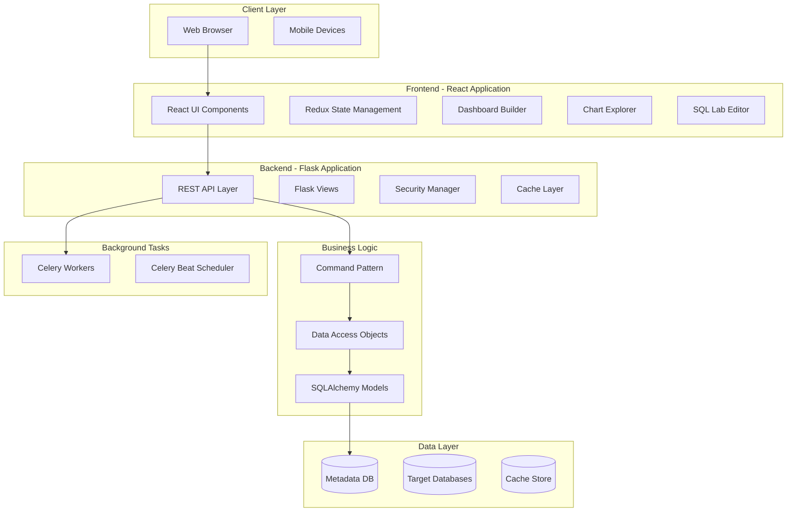

# Apache Superset - Architecture Overview

## Table of Contents
- [Apache Superset - Architecture Overview](#apache-superset---architecture-overview)
  - [Table of Contents](#table-of-contents)
  - [System Architecture](#system-architecture)
  - [Component Organization](#component-organization)
    - [Backend Components](#backend-components)
    - [Frontend Components](#frontend-components)
    - [Integration Flows](#integration-flows)
  - [Related Documentation](#related-documentation)

## System Architecture

## Component Organization

### Backend Components
- **[Application Initialization](./backend-initialization.md)** - App factory and bootstrap process
- **[REST API Layer](./backend-api-layer.md)** - REST endpoints and request handling
- **[Command Layer](./backend-command-layer.md)** - Business logic implementation
- **[Data Access Layer](./backend-dao-layer.md)** - Database operations
- **[Models](./backend-models.md)** - SQLAlchemy ORM models
- **[Security](./backend-security.md)** - Authentication and authorization

### Frontend Components
- **[Application Setup](./frontend-setup.md)** - React app initialization
- **[State Management](./frontend-state-management.md)** - Redux store and reducers
- **[Dashboard](./frontend-dashboard.md)** - Dashboard builder implementation
- **[Explore](./frontend-explore.md)** - Chart explorer and builder
- **[SQL Lab](./frontend-sqllab.md)** - SQL editor implementation
- **[Visualization Plugins](./frontend-visualizations.md)** - Chart plugin architecture

### Integration Flows
- **[Chart Rendering Flow](./flow-chart-rendering.md)** - End-to-end chart data flow
- **[Query Execution Flow](./flow-query-execution.md)** - SQL query processing
- **[Authentication Flow](./flow-authentication.md)** - User authentication process

## Related Documentation

### Backend Architecture (Detailed)
- **[Application Initialization](./backend-initialization.md)** - Complete app factory pattern, extensions setup, initialization sequence with code locations
- **[REST API Layer](./backend-api-layer.md)** - API classes, HTTP methods, decorators, permission handling with examples
- **[Command Layer](./backend-command-layer.md)** - Command pattern implementation, business logic, validation, exceptions
- **[Data Access Layer](./backend-dao-layer.md)** - DAO pattern, database queries, transaction management (TODO)
- **[Models](./backend-models.md)** - SQLAlchemy ORM models, relationships, database schema (TODO)
- **[Security](./backend-security.md)** - Authentication, authorization, RBAC, RLS implementation (TODO)

### Frontend Architecture (Detailed)
- **[Application Setup](./frontend-setup.md)** - React bootstrap, webpack config, theme, routing with code
- **[State Management](./frontend-state-management.md)** - Redux store, reducers, actions, middleware (TODO)
- **[Dashboard](./frontend-dashboard.md)** - Dashboard builder, grid layout, filter implementation (TODO)
- **[Explore](./frontend-explore.md)** - Chart explorer, control panel, query builder (TODO)
- **[SQL Lab](./frontend-sqllab.md)** - SQL editor, query execution, result display (TODO)
- **[Visualization Plugins](./frontend-visualizations.md)** - Plugin architecture, creating custom charts (TODO)

### Integration Flows (Detailed)
- **[Chart Rendering Flow](./flow-chart-rendering.md)** - Complete data flow from user click to chart render (TODO)
- **[Query Execution Flow](./flow-query-execution.md)** - SQL execution, caching, async queries (TODO)
- **[Authentication Flow](./flow-authentication.md)** - Login, session, permission checking (TODO)
