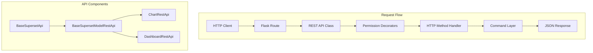

# Backend - REST API Layer

## Overview
Superset's REST API layer uses Flask-AppBuilder's REST API framework with a consistent pattern across all resources. This document details the implementation of REST APIs with code-level examples.

## Architecture



## Base API Classes

### 1. BaseSupersetApi (`superset/views/base_api.py`)

**File**: `superset/views/base_api.py`

```python
class BaseSupersetApi(BaseApi):
    """
    Base class for all Superset REST APIs
    Extends Flask-AppBuilder's BaseApi with Superset-specific features
    """
    
    # CSRF protection configuration
    csrf_exempt = False
    
    # Method permission mapping
    method_permission_name = {
        "get_list": "list",
        "get": "show",
        "post": "add",
        "put": "edit",
        "delete": "delete",
        "bulk_delete": "delete",
        "info": "list",
        "related": "list",
        "distinct": "list",
    }
    
    # OpenAPI spec configuration
    apispec_parameter_schemas: dict[str, Schema] = {}
    
    # Default response schemas
    openapi_spec_component_schemas: tuple[type[Schema], ...] = (
        ValidationErrorResponseSchema,
    )
```

**Location**: Lines 50-100 (approximate)  
**Purpose**: Base functionality for all Superset APIs

**Key Features**:
- Permission checking via `method_permission_name`
- OpenAPI/Swagger documentation
- Error handling standardization
- Response schema validation

---

### 2. BaseSupersetModelRestApi (`superset/views/base_api.py`)

**File**: `superset/views/base_api.py`

```python
class BaseSupersetModelRestApi(ModelRestApi):
    """
    Base class for CRUD REST APIs
    Provides standard CRUD operations for SQLAlchemy models
    """
    
    # Allow column-based filtering
    allow_browser_login = True
    
    # Base filter configuration
    base_filters: list[BaseFilter] = []
    
    # Response include/exclude fields
    include_route_methods: set[RouteMethod] = {
        RouteMethod.GET,
        RouteMethod.GET_LIST,
        RouteMethod.POST,
        RouteMethod.PUT,
        RouteMethod.DELETE,
        RouteMethod.RELATED,
        RouteMethod.DISTINCT,
        RouteMethod.INFO,
    }
    
    # Class permissions
    class_permission_name: str
    
    # Show all columns by default
    show_columns: list[str] = []
    list_columns: list[str] = []
    add_columns: list[str] = []
    edit_columns: list[str] = []
    
    # Related fields configuration
    related_field_filters: dict[str, BaseFilter] = {}
    
    # Ordering
    order_columns: list[str] = []
    
    # Method handlers
    def get(self, pk: int) -> Response:
        """Get a single item"""
        ...
    
    def get_list(self) -> Response:
        """Get a list of items with filtering/pagination"""
        ...
    
    def post(self) -> Response:
        """Create a new item"""
        ...
    
    def put(self, pk: int) -> Response:
        """Update an existing item"""
        ...
    
    def delete(self, pk: int) -> Response:
        """Delete an item"""
        ...
```

**Location**: Lines 150-500 (approximate)  
**Purpose**: CRUD operations for model-backed resources

---

## Chart REST API Implementation

### ChartRestApi (`superset/charts/api.py`)

**File**: `superset/charts/api.py`

```python
class ChartRestApi(BaseSupersetModelRestApi):
    """
    REST API for Chart/Slice operations
    Base route: /api/v1/chart/
    """
    
    # Model configuration
    datamodel = SQLAInterface(Slice)
    
    # Route configuration
    class_permission_name = "Chart"
    resource_name = "chart"
    allow_browser_login = True
    
    # OpenAPI tags
    openapi_spec_tag = "Charts"
    
    # API endpoints included
    include_route_methods = RouteMethod.REST_MODEL_VIEW_CRUD_SET | {
        RouteMethod.EXPORT,
        RouteMethod.IMPORT,
        RouteMethod.RELATED,
        RouteMethod.DISTINCT,
        "bulk_delete",
        "data",
        "data_from_cache",
        "get_charts",
        "favorite_status",
    }
    
    # Response schemas
    show_columns = [
        "cache_timeout",
        "dashboards.dashboard_title",
        "dashboards.id",
        "description",
        "owners.first_name",
        "owners.id",
        "owners.last_name",
        "owners.username",
        "params",
        "slice_name",
        "viz_type",
        "query_context",
    ]
    
    list_columns = [
        "cache_timeout",
        "changed_by.first_name",
        "changed_by.last_name",
        "changed_by_name",
        "changed_by_url",
        "changed_on_delta_humanized",
        "changed_on_utc",
        "created_by.first_name",
        "created_by.id",
        "created_by.last_name",
        "datasource_id",
        "datasource_type",
        "datasource_url",
        "datasource_name_text",
        "description",
        "description_markeddown",
        "id",
        "owners.first_name",
        "owners.id",
        "owners.last_name",
        "owners.username",
        "params",
        "slice_name",
        "thumbnail_url",
        "url",
        "viz_type",
    ]
    
    # Editable fields
    add_columns = [
        "cache_timeout",
        "certification_details",
        "certified_by",
        "dashboards",
        "datasource_id",
        "datasource_type",
        "description",
        "external_url",
        "is_managed_externally",
        "owners",
        "params",
        "query_context",
        "slice_name",
        "viz_type",
    ]
    
    edit_columns = add_columns
    
    # Ordering
    order_columns = [
        "changed_by.first_name",
        "changed_on_delta_humanized",
        "datasource_id",
        "datasource_name",
        "last_saved_at",
        "last_saved_by.first_name",
        "slice_name",
        "viz_type",
    ]
    
    # Searchable fields
    search_columns = [
        "created_by",
        "changed_by",
        "datasource_id",
        "datasource_name",
        "datasource_type",
        "description",
        "id",
        "owners",
        "slice_name",
        "viz_type",
    ]
    
    # Filters
    base_filters = [["id", ChartFilter, lambda: []]]
    
    # Related fields
    related_field_filters = {
        "owners": RelatedFieldFilter("first_name", FilterRelatedOwners),
        "created_by": RelatedFieldFilter("first_name", FilterRelatedOwners),
    }
    
    # Allowed distinct columns
    allowed_distinct_fields = {"dashboards.id"}
```

**Location**: `superset/charts/api.py` Lines 80-200 (approximate)

---

### Key HTTP Methods Implementation

#### GET Single Chart

```python
@expose("/<int:pk>", methods=["GET"])
@protect()
@safe
@statsd_metrics
@event_logger.log_this_with_context(
    action=lambda self, *args, **kwargs: f"{self.__class__.__name__}.get",
    log_to_statsd=False,
)
def get(self, pk: int) -> Response:
    """
    Get a chart
    ---
    get:
      summary: Get a chart
      parameters:
      - in: path
        schema:
          type: integer
        name: pk
        description: The chart id
      - in: query
        schema:
          type: string
        name: q
    responses:
      200:
        description: Chart
        content:
          application/json:
            schema:
              type: object
              properties:
                result:
                  $ref: '#/components/schemas/ChartRestApi.get'
      400:
        $ref: '#/components/responses/400'
      401:
        $ref: '#/components/responses/401'
      404:
        $ref: '#/components/responses/404'
      500:
        $ref: '#/components/responses/500'
    """
    return self.get_headless(pk)
```

**Location**: `superset/charts/api.py` Lines ~250-290

---

#### POST Create Chart

```python
@expose("/", methods=["POST"])
@protect()
@safe
@statsd_metrics
@event_logger.log_this_with_context(
    action=lambda self, *args, **kwargs: f"{self.__class__.__name__}.post",
    log_to_statsd=False,
)
def post(self) -> Response:
    """
    Create a new chart
    ---
    post:
      summary: Create a new chart
      requestBody:
        description: Chart schema
        required: true
        content:
          application/json:
            schema:
              $ref: '#/components/schemas/ChartRestApi.post'
      responses:
        201:
          description: Chart created
          content:
            application/json:
              schema:
                type: object
                properties:
                  id:
                    type: number
                  result:
                    $ref: '#/components/schemas/ChartRestApi.post'
        400:
          $ref: '#/components/responses/400'
        401:
          $ref: '#/components/responses/401'
        500:
          $ref: '#/components/responses/500'
    """
    try:
        # Validate request body
        item = self.add_model_schema.load(request.json)
        
        # Execute command
        new_model = CreateChartCommand(item).run()
        
        # Return created resource
        return self.response(
            201,
            id=new_model.id,
            result=self.show_model_schema.dump(new_model, many=False),
        )
    except ValidationError as error:
        return self.response_400(message=error.messages)
    except ChartInvalidError as ex:
        return self.response_422(message=ex.normalized_messages())
    except ChartCreateFailedError as ex:
        logger.error(
            "Error creating model %s: %s",
            self.__class__.__name__,
            str(ex),
            exc_info=True,
        )
        return self.response_422(message=str(ex))
```

**Location**: `superset/charts/api.py` Lines ~300-360

---

#### PUT Update Chart

```python
@expose("/<int:pk>", methods=["PUT"])
@protect()
@safe
@statsd_metrics
@event_logger.log_this_with_context(
    action=lambda self, *args, **kwargs: f"{self.__class__.__name__}.put",
    log_to_statsd=False,
)
def put(self, pk: int) -> Response:
    """
    Update a chart
    ---
    put:
      summary: Update a chart
      parameters:
      - in: path
        schema:
          type: integer
        name: pk
        description: The chart id
      requestBody:
        description: Chart schema
        required: true
        content:
          application/json:
            schema:
              $ref: '#/components/schemas/ChartRestApi.put'
      responses:
        200:
          description: Chart updated
          content:
            application/json:
              schema:
                type: object
                properties:
                  id:
                    type: number
                  result:
                    $ref: '#/components/schemas/ChartRestApi.put'
        400:
          $ref: '#/components/responses/400'
        401:
          $ref: '#/components/responses/401'
        404:
          $ref: '#/components/responses/404'
        500:
          $ref: '#/components/responses/500'
    """
    try:
        # Validate request body
        item = self.edit_model_schema.load(request.json)
        
        # Execute command
        changed_model = UpdateChartCommand(pk, item).run()
        
        if not changed_model:
            return self.response_404()
        
        # Return updated resource
        return self.response(
            200,
            id=changed_model.id,
            result=self.show_model_schema.dump(changed_model, many=False),
        )
    except ValidationError as error:
        return self.response_400(message=error.messages)
    except ChartNotFoundError:
        return self.response_404()
    except ChartForbiddenError:
        return self.response_403()
    except ChartInvalidError as ex:
        return self.response_422(message=ex.normalized_messages())
    except ChartUpdateFailedError as ex:
        logger.error(
            "Error updating model %s: %s",
            self.__class__.__name__,
            str(ex),
            exc_info=True,
        )
        return self.response_422(message=str(ex))
```

**Location**: `superset/charts/api.py` Lines ~400-480

---

#### DELETE Chart

```python
@expose("/<int:pk>", methods=["DELETE"])
@protect()
@safe
@statsd_metrics
@event_logger.log_this_with_context(
    action=lambda self, *args, **kwargs: f"{self.__class__.__name__}.delete",
    log_to_statsd=False,
)
def delete(self, pk: int) -> Response:
    """
    Delete a chart
    ---
    delete:
      summary: Delete a chart
      parameters:
      - in: path
        schema:
          type: integer
        name: pk
        description: The chart id
      responses:
        200:
          description: Chart deleted
          content:
            application/json:
              schema:
                type: object
                properties:
                  message:
                    type: string
        401:
          $ref: '#/components/responses/401'
        403:
          $ref: '#/components/responses/403'
        404:
          $ref: '#/components/responses/404'
        500:
          $ref: '#/components/responses/500'
    """
    try:
        DeleteChartCommand(pk).run()
        return self.response(200, message="OK")
    except ChartNotFoundError:
        return self.response_404()
    except ChartForbiddenError:
        return self.response_403()
    except ChartDeleteFailedError as ex:
        logger.error(
            "Error deleting model %s: %s",
            self.__class__.__name__,
            str(ex),
            exc_info=True,
        )
        return self.response_422(message=str(ex))
```

**Location**: `superset/charts/api.py` Lines ~500-560

---

### Custom Endpoints

#### Chart Data Endpoint

```python
@expose("/<int:pk>/data/", methods=["GET"])
@protect()
@safe
@statsd_metrics
@event_logger.log_this_with_context(
    action=lambda self, *args, **kwargs: f"{self.__class__.__name__}"
    f".data_{pk}",
    log_to_statsd=False,
)
def get_data(self, pk: int) -> Response:
    """
    Get chart data
    ---
    get:
      summary: Get chart data
      parameters:
      - in: path
        schema:
          type: integer
        name: pk
        description: The chart id
      - in: query
        name: format
        schema:
          type: string
          enum:
            - json
            - csv
      responses:
        200:
          description: Query result
          content:
            application/json:
              schema:
                $ref: "#/components/schemas/ChartDataResponseSchema"
        400:
          $ref: '#/components/responses/400'
        401:
          $ref: '#/components/responses/401'
        404:
          $ref: '#/components/responses/404'
        500:
          $ref: '#/components/responses/500'
    """
    try:
        json_body = None
        if request.args.get("json"):
            json_body = json.loads(request.args["json"])
        
        # Get chart instance
        chart = self.datamodel.get(pk, self._base_filters)
        if not chart:
            return self.response_404()
        
        # Execute chart data command
        result = ChartDataCommand(chart, json_body).run()
        
        # Format response
        result_format = request.args.get("format", "json")
        if result_format == "csv":
            return CsvResponse(
                result["queries"][0]["data"],
                headers=generate_download_headers("csv"),
            )
        
        return self.response(200, **result)
        
    except ChartDataCacheLoadError as ex:
        return self.response_422(message=str(ex))
    except ChartDataQueryFailedError as ex:
        return self.response_400(message=str(ex))
```

**Location**: `superset/charts/api.py` Lines ~600-680

---

## Permission Decorators

### @protect() Decorator

**File**: `superset/views/base_api.py`

```python
def protect(allow_browser_login: bool = False) -> Callable:
    """
    Decorator to check permissions before executing endpoint
    
    Args:
        allow_browser_login: If True, allow browser-based login
    
    Returns:
        Decorated function with permission checking
    """
    def decorator(f: Callable) -> Callable:
        @wraps(f)
        def wraps_protect(*args: Any, **kwargs: Any) -> Any:
            # Get the API instance
            self = args[0] if args else None
            
            # Check if user has permission
            if not self.appbuilder.sm.has_access(
                self.method_permission_name[f.__name__],
                self.class_permission_name,
            ):
                return self.response_403()
            
            # Execute the endpoint
            return f(*args, **kwargs)
        
        return wraps_protect
    
    return decorator
```

**Purpose**: Ensures user has required permissions before accessing endpoint

---

### @safe Decorator

**File**: `superset/views/base_api.py`

```python
def safe(f: Callable) -> Callable:
    """
    Decorator to wrap endpoints in try-catch for safety
    Handles database sessions and logging
    """
    @wraps(f)
    def wraps_safe(*args: Any, **kwargs: Any) -> Any:
        try:
            return f(*args, **kwargs)
        except Exception as ex:
            logger.exception(str(ex))
            return args[0].response_500(message=str(ex))
        finally:
            # Ensure database session is closed
            db.session.close()
    
    return wraps_safe
```

**Purpose**: Global exception handling and session cleanup

---

### @statsd_metrics Decorator

**File**: `superset/views/base_api.py`

```python
def statsd_metrics(f: Callable) -> Callable:
    """
    Decorator to send metrics to StatsD
    """
    @wraps(f)
    def wraps_metrics(*args: Any, **kwargs: Any) -> Any:
        # Record start time
        start_time = time.time()
        
        # Execute endpoint
        response = f(*args, **kwargs)
        
        # Send metrics
        duration = (time.time() - start_time) * 1000
        stats_logger.timing(
            f"{args[0].__class__.__name__}.{f.__name__}",
            duration,
        )
        stats_logger.incr(
            f"{args[0].__class__.__name__}.{f.__name__}.status_{response.status_code}"
        )
        
        return response
    
    return wraps_metrics
```

**Purpose**: Performance monitoring and metrics collection

---

## Response Helpers

**File**: `superset/views/base_api.py`

```python
class BaseSupersetApi(BaseApi):
    
    def response(
        self,
        status_code: int,
        **kwargs: Any,
    ) -> Response:
        """
        Generic response helper
        """
        return make_json_response(status_code=status_code, **kwargs)
    
    def response_400(self, message: str = "Bad request") -> Response:
        """400 Bad Request"""
        return self.response(400, message=message)
    
    def response_401(self) -> Response:
        """401 Unauthorized"""
        return self.response(401, message="Unauthorized")
    
    def response_403(self) -> Response:
        """403 Forbidden"""
        return self.response(403, message="Forbidden")
    
    def response_404(self) -> Response:
        """404 Not Found"""
        return self.response(404, message="Not found")
    
    def response_422(self, message: str = "") -> Response:
        """422 Unprocessable Entity"""
        return self.response(422, message=message)
    
    def response_500(self, message: str = "") -> Response:
        """500 Internal Server Error"""
        return self.response(500, message=message or "Internal error")
```

---

## API Registration

**File**: `superset/initialization/__init__.py`

```python
def init_views(self) -> None:
    """Register all REST APIs"""
    from superset.charts.api import ChartRestApi
    from superset.dashboards.api import DashboardRestApi
    # ... more imports
    
    # Register APIs with AppBuilder
    appbuilder.add_api(ChartRestApi)
    appbuilder.add_api(DashboardRestApi)
    appbuilder.add_api(DatabaseRestApi)
    appbuilder.add_api(DatasetRestApi)
    # ... more registrations
```

This automatically creates routes like:
- `/api/v1/chart/`
- `/api/v1/dashboard/`
- `/api/v1/database/`
- `/api/v1/dataset/`

---

## Complete API List

| API Class | Base Route | Purpose |
|-----------|------------|---------|
| `ChartRestApi` | `/api/v1/chart/` | Chart/Slice CRUD |
| `DashboardRestApi` | `/api/v1/dashboard/` | Dashboard CRUD |
| `DatasetRestApi` | `/api/v1/dataset/` | Dataset CRUD |
| `DatabaseRestApi` | `/api/v1/database/` | Database connection CRUD |
| `QueryRestApi` | `/api/v1/query/` | Query history |
| `SavedQueryRestApi` | `/api/v1/saved_query/` | Saved SQL queries |
| `ChartDataRestApi` | `/api/v1/chart/data` | Chart data execution |
| `SecurityRestApi` | `/api/v1/security/` | Security/Auth operations |
| `CurrentUserRestApi` | `/api/v1/me/` | Current user info |
| `CssTemplateRestApi` | `/api/v1/css_template/` | CSS template management |
| `AnnotationLayerRestApi` | `/api/v1/annotation_layer/` | Annotation layers |
| `ReportScheduleRestApi` | `/api/v1/report/` | Alerts & Reports |

---

## OpenAPI/Swagger Documentation

Access interactive API docs at:
```
http://localhost:8088/swagger/v1
```

Configuration:
```python
# superset/config.py
FAB_API_SWAGGER_UI = True  # Enable Swagger UI
```

---

## Next Steps

- [Backend Command Layer](./backend-command-layer.md) - Business logic implementation
- [Backend DAO Layer](./backend-dao-layer.md) - Data access patterns
- [Backend Security](./backend-security.md) - Authentication & authorization
