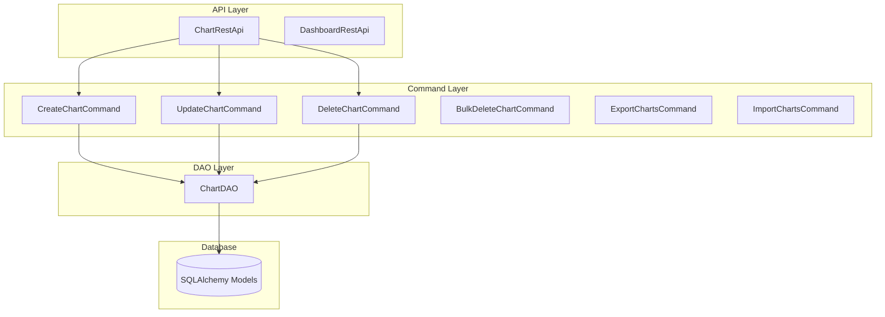

# Backend - Command Layer (Business Logic)

## Overview
The Command Layer implements the **Command Pattern** to encapsulate business logic. Each command represents a single business operation and provides clean separation between API endpoints and data access.

## Architecture



## Base Command Classes

### 1. BaseCommand (`superset/commands/base.py`)

**File**: `superset/commands/base.py`

```python
class BaseCommand(ABC):
    """
    Base class for all commands
    Implements the Command Pattern
    """
    
    @abstractmethod
    def run(self) -> Any:
        """
        Execute the command
        Must be implemented by subclasses
        
        Returns:
            Result of the command execution
            
        Raises:
            CommandException: On validation or execution errors
        """
        pass
    
    @abstractmethod
    def validate(self) -> None:
        """
        Validate command preconditions
        Must be implemented by subclasses
        
        Raises:
            CommandException: On validation failures
        """
        pass
```

**Location**: Lines 30-60  
**Purpose**: Abstract base for all command classes

---

### 2. CreateMixin (`superset/commands/base.py`)

```python
class CreateMixin:
    """
    Mixin for create operations
    Provides common create functionality
    """
    
    @staticmethod
    def populate_owners(owner_ids: list[int] | None = None) -> list[User]:
        """
        Populate list of owners based on current user and provided IDs
        
        Args:
            owner_ids: Optional list of owner user IDs
            
        Returns:
            List of User objects
        """
        if owner_ids is None:
            return [g.user]
        
        # Fetch owner users
        return security_manager.get_users_by_ids(owner_ids)
```

**Location**: Lines 70-90  
**Purpose**: Reusable create operation logic

---

### 3. UpdateMixin (`superset/commands/base.py`)

```python
class UpdateMixin:
    """
    Mixin for update operations
    Provides common update functionality
    """
    
    @staticmethod
    def populate_owners(
        owner_ids: list[int] | None = None,
    ) -> list[User]:
        """
        Populate list of owners
        Similar to CreateMixin but may have different logic
        """
        if owner_ids is None:
            return []
        
        return security_manager.get_users_by_ids(owner_ids)
```

**Location**: Lines 95-110  
**Purpose**: Reusable update operation logic

---

## Chart Commands

### Directory Structure
```
superset/commands/chart/
├── __init__.py
├── create.py          # CreateChartCommand
├── update.py          # UpdateChartCommand
├── delete.py          # DeleteChartCommand
├── bulk_delete.py     # BulkDeleteChartCommand
├── export.py          # ExportChartsCommand
├── import.py          # ImportChartsCommand
├── data.py            # ChartDataCommand
├── exceptions.py      # Custom exceptions
└── warm_up_cache.py   # WarmUpCacheChartCommand
```

---

### CreateChartCommand (`superset/commands/chart/create.py`)

**File**: `superset/commands/chart/create.py`

```python
class CreateChartCommand(CreateMixin, BaseCommand):
    """
    Command for creating a new chart
    """
    
    def __init__(self, data: dict[str, Any]):
        """
        Initialize command with chart data
        
        Args:
            data: Dictionary containing chart properties
        """
        self._properties = data.copy()
    
    def run(self) -> Slice:
        """
        Execute the chart creation
        
        Returns:
            Created Slice (chart) object
            
        Raises:
            ChartInvalidError: On validation failure
            ChartCreateFailedError: On database error
            DatasourceNotFoundError: If datasource doesn't exist
        """
        # Validate the command
        self.validate()
        
        try:
            # Get the datasource
            datasource_id = self._properties["datasource_id"]
            datasource_type = self._properties["datasource_type"]
            datasource = DatasourceDAO.get_datasource(
                datasource_type=datasource_type,
                datasource_id=datasource_id,
            )
            
            # Create the chart model
            chart = Slice()
            
            # Populate basic fields
            chart.datasource_id = datasource.id
            chart.datasource_type = datasource_type
            chart.datasource_name = datasource.name
            chart.slice_name = self._properties["slice_name"]
            chart.viz_type = self._properties["viz_type"]
            chart.params = self._properties.get("params", "")
            chart.description = self._properties.get("description")
            chart.cache_timeout = self._properties.get("cache_timeout")
            chart.query_context = self._properties.get("query_context")
            
            # Populate owners
            if "owners" in self._properties:
                chart.owners = self.populate_owners(
                    self._properties["owners"]
                )
            else:
                chart.owners = [g.user]
            
            # Populate dashboards if provided
            if "dashboards" in self._properties:
                dashboard_ids = self._properties["dashboards"]
                chart.dashboards = DashboardDAO.find_by_ids(dashboard_ids)
            
            # Set certification fields
            if "certified_by" in self._properties:
                chart.certified_by = self._properties["certified_by"]
                chart.certification_details = self._properties.get(
                    "certification_details"
                )
            
            # Set external URL
            if "external_url" in self._properties:
                chart.external_url = self._properties["external_url"]
            
            # Add to database
            db.session.add(chart)
            db.session.commit()
            
            # Log the event
            log_this_with_context(
                action="chart_created",
                object_ref=f"Chart:{chart.id}",
                dashboard_id=None,
            )
            
            return chart
            
        except SQLAlchemyError as ex:
            db.session.rollback()
            logger.exception("Error creating chart")
            raise ChartCreateFailedError() from ex
    
    def validate(self) -> None:
        """
        Validate chart creation data
        
        Raises:
            ChartInvalidError: On validation failure
            DatasourceNotFoundError: If datasource doesn't exist
        """
        exceptions: list[ValidationError] = []
        
        # Check required fields
        if not self._properties.get("slice_name"):
            exceptions.append(
                ValidationError(
                    message="Chart name is required",
                    field_name="slice_name",
                )
            )
        
        if not self._properties.get("viz_type"):
            exceptions.append(
                ValidationError(
                    message="Visualization type is required",
                    field_name="viz_type",
                )
            )
        
        # Check datasource exists
        datasource_id = self._properties.get("datasource_id")
        datasource_type = self._properties.get("datasource_type")
        
        if not datasource_id or not datasource_type:
            exceptions.append(
                ValidationError(
                    message="Datasource is required",
                    field_name="datasource_id",
                )
            )
        else:
            datasource = DatasourceDAO.get_datasource(
                datasource_type=datasource_type,
                datasource_id=datasource_id,
            )
            if not datasource:
                raise DatasourceNotFoundError()
        
        # Check if user has permission to the datasource
        if datasource and not security_manager.can_access_datasource(
            datasource
        ):
            exceptions.append(
                ValidationError(
                    message="You don't have access to this datasource",
                    field_name="datasource_id",
                )
            )
        
        # Check dashboards exist and are accessible
        if "dashboards" in self._properties:
            dashboard_ids = self._properties["dashboards"]
            dashboards = DashboardDAO.find_by_ids(dashboard_ids)
            
            if len(dashboards) != len(dashboard_ids):
                exceptions.append(
                    ValidationError(
                        message="Some dashboards do not exist",
                        field_name="dashboards",
                    )
                )
            
            for dashboard in dashboards:
                if not security_manager.can_access("can_write", "Dashboard"):
                    exceptions.append(
                        ValidationError(
                            message=f"No permission to add to dashboard {dashboard.id}",
                            field_name="dashboards",
                        )
                    )
        
        if exceptions:
            raise ChartInvalidError(exceptions=exceptions)
```

**Location**: Entire file (~200 lines)  
**Purpose**: Handles chart creation with validation

---

### UpdateChartCommand (`superset/commands/chart/update.py`)

**File**: `superset/commands/chart/update.py`

```python
class UpdateChartCommand(UpdateMixin, BaseCommand):
    """
    Command for updating an existing chart
    """
    
    def __init__(self, chart_id: int, data: dict[str, Any]):
        """
        Initialize command
        
        Args:
            chart_id: ID of chart to update
            data: Dictionary of fields to update
        """
        self._chart_id = chart_id
        self._properties = data.copy()
        self._chart: Slice | None = None
    
    def run(self) -> Slice:
        """
        Execute the chart update
        
        Returns:
            Updated Slice object
            
        Raises:
            ChartNotFoundError: If chart doesn't exist
            ChartForbiddenError: If user lacks permission
            ChartInvalidError: On validation failure
            ChartUpdateFailedError: On database error
        """
        self.validate()
        
        try:
            # Get the chart
            chart = self._chart
            
            # Update basic fields
            if "slice_name" in self._properties:
                chart.slice_name = self._properties["slice_name"]
            
            if "description" in self._properties:
                chart.description = self._properties["description"]
            
            if "cache_timeout" in self._properties:
                chart.cache_timeout = self._properties["cache_timeout"]
            
            if "viz_type" in self._properties:
                chart.viz_type = self._properties["viz_type"]
            
            if "params" in self._properties:
                chart.params = self._properties["params"]
            
            if "query_context" in self._properties:
                chart.query_context = self._properties["query_context"]
            
            # Update datasource if changed
            if "datasource_id" in self._properties:
                datasource = DatasourceDAO.get_datasource(
                    datasource_type=self._properties.get(
                        "datasource_type", chart.datasource_type
                    ),
                    datasource_id=self._properties["datasource_id"],
                )
                chart.datasource_id = datasource.id
                chart.datasource_name = datasource.name
                chart.datasource_type = datasource.type
            
            # Update owners
            if "owners" in self._properties:
                chart.owners = self.populate_owners(
                    self._properties["owners"]
                )
            
            # Update dashboards
            if "dashboards" in self._properties:
                dashboard_ids = self._properties["dashboards"]
                chart.dashboards = DashboardDAO.find_by_ids(dashboard_ids)
            
            # Update certification
            if "certified_by" in self._properties:
                chart.certified_by = self._properties["certified_by"]
            if "certification_details" in self._properties:
                chart.certification_details = self._properties[
                    "certification_details"
                ]
            
            # Update external URL
            if "external_url" in self._properties:
                chart.external_url = self._properties["external_url"]
            
            # Commit changes
            db.session.commit()
            
            # Log the event
            log_this_with_context(
                action="chart_updated",
                object_ref=f"Chart:{chart.id}",
                dashboard_id=None,
            )
            
            return chart
            
        except SQLAlchemyError as ex:
            db.session.rollback()
            logger.exception("Error updating chart")
            raise ChartUpdateFailedError() from ex
    
    def validate(self) -> None:
        """
        Validate chart update
        
        Raises:
            ChartNotFoundError: If chart doesn't exist
            ChartForbiddenError: If user lacks permission
            ChartInvalidError: On validation failure
        """
        exceptions: list[ValidationError] = []
        
        # Check chart exists
        self._chart = ChartDAO.find_by_id(self._chart_id)
        if not self._chart:
            raise ChartNotFoundError()
        
        # Check user has permission
        if not security_manager.can_access("can_write", "Chart"):
            raise ChartForbiddenError()
        
        # Validate datasource if changed
        if "datasource_id" in self._properties:
            datasource = DatasourceDAO.get_datasource(
                datasource_type=self._properties.get(
                    "datasource_type", self._chart.datasource_type
                ),
                datasource_id=self._properties["datasource_id"],
            )
            
            if not datasource:
                raise DatasourceNotFoundError()
            
            if not security_manager.can_access_datasource(datasource):
                exceptions.append(
                    ValidationError(
                        message="You don't have access to this datasource",
                        field_name="datasource_id",
                    )
                )
        
        # Validate dashboards
        if "dashboards" in self._properties:
            dashboard_ids = self._properties["dashboards"]
            dashboards = DashboardDAO.find_by_ids(dashboard_ids)
            
            if len(dashboards) != len(dashboard_ids):
                exceptions.append(
                    ValidationError(
                        message="Some dashboards do not exist",
                        field_name="dashboards",
                    )
                )
        
        if exceptions:
            raise ChartInvalidError(exceptions=exceptions)
```

**Location**: Entire file (~180 lines)  
**Purpose**: Updates existing chart with validation

---

### DeleteChartCommand (`superset/commands/chart/delete.py`)

**File**: `superset/commands/chart/delete.py`

```python
class DeleteChartCommand(BaseCommand):
    """
    Command for deleting a chart
    """
    
    def __init__(self, chart_id: int):
        """
        Initialize command
        
        Args:
            chart_id: ID of chart to delete
        """
        self._chart_id = chart_id
        self._chart: Slice | None = None
    
    def run(self) -> None:
        """
        Execute the chart deletion
        
        Raises:
            ChartNotFoundError: If chart doesn't exist
            ChartForbiddenError: If user lacks permission
            ChartDeleteFailedError: On database error
        """
        self.validate()
        
        try:
            # Delete the chart
            chart = self._chart
            
            # Log before deletion
            log_this_with_context(
                action="chart_deleted",
                object_ref=f"Chart:{chart.id}",
                dashboard_id=None,
            )
            
            # Remove from database
            db.session.delete(chart)
            db.session.commit()
            
        except SQLAlchemyError as ex:
            db.session.rollback()
            logger.exception("Error deleting chart")
            raise ChartDeleteFailedError() from ex
    
    def validate(self) -> None:
        """
        Validate chart deletion
        
        Raises:
            ChartNotFoundError: If chart doesn't exist
            ChartForbiddenError: If user lacks permission
        """
        # Check chart exists
        self._chart = ChartDAO.find_by_id(self._chart_id)
        if not self._chart:
            raise ChartNotFoundError()
        
        # Check user has permission
        if not security_manager.can_access("can_write", "Chart"):
            raise ChartForbiddenError()
```

**Location**: Entire file (~80 lines)  
**Purpose**: Safely deletes chart with permission checks

---

## Command Exceptions (`superset/commands/exceptions.py`)

**File**: `superset/commands/exceptions.py`

```python
class CommandException(SupersetException):
    """Base exception for all command errors"""
    status = 500
    message = "Command failed"


class CommandInvalidError(CommandException):
    """Raised when command validation fails"""
    status = 422
    
    def __init__(
        self,
        message: str = "",
        exceptions: list[ValidationError] | None = None,
    ):
        self.exceptions = exceptions or []
        super().__init__(message)
    
    def normalized_messages(self) -> dict[str, list[str]]:
        """Format validation errors for API response"""
        errors: dict[str, list[str]] = {}
        for exception in self.exceptions:
            if exception.field_name not in errors:
                errors[exception.field_name] = []
            errors[exception.field_name].append(exception.message)
        return errors


class ObjectNotFoundError(CommandException):
    """Raised when requested object doesn't exist"""
    status = 404
    message = "Object not found"


class ForbiddenError(CommandException):
    """Raised when user lacks permission"""
    status = 403
    message = "Forbidden"


class CreateFailedError(CommandException):
    """Raised when creation fails"""
    status = 500
    message = "Create failed"


class UpdateFailedError(CommandException):
    """Raised when update fails"""
    status = 500
    message = "Update failed"


class DeleteFailedError(CommandException):
    """Raised when deletion fails"""
    status = 500
    message = "Delete failed"
```

**Location**: Lines 20-100  
**Purpose**: Standardized exception hierarchy

---

## Chart-Specific Exceptions (`superset/commands/chart/exceptions.py`)

**File**: `superset/commands/chart/exceptions.py`

```python
from superset.commands.exceptions import (
    CommandInvalidError,
    CreateFailedError,
    DeleteFailedError,
    ForbiddenError,
    ObjectNotFoundError,
    UpdateFailedError,
)


class ChartNotFoundError(ObjectNotFoundError):
    message = "Chart not found"


class ChartInvalidError(CommandInvalidError):
    message = "Chart parameters are invalid"


class ChartForbiddenError(ForbiddenError):
    message = "Insufficient permissions to access chart"


class ChartCreateFailedError(CreateFailedError):
    message = "Chart could not be created"


class ChartUpdateFailedError(UpdateFailedError):
    message = "Chart could not be updated"


class ChartDeleteFailedError(DeleteFailedError):
    message = "Chart could not be deleted"


class ChartDataQueryFailedError(CommandException):
    status = 400
    message = "Chart data query failed"


class ChartDataCacheLoadError(CommandException):
    status = 422
    message = "Chart data cache could not be loaded"
```

**Location**: Entire file  
**Purpose**: Chart-specific exception types

---

## Usage in API Layer

**Example from** `superset/charts/api.py`:

```python
@expose("/", methods=["POST"])
@protect()
@safe
def post(self) -> Response:
    """Create a new chart"""
    try:
        # Parse request
        item = self.add_model_schema.load(request.json)
        
        # Execute command
        new_model = CreateChartCommand(item).run()
        
        # Return success response
        return self.response(
            201,
            id=new_model.id,
            result=self.show_model_schema.dump(new_model),
        )
        
    except ValidationError as error:
        # Schema validation error
        return self.response_400(message=error.messages)
        
    except ChartInvalidError as ex:
        # Command validation error
        return self.response_422(message=ex.normalized_messages())
        
    except ChartCreateFailedError as ex:
        # Database error
        logger.error(f"Error creating chart: {ex}")
        return self.response_422(message=str(ex))
```

---

## Command Pattern Benefits

1. **Separation of Concerns**: API layer only handles HTTP, commands handle business logic
2. **Reusability**: Commands can be called from API, CLI, or background tasks
3. **Testability**: Commands can be unit tested independently
4. **Transaction Management**: Each command manages its own database transaction
5. **Validation**: Centralized validation logic
6. **Error Handling**: Consistent exception handling

---

## Other Command Examples

### Dashboard Commands

**Directory**: `superset/commands/dashboard/`

- `CreateDashboardCommand` - Create dashboard
- `UpdateDashboardCommand` - Update dashboard
- `DeleteDashboardCommand` - Delete dashboard
- `ImportDashboardsCommand` - Import from ZIP
- `ExportDashboardsCommand` - Export to ZIP

---

### Dataset Commands

**Directory**: `superset/commands/dataset/`

- `CreateDatasetCommand` - Create dataset
- `UpdateDatasetCommand` - Update dataset
- `DeleteDatasetCommand` - Delete dataset
- `RefreshDatasetCommand` - Refresh metadata

---

### Query Commands

**Directory**: `superset/commands/query/`

- `CreateQueryCommand` - Save SQL query
- `UpdateQueryCommand` - Update saved query
- `DeleteQueryCommand` - Delete query

---

## Transaction Decorator

**File**: `superset/utils/decorators.py`

```python
def transaction(
    propagate_exceptions: bool = False,
) -> Callable:
    """
    Decorator to wrap function in database transaction
    
    Args:
        propagate_exceptions: If True, re-raise exceptions after rollback
    """
    def decorator(f: Callable) -> Callable:
        @wraps(f)
        def wrapper(*args: Any, **kwargs: Any) -> Any:
            try:
                # Execute function
                result = f(*args, **kwargs)
                
                # Commit transaction
                db.session.commit()
                
                return result
                
            except Exception as ex:
                # Rollback on error
                db.session.rollback()
                
                logger.exception("Transaction failed")
                
                if propagate_exceptions:
                    raise
                
                return None
        
        return wrapper
    
    return decorator
```

**Usage**:
```python
@transaction()
def some_command_method(self):
    # Database operations here
    # Auto-committed on success
    # Auto-rolled back on exception
    pass
```

---

## Key Files Reference

| File | Purpose |
|------|---------|
| `superset/commands/base.py` | Base command classes |
| `superset/commands/exceptions.py` | Base exception classes |
| `superset/commands/chart/create.py` | Chart creation command |
| `superset/commands/chart/update.py` | Chart update command |
| `superset/commands/chart/delete.py` | Chart deletion command |
| `superset/commands/chart/exceptions.py` | Chart exceptions |
| `superset/commands/dashboard/` | Dashboard commands |
| `superset/commands/dataset/` | Dataset commands |
| `superset/commands/database/` | Database commands |

---

## Next Steps

- [Backend DAO Layer](./backend-dao-layer.md) - Data access patterns
- [Backend Models](./backend-models.md) - SQLAlchemy models
- [Backend Security](./backend-security.md) - Permission checking
