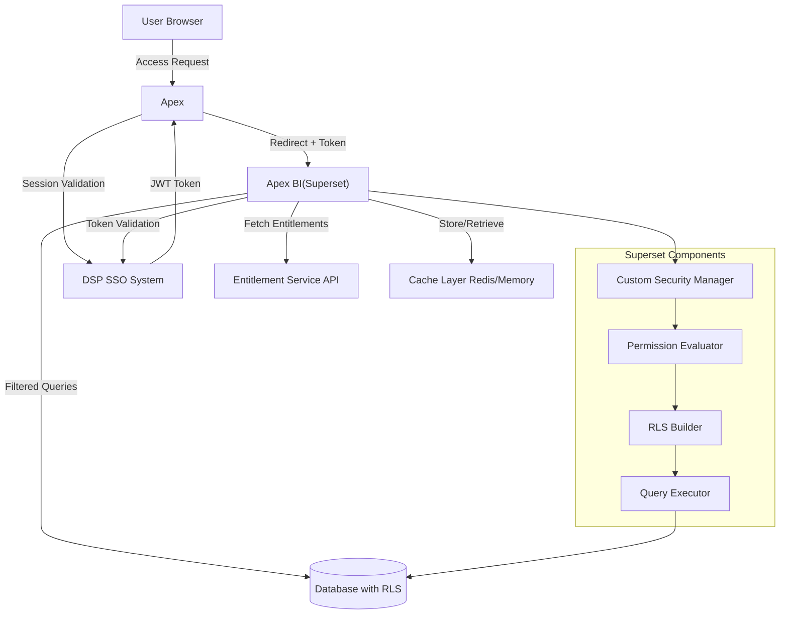
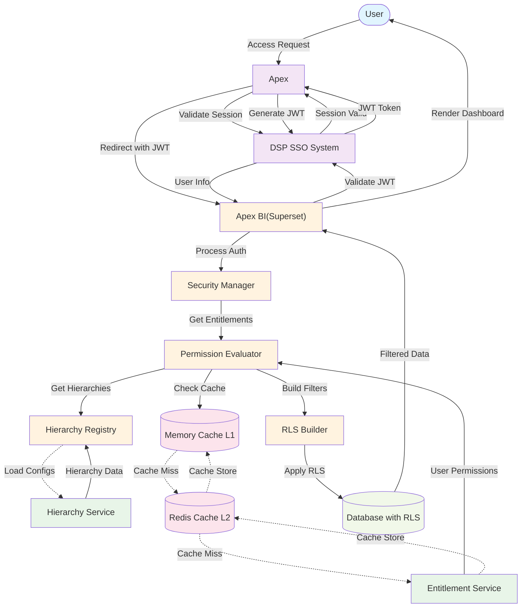
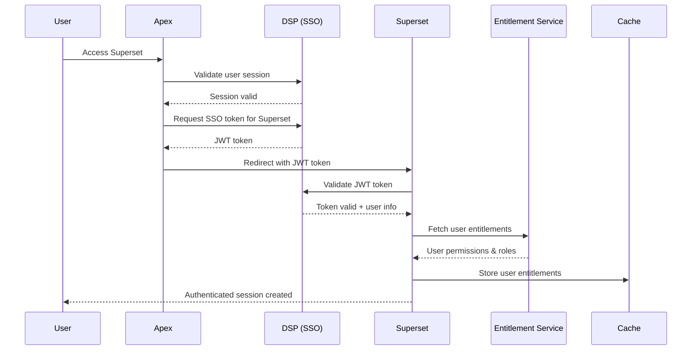
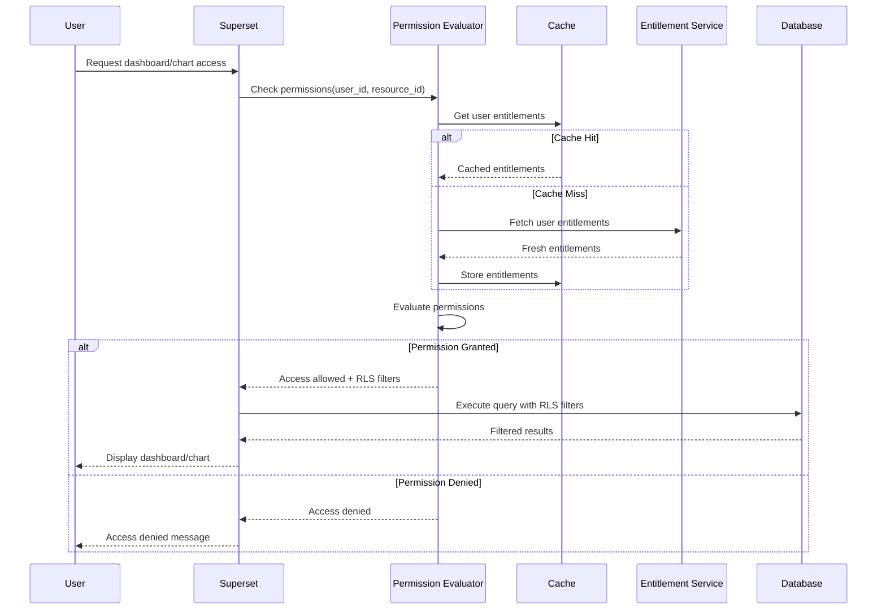
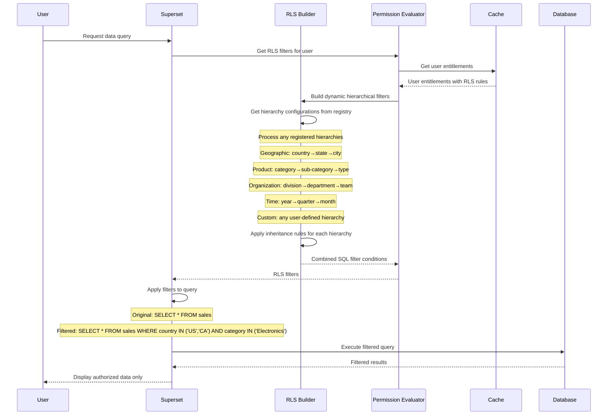
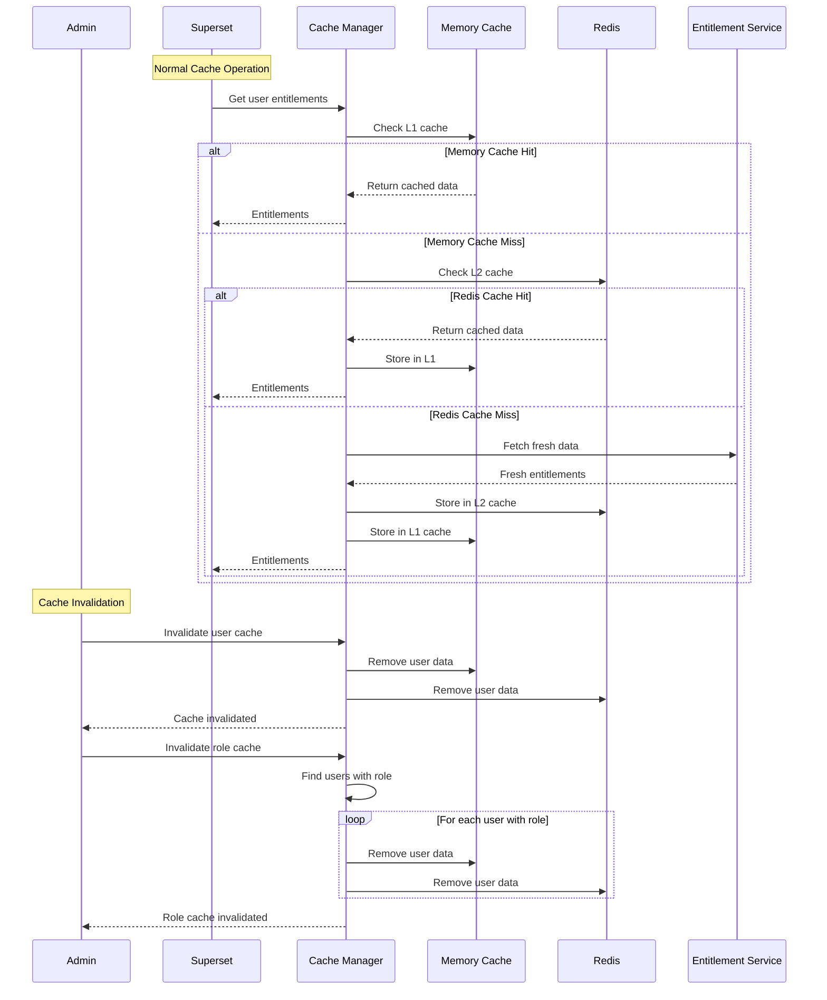

# Superset Entitlement Integration Design Document

## 1. Overview

This document outlines the design for integrating Apache Superset as a sub-application within the Apex platform, leveraging the platform's existing Single Sign-On (SSO) system (DSP) and entitlement service for authentication and authorization.

### 1.1 Objectives

- Integrate Superset seamlessly into the Apex platform ecosystem
- Leverage existing DSP (Single Sign-On) for user authentication
- Implement fine-grained authorization using the Apex entitlement service
- Support hierarchical row-level security (RLS) for data access control
- Provide efficient caching mechanisms for entitlement data
- Maintain Superset's core functionality while replacing its built-in security

### 1.2 Key Requirements

1. **Authentication**: Use Apex DSP for SSO, bypassing Superset's built-in authentication
2. **Authorization**: Integrate with Apex entitlement service for user permissions
3. **Access Control Levels**:
   - Report level (Dashboard/Chart access)
   - Dataset level access
   - Row-level security with hierarchical support
4. **Performance**: Implement caching layer for entitlement data
5. **API Integration**: RESTful API integration with entitlement service

## 2. Architecture Overview

### 2.1 System Architecture Diagram



### 2.2 Data Flow Overview



### 2.3 Data Flow Description

The enhanced data flow diagram shows the complete end-to-end process:

#### **Authentication Phase (Steps 1-9)**
1. **User Access**: User requests access through Apex
2. **Session Validation**: Apex validates existing user session with DSP
3. **JWT Generation**: DSP generates secure JWT token for Apex BI(Superset)
4. **Token Validation**: Apex BI(Superset) validates JWT with DSP and extracts user info

#### **Authorization Phase (Steps 10-14)**
5. **Entitlement Retrieval**: Multi-level cache check (Memory → Redis → Service)
6. **Hierarchy Loading**: Dynamic hierarchy configurations loaded from registry
7. **Permission Evaluation**: User permissions evaluated against requested resources

#### **Data Access Phase (Steps 15-18)**  
8. **RLS Filter Generation**: Dynamic hierarchical filters built based on user entitlements
9. **Query Execution**: Database queries executed with applied RLS filters
10. **Data Delivery**: Filtered results rendered to user dashboard

#### **Caching Strategy**
- **Solid arrows**: Primary data flow
- **Dotted arrows**: Cache miss scenarios and cache updates
- **Color coding**: Different component types for visual clarity

#### **Key Benefits**
- **18-step process** ensures comprehensive security at every stage
- **Multi-level caching** optimizes performance
- **Dynamic hierarchy support** provides flexible data access control
- **End-to-end traceability** for auditing and troubleshooting

## 3. Authentication Flow (SSO Integration)

### 3.1 SSO Authentication Process

1. **User Access**: User accesses Superset through Apex
2. **SSO Check**: Apex DSP validates user session
3. **Token Generation**: DSP generates JWT/session token for Superset
4. **Token Validation**: Superset validates token with DSP
5. **User Session**: Create Superset user session based on SSO identity

### 3.2 Authentication Sequence Diagram



### 3.3 Implementation Components

#### 3.3.1 Custom Security Manager
```python
class ApexSecurityManager(SupersetSecurityManager):
    def __init__(self, appbuilder):
        super().__init__(appbuilder)
        self.dsp_client = DSPClient()
        self.entitlement_client = EntitlementClient()
        
    def auth_user_sso(self, token):
        # Validate SSO token with DSP
        user_info = self.dsp_client.validate_token(token)
        if user_info:
            return self.get_or_create_user(user_info)
        return None
```

#### 3.3.2 SSO Authentication Backend
```python
class DSPAuthBackend:
    def authenticate(self, request):
        token = self.extract_token(request)
        if token:
            return self.security_manager.auth_user_sso(token)
        return None
```

## 4. Authorization Flow (Entitlement Service Integration)

### 4.0 CRUD Permission Model

The system supports fine-grained CRUD (Create, Read, Update, Delete) permissions for all BI resources:

#### 4.0.1 Permission Actions
- **Create**: Ability to create new dashboards, charts, or datasets
- **Read**: Ability to view and access existing resources
- **Update**: Ability to modify existing resources (structure, queries, visualizations)
- **Delete**: Ability to remove resources from the system

#### 4.0.2 Resource-Level Permissions
```json
{
  "user_permissions": {
    "dashboards": {
      "sales_dashboard": ["read", "update"],
      "finance_dashboard": ["read"],
      "admin_dashboard": ["create", "read", "update", "delete"]
    },
    "charts": {
      "sales_chart_1": ["read", "update"],
      "revenue_chart": ["read"],
      "user_analytics": ["create", "read", "update", "delete"]
    },
    "datasets": {
      "sales_data": ["read"],
      "customer_data": ["read", "update"],
      "admin_logs": ["create", "read", "update", "delete"]
    }
  }
}
```

#### 4.0.3 Permission Inheritance
- **Role-based permissions**: Users inherit base permissions from their roles
- **Explicit permissions**: Individual resource permissions override role permissions
- **Hierarchy permissions**: Access to parent objects may grant access to child objects
- **RLS integration**: CRUD permissions combined with row-level security filters

### 4.1 Entitlement Service API Specification

#### 4.1.1 User Entitlements Endpoint
```
GET /api/v1/users/{user_id}/entitlements
Headers:
  Authorization: Bearer {token}
  Content-Type: application/json

Response:
{
  "user_id": "string",
  "roles": ["analyst", "manager"],
  "permissions": {
    "dashboards": {
      "dashboard_1": ["read", "write", "update", "delete"],
      "dashboard_2": ["read", "write"],
      "dashboard_3": ["read"]
    },
    "charts": {
      "chart_1": ["read", "write", "update", "delete"],
      "chart_2": ["read", "write", "update"],
      "chart_3": ["read"]
    },
    "datasets": {
      "dataset_1": ["read", "write", "update", "delete"],
      "dataset_2": ["read"],
      "dataset_3": ["read", "write"]
    }
  },
     "row_level_filters": {
     "geographic_hierarchy": {
       "hierarchy_definition": ["country", "state", "city", "district"],
       "user_access": {
         "country": ["US", "CA"],
         "state": ["NY", "CA", "ON"],
         "city": ["NYC", "LA", "Toronto"]
       }
     },
     "product_hierarchy": {
       "hierarchy_definition": ["category", "sub_category", "product_type", "sku"],
       "user_access": {
         "category": ["Electronics", "Clothing"],
         "sub_category": ["Phones", "Laptops", "Shirts"],
         "product_type": ["iPhone", "MacBook", "T-Shirt"]
       }
     },
     "organization_hierarchy": {
       "hierarchy_definition": ["division", "department", "team", "project"],
       "user_access": {
         "division": ["Engineering", "Sales"],
         "department": ["Backend", "Frontend", "DevOps"],
         "team": ["Team-A", "Team-B"]
       }
     },
     "time_hierarchy": {
       "hierarchy_definition": ["year", "quarter", "month", "week"],
       "user_access": {
         "year": ["2023", "2024"],
         "quarter": ["Q1", "Q2", "Q3"],
         "month": ["January", "February", "March"]
       }
     }
   },
  "cache_ttl": 300
}
```

#### 4.1.2 Role Permissions Endpoint
```
GET /api/v1/roles/{role_name}/permissions
Headers:
  Authorization: Bearer {token}
  Content-Type: application/json

Response:
{
  "role_name": "string",
  "permissions": {
    "dashboards": {
      "actions": ["create", "read", "update", "delete"],
      "scope": "all" // or "specific"
    },
    "charts": {
      "actions": ["create", "read", "update", "delete"],
      "scope": "all"
    },
    "datasets": {
      "actions": ["create", "read", "update"],
      "scope": "specific"
    }
  }
}
```

#### 4.1.3 Dynamic Hierarchy Data Endpoint
```
GET /api/v1/hierarchies
Headers:
  Authorization: Bearer {token}
  Content-Type: application/json

Response:
{
  "hierarchies": [
    {
      "hierarchy_name": "geographic_hierarchy",
      "hierarchy_definition": ["country", "state", "city", "district"],
      "active": true
    },
    {
      "hierarchy_name": "product_hierarchy", 
      "hierarchy_definition": ["category", "sub_category", "product_type", "sku"],
      "active": true
    },
    {
      "hierarchy_name": "custom_business_hierarchy",
      "hierarchy_definition": ["business_unit", "cost_center", "gl_account"],
      "active": true
    }
  ]
}

GET /api/v1/hierarchies/{hierarchy_name}/lookup/{parent_level}/{parent_value}
Headers:
  Authorization: Bearer {token}
  Content-Type: application/json

Response:
{
  "hierarchy_name": "geographic_hierarchy",
  "parent_level": "country",
  "parent_value": "US",
  "children": {
    "state": ["NY", "CA", "TX", "FL"],
    "city": ["New York", "Los Angeles", "Houston", "Miami"],
    "district": ["Manhattan", "Brooklyn", "Beverly Hills", "Downtown"]
  }
}

POST /api/v1/users/{user_id}/entitlements/validate
Headers:
  Authorization: Bearer {token}
  Content-Type: application/json

Body:
{
  "resource_type": "dashboard", // or "chart", "dataset"
  "resource_id": "sales_dashboard",
  "action": "update", // "create", "read", "update", "delete"
  "context": {
    "hierarchy_filters": {
      "geographic_hierarchy": {
        "country": "US",
        "state": "NY"
      }
    }
  }
}

Response:
{
  "allowed": true,
  "effective_filters": {
    "geographic_hierarchy": {
      "country": ["US"],
      "state": ["NY"],
      "city": ["New York", "Albany", "Buffalo"],
      "district": ["Manhattan", "Brooklyn", "Queens"]
    }
  },
  "reason": "User has access to NY state and all its children"
}
```

### 4.2 Permission Checking Flow

1. **User Request**: User attempts to access resource (dashboard/chart/dataset)
2. **Cache Check**: Check cached entitlements for user
3. **Cache Miss**: Fetch entitlements from entitlement service
4. **Permission Evaluation**: Evaluate user permissions against requested resource
5. **Row-Level Filtering**: Apply hierarchical row-level filters if applicable
6. **Access Decision**: Grant or deny access based on evaluation

### 4.3 Authorization Sequence Diagram



## 5. Hierarchical Row-Level Security (RLS)

### 5.1 Dynamic Hierarchy Definition

#### 5.1.1 Hierarchy Configuration Schema
```json
{
  "hierarchy_name": "string",
  "hierarchy_definition": ["level1", "level2", "level3", ...],
  "column_mappings": {
    "level1": "database_column_name_1",
    "level2": "database_column_name_2",
    "level3": "database_column_name_3"
  },
  "inheritance_rules": {
    "enabled": true,
    "direction": "top_down"  // or "bottom_up"
  }
}
```

#### 5.1.2 Example Dynamic Hierarchies

**Geographic Hierarchy**
```
Country (Level 1)
├── State/Province (Level 2)
    ├── City (Level 3)
        ├── District (Level 4)
```

**Product Hierarchy**
```
Category (Level 1)
├── Sub-Category (Level 2)
    ├── Product Type (Level 3)
        ├── Product SKU (Level 4)
```

**Organizational Hierarchy**
```
Division (Level 1)
├── Department (Level 2)
    ├── Team (Level 3)
        ├── Project (Level 4)
```

**Time-Based Hierarchy**
```
Year (Level 1)
├── Quarter (Level 2)
    ├── Month (Level 3)
        ├── Week (Level 4)
            ├── Day (Level 5)
```

**Custom Business Hierarchy**
```
Business Unit (Level 1)
├── Cost Center (Level 2)
    ├── GL Account (Level 3)
        ├── Sub Account (Level 4)
```

### 5.2 RLS Implementation

#### 5.2.1 Row-Level Security Sequence Diagram



#### 5.2.2 Dynamic Hierarchical Filter Builder
```python
class DynamicHierarchicalRLSBuilder:
    def __init__(self, hierarchy_registry):
        self.hierarchy_registry = hierarchy_registry
    
    def build_filter(self, user_entitlements, dataset_schema):
        filters = []
        
        for hierarchy_name, hierarchy_data in user_entitlements.row_level_filters.items():
            hierarchy_config = self.hierarchy_registry.get_hierarchy(hierarchy_name)
            if hierarchy_config:
                filters.extend(self._build_dynamic_filters(
                    hierarchy_config, 
                    hierarchy_data, 
                    dataset_schema
                ))
        
        return self._combine_filters(filters)
    
    def _build_dynamic_filters(self, hierarchy_config, user_access_data, schema):
        """
        Build filters for any hierarchy type based on configuration
        """
        filters = []
        hierarchy_levels = hierarchy_config['hierarchy_definition']
        column_mappings = hierarchy_config['column_mappings']
        user_access = user_access_data['user_access']
        
        # Build inheritance map for hierarchical access
        inherited_access = self._build_inheritance_map(
            hierarchy_levels, 
            user_access, 
            hierarchy_config.get('inheritance_rules', {})
        )
        
        # Generate SQL filters for each level
        for level in hierarchy_levels:
            if level in inherited_access and inherited_access[level]:
                column_name = column_mappings.get(level, level)
                if self._column_exists_in_schema(column_name, schema):
                    filter_condition = self._create_in_filter(
                        column_name, 
                        inherited_access[level]
                    )
                    filters.append(filter_condition)
        
        return filters
    
    def _build_inheritance_map(self, hierarchy_levels, user_access, inheritance_rules):
        """
        Build access inheritance based on hierarchy levels
        If user has access to level 1, they inherit access to all lower levels
        """
        inherited_access = {}
        
        if not inheritance_rules.get('enabled', True):
            return user_access
        
        direction = inheritance_rules.get('direction', 'top_down')
        
        if direction == 'top_down':
            # Higher level access grants access to all lower levels
            for i, level in enumerate(hierarchy_levels):
                inherited_access[level] = set(user_access.get(level, []))
                
                # Inherit from higher levels
                for j in range(i):
                    parent_level = hierarchy_levels[j]
                    if user_access.get(parent_level):
                        # If user has access to parent level, 
                        # fetch all child values for current level
                        child_values = self._get_child_values(
                            parent_level, 
                            user_access[parent_level], 
                            level
                        )
                        inherited_access[level].update(child_values)
        
        # Convert sets back to lists
        return {k: list(v) for k, v in inherited_access.items()}
    
    def _get_child_values(self, parent_level, parent_values, child_level):
        """
        Fetch child values from hierarchy lookup service
        This would typically query a hierarchy lookup table/service
        """
        # Implementation would query hierarchy data
        # For now, return empty set as placeholder
        return set()
    
    def _column_exists_in_schema(self, column_name, schema):
        """Check if column exists in dataset schema"""
        return column_name in [col.name for col in schema.columns]
    
    def _create_in_filter(self, column_name, values):
        """Create SQL IN filter condition"""
        if not values:
            return None
        
        # Return SQL filter object (implementation depends on ORM/SQL builder)
        return f"{column_name} IN ({','.join(repr(v) for v in values)})"
    
    def _combine_filters(self, filters):
        """Combine multiple filters with AND logic"""
        valid_filters = [f for f in filters if f is not None]
        if not valid_filters:
            return None
        
        if len(valid_filters) == 1:
            return valid_filters[0]
        
        return " AND ".join(f"({f})" for f in valid_filters)
```

#### 5.2.3 Hierarchy Registry
```python
class HierarchyRegistry:
    def __init__(self):
        self.hierarchies = {}
        self.hierarchy_lookup_cache = {}
    
    def register_hierarchy(self, hierarchy_name, hierarchy_config):
        """Register a new hierarchy configuration"""
        self.hierarchies[hierarchy_name] = hierarchy_config
        self._validate_hierarchy_config(hierarchy_config)
    
    def get_hierarchy(self, hierarchy_name):
        """Get hierarchy configuration by name"""
        return self.hierarchies.get(hierarchy_name)
    
    def list_hierarchies(self):
        """List all registered hierarchies"""
        return list(self.hierarchies.keys())
    
    def _validate_hierarchy_config(self, config):
        """Validate hierarchy configuration"""
        required_fields = ['hierarchy_definition', 'column_mappings']
        for field in required_fields:
            if field not in config:
                raise ValueError(f"Missing required field: {field}")
    
    def get_hierarchy_lookup_data(self, hierarchy_name):
        """Get hierarchy lookup data for inheritance calculations"""
        # This would typically fetch from a hierarchy lookup service/database
        # For now, return cached data
        return self.hierarchy_lookup_cache.get(hierarchy_name, {})
    
    def update_hierarchy_lookup_cache(self, hierarchy_name, lookup_data):
        """Update hierarchy lookup cache"""
        self.hierarchy_lookup_cache[hierarchy_name] = lookup_data

# Global hierarchy registry instance
hierarchy_registry = HierarchyRegistry()

# Example hierarchy registrations
hierarchy_registry.register_hierarchy('geographic_hierarchy', {
    'hierarchy_definition': ['country', 'state', 'city', 'district'],
    'column_mappings': {
        'country': 'country_code',
        'state': 'state_code', 
        'city': 'city_name',
        'district': 'district_id'
    },
    'inheritance_rules': {
        'enabled': True,
        'direction': 'top_down'
    }
})

hierarchy_registry.register_hierarchy('organization_hierarchy', {
    'hierarchy_definition': ['division', 'department', 'team', 'project'],
    'column_mappings': {
        'division': 'div_code',
        'department': 'dept_code',
        'team': 'team_id',
        'project': 'project_id'
    },
    'inheritance_rules': {
        'enabled': True,
        'direction': 'top_down'
    }
})
```

#### 5.2.4 SQL Filter Generation
```python
class RLSQueryBuilder:
    def __init__(self, hierarchy_registry):
        self.hierarchy_registry = hierarchy_registry
        self.rls_builder = DynamicHierarchicalRLSBuilder(hierarchy_registry)
    
    def apply_rls_filters(self, query, user_entitlements, dataset):
        filters = self.rls_builder.build_filter(user_entitlements, dataset.schema)
        
        if filters:
            query = query.where(filters)
        
        return query
```

## 6. Caching Strategy

### 6.1 Cache Architecture

#### 6.1.1 Multi-Level Caching
```python
class EntitlementCacheManager:
    def __init__(self):
        self.redis_client = Redis()
        self.memory_cache = {}
        
    def get_user_entitlements(self, user_id):
        # Level 1: Memory cache (fastest)
        if user_id in self.memory_cache:
            return self.memory_cache[user_id]
        
        # Level 2: Redis cache
        cached_data = self.redis_client.get(f"entitlements:{user_id}")
        if cached_data:
            entitlements = json.loads(cached_data)
            self.memory_cache[user_id] = entitlements
            return entitlements
        
        # Level 3: Fetch from entitlement service
        entitlements = self.entitlement_client.fetch_user_entitlements(user_id)
        self._cache_entitlements(user_id, entitlements)
        return entitlements
```

#### 6.1.2 Cache Invalidation Strategy
```python
class CacheInvalidationManager:
    def invalidate_user_cache(self, user_id):
        # Remove from memory cache
        self.memory_cache.pop(user_id, None)
        
        # Remove from Redis
        self.redis_client.delete(f"entitlements:{user_id}")
    
    def invalidate_role_cache(self, role_name):
        # Find all users with this role and invalidate their cache
        users_with_role = self.get_users_by_role(role_name)
        for user_id in users_with_role:
            self.invalidate_user_cache(user_id)
```

### 6.2 Cache Management Sequence Diagram



### 6.3 Cache Configuration

| Cache Type | TTL | Invalidation Trigger |
|------------|-----|---------------------|
| Memory Cache | 5 minutes | User role change, permission update |
| Redis Cache | 30 minutes | Administrative changes, user deactivation |
| Query Result Cache | 15 minutes | Data updates, schema changes |

## 7. Implementation Components

### 7.1 Core Integration Components

#### 7.1.1 Entitlement Service Client
```python
class EntitlementServiceClient:
    def __init__(self, base_url, api_key):
        self.base_url = base_url
        self.api_key = api_key
        self.session = requests.Session()
    
    def fetch_user_entitlements(self, user_id):
        response = self.session.get(
            f"{self.base_url}/api/v1/users/{user_id}/entitlements",
            headers={"Authorization": f"Bearer {self.api_key}"}
        )
        return response.json()
    
    def check_permission(self, user_id, resource_type, resource_id, action):
        # Implementation for permission checking
        pass
```

#### 7.1.2 Custom Permission Evaluator
```python
class ApexPermissionEvaluator:
    def __init__(self, entitlement_client, cache_manager):
        self.entitlement_client = entitlement_client
        self.cache_manager = cache_manager
    
    def can_access_dashboard(self, user_id, dashboard_id, action="read"):
        entitlements = self.cache_manager.get_user_entitlements(user_id)
        dashboard_permissions = entitlements.permissions.dashboards.get(dashboard_id, [])
        return action in dashboard_permissions
    
    def can_access_chart(self, user_id, chart_id, action="read"):
        entitlements = self.cache_manager.get_user_entitlements(user_id)
        chart_permissions = entitlements.permissions.charts.get(chart_id, [])
        return action in chart_permissions
    
    def can_access_dataset(self, user_id, dataset_id, action="read"):
        entitlements = self.cache_manager.get_user_entitlements(user_id)
        dataset_permissions = entitlements.permissions.datasets.get(dataset_id, [])
        return action in dataset_permissions
    
    def check_crud_permission(self, user_id, resource_type, resource_id, action):
        """
        Generic CRUD permission checker
        """
        if resource_type == "dashboard":
            return self.can_access_dashboard(user_id, resource_id, action)
        elif resource_type == "chart":
            return self.can_access_chart(user_id, resource_id, action)
        elif resource_type == "dataset":
            return self.can_access_dataset(user_id, resource_id, action)
        else:
            return False
    
    def get_row_level_filters(self, user_id, dataset_id):
        entitlements = self.cache_manager.get_user_entitlements(user_id)
        return entitlements.row_level_filters
```

### 7.2 Dynamic Hierarchy Management Components

#### 7.2.1 Hierarchy Configuration Manager
```python
class HierarchyConfigurationManager:
    def __init__(self, config_source='database'):  # or 'file', 'api'
        self.config_source = config_source
        self.hierarchy_registry = HierarchyRegistry()
        
    def load_hierarchies_from_config(self):
        """Load hierarchy configurations from configured source"""
        if self.config_source == 'database':
            hierarchies = self._load_from_database()
        elif self.config_source == 'file':
            hierarchies = self._load_from_file()
        elif self.config_source == 'api':
            hierarchies = self._load_from_api()
        
        for hierarchy_name, config in hierarchies.items():
            self.hierarchy_registry.register_hierarchy(hierarchy_name, config)
    
    def add_hierarchy(self, hierarchy_name, hierarchy_config):
        """Add new hierarchy at runtime"""
        self.hierarchy_registry.register_hierarchy(hierarchy_name, hierarchy_config)
        self._persist_hierarchy(hierarchy_name, hierarchy_config)
    
    def update_hierarchy(self, hierarchy_name, hierarchy_config):
        """Update existing hierarchy"""
        self.hierarchy_registry.register_hierarchy(hierarchy_name, hierarchy_config)
        self._persist_hierarchy(hierarchy_name, hierarchy_config)
    
    def remove_hierarchy(self, hierarchy_name):
        """Remove hierarchy"""
        if hierarchy_name in self.hierarchy_registry.hierarchies:
            del self.hierarchy_registry.hierarchies[hierarchy_name]
            self._remove_persisted_hierarchy(hierarchy_name)

class HierarchyLookupService:
    def __init__(self, entitlement_client):
        self.entitlement_client = entitlement_client
        self.lookup_cache = {}
    
    def get_hierarchy_children(self, hierarchy_name, parent_level, parent_values, child_level):
        """Get children for parent values in a hierarchy"""
        cache_key = f"{hierarchy_name}:{parent_level}:{child_level}:{','.join(parent_values)}"
        
        if cache_key in self.lookup_cache:
            return self.lookup_cache[cache_key]
        
        # Fetch from entitlement service
        children = self.entitlement_client.get_hierarchy_children(
            hierarchy_name, parent_level, parent_values, child_level
        )
        
        self.lookup_cache[cache_key] = children
        return children
```

### 7.3 Superset Integration Points

#### 7.3.1 Security Manager Override
```python
# In superset_config.py
CUSTOM_SECURITY_MANAGER = ApexSecurityManager
```

#### 7.3.2 Query Execution Hook
```python
class ApexQueryExecutor:
    def __init__(self):
        self.hierarchy_registry = hierarchy_registry
        self.rls_builder = RLSQueryBuilder(self.hierarchy_registry)
    
    def execute_query(self, query, user_id, dataset):
        # Apply RLS filters before execution
        rls_filters = self.permission_evaluator.get_row_level_filters(user_id, dataset.id)
        filtered_query = self.rls_builder.apply_rls_filters(query, rls_filters, dataset)
        
        return super().execute_query(filtered_query)
```

## 8. Configuration

### 8.1 Superset Configuration Updates

```python
# superset_config.py

# Disable built-in authentication
AUTH_TYPE = AUTH_OAUTH
AUTH_USER_REGISTRATION = False

# Apex DSP Configuration
APEX_DSP_CONFIG = {
    'base_url': 'https://apex-dsp.company.com',
    'token_validation_endpoint': '/api/v1/validate-token',
    'user_info_endpoint': '/api/v1/user-info'
}

# Entitlement Service Configuration
ENTITLEMENT_SERVICE_CONFIG = {
    'base_url': 'https://entitlement.company.com',
    'api_key': 'your-api-key',
    'cache_ttl': 300,
    'timeout': 30
}

# Cache Configuration
CACHE_CONFIG = {
    'CACHE_TYPE': 'redis',
    'CACHE_REDIS_URL': 'redis://localhost:6379/0',
    'CACHE_DEFAULT_TIMEOUT': 300
}

# Row-Level Security Configuration
RLS_CONFIG = {
    'enabled': True,
    'hierarchy_service_url': 'https://hierarchy.company.com/api/v1',
    'dynamic_hierarchies': True,
    'default_inheritance': 'top_down',
    'hierarchy_cache_ttl': 3600,  # 1 hour
    'hierarchy_definitions': {
        'geographic_hierarchy': {
            'hierarchy_definition': ['country', 'state', 'city', 'district'],
            'column_mappings': {
                'country': 'country_code',
                'state': 'state_code',
                'city': 'city_name',
                'district': 'district_id'
            },
            'inheritance_rules': {
                'enabled': True,
                'direction': 'top_down'
            }
        },
        'product_hierarchy': {
            'hierarchy_definition': ['category', 'sub_category', 'product_type', 'sku'],
            'column_mappings': {
                'category': 'product_category',
                'sub_category': 'product_sub_category',
                'product_type': 'product_type_code',
                'sku': 'product_sku'
            },
            'inheritance_rules': {
                'enabled': True,
                'direction': 'top_down'
            }
        },
        'organization_hierarchy': {
            'hierarchy_definition': ['division', 'department', 'team', 'project'],
            'column_mappings': {
                'division': 'div_code',
                'department': 'dept_code',
                'team': 'team_id',
                'project': 'project_id'
            },
            'inheritance_rules': {
                'enabled': True,
                'direction': 'top_down'
            }
        },
        'time_hierarchy': {
            'hierarchy_definition': ['year', 'quarter', 'month', 'week'],
            'column_mappings': {
                'year': 'fiscal_year',
                'quarter': 'fiscal_quarter',
                'month': 'fiscal_month',
                'week': 'fiscal_week'
            },
            'inheritance_rules': {
                'enabled': True,
                'direction': 'top_down'
            }
        }
    }
}
```

## 9. API Specifications

### 9.1 Internal APIs

#### 9.1.1 Permission Check API
```
POST /api/v1/permissions/check
{
  "user_id": "string",
  "resource_type": "dashboard|chart|dataset",
  "resource_id": "string",
  "action": "create|read|update|delete"
}

Response:
{
  "allowed": boolean,
  "reason": "string",
  "permissions": ["create", "read", "update", "delete"],
  "rls_filters": {
    "geographic_hierarchy": {
      "country": ["US"],
      "state": ["NY", "CA"]
    }
  }
}

POST /api/v1/permissions/bulk-check
{
  "user_id": "string",
  "resources": [
    {
      "resource_type": "dashboard",
      "resource_id": "dashboard_1",
      "actions": ["read", "update"]
    },
    {
      "resource_type": "chart", 
      "resource_id": "chart_1",
      "actions": ["read", "delete"]
    }
  ]
}

Response:
{
  "results": [
    {
      "resource_type": "dashboard",
      "resource_id": "dashboard_1",
      "permissions": {
        "read": true,
        "update": true,
        "delete": false
      }
    },
    {
      "resource_type": "chart",
      "resource_id": "chart_1", 
      "permissions": {
        "read": true,
        "delete": false
      }
    }
  ]
}
```

#### 9.1.2 Cache Management API
```
DELETE /api/v1/cache/user/{user_id}
DELETE /api/v1/cache/role/{role_name}
POST /api/v1/cache/refresh
```

#### 9.1.3 Dynamic Hierarchy Management API
```
GET /api/v1/hierarchies
Response:
{
  "hierarchies": [
    {
      "hierarchy_name": "geographic_hierarchy",
      "hierarchy_definition": ["country", "state", "city", "district"],
      "column_mappings": {...},
      "inheritance_rules": {...}
    }
  ]
}

GET /api/v1/hierarchies/{hierarchy_name}
Response:
{
  "hierarchy_name": "string",
  "hierarchy_definition": ["level1", "level2", ...],
  "column_mappings": {...},
  "inheritance_rules": {...}
}

POST /api/v1/hierarchies
{
  "hierarchy_name": "custom_hierarchy",
  "hierarchy_definition": ["level1", "level2", "level3"],
  "column_mappings": {
    "level1": "column1",
    "level2": "column2",
    "level3": "column3"
  },
  "inheritance_rules": {
    "enabled": true,
    "direction": "top_down"
  }
}

PUT /api/v1/hierarchies/{hierarchy_name}
{
  "hierarchy_definition": ["updated_level1", "updated_level2"],
  "column_mappings": {...},
  "inheritance_rules": {...}
}

DELETE /api/v1/hierarchies/{hierarchy_name}

GET /api/v1/hierarchies/{hierarchy_name}/lookup/{parent_level}/{parent_value}/children
Response:
{
  "parent_level": "country",
  "parent_value": "US",
  "child_level": "state",
  "children": ["NY", "CA", "TX", ...]
}
```

## 10. Migration Strategy

### 10.1 Phase 1: Core Integration (Week 1-2)
- Implement DSP SSO integration
- Create custom security manager
- Basic entitlement service client

### 10.2 Phase 2: Permission System (Week 3-4)
- Implement report-level permissions
- Dataset access control
- Basic caching layer

### 10.3 Phase 3: Row-Level Security (Week 5-6)
- Implement hierarchical RLS
- Query filtering mechanisms
- Advanced caching strategies

### 10.4 Phase 4: Testing & Optimization (Week 7-8)
- Performance testing
- Security testing
- Cache optimization
- Documentation

## 11. Security Considerations

### 11.1 Token Security
- Secure token transmission (HTTPS only)
- Token expiration and refresh mechanisms
- Token validation caching with short TTL

### 11.2 Permission Bypass Prevention
- Multiple validation layers
- Audit logging for all permission checks
- Fail-secure design (deny by default)

### 11.3 Data Protection
- Encrypted cache storage
- Secure API communication
- Regular security audits

## 12. Monitoring and Logging

### 12.1 Key Metrics
- Authentication success/failure rates
- Permission check latency
- Cache hit/miss ratios
- RLS filter application time

### 12.2 Audit Logging
- All authentication attempts
- Permission checks and results
- Administrative actions
- Cache invalidations

## 13. Testing Strategy

### 13.1 Unit Tests
- Permission evaluation logic
- RLS filter generation
- Cache management functions

### 13.2 Integration Tests
- End-to-end authentication flow
- Entitlement service integration
- Database query filtering

### 13.3 Performance Tests
- Cache performance under load
- Query execution with RLS filters
- Concurrent user scenarios

## 14. Future Enhancements

### 14.1 Advanced Hierarchy Features
- **Real-time Hierarchy Updates**: Automatic synchronization when hierarchy structures change
- **Hierarchy Versioning**: Support for multiple versions of hierarchies with rollback capability
- **Cross-Hierarchy Relationships**: Support for relationships between different hierarchy types
- **Conditional Hierarchy Rules**: Time-based or context-based hierarchy access
- **Hierarchy Analytics**: Usage analytics and performance monitoring for hierarchy filters
- **Hierarchy Validation**: Automated validation of hierarchy integrity and consistency

### 14.2 Dynamic Permission Features
- **Runtime Permission Updates**: Dynamic permission changes without system restart
- **Conditional Access Policies**: Context-aware permission evaluation
- **Time-based Access Controls**: Temporal restrictions on access
- **Geographic Access Restrictions**: Location-based access controls
- **Bulk Permission Operations**: Efficient bulk permission updates

### 14.3 Scalability Improvements
- **Distributed Hierarchy Caching**: Multi-region hierarchy data distribution
- **Async Permission Checks**: Non-blocking permission evaluation
- **Bulk Permission Evaluation**: Optimized bulk operations
- **Hierarchy Sharding**: Partitioning large hierarchy data
- **Progressive Loading**: On-demand hierarchy data loading

## 15. Conclusion

This design provides a comprehensive framework for integrating Superset with the Apex platform's authentication and authorization systems. The implementation ensures secure, performant, and scalable access control while maintaining Superset's core functionality and user experience.

### Key Capabilities Delivered:

1. **Dynamic Hierarchy Support**: The system supports unlimited, configurable hierarchy types beyond just geographic and product hierarchies, including:
   - Organizational structures (division → department → team → project)
   - Time-based hierarchies (year → quarter → month → week)
   - Custom business hierarchies (business unit → cost center → GL account)
   - Any user-defined hierarchy structure

2. **Flexible Row-Level Security**: Dynamic hierarchical RLS that automatically applies inheritance rules and can be configured at runtime without code changes

3. **Scalable Architecture**: Multi-level caching, configurable inheritance rules, and efficient bulk operations ensure the system performs well at scale

4. **Administrative Flexibility**: Runtime hierarchy management allows administrators to create, modify, and remove hierarchy structures through APIs without system downtime

5. **Future-Ready Design**: The modular, registry-based approach allows for easy extension and enhancement of hierarchy capabilities

The dynamic hierarchical row-level security system provides unprecedented flexibility in data access control, while the multi-level caching strategy ensures optimal performance. The registry-based architecture enables easy addition of new hierarchy types and supports complex business requirements that may evolve over time. 