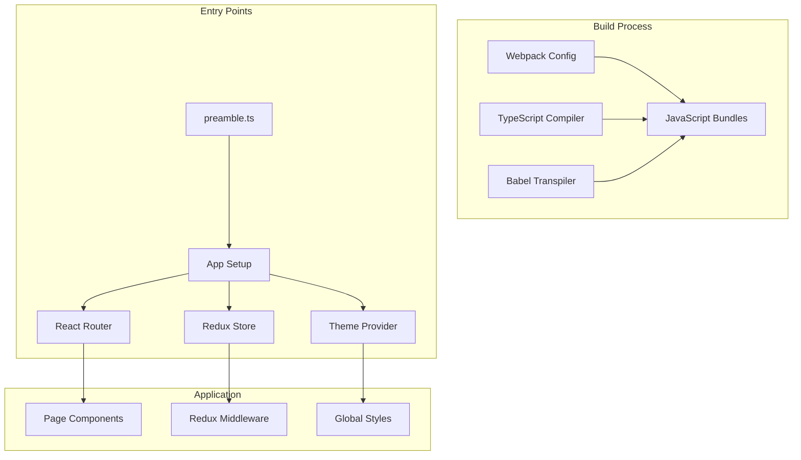
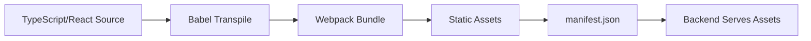

# Frontend - Application Setup

## Overview
The Superset frontend is a React application built with TypeScript, Redux, and Webpack. This document details the complete frontend initialization and setup process.

## Architecture



## Directory Structure

```
superset-frontend/
├── src/
│   ├── preamble.ts           # App bootstrap
│   ├── setup/                # App initialization
│   │   ├── setupApp.ts
│   │   ├── setupPlugins.ts
│   │   ├── setupClient.ts
│   │   └── setupColors.ts
│   ├── components/           # Shared UI components
│   ├── dashboard/            # Dashboard feature
│   ├── explore/              # Chart builder
│   ├── SqlLab/              # SQL editor
│   ├── pages/               # Route pages
│   ├── middleware/          # Redux middleware
│   ├── types/               # TypeScript types
│   └── utils/               # Utility functions
├── webpack.config.js        # Webpack configuration
├── tsconfig.json           # TypeScript config
├── package.json            # Dependencies
└── babel.config.js         # Babel config
```

## Entry Point - Preamble (`superset-frontend/src/preamble.ts`)

**File**: `superset-frontend/src/preamble.ts`

```typescript
/**
 * Licensed to the Apache Software Foundation (ASF)
 * 
 * This is the first file loaded in the browser
 * Sets up the application environment
 */

// Polyfills for older browsers
import 'core-js/stable';
import 'regenerator-runtime/runtime';
import 'abortcontroller-polyfill/dist/abortcontroller-polyfill-only';

// jQuery - required for some legacy components
import $ from 'jquery';

// Make jQuery available globally
window.$ = $;
window.jQuery = $;

// Set up SupersetClient for API calls
import { setupClient } from './setup/setupClient';
setupClient();

// Set up color schemes
import { setupColors } from './setup/setupColors';
setupColors();

// Set up visualization plugins
import { setupPlugins } from './setup/setupPlugins';
setupPlugins();

// Set up application
import { setupApp } from './setup/setupApp';
setupApp();
```

**Location**: Lines 1-80  
**Purpose**: Bootstrap the application environment

---

## Setup Client (`superset-frontend/src/setup/setupClient.ts`)

**File**: `superset-frontend/src/setup/setupClient.ts`

```typescript
import { SupersetClient } from '@superset-ui/core';

/**
 * Configure the Superset API client
 * Sets up base URL, CSRF tokens, and request/response interceptors
 */
export function setupClient() {
  // Get CSRF token from meta tag
  const csrfNode = document.querySelector<HTMLMetaElement>(
    'meta[name="csrf_token"]'
  );
  const csrfToken = csrfNode?.content;
  
  // Get base URL from bootstrap data
  const root = document.getElementById('app');
  const bootstrapData = root?.dataset?.bootstrap 
    ? JSON.parse(root.dataset.bootstrap)
    : {};
  
  // Configure SupersetClient
  SupersetClient.configure({
    protocol: window.location.protocol.slice(0, -1) as 'http' | 'https',
    host: window.location.host,
    csrfToken,
  })
    // Add CSRF token to all requests
    .init()
    // Add request interceptor for authentication
    .then(() => {
      SupersetClient.get({
        endpoint: '/api/v1/security/csrf_token/',
      }).then(({ json }) => {
        if (json?.result) {
          SupersetClient.configure({ csrfToken: json.result });
        }
      });
    });
  
  return SupersetClient;
}
```

**Location**: Lines 1-60  
**Purpose**: Configure API client with authentication

---

## Setup Plugins (`superset-frontend/src/setup/setupPlugins.ts`)

**File**: `superset-frontend/src/setup/setupPlugins.ts`

```typescript
import {
  getChartControlPanelRegistry,
  getChartMetadataRegistry,
  getChartBuildQueryRegistry,
  getChartTransformPropsRegistry,
} from '@superset-ui/core';

// Import chart plugins
import TableChartPlugin from '../visualizations/presets/MainPreset/plugins/TableChartPlugin';
import BigNumberChartPlugin from '../visualizations/presets/MainPreset/plugins/BigNumberChartPlugin';
import EchartsTimeseriesChartPlugin from '../visualizations/presets/MainPreset/plugins/EchartsTimeseriesChartPlugin';
// ... more plugins

/**
 * Register all visualization plugins
 * Each plugin provides:
 * - metadata (name, thumbnail, description)
 * - controlPanel (configuration UI)
 * - buildQuery (convert form data to query)
 * - transformProps (format query result for viz)
 */
export function setupPlugins() {
  // Get plugin registries
  const metadataRegistry = getChartMetadataRegistry();
  const controlPanelRegistry = getChartControlPanelRegistry();
  const buildQueryRegistry = getChartBuildQueryRegistry();
  const transformPropsRegistry = getChartTransformPropsRegistry();
  
  // Register Table chart
  new TableChartPlugin()
    .configure({ key: 'table' })
    .register();
  
  // Register Big Number chart
  new BigNumberChartPlugin()
    .configure({ key: 'big_number' })
    .register();
  
  // Register ECharts Timeseries
  new EchartsTimeseriesChartPlugin()
    .configure({ key: 'echarts_timeseries' })
    .register();
  
  // ... register more plugins
  
  // Load dynamic plugins from backend if feature flag enabled
  if (window.featureFlags?.DYNAMIC_PLUGINS) {
    fetch('/api/v1/chart/plugins')
      .then(response => response.json())
      .then(({ result }) => {
        result.forEach((plugin: any) => {
          // Dynamically load and register plugin
          import(/* webpackIgnore: true */ plugin.url)
            .then(module => {
              new module.default()
                .configure({ key: plugin.key })
                .register();
            });
        });
      });
  }
}
```

**Location**: Lines 1-100  
**Purpose**: Register all chart visualization plugins

---

## Setup App (`superset-frontend/src/setup/setupApp.ts`)

**File**: `superset-frontend/src/setup/setupApp.ts`

```typescript
import React from 'react';
import ReactDOM from 'react-dom';
import { Provider } from 'react-redux';
import { BrowserRouter } from 'react-router-dom';
import { ThemeProvider } from '@superset-ui/core';

import { store } from '../redux/store';
import { theme } from '../theme';
import App from '../pages/App';

/**
 * Mount the React application to the DOM
 * Sets up Redux Provider, Theme, and Router
 */
export function setupApp() {
  // Get mount point
  const appContainer = document.getElementById('app');
  
  if (!appContainer) {
    console.error('App container not found');
    return;
  }
  
  // Get bootstrap data from server
  const bootstrapData = appContainer.dataset?.bootstrap
    ? JSON.parse(appContainer.dataset.bootstrap)
    : {};
  
  // Store bootstrap data globally
  window.bootstrapData = bootstrapData;
  
  // Render the app
  ReactDOM.render(
    <React.StrictMode>
      <Provider store={store}>
        <BrowserRouter>
          <ThemeProvider theme={theme}>
            <App />
          </ThemeProvider>
        </BrowserRouter>
      </Provider>
    </React.StrictMode>,
    appContainer
  );
}
```

**Location**: Lines 1-60  
**Purpose**: Mount React app with providers

---

## Redux Store Setup (`superset-frontend/src/redux/store.ts`)

**File**: `superset-frontend/src/redux/store.ts` (approximate location)

```typescript
import { createStore, applyMiddleware, combineReducers } from 'redux';
import thunk from 'redux-thunk';
import { composeWithDevTools } from 'redux-devtools-extension';

// Import reducers
import dashboardReducer from '../dashboard/reducers';
import exploreReducer from '../explore/reducers';
import sqlLabReducer from '../SqlLab/reducers';
import messageToastsReducer from '../components/MessageToasts/reducers';
import chartsReducer from '../components/Chart/chartReducer';

/**
 * Root reducer combining all feature reducers
 */
const rootReducer = combineReducers({
  dashboard: dashboardReducer,
  explore: exploreReducer,
  sqlLab: sqlLabReducer,
  messageToasts: messageToastsReducer,
  charts: chartsReducer,
  // ... more reducers
});

/**
 * Middleware stack
 * - thunk: for async actions
 * - logger: development logging
 */
const middleware = [thunk];

if (process.env.NODE_ENV === 'development') {
  const { logger } = require('redux-logger');
  middleware.push(logger);
}

/**
 * Create Redux store with middleware
 */
export const store = createStore(
  rootReducer,
  composeWithDevTools(
    applyMiddleware(...middleware)
  )
);

// Export types for TypeScript
export type RootState = ReturnType<typeof rootReducer>;
export type AppDispatch = typeof store.dispatch;
```

**Location**: Feature-specific reducers combined  
**Purpose**: Configure Redux store with all reducers

---

## Theme Configuration (`superset-frontend/src/theme.ts`)

**File**: `superset-frontend/src/theme.ts`

```typescript
import { SupersetTheme } from '@superset-ui/core';

/**
 * Default Superset theme
 * Can be overridden via THEME_OVERRIDES in backend config
 */
export const theme: SupersetTheme = {
  // Color palette
  colors: {
    primary: {
      base: '#20A7C9',
      dark1: '#1A85A0',
      dark2: '#156378',
      light1: '#79CADE',
      light2: '#A5DAE9',
      light3: '#D2EDF4',
      light4: '#E9F6F9',
      light5: '#F3F9FB',
    },
    secondary: {
      base: '#444E7C',
      dark1: '#363E63',
      dark2: '#282E4A',
      dark3: '#1B1F31',
      light1: '#8E94B0',
      light2: '#B4B8CA',
      light3: '#D9DBE4',
      light4: '#ECEEF2',
      light5: '#F5F5F8',
    },
    grayscale: {
      base: '#666666',
      dark1: '#323232',
      dark2: '#000000',
      light1: '#B2B2B2',
      light2: '#E0E0E0',
      light3: '#F0F0F0',
      light4: '#F7F7F7',
      light5: '#FFFFFF',
    },
    error: {
      base: '#E04355',
      dark1: '#A7323F',
      dark2: '#6F212A',
      light1: '#EFA1AA',
      light2: '#FAEDEE',
    },
    warning: {
      base: '#FF7F44',
      dark1: '#BF5E33',
      dark2: '#7F3F21',
      light1: '#FEC0A1',
      light2: '#FFF2EC',
    },
    alert: {
      base: '#FCC700',
      dark1: '#BC9501',
      dark2: '#7D6300',
      light1: '#FDE380',
      light2: '#FEF9E6',
    },
    success: {
      base: '#5AC189',
      dark1: '#439066',
      dark2: '#2D6044',
      light1: '#ACE1C4',
      light2: '#EEF8F3',
    },
    info: {
      base: '#66BCFE',
      dark1: '#4D8DBE',
      dark2: '#335E7F',
      light1: '#B2DEFE',
      light2: '#EFF8FE',
    },
  },
  
  // Typography
  typography: {
    families: {
      sansSerif: '"Inter", Helvetica, Arial, sans-serif',
      serif: 'Georgia, "Times New Roman", Times, serif',
      monospace: '"Fira Code", "Courier New", monospace',
    },
    weights: {
      light: 200,
      normal: 400,
      medium: 500,
      bold: 600,
    },
    sizes: {
      xxs: 9,
      xs: 10,
      s: 12,
      m: 14,
      l: 16,
      xl: 21,
      xxl: 28,
    },
  },
  
  // Spacing
  gridUnit: 4,
  borderRadius: 4,
  
  // Transitions
  transitionTiming: 0.3,
};
```

**Location**: Lines 1-120  
**Purpose**: Define application theme

---

## Route Configuration

### App Component (`superset-frontend/src/pages/App.tsx`)

```typescript
import React from 'react';
import { Switch, Route } from 'react-router-dom';

// Page components
import DashboardPage from '../dashboard/containers/DashboardPage';
import ExplorePage from '../explore/components/ExploreViewContainer';
import SqlLabPage from '../SqlLab';
import DatasetList from '../pages/DatasetList';
import ChartList from '../pages/ChartList';
import Home from '../pages/Home';

/**
 * Main application component with routing
 */
const App: React.FC = () => {
  return (
    <Switch>
      {/* Dashboard routes */}
      <Route 
        path="/superset/dashboard/:idOrSlug" 
        component={DashboardPage} 
      />
      
      {/* Explore routes */}
      <Route 
        path="/superset/explore/:datasource" 
        component={ExplorePage} 
      />
      
      {/* SQL Lab */}
      <Route 
        path="/sqllab" 
        component={SqlLabPage} 
      />
      
      {/* List views */}
      <Route 
        path="/tablemodelview/list" 
        component={DatasetList} 
      />
      <Route 
        path="/chart/list" 
        component={ChartList} 
      />
      
      {/* Home */}
      <Route 
        path="/superset/welcome" 
        component={Home} 
      />
      
      {/* Default redirect */}
      <Route 
        path="*" 
        render={() => {
          window.location.href = '/superset/welcome';
          return null;
        }}
      />
    </Switch>
  );
};

export default App;
```

**Location**: Main app routing  
**Purpose**: Define application routes

---

## Bootstrap Data

Bootstrap data is injected from the backend into the HTML:

```html
<!-- In base template -->
<div 
  id="app"
  data-bootstrap='{
    "user": {...},
    "common": {
      "feature_flags": {...},
      "conf": {...}
    }
  }'
></div>
```

Accessed in frontend:

```typescript
// Get bootstrap data
const appContainer = document.getElementById('app');
const bootstrapData = JSON.parse(appContainer.dataset.bootstrap);

// Access feature flags
const featureFlags = bootstrapData.common.feature_flags;

// Access user info
const currentUser = bootstrapData.user;

// Access configuration
const conf = bootstrapData.common.conf;
```

---

## Webpack Configuration

**File**: `superset-frontend/webpack.config.js`

```javascript
const path = require('path');
const webpack = require('webpack');
const { WebpackManifestPlugin } = require('webpack-manifest-plugin');
const MiniCssExtractPlugin = require('mini-css-extract-plugin');
const OptimizeCSSAssetsPlugin = require('optimize-css-assets-webpack-plugin');
const TerserPlugin = require('terser-webpack-plugin');

module.exports = {
  // Entry points
  entry: {
    preamble: path.resolve(__dirname, 'src/preamble.ts'),
    theme: path.resolve(__dirname, 'src/theme.ts'),
    addSlice: path.resolve(__dirname, 'src/addSlice/index.tsx'),
    explore: path.resolve(__dirname, 'src/explore/index.tsx'),
    dashboard: path.resolve(__dirname, 'src/dashboard/index.tsx'),
    sqllab: path.resolve(__dirname, 'src/SqlLab/index.tsx'),
    // ... more entries
  },
  
  // Output configuration
  output: {
    path: path.resolve(__dirname, '../superset/static/assets'),
    publicPath: '/static/assets/',
    filename: '[name].[contenthash].bundle.js',
    chunkFilename: '[name].[contenthash].chunk.js',
  },
  
  // Module rules
  module: {
    rules: [
      // TypeScript/JavaScript
      {
        test: /\.(ts|tsx|js|jsx)$/,
        exclude: /node_modules/,
        use: {
          loader: 'babel-loader',
          options: {
            presets: [
              '@babel/preset-env',
              '@babel/preset-react',
              '@babel/preset-typescript',
            ],
          },
        },
      },
      
      // CSS/LESS
      {
        test: /\.css$/,
        use: [
          MiniCssExtractPlugin.loader,
          'css-loader',
        ],
      },
      {
        test: /\.less$/,
        use: [
          MiniCssExtractPlugin.loader,
          'css-loader',
          'less-loader',
        ],
      },
      
      // Images
      {
        test: /\.(png|jpg|gif|svg)$/,
        use: [
          {
            loader: 'file-loader',
            options: {
              name: '[name].[hash].[ext]',
            },
          },
        ],
      },
    ],
  },
  
  // Resolve extensions
  resolve: {
    extensions: ['.ts', '.tsx', '.js', '.jsx', '.json'],
    alias: {
      // Allow absolute imports
      src: path.resolve(__dirname, 'src'),
    },
  },
  
  // Optimization
  optimization: {
    minimize: true,
    minimizer: [
      new TerserPlugin({
        terserOptions: {
          compress: {
            drop_console: true,
          },
        },
      }),
      new OptimizeCSSAssetsPlugin(),
    ],
    splitChunks: {
      chunks: 'all',
      cacheGroups: {
        vendors: {
          test: /[\\/]node_modules[\\/]/,
          name: 'vendors',
          priority: -10,
        },
      },
    },
  },
  
  // Plugins
  plugins: [
    // Extract CSS
    new MiniCssExtractPlugin({
      filename: '[name].[contenthash].css',
    }),
    
    // Generate manifest
    new WebpackManifestPlugin({
      fileName: 'manifest.json',
    }),
    
    // Define environment variables
    new webpack.DefinePlugin({
      'process.env.NODE_ENV': JSON.stringify(process.env.NODE_ENV),
    }),
  ],
  
  // Dev server
  devServer: {
    port: 9000,
    proxy: {
      '/api': {
        target: 'http://localhost:8088',
      },
      '/superset': {
        target: 'http://localhost:8088',
      },
    },
  },
};
```

**Location**: Root of superset-frontend  
**Purpose**: Configure webpack build process

---

## Development Scripts

**File**: `superset-frontend/package.json`

```json
{
  "scripts": {
    "dev-server": "webpack-dev-server --mode development",
    "build": "webpack --mode production",
    "build-dev": "webpack --mode development",
    "lint": "eslint --ext .js,.jsx,.ts,.tsx src",
    "lint-fix": "eslint --ext .js,.jsx,.ts,.tsx src --fix",
    "type-check": "tsc --noEmit",
    "test": "jest",
    "test-watch": "jest --watch",
    "prettier": "prettier --write '{src,spec}/**/*.{ts,tsx,js,jsx,json,css,less}'"
  }
}
```

---

## Build Process Flow



---

## Key Files Reference

| File | Purpose |
|------|---------|
| `src/preamble.ts` | App bootstrap entry point |
| `src/setup/setupApp.ts` | React app initialization |
| `src/setup/setupClient.ts` | API client configuration |
| `src/setup/setupPlugins.ts` | Visualization plugins |
| `src/theme.ts` | Theme configuration |
| `webpack.config.js` | Build configuration |
| `tsconfig.json` | TypeScript configuration |
| `babel.config.js` | Babel transpiler config |

---

## Development Workflow

1. **Start Backend**: `make flask-app` (port 8088)
2. **Start Frontend Dev Server**: `npm run dev-server` (port 9000)
3. **Access App**: http://localhost:9000
4. **Hot Reload**: Changes auto-reload in browser
5. **API Proxied**: Frontend proxies API calls to backend

---

## Production Build

```bash
# Build frontend assets
cd superset-frontend
npm run build

# Assets output to: superset/static/assets/
# Backend serves from this directory
```

---

## Next Steps

- [Frontend State Management](./frontend-state-management.md) - Redux patterns
- [Frontend Dashboard](./frontend-dashboard.md) - Dashboard implementation
- [Frontend Explore](./frontend-explore.md) - Chart builder
- [Frontend Visualizations](./frontend-visualizations.md) - Chart plugins
