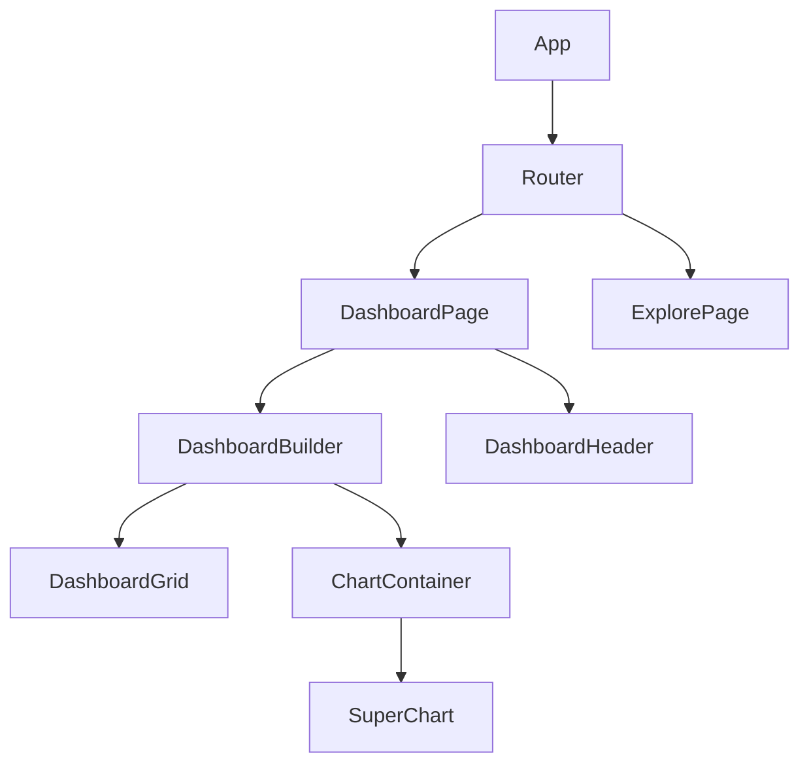
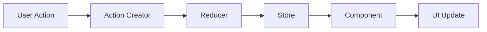
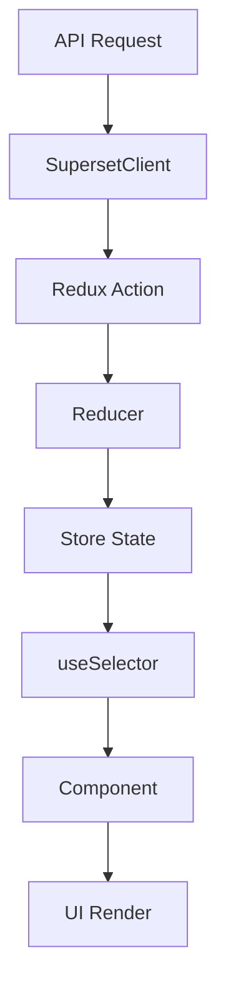

# Day 11: Superset前端架构学习指南

## 📚 学习目标

通过本章学习，您将：
- 深入理解Superset前端技术栈和架构设计
- 掌握React + Redux的现代前端开发模式
- 学会组件开发、状态管理和性能优化
- 具备前端扩展开发和调试能力

## 📁 文件结构

```
day11_frontend_architecture/
├── README.md                    # 学习指南（本文件）
├── day11_learning_notes.md      # 详细学习笔记
├── day11_practice.py            # 实践代码和架构分析
├── frontend_examples/           # 前端代码示例
│   ├── components/              # 组件示例
│   ├── hooks/                   # 自定义Hooks
│   ├── redux/                   # Redux相关
│   └── tests/                   # 测试示例
└── diagrams/                    # 架构图表
    ├── component_hierarchy.md   # 组件层次图
    ├── state_flow.md           # 状态流转图
    └── performance_flow.md     # 性能优化流程图
```

## 🎯 核心学习内容

### 1. 技术栈概览
- **React 16.x**: 现代UI框架，函数组件 + Hooks
- **Redux + RTK**: 状态管理，单向数据流
- **TypeScript**: 类型安全，开发体验提升
- **Webpack 5**: 模块打包，代码分割
- **Ant Design**: UI组件库，设计系统
- **Emotion**: CSS-in-JS，样式管理

### 2. 架构设计原理
```
┌─────────────────────────────────────┐
│           Presentation Layer        │  React组件 + UI库
├─────────────────────────────────────┤
│           Business Logic Layer      │  自定义Hooks + 工具函数
├─────────────────────────────────────┤
│           State Management Layer    │  Redux + RTK Query
├─────────────────────────────────────┤
│           Data Access Layer         │  API客户端 + 数据获取
├─────────────────────────────────────┤
│           Infrastructure Layer      │  构建工具 + 开发环境
└─────────────────────────────────────┘
```

### 3. 组件开发模式

#### 3.1 组件分类
- **容器组件**: 负责数据获取和状态管理
- **展示组件**: 纯UI组件，只负责渲染
- **高阶组件**: 提供通用功能增强
- **自定义Hooks**: 封装业务逻辑

#### 3.2 开发规范
```typescript
// 组件接口定义
interface ComponentProps {
  // 必需属性
  id: string;
  title: string;
  
  // 可选属性
  description?: string;
  
  // 事件处理
  onSave: (data: FormData) => void;
  onCancel?: () => void;
  
  // 子组件
  children?: React.ReactNode;
}

// 函数组件实现
const Component: React.FC<ComponentProps> = ({
  id,
  title,
  description,
  onSave,
  onCancel,
  children
}) => {
  // Hooks使用
  const [loading, setLoading] = useState(false);
  const dispatch = useDispatch();
  const data = useSelector(selectData);
  
  // 事件处理
  const handleSave = useCallback(async () => {
    setLoading(true);
    try {
      await onSave(formData);
    } finally {
      setLoading(false);
    }
  }, [onSave, formData]);
  
  // 渲染
  return (
    <div className="component">
      <h1>{title}</h1>
      {description && <p>{description}</p>}
      {children}
      <Button onClick={handleSave} loading={loading}>
        Save
      </Button>
    </div>
  );
};
```

### 4. Redux状态管理

#### 4.1 状态结构
```typescript
interface RootState {
  dashboardState: DashboardState;    // 仪表板状态
  dashboardLayout: LayoutState;      // 布局状态
  charts: ChartsState;               // 图表状态
  datasources: DatasourcesState;     // 数据源状态
  nativeFilters: FiltersState;       // 过滤器状态
  dataMask: DataMaskState;           // 数据掩码
  user: UserState;                   // 用户状态
}
```

#### 4.2 Redux Toolkit使用
```typescript
// Slice定义
const dashboardSlice = createSlice({
  name: 'dashboard',
  initialState,
  reducers: {
    setEditMode: (state, action) => {
      state.editMode = action.payload;
    },
  },
  extraReducers: (builder) => {
    builder
      .addCase(fetchDashboard.pending, (state) => {
        state.loading = true;
      })
      .addCase(fetchDashboard.fulfilled, (state, action) => {
        state.data = action.payload;
        state.loading = false;
      });
  },
});
```

### 5. 性能优化策略

#### 5.1 代码分割
```typescript
// 路由级分割
const Dashboard = lazy(() => import('./Dashboard'));
const Explore = lazy(() => import('./Explore'));

// 组件级分割
const HeavyChart = lazy(() => import('./HeavyChart'));
```

#### 5.2 记忆化优化
```typescript
// React.memo
const Component = React.memo(({ data }) => {
  return <div>{data.title}</div>;
});

// useMemo
const expensiveValue = useMemo(() => {
  return computeExpensiveValue(data);
}, [data]);

// useCallback
const handleClick = useCallback(() => {
  onClick(id);
}, [onClick, id]);
```

## 🛠️ 实践练习

### 练习1: 创建自定义Hook
```typescript
// 实现一个数据获取Hook
function useApiResource<T>(endpoint: string) {
  const [data, setData] = useState<T | null>(null);
  const [loading, setLoading] = useState(true);
  const [error, setError] = useState<string | null>(null);
  
  useEffect(() => {
    // 实现数据获取逻辑
  }, [endpoint]);
  
  return { data, loading, error };
}
```

### 练习2: 实现Redux Slice
```typescript
// 创建一个图表管理的Slice
const chartSlice = createSlice({
  name: 'chart',
  initialState: {
    charts: {},
    loading: false,
    error: null,
  },
  reducers: {
    // 实现reducer逻辑
  },
  extraReducers: (builder) => {
    // 处理异步actions
  },
});
```

### 练习3: 组件性能优化
```typescript
// 优化一个图表列表组件
const ChartList = React.memo(({ charts, onChartClick }) => {
  const filteredCharts = useMemo(() => {
    return charts.filter(chart => chart.published);
  }, [charts]);
  
  const handleChartClick = useCallback((chartId) => {
    onChartClick(chartId);
  }, [onChartClick]);
  
  return (
    <div>
      {filteredCharts.map(chart => (
        <ChartItem
          key={chart.id}
          chart={chart}
          onClick={handleChartClick}
        />
      ))}
    </div>
  );
});
```

## 🧪 测试策略

### 单元测试
```typescript
// 组件测试
describe('Dashboard Component', () => {
  it('renders dashboard title', () => {
    render(<Dashboard title="Test" />);
    expect(screen.getByText('Test')).toBeInTheDocument();
  });
});

// Hook测试
describe('useApiResource', () => {
  it('fetches data successfully', async () => {
    const { result, waitForNextUpdate } = renderHook(
      () => useApiResource('/api/data')
    );
    
    await waitForNextUpdate();
    
    expect(result.current.data).toBeDefined();
  });
});
```

### 集成测试
```typescript
// Redux集成测试
describe('Dashboard Integration', () => {
  it('updates state when action is dispatched', () => {
    const store = configureStore({ reducer: { dashboard: dashboardReducer } });
    
    store.dispatch(setEditMode(true));
    
    expect(store.getState().dashboard.editMode).toBe(true);
  });
});
```

## 📊 架构图表

### 组件层次结构


### 状态流转图


### 数据流向图


## 🔧 开发工具

### 必备工具
- **React DevTools**: 组件调试
- **Redux DevTools**: 状态调试
- **TypeScript**: 类型检查
- **ESLint**: 代码规范
- **Prettier**: 代码格式化
- **Jest**: 单元测试
- **Storybook**: 组件开发

### VS Code插件推荐
- ES7+ React/Redux/React-Native snippets
- TypeScript Importer
- Auto Rename Tag
- Bracket Pair Colorizer
- GitLens

## 📈 性能监控

### 关键指标
- **首屏加载时间**: < 3秒
- **组件渲染时间**: < 100ms
- **内存使用**: 监控内存泄漏
- **包大小**: 控制bundle大小
- **代码覆盖率**: > 80%

### 监控工具
```typescript
// 性能监控Hook
const usePerformanceMonitor = (componentName: string) => {
  useEffect(() => {
    const startTime = performance.now();
    
    return () => {
      const endTime = performance.now();
      const renderTime = endTime - startTime;
      
      if (renderTime > 100) {
        console.warn(`${componentName} render time: ${renderTime}ms`);
      }
    };
  });
};
```

## 🚀 部署和构建

### 构建配置
```javascript
// webpack.config.js
module.exports = {
  entry: {
    spa: './src/views/index.tsx',
    dashboard: './src/dashboard/index.tsx',
  },
  optimization: {
    splitChunks: {
      chunks: 'all',
      cacheGroups: {
        vendors: {
          test: /[\\/]node_modules[\\/]/,
          name: 'vendors',
          priority: 50,
        },
      },
    },
  },
};
```

### 构建脚本
```json
{
  "scripts": {
    "build": "webpack --mode=production",
    "dev": "webpack-dev-server --mode=development",
    "test": "jest",
    "lint": "eslint src/",
    "type-check": "tsc --noEmit"
  }
}
```

## 📚 学习资源

### 官方文档
- [React官方文档](https://reactjs.org/docs)
- [Redux官方文档](https://redux.js.org/)
- [TypeScript官方文档](https://www.typescriptlang.org/docs/)
- [Webpack官方文档](https://webpack.js.org/concepts/)

### 推荐教程
- React Hooks深入理解
- Redux Toolkit最佳实践
- TypeScript在React中的应用
- 前端性能优化指南

### 社区资源
- [React社区](https://reactjs.org/community/support.html)
- [Redux社区](https://redux.js.org/introduction/community)
- [Superset社区](https://superset.apache.org/community)

## 🎓 学习路径建议

### 初级阶段 (1-2周)
1. **React基础**: 组件、Props、State
2. **Hooks入门**: useState、useEffect
3. **TypeScript基础**: 类型定义、接口
4. **开发环境**: 搭建开发环境

### 中级阶段 (2-3周)
1. **Redux基础**: Store、Action、Reducer
2. **高级Hooks**: useCallback、useMemo、useRef
3. **组件设计**: 容器组件vs展示组件
4. **测试基础**: Jest、React Testing Library

### 高级阶段 (3-4周)
1. **Redux Toolkit**: 现代Redux开发
2. **性能优化**: 代码分割、懒加载
3. **架构设计**: 大型应用架构
4. **扩展开发**: 自定义组件和插件

## 🔍 常见问题

### Q1: 如何调试React组件？
A: 使用React DevTools，可以查看组件树、Props和State。

### Q2: Redux状态如何设计？
A: 遵循扁平化原则，避免深层嵌套，使用normalizr处理关系数据。

### Q3: 如何优化大型列表渲染？
A: 使用react-window或react-virtualized进行虚拟化渲染。

### Q4: TypeScript如何提高开发效率？
A: 提供类型检查、智能提示和重构支持，减少运行时错误。

## 📝 总结

通过本章学习，您应该掌握：

1. **技术栈理解**: React + Redux + TypeScript的现代前端架构
2. **组件开发**: 函数组件、Hooks、高阶组件的使用
3. **状态管理**: Redux的最佳实践和RTK的应用
4. **性能优化**: 代码分割、记忆化、虚拟化等技术
5. **测试策略**: 单元测试、集成测试的实施
6. **构建部署**: Webpack配置和构建优化
7. **扩展开发**: 自定义组件和插件开发

这些知识将为您深入理解和扩展Superset前端功能奠定坚实基础。

---

**下一步**: 继续学习Day 12的内容，或者深入实践本章的示例代码。 