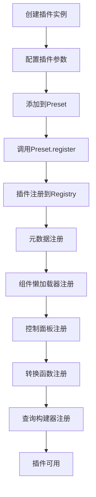

# Day 12: Superset 插件架构与虚拟化机制 🔌

欢迎来到第12天的学习！今天我们将深入探索 Apache Superset 的插件架构体系，学习如何创建自定义插件，并实现一个增强的 Pivot Table 插件。

## 🎯 学习目标

- **插件架构原理**：理解 Superset 的插件化设计思想
- **插件生命周期**：掌握插件的注册、加载、渲染流程
- **核心组件解析**：深入理解 ChartPlugin、Preset、Registry 等核心类
- **插件开发实践**：手把手创建一个增强版 Pivot Table 插件
- **动态插件机制**：学习动态插件的加载和管理
- **插件扩展技巧**：掌握插件的高级扩展方法

## 📚 学习资料

### 1. 核心概念和架构

**主要文档：**
- [`day12_source_code_analysis.md`](./day12_source_code_analysis.md) - 深度源码分析
- [`plugin_development_guide.md`](./plugin_development_guide.md) - 完整开发指南

**关键概念：**
- Plugin 基类设计和继承体系
- ChartPlugin 图表插件架构
- Registry 注册表系统
- Preset 预设管理机制
- 动态插件加载和共享模块

### 2. 实践练习

**练习文档：**
- [`day12_practice.md`](./day12_practice.md) - 分步骤实践练习

**练习内容：**
1. **分析现有插件结构** - 理解 Pivot Table 插件的组织方式
2. **创建简单插件** - 从零实现 "简单数值展示" 插件
3. **注册和测试** - 将插件集成到 Superset 系统
4. **功能增强** - 添加动画、交互、主题等高级功能
5. **复杂插件开发** - 创建增强版 Pivot Table 插件
6. **性能优化** - 虚拟化渲染、缓存、懒加载等技术

### 3. 完整示例代码

**前端插件实现：**
- [`enhanced_pivot_plugin.tsx`](./enhanced_pivot_plugin.tsx) - 完整的增强版 Pivot Table 插件

**后端插件演示：**
- [`plugin_demo.py`](./plugin_demo.py) - Python 版本的插件系统演示

## 🏗️ 插件架构概览

### 核心架构层次

```
Superset Plugin Architecture
├── Frontend (React/TypeScript)
│   ├── Plugin Core (@superset-ui/core)
│   │   ├── ChartPlugin 基类
│   │   ├── Registry 注册表系统
│   │   └── Preset 预设管理
│   ├── Plugin Packages
│   │   ├── Chart Components
│   │   ├── Control Panels
│   │   └── Transform Functions
│   └── Plugin Management
│       ├── MainPreset 主预设
│       ├── Dynamic Plugin Provider
│       └── Plugin Context
└── Backend (Python)
    ├── Dynamic Plugin Model
    ├── Plugin API Endpoints
    └── Plugin Bundle Management
```

### 插件生命周期



## 🚀 快速开始

### 1. 环境准备

```bash
# 获取 Superset 源码
git clone https://github.com/apache/superset.git
cd superset/superset-frontend

# 安装依赖
npm ci

# 安装插件开发工具
npm install -g @yeoman/yo generator-superset
```

### 2. 创建第一个插件

```bash
# 进入插件目录
cd plugins

# 使用脚手架生成插件
yo @superset-ui/superset

# 选择 Chart 类型，输入插件名称
```

### 3. 实现核心组件

**插件定义：**
```typescript
export default class MyChartPlugin extends ChartPlugin {
  constructor() {
    const metadata = new ChartMetadata({
      name: t('My Chart'),
      description: t('My custom chart'),
      category: t('Custom'),
      thumbnail: '/path/to/thumbnail.png',
    });

    super({
      loadChart: () => import('./MyChart'),
      metadata,
      transformProps,
      controlPanel,
    });
  }
}
```

### 4. 注册插件

```typescript
// MainPreset.js
import MyChartPlugin from '../../../plugins/my-chart/src';

export default class MainPreset extends Preset {
  constructor() {
    super({
      plugins: [
        // ... 其他插件
        new MyChartPlugin().configure({ key: 'my_chart' }),
      ],
    });
  }
}
```

## 🎨 增强版 Pivot Table 插件特性

我们将创建一个具有以下高级功能的增强版 Pivot Table 插件：

### 核心增强功能

1. **数据条 (Data Bars)**
   - 在单元格中显示横向数据条
   - 可配置颜色和样式
   - 基于列的最大值计算百分比

2. **热力图 (Heatmap)**
   - 根据数值大小为单元格着色
   - 多种颜色方案可选
   - 自动计算颜色强度

3. **条件格式化 (Conditional Formatting)**
   - 支持多种条件规则（大于、小于、区间、等于）
   - 自定义背景色和文字颜色
   - 按指标应用不同规则

4. **高级交互**
   - 可排序的列标题
   - 上下文菜单支持
   - 钻取功能
   - 交叉过滤

5. **性能优化**
   - 虚拟化渲染大数据集
   - 数据缓存和懒加载
   - 响应式设计

### 技术特色

- **TypeScript 支持**：完整的类型定义和类型安全
- **主题适配**：支持 Superset 的主题系统
- **可配置性**：丰富的控制面板选项
- **扩展性**：模块化设计，易于扩展新功能
- **性能优化**：针对大数据集的优化策略

## 📖 学习路径

### 初级阶段（1-2天）
1. 阅读插件架构概述
2. 分析现有插件代码
3. 创建简单的数值显示插件
4. 理解注册和生命周期机制

### 中级阶段（2-3天）
1. 深入学习 ChartPlugin 类
2. 掌握控制面板配置
3. 学习数据转换和处理
4. 实现复杂的交互功能

### 高级阶段（2-3天）
1. 创建增强版 Pivot Table 插件
2. 实现高级可视化功能
3. 性能优化和错误处理
4. 动态插件部署和管理

## 🛠️ 开发工具推荐

### VS Code 扩展
- TypeScript and JavaScript Language Features
- ES7+ React/Redux/React-Native snippets
- Prettier - Code formatter
- ESLint

### 调试工具
- React Developer Tools
- Redux DevTools
- Chrome DevTools

### 测试工具
- Jest - 单元测试
- React Testing Library - 组件测试
- Storybook - 组件开发和文档

## 📝 最佳实践

### 代码组织
- **单一职责原则**：每个组件专注一个功能
- **模块化设计**：便于维护和扩展
- **类型安全**：充分利用 TypeScript

### 性能优化
- **懒加载**：按需加载组件和资源
- **缓存策略**：合理缓存计算结果
- **虚拟化**：处理大数据集

### 用户体验
- **错误边界**：优雅处理异常情况
- **加载状态**：提供反馈信息
- **响应式**：适配不同设备

## 🔗 相关资源

### 官方文档
- [Superset 插件开发指南](https://superset.apache.org/docs/installation/building-custom-viz-plugins)
- [@superset-ui 文档](https://apache-superset.github.io/superset-ui/)
- [Chart Controls 文档](https://apache-superset.github.io/superset-ui/?path=/docs/chart-controls-introduction--page)

### 社区资源
- [官方插件仓库](https://github.com/apache/superset/tree/master/superset-frontend/plugins)
- [社区插件集合](https://github.com/topics/superset-plugin)
- [Superset 社区论坛](https://github.com/apache/superset/discussions)

## 🎯 学习成果

完成本次学习后，您将能够：

1. **深入理解** Superset 插件架构和设计原理
2. **熟练开发** 各种类型的自定义图表插件
3. **掌握技能** 包括组件开发、数据处理、交互设计
4. **实际应用** 创建生产级别的插件并部署到实际环境
5. **持续学习** 具备独立研究和扩展插件功能的能力

让我们开始这次精彩的插件开发之旅吧！ 🚀

---

**下一步计划：**
- Day 13: 高级仪表板开发与布局系统
- Day 14: 数据血缘与元数据管理
- Day 15: 企业级部署与运维最佳实践 