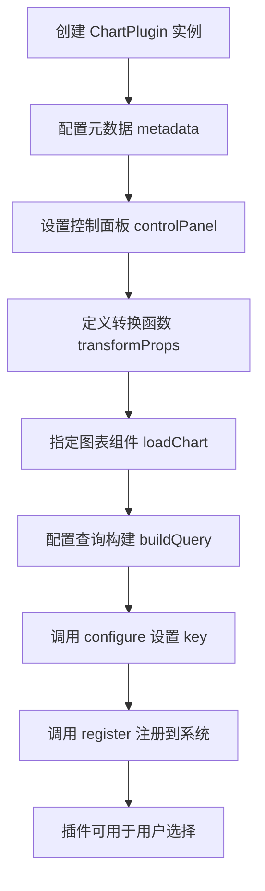
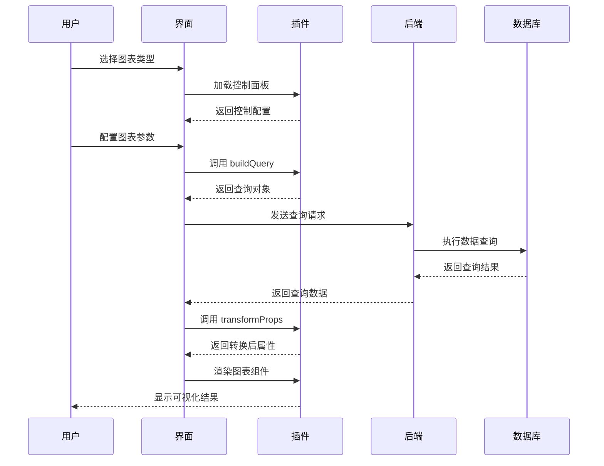

# Superset 插件开发完整指南 🚀

## 概述

这份指南将帮助你从零开始创建功能完整的 Superset 图表插件，包括开发环境设置、核心概念理解、实际编码和部署测试。

## 🛠️ 开发环境准备

### 1. 环境要求

```bash
# Node.js 版本要求
node --version  # >= 16.0.0
npm --version   # >= 8.0.0

# Python 环境
python --version  # >= 3.8

# 必需工具
npm install -g @yeoman/yo
npm install -g generator-superset
```

### 2. 获取 Superset 源码

```bash
git clone https://github.com/apache/superset.git
cd superset
git checkout master

# 安装前端依赖
cd superset-frontend
npm ci
```

### 3. 开发工具配置

**VS Code 推荐扩展：**
- TypeScript and JavaScript Language Features
- ES7+ React/Redux/React-Native snippets
- Prettier - Code formatter
- ESLint

**项目配置文件：**

```json
// .vscode/settings.json
{
  "typescript.preferences.importModuleSpecifier": "relative",
  "editor.formatOnSave": true,
  "editor.codeActionsOnSave": {
    "source.fixAll.eslint": true
  }
}
```

## 🏗️ 插件架构核心概念

### 1. ChartPlugin 生命周期



### 2. 数据流转过程



### 3. 核心接口定义

```typescript
interface ChartPluginConfig<FormData, Props> {
  // 必需：图表元数据
  metadata: ChartMetadata;
  
  // 可选：查询构建函数
  buildQuery?: BuildQueryFunction<FormData>;
  loadBuildQuery?: PromiseOrValueLoader<BuildQueryFunction<FormData>>;
  
  // 必需：属性转换函数
  transformProps?: TransformProps<Props>;
  loadTransformProps?: PromiseOrValueLoader<TransformProps<Props>>;
  
  // 必需：图表组件（二选一）
  Chart?: ChartType;
  loadChart?: PromiseOrValueLoader<ChartType>;
  
  // 可选：控制面板配置
  controlPanel?: ChartControlPanel;
}
```

## ⚡ 快速开始：创建第一个插件

### Step 1: 使用脚手架生成插件

```bash
# 进入插件目录
cd superset-frontend/plugins

# 使用 Yeoman 生成器
yo @superset-ui/superset

# 选择配置
? What type of package would you like to create? Chart
? Package name: my-awesome-chart
? Description: My first awesome chart plugin
? What type of React component would you like to use? Function component with hooks
```

### Step 2: 理解生成的文件结构

```
plugin-chart-my-awesome-chart/
├── README.md
├── package.json
├── src/
│   ├── MyAwesomeChart.tsx        # 主图表组件
│   ├── images/
│   │   └── thumbnail.png         # 缩略图
│   ├── plugin/
│   │   ├── buildQuery.ts         # 查询构建
│   │   ├── controlPanel.ts       # 控制面板
│   │   ├── index.ts             # 插件入口
│   │   └── transformProps.ts    # 数据转换
│   ├── types.ts                 # 类型定义
│   └── index.ts                 # 导出入口
└── test/
    └── index.test.ts            # 测试文件
```

### Step 3: 实现核心组件

**主图表组件：**

```typescript
// src/MyAwesomeChart.tsx
import React from 'react';
import { styled } from '@superset-ui/core';

const Styles = styled.div`
  background-color: ${({ theme }) => theme.colors.secondary.light2};
  padding: ${({ theme }) => theme.gridUnit * 4}px;
  border-radius: ${({ theme }) => theme.gridUnit * 2}px;
  height: ${props => props.height}px;
  width: ${props => props.width}px;
  overflow-y: scroll;

  h3 {
    /* You can use your props to control CSS! */
    margin-top: 0;
    color: ${props => props.headerFontColor};
    font-size: ${props => props.headerFontSize}px;
  }
`;

export default function MyAwesomeChart({
  data,
  height,
  width,
  headerText,
  headerFontColor,
  headerFontSize,
}) {
  return (
    <Styles
      height={height}
      width={width}
      headerFontColor={headerFontColor}
      headerFontSize={headerFontSize}
    >
      <h3>{headerText}</h3>
      <pre>{JSON.stringify(data, null, 2)}</pre>
    </Styles>
  );
}
```

**插件注册：**

```typescript
// src/plugin/index.ts
import { ChartMetadata, ChartPlugin, t } from '@superset-ui/core';
import buildQuery from './buildQuery';
import controlPanel from './controlPanel';
import transformProps from './transformProps';
import thumbnail from '../images/thumbnail.png';

export default class MyAwesomeChartPlugin extends ChartPlugin {
  constructor() {
    const metadata = new ChartMetadata({
      name: t('My Awesome Chart'),
      description: t('My first awesome chart plugin'),
      category: t('Custom'),
      tags: [t('Awesome'), t('Custom')],
      thumbnail,
    });

    super({
      buildQuery,
      controlPanel,
      loadChart: () => import('../MyAwesomeChart'),
      metadata,
      transformProps,
    });
  }
}
```

### Step 4: 集成到 Superset

**注册插件：**

```typescript
// superset-frontend/src/visualizations/presets/MainPreset.js
import MyAwesomeChartPlugin from '../../../plugins/plugin-chart-my-awesome-chart/src';

export default class MainPreset extends Preset {
  constructor() {
    super({
      name: 'Legacy charts',
      plugins: [
        // ... 其他插件
        new MyAwesomeChartPlugin().configure({ key: 'my_awesome_chart' }),
      ],
    });
  }
}
```

**构建和测试：**

```bash
# 构建插件
cd superset-frontend/plugins/plugin-chart-my-awesome-chart
npm run build

# 启动开发服务器
cd ../../
npm run dev-server
```

## 🎨 高级功能开发

### 1. 复杂控制面板

```typescript
// 多层级控制面板配置
const controlPanel: ControlPanelConfig = {
  controlPanelSections: [
    // 查询配置部分
    {
      label: t('Query'),
      expanded: true,
      controlSetRows: [
        // 基础查询控件
        [
          {
            name: 'metrics',
            config: {
              ...sharedControls.metrics,
              validators: [validateNonEmpty],
              rerender: ['conditional_formatting'], // 触发重渲染
            },
          },
        ],
        // 分组控件
        [
          {
            name: 'groupby',
            config: {
              ...sharedControls.groupby,
              label: t('Group by'),
              description: t('One or many controls to group by'),
            },
          },
        ],
        // 过滤器
        ['adhoc_filters'],
        // 行限制
        [
          {
            name: 'row_limit',
            config: {
              ...sharedControls.row_limit,
              default: 10000,
            },
          },
        ],
      ],
    },
    
    // 自定义配置部分
    {
      label: t('Chart Options'),
      expanded: false,
      controlSetRows: [
        // 颜色配置
        [
          {
            name: 'color_scheme',
            config: {
              type: 'ColorSchemeControl',
              label: t('Color Scheme'),
              default: 'supersetColors',
              description: t('Choose a color scheme for the chart'),
              renderTrigger: true,
            },
          },
        ],
        // 动态可见性控件
        [
          {
            name: 'show_legend',
            config: {
              type: 'CheckboxControl',
              label: t('Show Legend'),
              default: true,
              renderTrigger: true,
            },
          },
          {
            name: 'legend_position',
            config: {
              type: 'SelectControl',
              label: t('Legend Position'),
              choices: [
                ['top', t('Top')],
                ['right', t('Right')],
                ['bottom', t('Bottom')],
                ['left', t('Left')],
              ],
              default: 'right',
              visibility: ({ controls }) => controls?.show_legend?.value,
              renderTrigger: true,
            },
          },
        ],
        // 条件格式化
        [
          {
            name: 'conditional_formatting',
            config: {
              type: 'ConditionalFormattingControl',
              label: t('Conditional Formatting'),
              description: t('Apply conditional formatting based on metrics'),
              shouldMapStateToProps: true,
              mapStateToProps: (explore, _, chart) => ({
                columnOptions: chart.datasource?.columns || [],
                metricOptions: chart.datasource?.metrics || [],
                verboseMap: chart.datasource?.verbose_map || {},
              }),
            },
          },
        ],
      ],
    },
  ],
  
  // 全局控件设置
  controlOverrides: {
    series: {
      validators: [validateNonEmpty],
      clearable: false,
    },
    row_limit: {
      default: 100,
    },
  },
};
```

### 2. 高级数据转换

```typescript
// transformProps.ts - 复杂数据处理
export default function transformProps(chartProps: ChartProps): MyChartProps {
  const {
    width,
    height,
    queriesData,
    formData,
    hooks: { setDataMask, onContextMenu, onLegendStateChanged },
    filterState,
    datasource: { verboseMap = {} },
    rawFormData,
  } = chartProps;

  const {
    metrics = [],
    groupby = [],
    colorScheme = 'supersetColors',
    showLegend = true,
    legendPosition = 'right',
    conditionalFormatting = [],
  } = formData;

  const { data, colnames, coltypes } = queriesData[0];

  // 1. 数据预处理
  const processedData = useMemo(() => {
    return data.map((row, index) => ({
      ...row,
      __rowId: index, // 添加行ID用于交互
      __timestamp: new Date().getTime(), // 添加时间戳
    }));
  }, [data]);

  // 2. 计算衍生数据
  const aggregatedData = useMemo(() => {
    const grouped = {};
    processedData.forEach(row => {
      const key = groupby.map(col => row[col]).join('|');
      if (!grouped[key]) {
        grouped[key] = { values: [], count: 0 };
      }
      grouped[key].values.push(row);
      grouped[key].count += 1;
    });
    return grouped;
  }, [processedData, groupby]);

  // 3. 颜色映射
  const colorMapping = useMemo(() => {
    const colors = getSequentialSchemeRegistry().get(colorScheme)?.colors || [];
    const keys = Object.keys(aggregatedData);
    return keys.reduce((acc, key, index) => {
      acc[key] = colors[index % colors.length];
      return acc;
    }, {});
  }, [aggregatedData, colorScheme]);

  // 4. 交互处理函数
  const handleDataPointClick = useCallback((dataPoint) => {
    if (setDataMask) {
      const filters = groupby.map(col => ({
        col,
        op: '==',
        val: dataPoint[col],
      }));
      
      setDataMask({
        extraFormData: {
          filters,
        },
        filterState: {
          value: filters,
          selectedValues: [dataPoint],
        },
      });
    }
  }, [groupby, setDataMask]);

  // 5. 条件格式化处理
  const formattingRules = useMemo(() => {
    return conditionalFormatting.map(rule => ({
      ...rule,
      evaluate: (value, metric) => {
        // 实现条件评估逻辑
        switch (rule.operator) {
          case '>':
            return value > rule.value;
          case '<':
            return value < rule.value;
          case '==':
            return value === rule.value;
          case 'between':
            return value >= rule.value[0] && value <= rule.value[1];
          default:
            return false;
        }
      },
    }));
  }, [conditionalFormatting]);

  return {
    // 基础属性
    width,
    height,
    data: processedData,
    aggregatedData,
    
    // 配置属性
    metrics,
    groupby,
    colorScheme,
    colorMapping,
    showLegend,
    legendPosition,
    
    // 格式化和样式
    verboseMap,
    formattingRules,
    
    // 交互函数
    onDataPointClick: handleDataPointClick,
    onContextMenu,
    onLegendStateChanged,
    
    // 过滤状态
    selectedFilters: filterState.selectedFilters,
    
    // 元数据
    colnames,
    coltypes,
  };
}
```

### 3. 复杂图表组件

```typescript
// 使用 D3.js 的复杂图表组件
import React, { useEffect, useRef, useMemo } from 'react';
import * as d3 from 'd3';
import { styled, useTheme } from '@superset-ui/core';

const ChartContainer = styled.div`
  .axis {
    font-size: 12px;
  }
  
  .axis-label {
    font-size: 14px;
    font-weight: 600;
  }
  
  .data-point {
    cursor: pointer;
    transition: all 0.2s ease;
    
    &:hover {
      stroke-width: 2;
      opacity: 0.8;
    }
  }
  
  .tooltip {
    position: absolute;
    background: rgba(0, 0, 0, 0.8);
    color: white;
    padding: 8px;
    border-radius: 4px;
    font-size: 12px;
    pointer-events: none;
    z-index: 1000;
  }
`;

export default function AdvancedD3Chart({
  width,
  height,
  data,
  metrics,
  groupby,
  colorMapping,
  onDataPointClick,
  formattingRules,
}) {
  const svgRef = useRef();
  const theme = useTheme();
  
  // 图表配置
  const config = useMemo(() => ({
    margin: { top: 20, right: 30, bottom: 40, left: 40 },
    width: width - 60,
    height: height - 60,
  }), [width, height]);

  useEffect(() => {
    if (!data || data.length === 0) return;

    const svg = d3.select(svgRef.current);
    svg.selectAll('*').remove(); // 清除之前的内容

    // 1. 设置比例尺
    const xScale = d3.scaleBand()
      .domain(data.map(d => d[groupby[0]]))
      .range([0, config.width])
      .padding(0.1);

    const yScale = d3.scaleLinear()
      .domain([0, d3.max(data, d => d[metrics[0]])])
      .nice()
      .range([config.height, 0]);

    // 2. 创建主图区
    const g = svg.append('g')
      .attr('transform', `translate(${config.margin.left},${config.margin.top})`);

    // 3. 添加坐标轴
    const xAxis = d3.axisBottom(xScale);
    const yAxis = d3.axisLeft(yScale);

    g.append('g')
      .attr('class', 'x-axis')
      .attr('transform', `translate(0,${config.height})`)
      .call(xAxis)
      .append('text')
      .attr('class', 'axis-label')
      .attr('x', config.width / 2)
      .attr('y', 35)
      .style('text-anchor', 'middle')
      .style('fill', theme.colors.grayscale.base)
      .text(groupby[0]);

    g.append('g')
      .attr('class', 'y-axis')
      .call(yAxis)
      .append('text')
      .attr('class', 'axis-label')
      .attr('transform', 'rotate(-90)')
      .attr('y', -25)
      .attr('x', -config.height / 2)
      .style('text-anchor', 'middle')
      .style('fill', theme.colors.grayscale.base)
      .text(metrics[0]);

    // 4. 创建提示框
    const tooltip = d3.select('body').append('div')
      .attr('class', 'tooltip')
      .style('opacity', 0);

    // 5. 绘制数据点
    const bars = g.selectAll('.bar')
      .data(data)
      .enter().append('rect')
      .attr('class', 'bar data-point')
      .attr('x', d => xScale(d[groupby[0]]))
      .attr('width', xScale.bandwidth())
      .attr('y', config.height)
      .attr('height', 0)
      .style('fill', d => colorMapping[d[groupby[0]]] || theme.colors.primary.base)
      .style('stroke', theme.colors.grayscale.light1)
      .style('stroke-width', 1);

    // 6. 添加动画
    bars.transition()
      .duration(750)
      .attr('y', d => yScale(d[metrics[0]]))
      .attr('height', d => config.height - yScale(d[metrics[0]]));

    // 7. 添加交互
    bars
      .on('mouseover', function(event, d) {
        d3.select(this)
          .style('opacity', 0.7);
        
        tooltip.transition()
          .duration(200)
          .style('opacity', .9);
        
        tooltip.html(`
          <strong>${groupby[0]}:</strong> ${d[groupby[0]]}<br/>
          <strong>${metrics[0]}:</strong> ${d[metrics[0]].toLocaleString()}
        `)
          .style('left', (event.pageX + 10) + 'px')
          .style('top', (event.pageY - 28) + 'px');
      })
      .on('mouseout', function(d) {
        d3.select(this)
          .style('opacity', 1);
        
        tooltip.transition()
          .duration(500)
          .style('opacity', 0);
      })
      .on('click', function(event, d) {
        onDataPointClick?.(d);
      });

    // 8. 应用条件格式化
    if (formattingRules.length > 0) {
      bars.style('fill', function(d) {
        const value = d[metrics[0]];
        for (const rule of formattingRules) {
          if (rule.evaluate(value, metrics[0])) {
            return rule.backgroundColor || colorMapping[d[groupby[0]]];
          }
        }
        return colorMapping[d[groupby[0]]] || theme.colors.primary.base;
      });
    }

    // 清理函数
    return () => {
      tooltip.remove();
    };
  }, [data, config, metrics, groupby, colorMapping, theme, formattingRules, onDataPointClick]);

  return (
    <ChartContainer>
      <svg
        ref={svgRef}
        width={width}
        height={height}
      />
    </ChartContainer>
  );
}
```

## 🚀 部署和发布

### 1. 测试和验证

```bash
# 运行单元测试
npm test

# 运行 E2E 测试
npm run test:e2e

# 构建生产版本
npm run build

# 检查构建输出
ls -la lib/
```

### 2. 打包发布

```json
// package.json
{
  "name": "@your-org/superset-plugin-awesome-chart",
  "version": "1.0.0",
  "description": "An awesome chart plugin for Apache Superset",
  "main": "lib/index.js",
  "types": "lib/index.d.ts",
  "files": [
    "lib"
  ],
  "scripts": {
    "build": "tsc && npm run build:assets",
    "build:assets": "cp -r src/images lib/",
    "prepublishOnly": "npm run build"
  },
  "peerDependencies": {
    "@superset-ui/core": "^0.18.0",
    "@superset-ui/chart-controls": "^0.18.0",
    "react": "^16.8.0 || ^17.0.0"
  }
}
```

### 3. 动态插件部署

**创建插件包：**

```bash
# 构建 UMD 格式的包
webpack --config webpack.config.js --mode production

# 上传到 CDN 或静态服务器
aws s3 cp dist/index.js s3://your-bucket/plugins/awesome-chart/1.0.0/
```

**在 Superset 中注册动态插件：**

```python
# 通过 API 或管理界面添加动态插件
from superset.models.dynamic_plugins import DynamicPlugin

plugin = DynamicPlugin(
    name='Awesome Chart',
    key='awesome_chart',
    bundle_url='https://your-cdn.com/plugins/awesome-chart/1.0.0/index.js'
)
db.session.add(plugin)
db.session.commit()
```

## 📝 最佳实践

### 1. 代码组织

- **单一职责原则**：每个组件只负责一个功能
- **目录结构清晰**：按功能模块组织文件
- **命名规范一致**：使用有意义的变量和函数名
- **类型定义完整**：为所有接口定义 TypeScript 类型

### 2. 性能优化

- **使用 React.memo**：避免不必要的重渲染
- **合理使用 useMemo 和 useCallback**：缓存计算结果和函数
- **懒加载大型组件**：使用 React.lazy 和 Suspense
- **虚拟化长列表**：使用 react-window 处理大数据集

### 3. 用户体验

- **提供加载状态**：显示数据加载进度
- **错误边界处理**：优雅处理组件错误
- **无障碍支持**：添加适当的 ARIA 标签
- **响应式设计**：适配不同屏幕尺寸

### 4. 测试策略

- **单元测试**：测试核心逻辑函数
- **组件测试**：使用 React Testing Library
- **集成测试**：测试插件注册和数据流
- **视觉回归测试**：使用 Storybook 和 Chromatic

## 🔧 故障排除

### 常见问题和解决方案

**1. 插件未显示在图表类型列表中**

```typescript
// 检查插件是否正确注册
console.log(getChartMetadataRegistry().keys());

// 确保 key 配置正确
new MyPlugin().configure({ key: 'my_unique_key' }).register();
```

**2. 数据转换错误**

```typescript
// 添加数据验证
export default function transformProps(chartProps) {
  const { queriesData } = chartProps;
  
  if (!queriesData || queriesData.length === 0) {
    throw new Error('No data received');
  }
  
  const { data } = queriesData[0];
  
  if (!Array.isArray(data)) {
    throw new Error('Data is not an array');
  }
  
  // ... 其他处理
}
```

**3. 样式问题**

```typescript
// 使用主题变量而不是硬编码颜色
const StyledComponent = styled.div`
  color: ${({ theme }) => theme.colors.grayscale.base};
  background: ${({ theme }) => theme.colors.grayscale.light5};
`;
```

**4. 打包构建错误**

```bash
# 清理缓存
rm -rf node_modules package-lock.json
npm install

# 检查依赖版本兼容性
npm ls
```

## 📚 进阶资源

### 官方文档
- [Superset 插件开发指南](https://superset.apache.org/docs/installation/building-custom-viz-plugins)
- [@superset-ui 文档](https://apache-superset.github.io/superset-ui/)
- [Chart Controls 文档](https://apache-superset.github.io/superset-ui/?path=/docs/chart-controls-introduction--page)

### 开源插件示例
- [官方插件库](https://github.com/apache/superset/tree/master/superset-frontend/plugins)
- [社区插件集合](https://github.com/topics/superset-plugin)

### 开发工具
- [Storybook for Superset](https://apache-superset.github.io/superset-ui/)
- [TypeScript 手册](https://www.typescriptlang.org/docs/)
- [React 测试库](https://testing-library.com/docs/react-testing-library/intro/)

通过遵循这份指南，你将能够创建功能强大、用户友好的 Superset 图表插件！ 🎉 