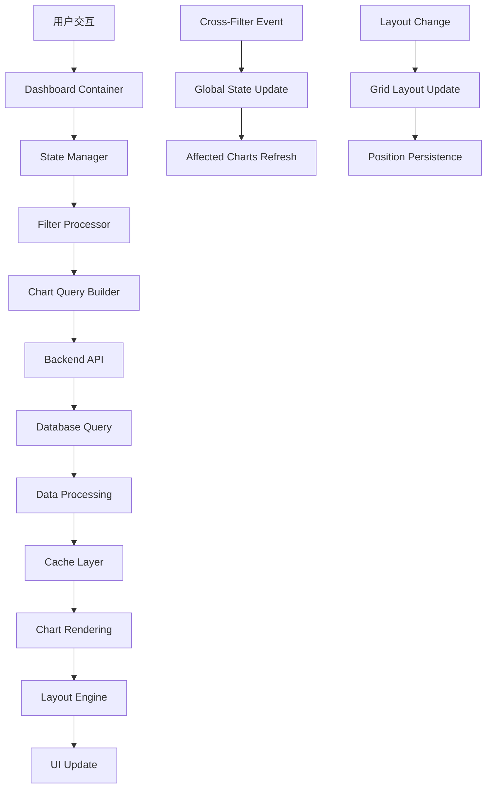

# Day 13: 高级仪表板开发与布局系统 📊

欢迎来到第13天的学习！今天我们将深入探索 Apache Superset 的仪表板架构，学习如何开发复杂的仪表板功能，掌握布局系统、组件协作和性能优化技术。

## 🎯 学习目标

- **仪表板架构原理**：理解 Superset 仪表板的核心设计思想
- **布局引擎深度剖析**：掌握网格布局和拖拽系统的实现
- **组件协作机制**：学习图表间的数据联动和交互
- **性能优化策略**：掌握大型仪表板的优化技术
- **响应式设计**：实现多设备适配的仪表板
- **高级功能开发**：实现过滤器、钻取、导出等功能

## 📚 学习资料概览

### 主要文档
- [`day13_source_code_analysis.md`](./day13_source_code_analysis.md) - 仪表板源码深度分析
- [`dashboard_architecture_guide.md`](./dashboard_architecture_guide.md) - 仪表板架构完整指南
- [`day13_practice.md`](./day13_practice.md) - 实践练习和项目开发

### 示例代码
- [`advanced_dashboard_demo.tsx`](./advanced_dashboard_demo.tsx) - 高级仪表板组件实现
- [`layout_engine_demo.py`](./layout_engine_demo.py) - 布局引擎演示
- [`dashboard_components/`](./dashboard_components/) - 各种仪表板组件示例

## 🏗️ 仪表板架构概览

### 核心架构层次

```
Superset Dashboard Architecture
├── Frontend (React/Redux)
│   ├── Dashboard Container
│   │   ├── Layout Engine (react-grid-layout)
│   │   ├── Chart Components
│   │   ├── Filter Components
│   │   └── Tab Components
│   ├── State Management
│   │   ├── Dashboard State
│   │   ├── Chart State
│   │   ├── Filter State
│   │   └── Layout State
│   └── Interaction System
│       ├── Cross-Filtering
│       ├── Drill-Down/Up
│       ├── Export Functions
│       └── Real-time Updates
└── Backend (Flask/SQLAlchemy)
    ├── Dashboard API
    ├── Layout Persistence
    ├── Filter Management
    └── Cache Strategy
```

### 数据流架构



## 🎨 核心功能模块

### 1. 布局引擎 (Layout Engine)

**核心特性：**
- 基于 react-grid-layout 的拖拽布局
- 响应式网格系统
- 组件大小调整和位置记忆
- 布局模式切换（编辑/查看）

**技术实现：**
```typescript
interface LayoutConfig {
  i: string;          // 组件ID
  x: number;          // X坐标
  y: number;          // Y坐标
  w: number;          // 宽度
  h: number;          // 高度
  minW?: number;      // 最小宽度
  minH?: number;      // 最小高度
  maxW?: number;      // 最大宽度
  maxH?: number;      // 最大高度
  static?: boolean;   // 是否静态
  isDraggable?: boolean;
  isResizable?: boolean;
}
```

### 2. 状态管理系统

**Redux Store 结构：**
```typescript
interface DashboardState {
  dashboard: {
    id: string;
    metadata: DashboardMetadata;
    layout: LayoutConfig[];
    filters: FilterState;
    charts: { [chartId: string]: ChartState };
  };
  dataMask: {
    [filterId: string]: DataMask;
  };
  nativeFilters: {
    filters: { [filterId: string]: NativeFilter };
    filtersState: { [filterId: string]: FilterValue };
  };
  common: {
    flash_messages: FlashMessage[];
    conf: CommonBootstrapData;
  };
}
```

### 3. 组件协作机制

**Cross-Filtering 流程：**
1. 用户在图表A中选择数据点
2. 触发 cross-filter 事件
3. 更新全局 dataMask 状态
4. 影响的图表B、C重新查询数据
5. 所有相关图表重新渲染

**实现方式：**
```typescript
const handleCrossFilter = useCallback((
  chartId: string,
  dataMask: DataMask,
) => {
  dispatch(updateDataMask(chartId, dataMask));
  
  // 找出受影响的图表
  const affectedCharts = getAffectedCharts(chartId, dataMask);
  
  // 批量更新图表查询
  affectedCharts.forEach(targetChartId => {
    dispatch(refreshChart(targetChartId));
  });
}, [dispatch]);
```

## 🚀 高级功能实现

### 1. 原生过滤器 (Native Filters)

**架构特点：**
- 独立于图表的全局过滤器
- 支持级联过滤和依赖关系
- 动态配置和实时预览
- 多种过滤器类型支持

### 2. 标签页系统 (Tabs)

**功能特性：**
- 多层级标签页结构
- 标签页内的独立布局
- 跨标签页的数据共享
- 标签页的动态加载

### 3. 实时数据更新

**实现策略：**
- WebSocket 连接管理
- 增量数据更新
- 智能缓存策略
- 错误恢复机制

## 📱 响应式设计

### 断点配置
```typescript
const BREAKPOINTS = {
  lg: 1200,
  md: 996,
  sm: 768,
  xs: 480,
  xxs: 0,
};

const COLS = {
  lg: 12,
  md: 10,
  sm: 6,
  xs: 4,
  xxs: 2,
};
```

### 自适应布局策略
- 基于设备宽度的列数调整
- 组件大小的智能缩放
- 触摸设备的交互优化
- 移动端的导航优化

## ⚡ 性能优化技术

### 1. 虚拟化渲染
- 大型仪表板的按需渲染
- 视口外组件的懒加载
- 图表的增量更新策略

### 2. 缓存策略
- 查询结果缓存
- 图表渲染缓存
- 布局状态缓存
- 静态资源缓存

### 3. 代码分割
- 路由级别的代码分割
- 组件级别的懒加载
- 第三方库的按需加载

## 🛠️ 开发工具和调试

### Redux DevTools 集成
- 状态变化的时间旅行调试
- Action 和 State 的详细检查
- 性能监控和分析

### Dashboard Inspector
- 布局结构的可视化
- 组件依赖关系图
- 性能指标监控

## 📖 学习路径

### 第一阶段：架构理解（1-2天）
1. **仪表板核心概念**
   - Dashboard、Chart、Filter 的关系
   - State 管理和数据流
   - 事件系统和组件通信

2. **布局系统深入**
   - react-grid-layout 原理
   - 响应式布局实现
   - 拖拽和调整大小机制

### 第二阶段：功能开发（2-3天）
1. **组件开发**
   - 自定义仪表板组件
   - 过滤器组件开发
   - 图表包装器实现

2. **交互功能**
   - Cross-filtering 实现
   - 钻取功能开发
   - 导出和分享功能

### 第三阶段：高级特性（2-3天）
1. **性能优化**
   - 大型仪表板优化
   - 实时数据处理
   - 缓存策略实现

2. **企业级功能**
   - 权限控制集成
   - 审计日志记录
   - 多租户支持

## 🎯 实践项目

### 项目1：企业级销售仪表板
**功能要求：**
- 多维度销售数据展示
- 实时销售监控
- 地理位置分析
- 趋势预测功能

### 项目2：运营监控大屏
**技术挑战：**
- 大屏适配和布局
- 实时数据更新
- 告警和通知系统
- 多数据源集成

### 项目3：移动端仪表板
**重点技术：**
- 响应式设计
- 触摸交互优化
- 离线功能支持
- 性能优化

## 📊 学习成果评估

### 技能检查清单
- [ ] 理解仪表板架构和数据流
- [ ] 掌握布局引擎的使用和定制
- [ ] 实现复杂的组件交互功能
- [ ] 完成性能优化和缓存策略
- [ ] 开发响应式仪表板组件
- [ ] 集成高级功能（过滤器、钻取等）

### 项目交付物
- [ ] 完整的企业级仪表板实现
- [ ] 自定义组件库
- [ ] 性能优化方案
- [ ] 技术文档和最佳实践

## 🔗 相关资源

### 官方文档
- [Superset Dashboard Guide](https://superset.apache.org/docs/creating-charts-dashboards/creating-your-first-dashboard)
- [React Grid Layout](https://github.com/STRML/react-grid-layout)
- [Redux Toolkit](https://redux-toolkit.js.org/)

### 社区资源
- [Dashboard Templates](https://github.com/apache/superset/tree/master/superset-frontend/src/dashboard)
- [Best Practices Guide](https://superset.apache.org/docs/faq)
- [Performance Optimization](https://superset.apache.org/docs/miscellaneous/cache)

## 💡 今日学习重点

1. **深入理解仪表板架构**：掌握从数据到可视化的完整流程
2. **布局系统实践**：学会创建灵活的拖拽布局
3. **组件协作开发**：实现图表间的数据联动
4. **性能优化技术**：应对大型仪表板的挑战

---

**准备好开始这次仪表板架构的深度探索之旅了吗？让我们一起创建令人印象深刻的数据可视化体验！** 🚀

下一步：阅读源码分析文档，然后开始实践项目开发。 