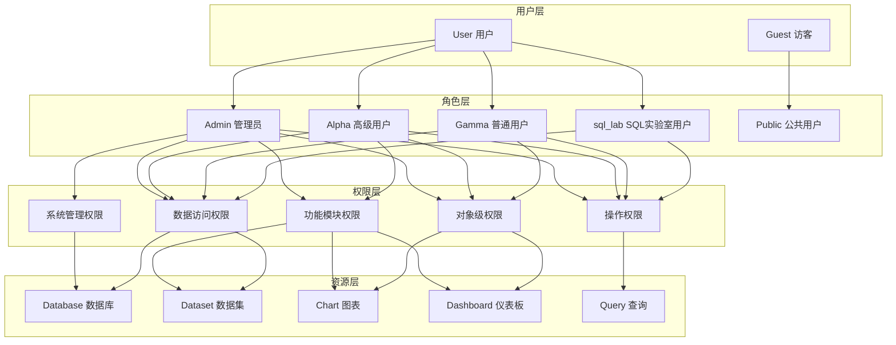

# Day 15: Apache Superset 权限系统深度解析

## 🔒 学习目标

深入理解和掌握 Apache Superset 的权限系统架构，包括：
- 权限类型分类和层级结构
- 权限控制范围和影响分析
- 数据模型和实体关系图
- 实际权限管理和应用

## 📚 学习内容概览

### 1. 权限系统架构概述
- **基于角色的访问控制 (RBAC)**
- **分层权限模型**
- **动态权限生成机制**
- **多级权限继承**

### 2. 权限类型分类
1. **系统管理权限** - 系统级别控制
2. **功能模块权限** - 功能访问控制
3. **数据访问权限** - 数据层面控制
4. **对象级权限** - 资源级别控制
5. **操作权限** - CRUD 操作控制

### 3. 核心组件分析
- `SupersetSecurityManager` - 权限管理核心
- `Role` - 角色模型
- `Permission` - 权限模型
- `ViewMenu` - 视图菜单模型
- `PermissionView` - 权限视图关联

## 🏗️ 权限系统架构图



## 📋 核心权限类型详解

### 1. 系统管理权限 (Admin Only)
- **用户管理**: 创建、修改、删除用户
- **角色管理**: 权限分配和角色配置
- **系统配置**: 全局设置和功能开关
- **安全策略**: 访问控制和安全规则

### 2. 功能模块权限 (Alpha/Gamma)
- **仪表板管理**: 创建、编辑仪表板
- **图表创建**: 图表设计和配置
- **数据集管理**: 数据源管理
- **SQL Lab**: SQL 查询和分析

### 3. 数据访问权限 (Hierarchical)
- **数据库级别**: 整个数据库访问
- **目录级别**: 数据库目录访问
- **模式级别**: 数据库模式访问  
- **表级别**: 具体数据表访问

### 4. 对象级权限 (Resource Specific)
- **所有权控制**: 资源所有者权限
- **共享权限**: 资源共享设置
- **查看权限**: 只读访问控制
- **编辑权限**: 修改操作控制

## 🎯 学习路径

### 基础阶段 (1-2小时)
1. **理解权限概念** - 阅读权限系统概述
2. **熟悉角色模型** - 了解内置角色和权限
3. **权限类型分类** - 掌握不同权限类型

### 进阶阶段 (2-3小时)
1. **源码分析** - 深入 SecurityManager 实现
2. **数据模型** - 理解权限相关实体关系
3. **权限检查机制** - 掌握权限验证流程

### 实战阶段 (2-3小时)
1. **权限配置** - 实际权限管理操作
2. **自定义权限** - 扩展权限系统
3. **安全最佳实践** - 企业级权限设计

### 专家阶段 (3-4小时)
1. **权限系统扩展** - 自定义安全管理器
2. **性能优化** - 权限检查优化
3. **安全审计** - 权限使用分析

## 📖 学习资源

1. **`day15_permission_analysis.md`** - 权限系统完整源码分析
2. **`permission_er_diagram.md`** - 权限相关ER图和数据模型
3. **`permission_demo.py`** - 权限管理实战演示
4. **`security_best_practices.md`** - 企业级安全最佳实践
5. **`day15_practice.md`** - 实践练习和案例

## 🔍 权限检查核心流程

```python
# 权限检查主要流程
def check_permission(user, permission, resource):
    # 1. 获取用户角色
    user_roles = get_user_roles(user)
    
    # 2. 检查角色权限
    for role in user_roles:
        if has_permission(role, permission, resource):
            return True
    
    # 3. 检查特殊权限
    if check_special_permissions(user, permission, resource):
        return True
    
    # 4. 检查所有权
    if is_owner(user, resource):
        return True
    
    return False
```

## 📊 权限影响范围

| 权限类型 | 影响范围 | 控制级别 | 典型应用 |
|---------|----------|----------|----------|
| 系统管理 | 全系统 | 最高级 | 用户管理、系统配置 |
| 功能模块 | 功能级 | 高级 | 仪表板、图表管理 |
| 数据访问 | 数据级 | 中级 | 数据库、表访问 |
| 对象级 | 资源级 | 基础级 | 具体图表、仪表板 |
| 操作级 | 动作级 | 细粒度 | 查看、编辑、删除 |

## 🎓 学习成果

完成本天学习后，您将能够：

1. **深度理解** Superset 权限系统架构和设计理念
2. **熟练掌握** 各种权限类型的配置和管理
3. **准确分析** 权限控制范围和影响关系
4. **有效设计** 企业级权限方案和安全策略
5. **成功扩展** 自定义权限功能和安全管理器

## 📝 学习检查清单

- [ ] 理解 RBAC 权限模型的核心概念
- [ ] 掌握 Superset 内置角色和权限分类
- [ ] 熟悉权限相关数据模型和ER关系
- [ ] 能够分析权限检查流程和验证机制
- [ ] 掌握权限配置和管理的最佳实践
- [ ] 具备权限系统扩展和定制能力

开始您的 Superset 权限系统深度学习之旅！🚀 