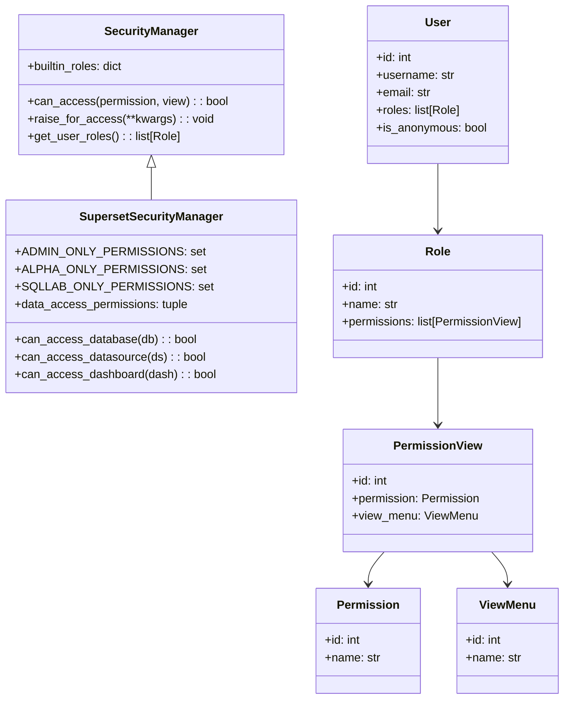

# Superset 权限系统深度源码分析

## 🔒 权限系统核心架构

Apache Superset 采用基于 Flask-AppBuilder 的 RBAC (Role-Based Access Control) 权限模型，实现了多层次、细粒度的权限控制系统。

## 📊 权限系统类层次结构



## 🏗️ 权限类型完整分类

### 1. 系统管理权限 (ADMIN_ONLY_PERMISSIONS)

```python
# 位置: superset/security/manager.py:267-275
ADMIN_ONLY_PERMISSIONS = {
    "can_update_role",        # 角色更新权限
    "all_query_access",       # 所有查询访问权限
    "can_grant_guest_token",  # 访客令牌授权权限
    "can_set_embedded",       # 嵌入式设置权限
    "can_warm_up_cache",      # 缓存预热权限
}
```

**控制范围**: 整个系统的核心管理功能
**影响**: 系统安全、用户管理、全局配置
**典型用户**: Admin 角色

### 2. 高级用户权限 (ALPHA_ONLY_PERMISSIONS)

```python
# 位置: superset/security/manager.py:284-288
ALPHA_ONLY_PERMISSIONS = {
    "muldelete",              # 批量删除权限
    "all_database_access",    # 所有数据库访问权限
    "all_datasource_access",  # 所有数据源访问权限
}
```

**控制范围**: 高级数据管理和分析功能
**影响**: 数据库管理、数据源创建、批量操作
**典型用户**: Alpha 角色

### 3. SQL Lab 专用权限 (SQLLAB_ONLY_PERMISSIONS)

```python
# 位置: superset/security/manager.py:295-317
SQLLAB_ONLY_PERMISSIONS = {
    ("can_read", "SavedQuery"),           # 保存查询读取
    ("can_write", "SavedQuery"),          # 保存查询写入
    ("can_export", "SavedQuery"),         # 保存查询导出
    ("can_read", "Query"),                # 查询读取
    ("can_export_csv", "Query"),          # 查询CSV导出
    ("can_get_results", "SQLLab"),        # SQL结果获取
    ("can_execute_sql_query", "SQLLab"),  # SQL查询执行
    ("can_estimate_query_cost", "SQL Lab"), # 查询成本估算
    ("can_export_csv", "SQLLab"),         # SQL Lab CSV导出
    ("can_read", "SQLLab"),               # SQL Lab 读取
    ("can_sqllab_history", "Superset"),   # SQL Lab 历史记录
    ("can_sqllab", "Superset"),           # SQL Lab 访问
    ("can_test_conn", "Superset"),        # 连接测试 (已废弃)
    # TabStateView 相关权限
    ("can_activate", "TabStateView"),     # 标签激活
    ("can_get", "TabStateView"),          # 标签获取
    ("can_delete_query", "TabStateView"), # 查询删除
    ("can_post", "TabStateView"),         # 标签提交
    ("can_delete", "TabStateView"),       # 标签删除
    ("can_put", "TabStateView"),          # 标签更新
    ("can_migrate_query", "TabStateView"), # 查询迁移
    # 菜单访问权限
    ("menu_access", "SQL Lab"),           # SQL Lab 菜单
    ("menu_access", "SQL Editor"),        # SQL 编辑器菜单
    ("menu_access", "Saved Queries"),     # 保存查询菜单
    ("menu_access", "Query Search"),      # 查询搜索菜单
}
```

**控制范围**: SQL 查询和分析功能
**影响**: SQL 执行、查询保存、结果导出
**典型用户**: sql_lab 角色用户

### 4. 对象特定权限 (OBJECT_SPEC_PERMISSIONS)

```python
# 位置: superset/security/manager.py:290-294
OBJECT_SPEC_PERMISSIONS = {
    "database_access",     # 数据库访问权限
    "catalog_access",      # 目录访问权限  
    "schema_access",       # 模式访问权限
    "datasource_access",   # 数据源访问权限
}
```

**控制范围**: 具体数据对象的访问
**影响**: 数据库连接、表访问、数据查询
**权限格式**: 
- `database_access`: `[database_name].(id:database_id)`
- `schema_access`: `[database].[schema]` 或 `[database].[catalog].[schema]`
- `datasource_access`: `[database].[table_name](id:table_id)`

### 5. 只读权限 (READ_ONLY_PERMISSION)

```python
# 位置: superset/security/manager.py:277-283
READ_ONLY_PERMISSION = {
    "can_show",                    # 显示权限
    "can_list",                    # 列表权限
    "can_get",                     # 获取权限
    "can_external_metadata",       # 外部元数据权限
    "can_external_metadata_by_name", # 按名称获取外部元数据权限
    "can_read",                    # 读取权限
}
```

**控制范围**: 只读访问功能
**影响**: 数据查看、元数据访问
**典型用户**: 具有只读访问需求的用户

## 🎭 内置角色分析

### 1. Admin 角色 (系统管理员)

```python
# 位置: superset/security/manager.py:1228-1238
def _is_admin_pvm(self, pvm: PermissionView) -> bool:
    """检查权限是否为管理员权限"""
    return (
        pvm.permission.name in self.ADMIN_ONLY_PERMISSIONS
        or pvm.view_menu.name in self.ADMIN_ONLY_VIEW_MENUS
        or (pvm.permission.name, pvm.view_menu.name) in self.ALPHA_ONLY_PMVS
        or self._is_alpha_pvm(pvm)
    )
```

**权限范围**: 
- 所有系统管理权限
- 所有用户管理权限
- 所有数据访问权限
- 所有功能模块权限

**主要能力**:
- 用户和角色管理
- 系统配置和安全设置
- 全局权限分配
- 系统监控和日志

### 2. Alpha 角色 (高级用户)

```python
# 位置: superset/security/manager.py:1239-1253
def _is_alpha_pvm(self, pvm: PermissionView) -> bool:
    """检查权限是否为Alpha权限"""
    return (
        pvm.permission.name in self.ALPHA_ONLY_PERMISSIONS
        or pvm.view_menu.name in self.ALPHA_ONLY_VIEW_MENUS  
        or (pvm.permission.name, pvm.view_menu.name) in self.ALPHA_ONLY_PMVS
        or self._is_gamma_pvm(pvm)
    )
```

**权限范围**:
- 数据库和数据源管理
- 仪表板和图表创建
- 数据集配置和管理
- 高级数据分析功能

**主要能力**:
- 创建和管理数据库连接
- 设计复杂仪表板和图表
- 管理数据集和指标
- 执行高级数据分析

### 3. Gamma 角色 (普通用户)

```python
# 位置: superset/security/manager.py:1254-1269
def _is_gamma_pvm(self, pvm: PermissionView) -> bool:
    """检查权限是否为Gamma权限"""
    return (
        pvm.view_menu.name in self.GAMMA_READ_ONLY_MODEL_VIEWS
        and pvm.permission.name in self.READ_ONLY_PERMISSION
    ) or self._is_accessible_to_all(pvm)
```

**权限范围**:
- 基本数据查看权限
- 有限的图表和仪表板访问
- 自己创建的资源管理

**主要能力**:
- 查看授权的仪表板和图表
- 创建基本的数据可视化
- 导出数据和报告
- 基本的数据探索

### 4. sql_lab 角色 (SQL实验室用户)

```python
# 位置: superset/security/manager.py:1270-1279
def _is_sql_lab_only(self, pvm: PermissionView) -> bool:
    """检查权限是否仅限于SQL Lab"""
    return (
        (pvm.permission.name, pvm.view_menu.name) in self.SQLLAB_ONLY_PERMISSIONS
    )

def _is_sql_lab_pvm(self, pvm: PermissionView) -> bool:
    """检查权限是否为SQL Lab权限"""
    return (
        (pvm.permission.name, pvm.view_menu.name) in self.SQLLAB_ONLY_PERMISSIONS
        or (pvm.permission.name, pvm.view_menu.name) in self.SQLLAB_EXTRA_PERMISSION_VIEWS
        or self._is_accessible_to_all(pvm)
    )
```

**权限范围**:
- SQL 查询执行
- 查询历史管理
- 数据探索和分析

**主要能力**:
- 执行 SQL 查询
- 保存和管理查询
- 导出查询结果
- 查看查询历史

## 🔍 权限检查核心机制

### 1. 基础权限检查

```python
# 位置: superset/security/manager.py:433-448
def can_access(self, permission_name: str, view_name: str) -> bool:
    """
    返回用户是否可以访问 FAB 权限/视图
    
    :param permission_name: FAB权限名称
    :param view_name: FAB视图菜单名称  
    :returns: 用户是否可以访问FAB权限/视图
    """
    user = g.user
    if user.is_anonymous:
        return self.is_item_public(permission_name, view_name)
    return self._has_view_access(user, permission_name, view_name)
```

### 2. 数据库访问检查

```python
# 位置: superset/security/manager.py:478-491
def can_access_database(self, database: "Database") -> bool:
    """
    返回用户是否可以访问指定数据库
    
    :param database: 数据库对象
    :returns: 用户是否可以访问该数据库
    """
    return (
        self.can_access_all_datasources()
        or self.can_access_all_databases()
        or self.can_access("database_access", database.perm)
    )
```

### 3. 数据源访问检查

```python
# 位置: superset/security/manager.py:522-536
def can_access_datasource(self, datasource: "BaseDatasource") -> bool:
    """
    返回用户是否可以访问指定数据源
    
    :param datasource: 数据源对象
    :returns: 用户是否可以访问该数据源
    """
    try:
        self.raise_for_access(datasource=datasource)
    except SupersetSecurityException:
        return False
    return True
```

### 4. 综合权限验证

```python
# 位置: superset/security/manager.py:2155-2412
def raise_for_access(
    self,
    dashboard: Optional["Dashboard"] = None,
    chart: Optional["Slice"] = None,
    database: Optional["Database"] = None,
    datasource: Optional["BaseDatasource"] = None,
    query: Optional["Query"] = None,
    query_context: Optional["QueryContext"] = None,
    table: Optional["Table"] = None,
    viz: Optional["BaseViz"] = None,
    sql: Optional[str] = None,
    catalog: Optional[str] = None,
    schema: Optional[str] = None,
) -> None:
    """
    综合权限验证方法
    如果用户没有权限访问资源，抛出 SupersetSecurityException
    """
    # 实现复杂的权限检查逻辑...
```

## 🗃️ 权限数据模型

### 1. 用户模型 (User)

```python
# 继承自 Flask-AppBuilder User模型
class User(Model):
    id = Column(Integer, primary_key=True)
    username = Column(String(256), unique=True, nullable=False)
    email = Column(String(320), unique=True, nullable=False)
    first_name = Column(String(256), nullable=False)
    last_name = Column(String(256), nullable=False)
    active = Column(Boolean, default=True)
    created_on = Column(DateTime, default=datetime.datetime.now)
    changed_on = Column(DateTime, default=datetime.datetime.now)
    
    # 角色关系
    roles = relationship("Role", secondary=assoc_user_role, backref="users")
```

### 2. 角色模型 (Role)

```python
# 继承自 Flask-AppBuilder Role模型
class Role(Model):
    id = Column(Integer, primary_key=True)
    name = Column(String(64), unique=True, nullable=False)
    
    # 权限关系
    permissions = relationship("PermissionView", 
                             secondary=assoc_permissionview_role, 
                             backref="roles")
```

### 3. 权限模型 (Permission)

```python
# 继承自 Flask-AppBuilder Permission模型
class Permission(Model):
    id = Column(Integer, primary_key=True)
    name = Column(String(100), unique=True, nullable=False)
```

### 4. 视图菜单模型 (ViewMenu)

```python
# 继承自 Flask-AppBuilder ViewMenu模型
class ViewMenu(Model):
    id = Column(Integer, primary_key=True)
    name = Column(String(250), unique=True, nullable=False)
```

### 5. 权限视图关联模型 (PermissionView)

```python
# 继承自 Flask-AppBuilder PermissionView模型
class PermissionView(Model):
    id = Column(Integer, primary_key=True)
    permission_id = Column(Integer, ForeignKey("ab_permission.id"))
    view_menu_id = Column(Integer, ForeignKey("ab_view_menu.id"))
    
    permission = relationship("Permission")
    view_menu = relationship("ViewMenu")
```

## 🔗 权限关联表

### 1. 用户角色关联表

```python
# assoc_user_role 表结构
assoc_user_role = Table(
    "ab_user_role",
    metadata,
    Column("id", Integer, primary_key=True),
    Column("user_id", Integer, ForeignKey("ab_user.id")),
    Column("role_id", Integer, ForeignKey("ab_role.id")),
)
```

### 2. 角色权限关联表

```python  
# assoc_permissionview_role 表结构
assoc_permissionview_role = Table(
    "ab_permission_view_role",
    metadata,
    Column("id", Integer, primary_key=True),
    Column("permission_view_id", Integer, ForeignKey("ab_permission_view.id")),
    Column("role_id", Integer, ForeignKey("ab_role.id")),
)
```

## 🏭 权限动态生成机制

### 1. 数据库权限生成

```python
# 位置: superset/security/manager.py:421-424
@staticmethod
def get_database_perm(database_id: int, database_name: str) -> Optional[str]:
    """生成数据库权限名称"""
    return f"[{database_name}].(id:{database_id})"
```

### 2. 数据集权限生成

```python
# 位置: superset/security/manager.py:425-432
@staticmethod
def get_dataset_perm(
    dataset_id: int,
    dataset_name: str,
    database_name: str,
) -> Optional[str]:
    """生成数据集权限名称"""
    return f"[{database_name}].[{dataset_name}](id:{dataset_id})"
```

### 3. 模式权限生成

```python
# 位置: superset/security/manager.py:392-420
def get_schema_perm(
    self,
    database: str,
    catalog: Optional[str] = None,
    schema: Optional[str] = None,
) -> Optional[str]:
    """
    生成数据库特定模式权限
    
    格式：
    - [database].[schema]
    - [database].[catalog].[schema]
    """
    if schema is None:
        return None
        
    if catalog:
        return f"[{database}].[{catalog}].[{schema}]"
    
    return f"[{database}].[{schema}]"
```

## 🎯 权限检查优化策略

### 1. 缓存机制

```python
# 权限检查结果缓存
@cache_util.memoized_func(
    key="user:{user_id}:perm:{permission}:{view_menu}",
    cache=cache_manager.cache,
)
def _has_view_access_cached(user_id, permission, view_menu):
    """缓存的权限检查方法"""
    pass
```

### 2. 批量权限检查

```python
# 位置: superset/security/manager.py:733-762
def user_view_menu_names(self, permission_name: str) -> set[str]:
    """
    获取用户有权限访问的视图菜单名称集合
    用于批量权限检查优化
    """
    if self.can_access_all_datasources():
        return {"*"}
        
    perms = self.find_perms_by_name(permission_name)
    return {perm.view_menu.name for perm in perms if self.can_access(permission_name, perm.view_menu.name)}
```

### 3. 权限继承优化

```python
# 层级权限检查优化
def check_hierarchical_access(self, database, catalog, schema, table):
    """检查层级权限访问"""
    # 1. 检查全局权限
    if self.can_access_all_datasources():
        return True
        
    # 2. 检查数据库级权限  
    if self.can_access_database(database):
        return True
        
    # 3. 检查目录级权限
    if catalog and self.can_access_catalog(database, catalog):
        return True
        
    # 4. 检查模式级权限
    if schema and self.can_access_schema_perm(database, catalog, schema):
        return True
        
    # 5. 检查表级权限
    if table and self.can_access_datasource(table):
        return True
        
    return False
```

## 📊 权限系统性能指标

### 1. 权限检查延迟
- **目标**: < 10ms
- **优化**: 缓存 + 索引

### 2. 权限缓存命中率
- **目标**: > 90%
- **监控**: Redis 缓存统计

### 3. 数据库权限查询
- **目标**: < 5 queries/request
- **优化**: 预加载 + 批量查询

### 4. 内存使用
- **目标**: < 100MB 权限数据
- **优化**: 压缩 + 清理

这个权限系统分析展示了 Superset 复杂而完善的安全架构，为企业级应用提供了强大的安全保障。 