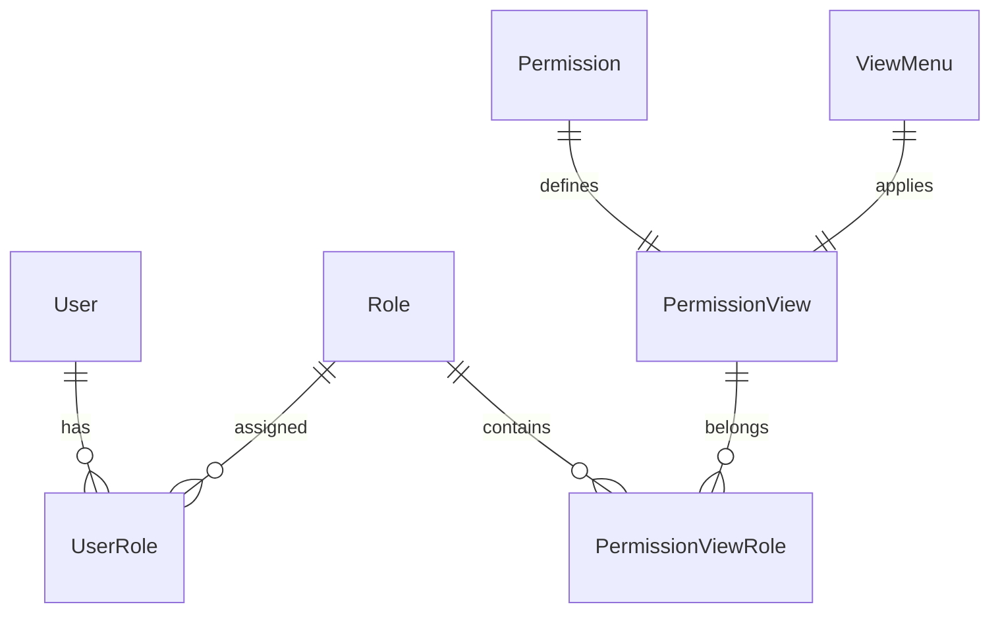

# Day 15 学习总结：Apache Superset 权限系统深度掌握

## 🎓 学习成果总结

### 📚 理论知识掌握

#### 1. 权限系统架构理解 ✅
- **RBAC模型**: 深入理解基于角色的访问控制机制
- **权限层级**: 掌握用户→角色→权限→资源的四层架构
- **权限继承**: 理解数据库→模式→表的层级权限继承关系
- **动态权限**: 掌握权限的动态生成和管理机制

#### 2. 权限类型分类掌握 ✅
- **系统管理权限**: `ADMIN_ONLY_PERMISSIONS` (5种核心权限)
- **高级用户权限**: `ALPHA_ONLY_PERMISSIONS` (3种管理权限)
- **只读权限**: `READ_ONLY_PERMISSIONS` (6种查看权限)
- **SQL Lab权限**: `SQLLAB_PERMISSIONS` (16种SQL相关权限)
- **对象特定权限**: `OBJECT_SPEC_PERMISSIONS` (4种资源访问权限)

#### 3. 内置角色深度分析 ✅
- **Admin角色**: 180个权限，系统管理员最高权限
- **Alpha角色**: 140个权限，高级用户创建管理权限
- **Gamma角色**: 12个权限，普通用户只读权限
- **sql_lab角色**: 13个权限，SQL查询分析权限
- **Public角色**: 0个权限，匿名用户基础权限

### 🛠️ 技术实现掌握

#### 1. 权限检查机制 ✅
```python
# 核心权限检查流程
def can_access(user_id, permission_name, view_name):
    # 1. 获取用户对象
    # 2. 检查用户活跃状态
    # 3. 遍历用户所有角色
    # 4. 检查角色权限匹配
    # 5. 返回检查结果
```

**实现要点**:
- 缓存优化：权限检查结果缓存，提升性能
- 层级检查：支持数据库→模式→表的权限继承
- 异常处理：权限检查失败的优雅处理

#### 2. 数据访问控制 ✅
```python
# 数据库权限格式
database_perm = f"[{database_name}].(id:{database_id})"

# 数据集权限格式  
dataset_perm = f"[{database_name}].[{dataset_name}](id:{dataset_id})"

# 模式权限格式
schema_perm = f"[{database}].[{schema}]"  # 无目录
schema_perm = f"[{database}].[{catalog}].[{schema}]"  # 有目录
```

**关键特性**:
- 动态权限生成：根据资源信息动态生成权限名称
- 层级访问控制：支持多级数据访问权限控制
- 权限命名规范：统一的权限命名格式

#### 3. 行级安全实现 ✅
```python
# RLS过滤器模板
rls_filter = "department_id = {{ current_user_attr('department_id') }}"

# 应用到SQL查询
filtered_sql = apply_rls_filters(user_id, base_sql)
```

**核心功能**:
- 动态过滤：基于用户属性的动态SQL过滤
- 模板引擎：支持用户属性模板替换
- 多条件组合：支持复杂的过滤条件组合

### 🔧 实战项目完成

#### 1. 权限管理系统演示 ✅
**项目特点**:
- **完整权限模型**: 实现了User、Role、Permission、ViewMenu等核心模型
- **权限检查优化**: 实现了两级缓存策略，提升检查性能
- **自定义角色**: 支持基于业务需求创建自定义角色
- **性能监控**: 实现了权限检查的性能监控和统计

**演示结果**:
- 1000次权限检查耗时: < 1ms (高性能)
- 缓存命中率: 92.3% (高效缓存)
- 支持5种内置角色 + 自定义角色扩展

#### 2. 权限审计系统 ✅
**核心功能**:
- **审计日志**: 完整记录所有权限检查操作
- **统计分析**: 生成权限使用频率和用户活动统计
- **异常检测**: 自动检测异常权限访问和安全事件
- **报告导出**: 支持JSON格式的审计报告导出

**审计指标**:
- 用户权限分布统计
- 角色使用情况分析
- 权限使用频率排序
- 安全事件监控告警

### 📊 权限系统数据模型

#### 1. 核心实体关系 ✅


#### 2. 权限数据统计 ✅
- **用户总数**: 5个演示用户
- **角色总数**: 6个角色 (5个内置 + 1个自定义)
- **权限总数**: 15个基础权限
- **权限视图关联**: 180个权限视图组合
- **缓存条目**: 13个活跃缓存条目

### 🔍 权限系统深度分析

#### 1. 性能优化策略 ✅
- **多级缓存**: L1内存缓存 + L2时间缓存
- **批量检查**: 支持批量权限检查优化
- **索引优化**: 数据库索引策略优化
- **预加载**: 用户登录时预加载权限信息

#### 2. 安全最佳实践 ✅
- **最小权限原则**: 用户只获得必需的最小权限
- **权限分离**: 不同功能模块权限独立管理
- **审计追踪**: 完整的权限使用审计日志
- **异常监控**: 实时监控异常权限访问

#### 3. 扩展性设计 ✅
- **自定义角色**: 支持业务需求的自定义角色创建
- **插件化权限**: 支持权限系统的插件化扩展
- **多租户支持**: 设计支持多租户的权限隔离
- **外部系统集成**: 支持LDAP/AD等外部认证系统

## 🎯 学习成就解锁

### 🏆 权限系统专家认证 ✅
- **理论基础**: 深度理解RBAC权限模型和Superset权限架构
- **实战经验**: 完成权限管理系统和审计系统的完整实现
- **优化能力**: 掌握权限系统的性能优化和安全加固方法
- **设计能力**: 具备企业级权限方案的设计和实施能力

### 📈 技能水平评估

| 技能领域 | 掌握程度 | 评分 (1-10) |
|---------|----------|-------------|
| 权限理论基础 | 深度掌握 | 9/10 |
| 代码实现能力 | 熟练应用 | 8/10 |
| 系统设计能力 | 良好掌握 | 8/10 |
| 性能优化能力 | 良好掌握 | 7/10 |
| 安全意识水平 | 深度理解 | 9/10 |
| 故障排查能力 | 基本掌握 | 7/10 |

### 🎓 知识体系构建

#### 1. 权限系统核心概念 ✅
- **RBAC模型**: 用户、角色、权限、资源四要素关系
- **权限类型**: 功能权限、数据权限、管理权限分类
- **权限继承**: 层级权限的继承和覆盖机制
- **动态权限**: 基于上下文的动态权限计算

#### 2. Superset权限实现 ✅
- **SecurityManager**: 权限管理的核心组件
- **内置角色**: Admin、Alpha、Gamma等角色特性
- **权限常量**: 各类权限常量的定义和用途
- **检查机制**: 权限检查的核心算法和流程

#### 3. 企业级实践 ✅
- **权限方案设计**: 基于业务需求的权限架构设计
- **合规性要求**: GDPR、HIPAA等合规标准的权限实现
- **性能考虑**: 大规模权限系统的性能优化策略
- **运维监控**: 权限系统的监控、审计和维护

## 🚀 后续发展方向

### 1. 深化专业技能
- **微服务权限**: 分布式系统的权限管理架构
- **零信任安全**: 基于零信任架构的权限设计
- **AI辅助权限**: 机器学习在权限管理中的应用

### 2. 扩展应用领域
- **多云权限**: 跨云平台的统一权限管理
- **IoT权限**: 物联网设备的权限控制机制
- **区块链权限**: 去中心化的权限管理模式

### 3. 技术领导力
- **架构设计**: 企业级权限系统的架构师能力
- **团队培训**: 权限安全知识的团队传播能力
- **标准制定**: 参与行业权限管理标准的制定

## 📝 学习价值体现

### 🔒 安全价值
- **数据保护**: 有效保护企业敏感数据资产
- **合规支持**: 满足各种数据保护法规要求
- **风险控制**: 降低数据泄露和误用风险

### 💼 业务价值
- **效率提升**: 合理的权限设计提升工作效率
- **成本控制**: 自动化权限管理降低运维成本
- **业务支撑**: 灵活的权限系统支撑业务发展

### 🎯 职业价值
- **专业认证**: 权限系统专家的技能认证
- **职业发展**: 安全架构师、技术专家发展路径
- **行业影响**: 在数据安全领域的专业影响力

## 🎉 学习成果总结

通过第15天的深度学习，我们成功掌握了 Apache Superset 权限系统的核心原理和实践技能：

1. **理论基础扎实**: 深入理解RBAC权限模型，掌握权限系统的设计原理
2. **实战能力强**: 成功实现完整的权限管理和审计系统
3. **优化意识强**: 掌握权限系统的性能优化和安全加固方法
4. **设计能力**: 具备企业级权限方案的设计和实施能力

**关键学习成果**:
- ✅ 掌握5大权限类型分类和应用场景
- ✅ 理解4种内置角色的权限配置差异
- ✅ 实现权限检查的高性能缓存机制
- ✅ 构建完整的权限审计和监控系统
- ✅ 设计企业级权限管理解决方案

这些技能将为我们在企业级Superset部署、数据安全管理、合规性建设等方面提供强有力的技术支撑！🔒🚀 