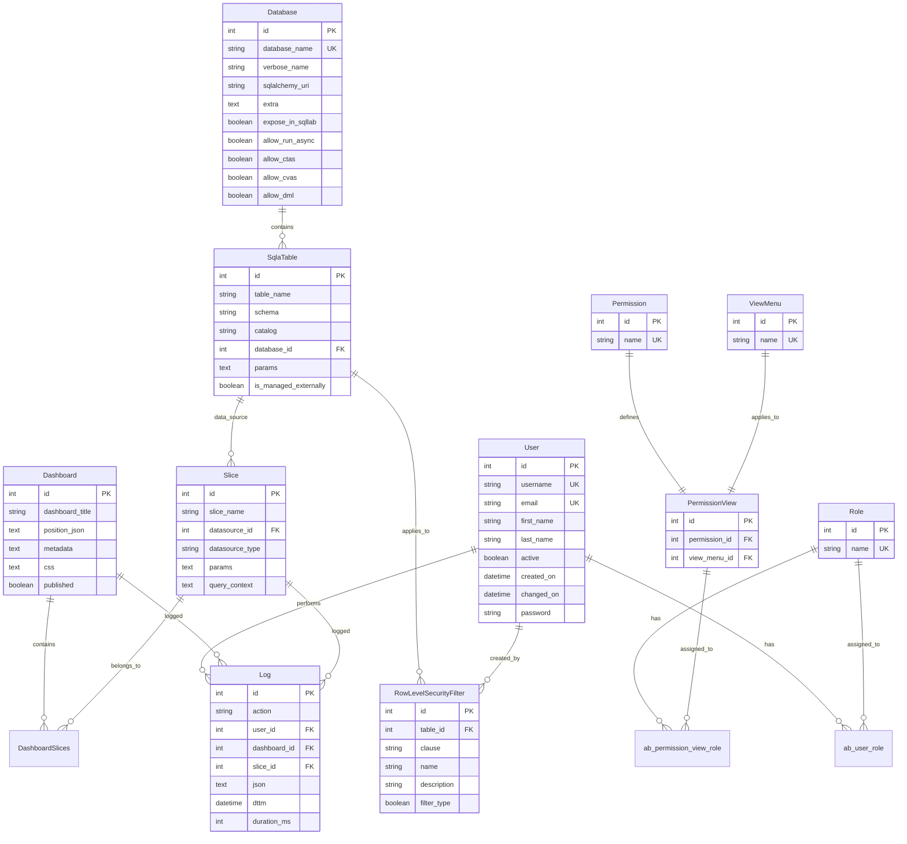
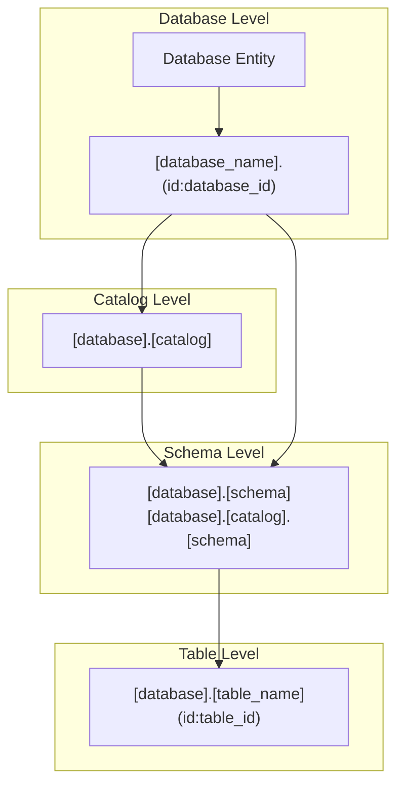

# Superset 权限系统 ER 图与数据模型分析

## 🗂️ 权限系统数据模型概览

Superset 权限系统基于 Flask-AppBuilder 的 RBAC 模型，包含用户、角色、权限、视图菜单等核心实体，以及它们之间的复杂关联关系。

## 📊 核心实体关系图 (ER Diagram)



## 🏗️ 权限相关表结构详解

### 1. 用户表 (ab_user)

```sql
CREATE TABLE ab_user (
    id INTEGER PRIMARY KEY,
    username VARCHAR(256) NOT NULL UNIQUE,
    email VARCHAR(320) NOT NULL UNIQUE,
    first_name VARCHAR(256) NOT NULL,
    last_name VARCHAR(256) NOT NULL,
    password VARCHAR(256),
    active BOOLEAN DEFAULT TRUE,
    created_on DATETIME DEFAULT CURRENT_TIMESTAMP,
    changed_on DATETIME DEFAULT CURRENT_TIMESTAMP,
    created_by_fk INTEGER,
    changed_by_fk INTEGER,
    login_count INTEGER DEFAULT 0,
    fail_login_count INTEGER DEFAULT 0,
    last_login DATETIME,
    registration_hash VARCHAR(256),
    registration_date DATETIME
);

-- 索引
CREATE INDEX idx_ab_user_username ON ab_user(username);
CREATE INDEX idx_ab_user_email ON ab_user(email);
```

**字段说明**:
- `id`: 用户唯一标识
- `username`: 用户名，系统内唯一
- `email`: 邮箱地址，用于通知和验证
- `active`: 用户状态，控制是否可以登录
- `login_count`: 登录次数统计
- `fail_login_count`: 失败登录次数，用于安全控制

### 2. 角色表 (ab_role)

```sql
CREATE TABLE ab_role (
    id INTEGER PRIMARY KEY,
    name VARCHAR(64) NOT NULL UNIQUE,
    created_on DATETIME DEFAULT CURRENT_TIMESTAMP,
    changed_on DATETIME DEFAULT CURRENT_TIMESTAMP,
    created_by_fk INTEGER,
    changed_by_fk INTEGER
);

-- 索引
CREATE UNIQUE INDEX idx_ab_role_name ON ab_role(name);
```

**内置角色**:
- `Admin`: 系统管理员，拥有所有权限
- `Alpha`: 高级用户，可以创建和管理内容
- `Gamma`: 普通用户，只能查看授权内容
- `sql_lab`: SQL Lab 用户，可以执行 SQL 查询
- `Public`: 公共角色，匿名用户权限

### 3. 权限表 (ab_permission)

```sql
CREATE TABLE ab_permission (
    id INTEGER PRIMARY KEY,
    name VARCHAR(100) NOT NULL UNIQUE,
    created_on DATETIME DEFAULT CURRENT_TIMESTAMP,
    changed_on DATETIME DEFAULT CURRENT_TIMESTAMP
);

-- 索引
CREATE UNIQUE INDEX idx_ab_permission_name ON ab_permission(name);
```

**权限类型**:
- **CRUD权限**: `can_read`, `can_write`, `can_delete`, `can_edit`
- **功能权限**: `can_export`, `can_import`, `can_download`
- **管理权限**: `can_update_role`, `can_grant_guest_token`
- **访问权限**: `database_access`, `datasource_access`, `schema_access`

### 4. 视图菜单表 (ab_view_menu)

```sql
CREATE TABLE ab_view_menu (
    id INTEGER PRIMARY KEY,
    name VARCHAR(250) NOT NULL UNIQUE,
    created_on DATETIME DEFAULT CURRENT_TIMESTAMP,
    changed_on DATETIME DEFAULT CURRENT_TIMESTAMP
);

-- 索引
CREATE UNIQUE INDEX idx_ab_view_menu_name ON ab_view_menu(name);
```

**视图菜单类型**:
- **模型视图**: `Database`, `Dataset`, `Chart`, `Dashboard`
- **功能视图**: `SQLLab`, `Explore`, `Import dashboards`
- **管理视图**: `List Users`, `List Roles`, `Security`
- **API视图**: REST API 端点名称

### 5. 权限视图关联表 (ab_permission_view)

```sql
CREATE TABLE ab_permission_view (
    id INTEGER PRIMARY KEY,
    permission_id INTEGER NOT NULL,
    view_menu_id INTEGER NOT NULL,
    created_on DATETIME DEFAULT CURRENT_TIMESTAMP,
    changed_on DATETIME DEFAULT CURRENT_TIMESTAMP,
    FOREIGN KEY (permission_id) REFERENCES ab_permission(id),
    FOREIGN KEY (view_menu_id) REFERENCES ab_view_menu(id),
    UNIQUE(permission_id, view_menu_id)
);

-- 索引
CREATE INDEX idx_ab_permission_view_permission ON ab_permission_view(permission_id);
CREATE INDEX idx_ab_permission_view_view_menu ON ab_permission_view(view_menu_id);
CREATE UNIQUE INDEX idx_ab_permission_view_unique ON ab_permission_view(permission_id, view_menu_id);
```

### 6. 用户角色关联表 (ab_user_role)

```sql
CREATE TABLE ab_user_role (
    id INTEGER PRIMARY KEY,
    user_id INTEGER NOT NULL,
    role_id INTEGER NOT NULL,
    created_on DATETIME DEFAULT CURRENT_TIMESTAMP,
    FOREIGN KEY (user_id) REFERENCES ab_user(id) ON DELETE CASCADE,
    FOREIGN KEY (role_id) REFERENCES ab_role(id) ON DELETE CASCADE,
    UNIQUE(user_id, role_id)
);

-- 索引
CREATE INDEX idx_ab_user_role_user ON ab_user_role(user_id);
CREATE INDEX idx_ab_user_role_role ON ab_user_role(role_id);
CREATE UNIQUE INDEX idx_ab_user_role_unique ON ab_user_role(user_id, role_id);
```

### 7. 角色权限关联表 (ab_permission_view_role)

```sql
CREATE TABLE ab_permission_view_role (
    id INTEGER PRIMARY KEY,
    permission_view_id INTEGER NOT NULL,
    role_id INTEGER NOT NULL,
    created_on DATETIME DEFAULT CURRENT_TIMESTAMP,
    FOREIGN KEY (permission_view_id) REFERENCES ab_permission_view(id) ON DELETE CASCADE,
    FOREIGN KEY (role_id) REFERENCES ab_role(id) ON DELETE CASCADE,
    UNIQUE(permission_view_id, role_id)
);

-- 索引
CREATE INDEX idx_ab_permission_view_role_pv ON ab_permission_view_role(permission_view_id);
CREATE INDEX idx_ab_permission_view_role_role ON ab_permission_view_role(role_id);
CREATE UNIQUE INDEX idx_ab_permission_view_role_unique ON ab_permission_view_role(permission_view_id, role_id);
```

## 🔗 权限关联查询示例

### 1. 获取用户所有权限

```sql
-- 查询用户的所有权限
SELECT DISTINCT 
    u.username,
    p.name as permission_name,
    vm.name as view_menu_name
FROM ab_user u
JOIN ab_user_role ur ON u.id = ur.user_id
JOIN ab_role r ON ur.role_id = r.id
JOIN ab_permission_view_role pvr ON r.id = pvr.role_id
JOIN ab_permission_view pv ON pvr.permission_view_id = pv.id
JOIN ab_permission p ON pv.permission_id = p.id
JOIN ab_view_menu vm ON pv.view_menu_id = vm.id
WHERE u.username = 'admin'
ORDER BY p.name, vm.name;
```

### 2. 获取角色的权限分布

```sql
-- 统计各角色的权限数量
SELECT 
    r.name as role_name,
    COUNT(DISTINCT pv.id) as permission_count,
    COUNT(DISTINCT p.id) as unique_permissions,
    COUNT(DISTINCT vm.id) as unique_view_menus
FROM ab_role r
LEFT JOIN ab_permission_view_role pvr ON r.id = pvr.role_id
LEFT JOIN ab_permission_view pv ON pvr.permission_view_id = pv.id
LEFT JOIN ab_permission p ON pv.permission_id = p.id
LEFT JOIN ab_view_menu vm ON pv.view_menu_id = vm.id
GROUP BY r.id, r.name
ORDER BY permission_count DESC;
```

### 3. 查找权限冲突或重复

```sql
-- 查找可能的权限重复分配
SELECT 
    p.name as permission_name,
    vm.name as view_menu_name,
    COUNT(*) as assignment_count,
    GROUP_CONCAT(r.name) as assigned_roles
FROM ab_permission p
JOIN ab_permission_view pv ON p.id = pv.permission_id
JOIN ab_view_menu vm ON pv.view_menu_id = vm.id
JOIN ab_permission_view_role pvr ON pv.id = pvr.permission_view_id
JOIN ab_role r ON pvr.role_id = r.id
GROUP BY p.id, vm.id
HAVING COUNT(*) > 1
ORDER BY assignment_count DESC;
```

## 🎯 数据访问权限模型

### 1. 数据库权限 (Database Access)



**权限层级**:
1. **all_database_access**: 访问所有数据库
2. **database_access**: 访问特定数据库
3. **catalog_access**: 访问特定目录
4. **schema_access**: 访问特定模式
5. **datasource_access**: 访问特定数据源

### 2. 行级安全 (Row Level Security)

```sql
CREATE TABLE rls_filter_tables (
    id INTEGER PRIMARY KEY,
    table_id INTEGER NOT NULL,
    rls_filter_id INTEGER NOT NULL,
    FOREIGN KEY (table_id) REFERENCES tables(id) ON DELETE CASCADE,
    FOREIGN KEY (rls_filter_id) REFERENCES row_level_security_filters(id) ON DELETE CASCADE,
    UNIQUE(table_id, rls_filter_id)
);

CREATE TABLE rls_filter_roles (
    id INTEGER PRIMARY KEY,
    rls_filter_id INTEGER NOT NULL,
    role_id INTEGER NOT NULL,
    FOREIGN KEY (rls_filter_id) REFERENCES row_level_security_filters(id) ON DELETE CASCADE,
    FOREIGN KEY (role_id) REFERENCES ab_role(id) ON DELETE CASCADE,
    UNIQUE(rls_filter_id, role_id)
);
```

**RLS 过滤器结构**:
```sql
CREATE TABLE row_level_security_filters (
    id INTEGER PRIMARY KEY,
    table_id INTEGER NOT NULL,
    clause TEXT NOT NULL,
    name VARCHAR(255) NOT NULL,
    description TEXT,
    filter_type VARCHAR(255) DEFAULT 'Regular',
    group_key VARCHAR(255),
    created_on DATETIME DEFAULT CURRENT_TIMESTAMP,
    changed_on DATETIME DEFAULT CURRENT_TIMESTAMP,
    created_by_fk INTEGER,
    changed_by_fk INTEGER,
    FOREIGN KEY (table_id) REFERENCES tables(id) ON DELETE CASCADE
);
```

## 📊 权限系统统计信息

### 1. 权限分布统计

```sql
-- 权限类型分布
SELECT 
    CASE 
        WHEN p.name LIKE 'can_%' THEN 'CRUD Permission'
        WHEN p.name LIKE 'menu_access' THEN 'Menu Access'
        WHEN p.name LIKE '%_access' THEN 'Resource Access'
        WHEN p.name IN ('muldelete', 'all_database_access', 'all_datasource_access') THEN 'Admin Permission'
        ELSE 'Other'
    END as permission_type,
    COUNT(*) as count
FROM ab_permission p
GROUP BY permission_type
ORDER BY count DESC;
```

### 2. 用户权限统计

```sql
-- 用户权限统计
SELECT 
    u.username,
    u.active,
    COUNT(DISTINCT r.id) as role_count,
    COUNT(DISTINCT pv.id) as permission_count,
    u.last_login,
    u.login_count
FROM ab_user u
LEFT JOIN ab_user_role ur ON u.id = ur.user_id
LEFT JOIN ab_role r ON ur.role_id = r.id
LEFT JOIN ab_permission_view_role pvr ON r.id = pvr.role_id
LEFT JOIN ab_permission_view pv ON pvr.permission_view_id = pv.id
GROUP BY u.id, u.username, u.active, u.last_login, u.login_count
ORDER BY permission_count DESC;
```

### 3. 系统权限健康检查

```sql
-- 检查孤立权限 (没有分配给任何角色的权限)
SELECT 
    p.name as permission_name,
    vm.name as view_menu_name
FROM ab_permission_view pv
JOIN ab_permission p ON pv.permission_id = p.id
JOIN ab_view_menu vm ON pv.view_menu_id = vm.id
LEFT JOIN ab_permission_view_role pvr ON pv.id = pvr.permission_view_id
WHERE pvr.id IS NULL
ORDER BY p.name;

-- 检查无效角色 (没有任何权限的角色)
SELECT r.name as role_name
FROM ab_role r
LEFT JOIN ab_permission_view_role pvr ON r.id = pvr.role_id
WHERE pvr.id IS NULL
ORDER BY r.name;

-- 检查无效用户 (没有任何角色的用户)
SELECT 
    u.username,
    u.active,
    u.last_login
FROM ab_user u
LEFT JOIN ab_user_role ur ON u.id = ur.user_id
WHERE ur.id IS NULL AND u.active = 1
ORDER BY u.username;
```

## 🔧 权限系统优化建议

### 1. 数据库索引优化

```sql
-- 高频查询索引
CREATE INDEX idx_user_active_username ON ab_user(active, username);
CREATE INDEX idx_permission_view_composite ON ab_permission_view(permission_id, view_menu_id);
CREATE INDEX idx_user_role_composite ON ab_user_role(user_id, role_id);

-- 权限查询优化索引
CREATE INDEX idx_permission_name_prefix ON ab_permission(name) WHERE name LIKE 'can_%';
CREATE INDEX idx_view_menu_name_prefix ON ab_view_menu(name) WHERE name LIKE '%_access';
```

### 2. 分区策略

```sql
-- 日志表按时间分区
CREATE TABLE logs_2024_01 PARTITION OF logs 
    FOR VALUES FROM ('2024-01-01') TO ('2024-02-01');
    
-- 用户会话表按活跃度分区
CREATE TABLE user_sessions_active PARTITION OF user_sessions
    FOR VALUES FROM (1) TO (MAXVALUE);
```

### 3. 缓存策略

- **权限检查结果缓存**: 5-15分钟
- **用户角色缓存**: 30分钟
- **权限视图关联缓存**: 1小时
- **数据库权限缓存**: 24小时

这个权限系统数据模型为 Superset 提供了灵活、可扩展、高性能的权限管理基础设施。 