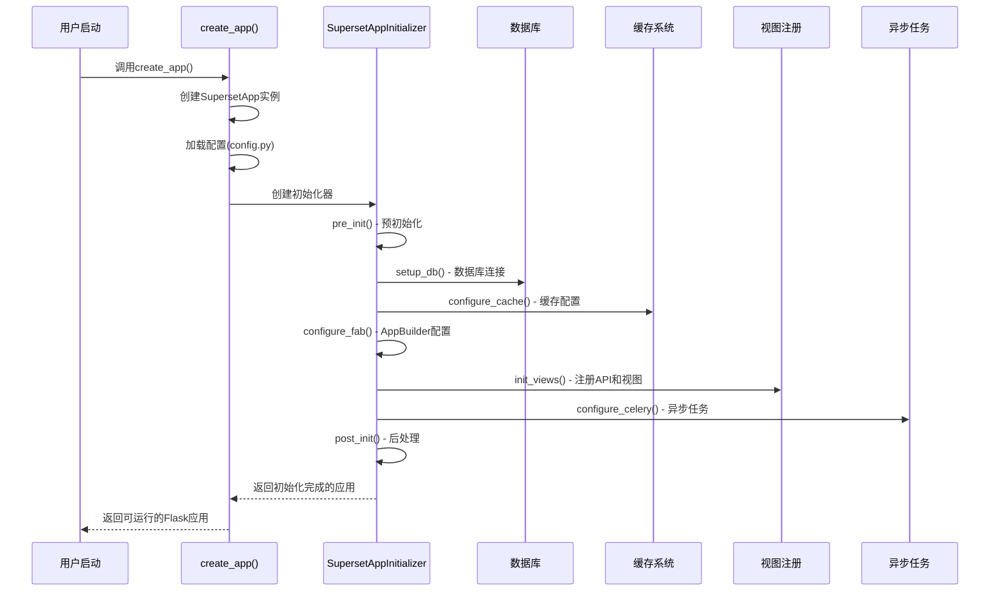
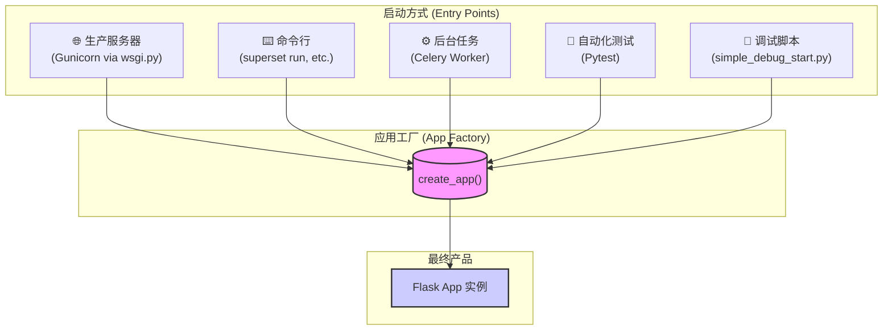

# 📚 第1天学习笔记：Flask应用架构深入理解

## 🎯 今日学习目标
- ✅ 理解Flask应用工厂模式
- ✅ 掌握Superset的启动流程
- ✅ 了解全局对象和依赖注入
- ✅ 熟悉配置管理系统

---

## 1️⃣ 应用入口分析：`superset/app.py`

### 🔍 **核心发现**

```python
def create_app(superset_config_module: Optional[str] = None) -> Flask:
    app = SupersetApp(__name__)  # 创建自定义Flask应用实例
    
    # 配置加载优先级：
    # 1. 环境变量 SUPERSET_CONFIG
    # 2. 参数 superset_config_module  
    # 3. 默认配置 "superset.config"
    config_module = superset_config_module or os.environ.get(
        "SUPERSET_CONFIG", "superset.config"
    )
    app.config.from_object(config_module)
    
    # 获取应用初始化器（支持自定义）
    app_initializer = app.config.get("APP_INITIALIZER", SupersetAppInitializer)(app)
    app_initializer.init_app()  # 执行完整的应用初始化
    
    return app
```

### 💡 **关键设计模式**

1. **工厂模式**: `create_app()` 函数是典型的工厂模式，支持不同配置创建不同的应用实例
2. **策略模式**: `APP_INITIALIZER` 配置项允许注入自定义初始化器
3. **模板方法模式**: `SupersetAppInitializer.init_app()` 定义了固定的初始化步骤

---

## 2️⃣ 应用初始化器：`superset/initialization/__init__.py`

### 🏗️ **初始化流程解析**

```python
class SupersetAppInitializer:
    def init_app(self) -> None:
        """完整的应用初始化流程"""
        
        # 第1步：基础配置检查
        self.check_secret_key()          # 检查SECRET_KEY安全性
        
        # 第2步：数据库和存储
        self.configure_db_encrypt()      # 配置数据库加密
        self.setup_db()                  # 初始化数据库连接
        
        # 第3步：缓存和会话
        self.configure_cache()           # 配置缓存管理器
        self.configure_session()         # 配置Flask Session
        
        # 第4步：安全和认证 
        self.configure_wtf()             # 配置WTF表单保护
        self.configure_auth_provider()   # 配置认证提供者
        self.configure_fab()             # 配置Flask-AppBuilder
        
        # 第5步：核心功能
        self.configure_feature_flags()   # 配置功能开关
        self.configure_logging()         # 配置日志系统
        self.configure_data_sources()    # 注册数据源
        
        # 第6步：视图和API
        self.init_views()                # 注册所有视图和API
        self.register_blueprints()       # 注册蓝图
        
        # 第7步：异步和任务
        self.configure_celery()          # 配置Celery任务队列
        self.configure_async_queries()   # 配置异步查询
        
        # 第8步：前端资源
        self.setup_bundle_manifest()     # 设置前端资源清单
        
        # 第9步：中间件和扩展
        self.configure_middlewares()     # 配置中间件
        self.configure_url_map_converters() # 配置URL转换器
```

### 🔧 **关键初始化步骤详解**

#### **数据库初始化**
```python
def setup_db(self) -> None:
    db.init_app(self.superset_app)                    # 初始化SQLAlchemy
    migrate.init_app(self.superset_app, db)           # 初始化数据库迁移
    pessimistic_connection_handling(db.engine)        # 配置悲观连接处理
```

#### **视图注册** (关键！)
```python
def init_views(self) -> None:
    # API端点注册
    appbuilder.add_api(ChartRestApi)         # 图表API
    appbuilder.add_api(DashboardRestApi)     # 仪表板API  
    appbuilder.add_api(DatabaseRestApi)      # 数据库API
    appbuilder.add_api(DatasetRestApi)       # 数据集API
    
    # 传统视图注册
    appbuilder.add_view(DatabaseView)        # 数据库管理界面
    appbuilder.add_view(SliceModelView)      # 图表管理界面
    appbuilder.add_view(DashboardModelView)  # 仪表板管理界面
```

---

## 3️⃣ 配置管理：`superset/config.py`

### ⚙️ **配置层次结构**

```python
# 核心应用配置
SECRET_KEY = os.environ.get("SUPERSET_SECRET_KEY") or CHANGE_ME_SECRET_KEY
SQLALCHEMY_DATABASE_URI = f"sqlite:///{DATA_DIR}/superset.db"

# 性能配置  
ROW_LIMIT = 50000                    # 图表数据行限制
SUPERSET_WEBSERVER_TIMEOUT = 60     # Web服务器超时
SAMPLES_ROW_LIMIT = 1000             # 样本数据限制

# 功能开关
FEATURE_FLAGS = {
    "DASHBOARD_NATIVE_FILTERS": True,
    "GLOBAL_ASYNC_QUERIES": True,
    "VERSIONED_EXPORT": True,
}

# Celery异步任务配置
class CeleryConfig:
    broker_url = "sqla+sqlite:///celerydb.sqlite"
    result_backend = "db+sqlite:///celery_results.sqlite"
    imports = (
        "superset.sql_lab",
        "superset.tasks.scheduler", 
        "superset.tasks.thumbnails",
    )
```

### 🎛️ **配置优先级**
1. **环境变量** (最高优先级)
2. **superset_config.py** (用户自定义配置)
3. **superset.config** (默认配置)

---

## 4️⃣ 全局对象管理：`superset/extensions/__init__.py`

### 🌐 **依赖注入模式**

```python
# 核心扩展对象（单例模式）
appbuilder = AppBuilder(update_perms=False)     # Flask-AppBuilder实例
db = SQLA()                                     # SQLAlchemy数据库实例
cache_manager = CacheManager()                  # 缓存管理器
celery_app = celery.Celery()                   # Celery异步任务实例

# 使用LocalProxy实现延迟加载
security_manager: SupersetSecurityManager = LocalProxy(lambda: appbuilder.sm)
async_query_manager: AsyncQueryManager = LocalProxy(async_query_manager_factory.instance)
event_logger = LocalProxy(lambda: _event_logger.get("event_logger"))
```

### 🔄 **LocalProxy的作用**
- **延迟初始化**: 只在真正使用时才创建对象
- **应用上下文绑定**: 确保在正确的Flask应用上下文中访问
- **线程安全**: 每个线程/请求都有独立的对象实例

---

## 📊 应用启动流程图



---

## 🎯 今日收获总结

### ✅ **核心理解**
1. **工厂模式**: Superset使用工厂模式创建Flask应用，支持灵活配置
2. **分层初始化**: 初始化过程分为9个清晰的步骤，每步都有明确职责
3. **依赖注入**: 通过`extensions`模块管理全局对象，使用LocalProxy实现延迟加载
4. **配置管理**: 多层配置系统，支持环境变量覆盖

### 🔍 **关键文件**
- `superset/app.py` - 应用工厂入口
- `superset/initialization/__init__.py` - 初始化逻辑
- `superset/config.py` - 默认配置
- `superset/extensions/__init__.py` - 全局对象定义

### 💡 **设计思想**
- **模块化**: 每个功能模块职责单一，便于测试和维护
- **可扩展**: 支持自定义初始化器、配置覆盖、插件机制
- **生产就绪**: 考虑了安全性、性能、监控等生产环境需求

---

## 🚀 明日预告：数据模型深入学习

明天我们将深入学习：
- `superset/models/core.py` - 核心数据模型
- `superset/models/dashboard.py` - 仪表板模型
- `superset/models/slice.py` - 图表模型
- SQLAlchemy ORM的使用模式 

---

## `create_app` 调用入口 (Application Entry Points)

`create_app` 函数是 Superset 应用的**中央工厂**。不同的运行场景通过调用这个函数来获取一个标准化的、配置完备的 Flask 应用实例。

下面这张图清晰地展示了这种"统一入口"的设计模式：



### 主要调用场景:

1.  **Web 服务器 (WSGI)**:
    *   **文件**: `superset/wsgi.py`
    *   **目的**: 为 Gunicorn 等生产环境服务器提供 `app` 实例。

2.  **命令行 (CLI)**:
    *   **文件**: `superset/cli/main.py`
    *   **目的**: 为 `superset run`, `superset db upgrade` 等命令提供应用上下文。

3.  **后台任务 (Celery)**:
    *   **文件**: `superset/tasks/celery_app.py`
    *   **目的**: 为处理异步任务的 Celery Worker 提供应用上下文。

4.  **自动化测试**:
    *   **文件**: `tests/` 目录下的多个文件
    *   **目的**: 为每个测试用例创建干净、隔离的 `app` 实例。

这种模式是大型 Flask 应用保持结构清晰、可测试和可维护性的关键。 