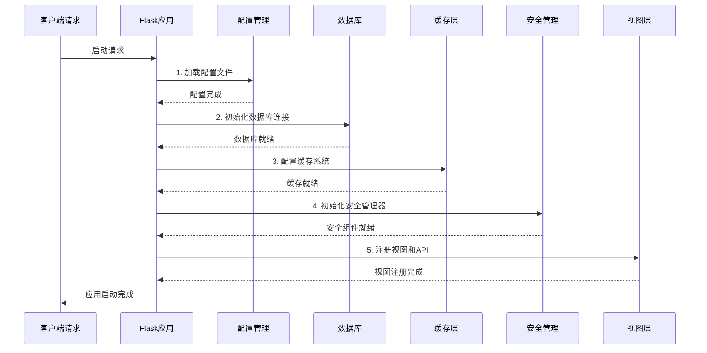
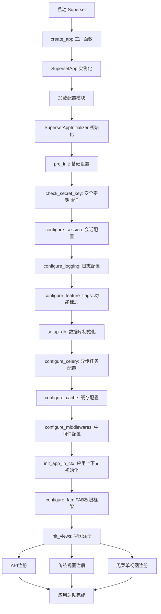
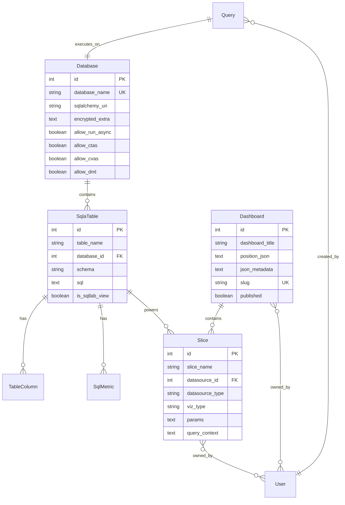
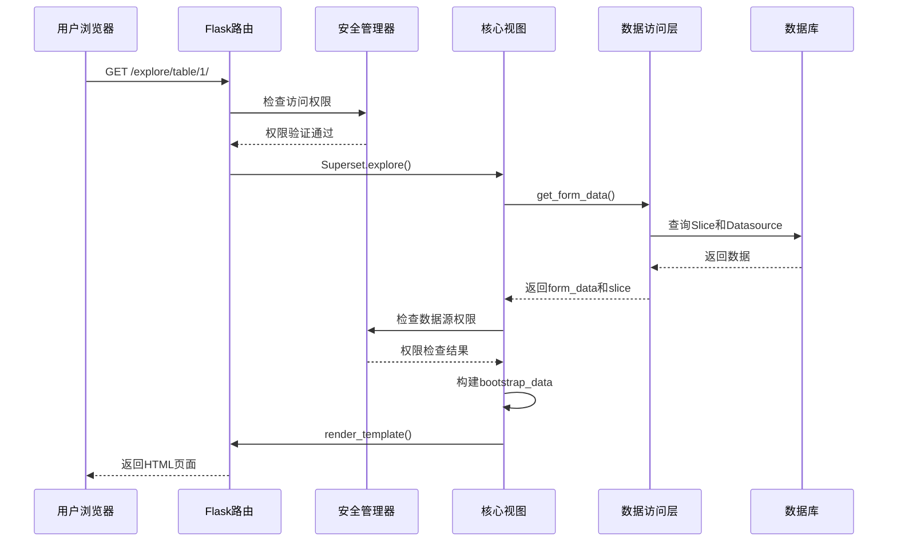
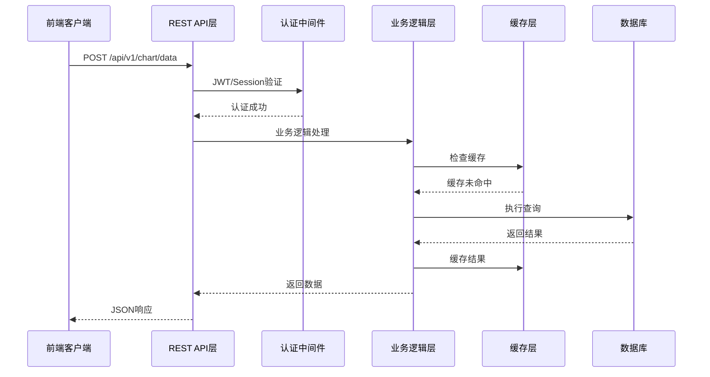

# Day 1: Superset 概览与架构 - 源码深度分析

## 1. 应用初始化流程分析

### 1.1 启动入口源码分析

#### 主要入口文件结构
```python
# superset/app.py - 应用工厂模式
def create_app(superset_config_module: Optional[str] = None) -> Flask:
    app = SupersetApp(__name__)
    
    try:
        # 加载配置模块
        config_module = superset_config_module or os.environ.get(
            "SUPERSET_CONFIG", "superset.config"
        )
        app.config.from_object(config_module)
        
        # 初始化应用
        app_initializer = app.config.get("APP_INITIALIZER", SupersetAppInitializer)(app)
        app_initializer.init_app()
        
        return app
    except Exception:
        logger.exception("Failed to create app")
        raise

class SupersetApp(Flask):
    pass
```

#### Flask环境配置
```bash
# .flaskenv - Flask应用自动发现
FLASK_APP="superset.app:create_app()"
FLASK_DEBUG=true
```

### 1.2 应用初始化器源码分析

#### SupersetAppInitializer 核心架构
```python
# superset/initialization/__init__.py
class SupersetAppInitializer:
    def __init__(self, app: SupersetApp) -> None:
        super().__init__()
        self.superset_app = app
        self.config = app.config
        self.manifest: dict[Any, Any] = {}

    def init_app(self) -> None:
        """主初始化入口 - 严格按顺序执行"""
        self.pre_init()
        self.check_secret_key()
        self.configure_session()
        self.configure_logging()
        self.configure_feature_flags()
        self.configure_db_encrypt()
        self.setup_db()
        self.configure_celery()
        self.enable_profiling()
        self.setup_event_logger()
        self.setup_bundle_manifest()
        self.register_blueprints()
        self.configure_wtf()
        self.configure_middlewares()
        self.configure_cache()
        self.set_db_default_isolation()
        self.configure_sqlglot_dialects()

        with self.superset_app.app_context():
            self.init_app_in_ctx()

        self.post_init()
```

### 1.3 初始化流程时序图



## 2. 核心数据模型源码分析

### 2.1 Database 模型深度解析

#### 数据库连接核心代码
```python
# superset/models/core.py
class Database(Model, AuditMixinNullable, ImportExportMixin):
    __tablename__ = "dbs"
    
    id = Column(Integer, primary_key=True)
    database_name = Column(String(250), unique=True, nullable=False)
    sqlalchemy_uri = Column(String(1024), nullable=False)
    password = Column(EncryptedType(String(1024), secret_key=SECRET_KEY))
    impersonate_user = Column(Boolean, default=False)
    encrypted_extra = Column(EncryptedType(Text, secret_key=SECRET_KEY))
    server_cert = Column(EncryptedType(Text, secret_key=SECRET_KEY))
    
    @contextmanager
    def get_sqla_engine(
        self,
        catalog: str | None = None,
        schema: str | None = None,
        nullpool: bool = True,
        source: utils.QuerySource | None = None,
    ) -> Engine:
        """获取SQLAlchemy引擎的核心方法"""
        sqlalchemy_url = self.get_url_for_impersonation(
            url=make_url_safe(self.sqlalchemy_uri_decrypted),
            impersonate_user=self.impersonate_user,
            username=effective_username,
        )
        
        # 连接参数配置
        params: dict[str, Any] = {
            "poolclass": NullPool if nullpool else StaticPool,
            "pool_pre_ping": self.pool_pre_ping,
            "pool_recycle": self.pool_recycle,
            "echo": self.db_engine_spec.echo,
        }
        
        # 安全检查
        if DB_CONNECTION_MUTATOR:
            if not source and request and request.referrer:
                if "/superset/dashboard/" in request.referrer:
                    source = utils.QuerySource.DASHBOARD
                elif "/explore/" in request.referrer:
                    source = utils.QuerySource.CHART
                elif "/sqllab/" in request.referrer:
                    source = utils.QuerySource.SQL_LAB
        
        try:
            return create_engine(sqlalchemy_url, **params)
        except Exception as ex:
            raise self.db_engine_spec.get_dbapi_mapped_exception(ex) from ex
```

### 2.2 Dashboard 模型架构分析

#### Dashboard 实体关系
```python
# superset/models/dashboard.py
class Dashboard(AuditMixinNullable, ImportExportMixin, Model):
    __tablename__ = "dashboards"
    
    id = Column(Integer, primary_key=True)
    dashboard_title = Column(String(500))
    position_json = Column(utils.MediumText())  # 布局配置
    description = Column(Text)
    css = Column(utils.MediumText())
    json_metadata = Column(utils.MediumText())
    slug = Column(String(255), unique=True)
    
    # 关联关系
    slices: list[Slice] = relationship(
        Slice, secondary=dashboard_slices, backref="dashboards"
    )
    owners = relationship(
        security_manager.user_model,
        secondary=dashboard_user,
        passive_deletes=True,
    )
    
    @property
    def datasources(self) -> set[BaseDatasource]:
        """获取所有关联数据源"""
        datasources_by_cls_model: dict[type[BaseDatasource], set[int]] = defaultdict(set)
        
        for slc in self.slices:
            datasources_by_cls_model[slc.cls_model].add(slc.datasource_id)
        
        return {
            datasource
            for cls_model, datasource_ids in datasources_by_cls_model.items()
            for datasource in db.session.query(cls_model)
            .filter(cls_model.id.in_(datasource_ids))
            .all()
        }
```

### 2.3 Chart (Slice) 模型分析

#### Chart 实体与可视化关系
```python
# superset/models/slice.py
class Slice(Model, AuditMixinNullable, ImportExportMixin):
    __tablename__ = "slices"
    
    id = Column(Integer, primary_key=True)
    slice_name = Column(String(250), nullable=False)
    datasource_id = Column(Integer, ForeignKey("tables.id"))
    datasource_type = Column(String(200))
    datasource_name = Column(String(2000))
    viz_type = Column(String(250))
    params = Column(Text)
    query_context = Column(Text)
    
    # 关联数据源
    table = relationship(
        "SqlaTable",
        foreign_keys=[datasource_id],
        primaryjoin="and_(Slice.datasource_id == SqlaTable.id, "
        "Slice.datasource_type == 'table')",
        remote_side="SqlaTable.id",
        lazy="subquery",
    )
    
    @property
    def cls_model(self) -> type[SqlaTable]:
        from superset.daos.datasource import DatasourceDAO
        return DatasourceDAO.sources[self.datasource_type]
        
    @property
    def datasource(self) -> SqlaTable | None:
        return self.get_datasource
```

## 3. 视图层架构源码分析

### 3.1 视图注册机制

#### API 视图注册流程
```python
# superset/initialization/__init__.py - init_views 方法
def init_views(self) -> None:
    # API 视图注册
    appbuilder.add_api(ChartRestApi)
    appbuilder.add_api(DashboardRestApi)
    appbuilder.add_api(DatabaseRestApi)
    appbuilder.add_api(DatasetRestApi)
    appbuilder.add_api(SqlLabRestApi)
    
    # 传统视图注册
    appbuilder.add_view(
        DatabaseView,
        "Databases",
        label=__("Database Connections"),
        icon="fa-database",
        category="Data",
        category_label=__("Data"),
    )
    
    # 无菜单视图
    appbuilder.add_view_no_menu(ExploreView)
    appbuilder.add_view_no_menu(SqllabView)
    appbuilder.add_view_no_menu(Superset)
```

### 3.2 核心视图类分析

#### Superset 核心视图
```python
# superset/views/core.py
class Superset(BaseSupersetView):
    """Superset核心视图类"""
    
    @has_access
    @event_logger.log_this
    @expose("/explore/<datasource_type>/<int:datasource_id>/", methods=("GET", "POST"))
    def explore(self, datasource_type: str | None = None, datasource_id: int | None = None) -> FlaskResponse:
        """探索页面视图"""
        form_data, slc = get_form_data(use_slice_data=True, initial_form_data=initial_form_data)
        
        # 数据源验证
        try:
            datasource_id, datasource_type = get_datasource_info(
                datasource_id, datasource_type, form_data
            )
        except SupersetException:
            datasource_id = None
            datasource_type = SqlaTable.type
            
        # 权限检查
        slice_add_perm = security_manager.can_access("can_write", "Chart")
        slice_overwrite_perm = security_manager.is_owner(slc) if slc else False
        
        # 构建bootstrap数据
        bootstrap_data = {
            "can_add": slice_add_perm,
            "datasource": sanitize_datasource_data(datasource_data),
            "form_data": form_data,
            "datasource_id": datasource_id,
            "datasource_type": datasource_type,
            "slice": slc.data if slc else None,
            "user": bootstrap_user_data(g.user, include_perms=True),
            "common": common_bootstrap_payload(),
        }
        
        return self.render_template(
            "superset/basic.html",
            bootstrap_data=json.dumps(bootstrap_data, default=json.pessimistic_json_iso_dttm_ser),
            entry="explore",
            title=title,
        )
```

#### SQL Lab 视图分析
```python
# superset/views/sqllab.py
class SqllabView(BaseSupersetView):
    route_base = "/sqllab"
    class_permission_name = "SQLLab"
    
    @expose("/", methods=["GET", "POST"])
    @has_access
    @permission_name("read")
    @event_logger.log_this
    def root(self) -> FlaskResponse:
        payload = {}
        if form_data := request.form.get("form_data"):
            with contextlib.suppress(json.JSONDecodeError):
                payload["requested_query"] = json.loads(form_data)
        return self.render_app_template(payload)
```

## 4. 安全管理架构分析

### 4.1 权限系统源码

#### SupersetSecurityManager 核心权限
```python
# superset/security/manager.py
class SupersetSecurityManager(SecurityManager):
    READ_ONLY_PERMISSION = {
        "can_show", "can_list", "can_get", "can_external_metadata",
        "can_external_metadata_by_name", "can_read",
    }
    
    SQLLAB_ONLY_PERMISSIONS = {
        ("can_read", "SavedQuery"),
        ("can_write", "SavedQuery"),
        ("can_get_results", "SQLLab"),
        ("can_execute_sql_query", "SQLLab"),
        ("can_estimate_query_cost", "SQL Lab"),
        ("menu_access", "SQL Lab"),
        ("menu_access", "SQL Editor"),
    }
    
    def can_access_datasource(self, datasource: BaseDatasource | None = None) -> bool:
        """数据源访问权限检查"""
        if not datasource:
            return False
            
        return (
            self.can_access_all_datasources()
            or self.can_access("datasource_access", datasource.perm)
            or self.is_owner(datasource)
        )
```

### 4.2 数据库安全检查

#### URI 安全验证
```python
# superset/security/analytics_db_safety.py
BLOCKLIST = {
    re.compile(r"sqlite(?:\+[^\s]*)?$"),  # SQLite安全限制
    re.compile(r"shillelagh$"),           # 文件系统访问限制
}

def check_sqlalchemy_uri(uri: URL) -> None:
    """检查SQLAlchemy URI的安全性"""
    for blocklist_regex in BLOCKLIST:
        if re.match(blocklist_regex, uri.drivername):
            try:
                dialect = uri.get_dialect().__name__
            except (NoSuchModuleError, ValueError):
                dialect = uri.drivername
                
            raise SupersetSecurityException(
                SupersetError(
                    error_type=SupersetErrorType.DATABASE_SECURITY_ACCESS_ERROR,
                    message=_(
                        "%(dialect)s cannot be used as a data source for security reasons.",
                        dialect=dialect,
                    ),
                    level=ErrorLevel.ERROR,
                )
            )
```

## 5. 配置管理源码分析

### 5.1 核心配置结构

#### 主配置文件架构
```python
# superset/config.py
# 数据库配置
SQLALCHEMY_DATABASE_URI = f"sqlite:///{os.path.join(DATA_DIR, 'superset.db')}"
SQLALCHEMY_ENGINE_OPTIONS = {}
SQLALCHEMY_ENCRYPTED_FIELD_TYPE_ADAPTER = SQLAlchemyUtilsAdapter

# 安全配置
SECRET_KEY = os.environ.get("SUPERSET_SECRET_KEY") or CHANGE_ME_SECRET_KEY
WTF_CSRF_ENABLED = True
WTF_CSRF_EXEMPT_LIST = [
    "superset.views.core.log",
    "superset.views.core.explore_json",
    "superset.charts.data.api.data",
]

# 缓存配置
CACHE_CONFIG = {
    'CACHE_TYPE': 'RedisCache',
    'CACHE_DEFAULT_TIMEOUT': 300,
    'CACHE_KEY_PREFIX': 'superset_',
}

# 功能标志
DEFAULT_FEATURE_FLAGS: dict[str, bool] = {
    "ENABLE_SUPERSET_META_DB": False,
    "SQLLAB_BACKEND_PERSISTENCE": True,
    "GLOBAL_ASYNC_QUERIES": False,
    "EMBEDDED_SUPERSET": False,
    "ALERT_REPORTS": False,
}
```

### 5.2 环境变量配置

#### Docker 环境配置示例
```python
# docker/pythonpath_dev/superset_config.py
DATABASE_DIALECT = os.getenv("DATABASE_DIALECT")
DATABASE_USER = os.getenv("DATABASE_USER")
DATABASE_PASSWORD = os.getenv("DATABASE_PASSWORD")
DATABASE_HOST = os.getenv("DATABASE_HOST")
DATABASE_PORT = os.getenv("DATABASE_PORT")
DATABASE_DB = os.getenv("DATABASE_DB")

SQLALCHEMY_DATABASE_URI = (
    f"{DATABASE_DIALECT}://"
    f"{DATABASE_USER}:{DATABASE_PASSWORD}@"
    f"{DATABASE_HOST}:{DATABASE_PORT}/{DATABASE_DB}"
)
```

## 6. 应用架构流程图

### 6.1 完整启动流程图



### 6.2 数据模型关系图



## 7. 请求处理时序图

### 7.1 探索页面请求流程



### 7.2 API 请求处理流程



## 8. 重点难点分析

### 8.1 设计难点

1. **多租户权限管理**：复杂的权限层次结构，包括对象级权限
2. **异步查询处理**：大查询的异步执行和结果缓存
3. **多数据源支持**：统一的接口适配不同数据库引擎
4. **前后端分离**：复杂的状态管理和数据同步

### 8.2 性能优化点

1. **连接池管理**：数据库连接的有效管理和复用
2. **查询缓存**：多层次缓存策略
3. **lazy loading**：按需加载相关数据
4. **批量操作**：减少数据库往返次数

### 8.3 安全考虑

1. **SQL注入防护**：参数化查询和输入验证
2. **权限隔离**：严格的数据访问控制
3. **审计日志**：完整的操作记录
4. **加密存储**：敏感信息的安全存储

这个源码分析展示了Superset作为企业级BI平台的完整架构设计，从应用初始化到数据模型，从权限管理到视图层，体现了现代Web应用的最佳实践。
