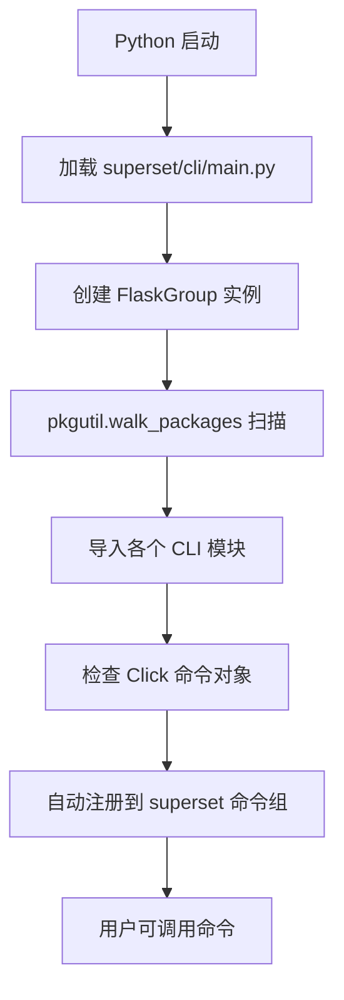

# Superset 学习指南 - Day 2: CLI 深度源码分析

欢迎来到学习第二天！今天我们将深入剖析 Superset 的命令行接口 (CLI) 源码实现、设计思想和调用流程。

## 1. CLI 架构深度解析

### 1.1 模块化设计思想

Superset 的 CLI 采用了高度模块化的设计，体现了"关注点分离"和"开放封闭原则"：

```
superset/cli/
├── main.py           # CLI 主入口，负责命令发现和注册
├── lib.py            # 公共工具函数
├── examples.py       # 示例数据相关命令
├── importexport.py   # 导入导出功能
├── test.py           # 测试相关命令
├── reset.py          # 重置功能
├── update.py         # 更新相关命令
├── thumbnails.py     # 缩略图生成
├── viz_migrations.py # 可视化迁移
└── test_db.py        # 数据库测试
```

### 1.2 核心设计模式分析

#### 1.2.1 命令发现模式 (Command Discovery Pattern)

在 `superset/cli/main.py` 中，使用了动态命令发现机制：

```python
# 自动发现并注册所有 CLI 命令
for load, module_name, is_pkg in pkgutil.walk_packages(
    cli.__path__, cli.__name__ + "."
):
    module = importlib.import_module(module_name)
    for attribute in module.__dict__.values():
        if isinstance(attribute, (click.core.Command, click.core.Group)):
            superset.add_command(attribute)
            if isinstance(attribute, click.core.Group):
                break
```

**设计思想**：
- **插件式架构**：新命令只需在 `cli/` 目录下创建文件即可自动被发现
- **零配置**：无需手动注册命令，降低维护成本
- **类型安全**：通过 `isinstance` 检查确保只注册有效的命令对象

#### 1.2.2 应用上下文注入模式

所有 CLI 命令都使用 `@with_appcontext` 装饰器：

```python
@superset.command()
@with_appcontext
@transaction()
def init() -> None:
    """Inits the Superset application"""
    appbuilder.add_permissions(update_perms=True)
    security_manager.sync_role_definitions()
```

**设计思想**：
- **依赖注入**：自动注入 Flask 应用上下文
- **事务管理**：通过 `@transaction()` 确保数据一致性
- **资源管理**：自动管理数据库连接和应用状态

### 1.3 装饰器深度解析 - 零基础也能懂

装饰器是 Python 的一个重要特性，但很多同学觉得难理解。让我们用最简单的方式来解释 Superset CLI 中用到的几个关键装饰器。

#### 1.3.1 什么是装饰器？

**简单类比**：想象装饰器就像是给函数"穿衣服"。原来的函数是"人"，装饰器是"衣服"，穿上衣服后，这个人就有了新的能力或特性。

```python
# 没有装饰器的普通函数
def say_hello():
    print("Hello!")

# 使用装饰器后的函数
@make_it_fancy  # 这就是"衣服"
def say_hello():
    print("Hello!")
```

#### 1.3.2 `@click.command()` 装饰器

**作用**：把普通 Python 函数变成 CLI 命令

**工作原理**：
```python
# 没有装饰器时 - 只是普通函数
def init():
    print("初始化应用")

# 加上装饰器后 - 变成CLI命令
@click.command()
def init():
    print("初始化应用")

# 等价于手动操作：
def init():
    print("初始化应用")
init = click.command()(init)  # 手动"穿衣服"
```

**实际效果**：
- **之前**：`init()` 只能在 Python 代码中调用
- **之后**：可以在命令行中执行 `superset init`

**类比理解**：就像给一个普通人穿上了"超级英雄的衣服"，现在他可以响应紧急呼叫了！

#### 1.3.3 `@with_appcontext` 装饰器

**作用**：确保函数在 Flask 应用上下文中运行

**为什么需要它？**
Flask 应用就像一个"工厂"，里面有数据库、配置、日志等各种"设备"。但这些设备只有在"工厂开工"时才能使用。

```python
# 没有上下文 - 无法使用Flask的功能
def bad_function():
    user = db.session.query(User).first()  # ❌ 报错！db 不知道是什么

# 有上下文 - 可以正常使用
@with_appcontext
def good_function():
    user = db.session.query(User).first()  # ✅ 正常工作
```

**工作原理详解**：
```python
from flask import current_app
from superset import db

# 手动创建上下文的繁琐过程
def manual_way():
    app = create_app()  # 创建应用
    with app.app_context():  # 进入应用上下文
        # 现在可以使用 db、current_app 等了
        user = db.session.query(User).first()
    # 退出上下文，清理资源

# 使用装饰器的简洁方式
@with_appcontext
def decorator_way():
    # 装饰器自动处理了上下文的创建和清理
    user = db.session.query(User).first()
```

**生活类比**：
- **没有装饰器**：就像你想在关着门的银行里取钱，门卫会说"银行没开门呢！"
- **有装饰器**：装饰器帮你"开门"，让你能正常办业务，办完后自动"关门"

#### 1.3.4 `@transaction()` 装饰器

**作用**：确保数据库操作的一致性

**什么是事务？**
事务就像"购物车"机制：
- 你可以往购物车里放很多商品（数据库操作）
- 只有点击"结账"时，所有商品才真正购买（提交事务）
- 如果中途出错，整个购物车都被清空（回滚事务）

```python
# 没有事务装饰器 - 危险！
def dangerous_operation():
    user = User(name="张三")
    db.session.add(user)
    db.session.commit()  # 第一个操作成功
    
    # 如果这里出错...
    1 / 0  # 程序崩溃！
    
    role = Role(name="admin")
    db.session.add(role)
    db.session.commit()  # 这个操作永远不会执行
    
    # 结果：数据库处于不一致状态（有用户但没角色）

# 使用事务装饰器 - 安全！
@transaction()
def safe_operation():
    user = User(name="张三")
    db.session.add(user)
    
    # 如果这里出错...
    1 / 0  # 程序崩溃！
    
    role = Role(name="admin")
    db.session.add(role)
    
    # 装饰器确保：要么全部成功，要么全部失败
    # 如果出错，user 也不会被保存到数据库
```

**工作原理**：
```python
def transaction():
    def decorator(func):
        def wrapper(*args, **kwargs):
            try:
                result = func(*args, **kwargs)  # 执行原函数
                db.session.commit()  # 一切正常，提交事务
                return result
            except Exception as e:
                db.session.rollback()  # 出错了，回滚事务
                raise e  # 重新抛出异常
        return wrapper
    return decorator
```

#### 1.3.5 `@click.option()` 装饰器

**作用**：为 CLI 命令添加命令行参数

```python
@click.command()
@click.option('--name', default='World', help='要打招呼的人')
@click.option('--count', default=1, help='重复次数')
def hello(name, count):
    for i in range(count):
        print(f"Hello {name}!")

# 使用方式：
# superset hello --name 张三 --count 3
# 输出：
# Hello 张三!
# Hello 张三!
# Hello 张三!
```

**装饰器的叠加效果**：
```python
@click.command()           # 第3层："能响应命令行调用"
@with_appcontext          # 第2层："能访问Flask资源"
@transaction()            # 第1层："数据库操作安全"
def init():               # 核心：原始函数
    # 现在这个函数同时具备了三种"超能力"！
    pass
```

**类比理解**：就像穿了三件衣服：
1. 内衣（`@transaction()`）：保护身体（数据库）不受伤害
2. 毛衣（`@with_appcontext`）：提供温暖（Flask 环境）
3. 外套（`@click.command()`）：让别人能找到你（命令行调用）

#### 1.3.6 装饰器的执行顺序

**重要概念**：装饰器的执行顺序是**从下往上**的！

```python
@click.command()       # 第3个执行
@with_appcontext      # 第2个执行  
@transaction()        # 第1个执行
def my_command():
    pass

# 等价于：
my_command = click.command()(
    with_appcontext(
        transaction()(my_command)
    )
)
```

**执行流程**：
```
用户执行: superset my-command
    ↓
1. click.command() 接收命令行调用
    ↓
2. with_appcontext 创建Flask上下文
    ↓  
3. transaction() 开始数据库事务
    ↓
4. 执行原始函数 my_command()
    ↓
5. transaction() 提交或回滚事务
    ↓
6. with_appcontext 清理Flask上下文
    ↓
7. click.command() 处理命令结果
```

#### 1.3.7 自己动手写一个简单装饰器

让我们写一个简单的装饰器来理解原理：

```python
def timer(func):
    """计时装饰器 - 统计函数执行时间"""
    import time
    
    def wrapper(*args, **kwargs):
        start_time = time.time()
        print(f"开始执行 {func.__name__}...")
        
        result = func(*args, **kwargs)  # 执行原函数
        
        end_time = time.time()
        print(f"{func.__name__} 执行完毕，耗时 {end_time - start_time:.2f} 秒")
        
        return result
    return wrapper

# 使用我们的装饰器
@timer
def slow_function():
    import time
    time.sleep(2)
    print("工作完成！")

# 调用函数
slow_function()
# 输出：
# 开始执行 slow_function...
# 工作完成！
# slow_function 执行完毕，耗时 2.00 秒
```

现在你应该明白装饰器的神奇之处了：它们就像是函数的"增强器"，给普通函数添加各种"超能力"！

### 1.4 Click 装饰器深度剖析

Click 是 Python 中最强大的命令行界面库之一，Superset 大量使用了它的装饰器。让我们深入了解这些装饰器的内部工作机制。

#### 1.4.1 Click 装饰器的核心理念

**设计哲学**：Click 采用声明式编程范式，通过装饰器将命令行参数的定义与函数逻辑分离。

```python
# 传统的命令行处理方式 - 繁琐且容易出错
import sys
import argparse

def traditional_way():
    parser = argparse.ArgumentParser()
    parser.add_argument('--host', default='localhost')
    parser.add_argument('--port', type=int, default=8088)
    parser.add_argument('--debug', action='store_true')
    
    args = parser.parse_args()
    
    # 手动验证和转换
    if args.port < 1 or args.port > 65535:
        print("端口号无效！")
        sys.exit(1)
    
    run_server(args.host, args.port, args.debug)

# Click 的声明式方式 - 简洁优雅
@click.command()
@click.option('--host', default='localhost', help='服务器地址')
@click.option('--port', default=8088, type=int, help='端口号')
@click.option('--debug', is_flag=True, help='调试模式')
def click_way(host, port, debug):
    # 参数已经自动验证和转换完毕
    run_server(host, port, debug)
```

#### 1.4.2 `@click.command()` 装饰器深度解析

**核心作用**：将普通 Python 函数转换为 Click 命令对象

**内部实现原理**：

```python
# Click 内部的简化实现逻辑
class Command:
    def __init__(self, name, callback, params=None):
        self.name = name or callback.__name__
        self.callback = callback  # 原始函数
        self.params = params or []  # 参数列表
    
    def invoke(self, ctx):
        """调用命令时的核心逻辑"""
        # 1. 解析命令行参数
        args, kwargs = self.parse_args(ctx.args)
        
        # 2. 参数验证和类型转换
        processed_kwargs = self.process_params(kwargs)
        
        # 3. 调用原始函数
        return self.callback(*args, **processed_kwargs)

def command(name=None):
    """@click.command() 装饰器的简化实现"""
    def decorator(func):
        # 创建 Command 对象包装原函数
        cmd = Command(name, func)
        
        # 复制原函数的 click 相关属性
        if hasattr(func, '__click_params__'):
            cmd.params = func.__click_params__
        
        return cmd
    return decorator
```

**装饰器的转换过程**：

```python
# 第一步：原始函数
def run(host, port):
    print(f"服务器启动在 {host}:{port}")

# 第二步：应用装饰器
@click.command()
def run(host, port):
    print(f"服务器启动在 {host}:{port}")

# 等价于：
def run(host, port):
    print(f"服务器启动在 {host}:{port}")

run = click.command()(run)  # 手动装饰

# 第三步：Click 内部转换
# run 现在是一个 Command 对象，不再是原来的函数
print(type(run))  # <class 'click.core.Command'>
```

#### 1.4.3 `@click.option()` 装饰器剖析

**核心功能**：为命令添加命令行选项

**参数收集机制**：

```python
# Click 如何收集装饰器参数
def option(*param_decls, **attrs):
    """@click.option() 装饰器实现原理"""
    def decorator(func):
        # 如果函数还没有参数列表，创建一个
        if not hasattr(func, '__click_params__'):
            func.__click_params__ = []
        
        # 创建选项对象
        option_obj = Option(param_decls, **attrs)
        
        # 将选项添加到参数列表（注意：是插入到开头！）
        func.__click_params__.insert(0, option_obj)
        
        return func
    return decorator

# 多个装饰器叠加的效果
@click.command()
@click.option('--host', default='localhost')  # 第二个添加
@click.option('--port', default=8088)         # 第一个添加
def run(port, host):  # 注意参数顺序！
    pass

# 函数的 __click_params__ 列表：
# [Option('--port'), Option('--host')]
```

**参数顺序的重要性**：

```python
# 错误的参数顺序
@click.command()
@click.option('--name', default='World')
@click.option('--count', default=1, type=int)
def hello(name, count):  # ❌ 参数顺序与装饰器相反
    pass

# 正确的参数顺序
@click.command()
@click.option('--name', default='World')
@click.option('--count', default=1, type=int)
def hello(count, name):  # ✅ 参数顺序与装饰器顺序相反
    pass

# 或者使用更清晰的方式
@click.command()
@click.option('--count', default=1, type=int)  # 最后一个装饰器
@click.option('--name', default='World')       # 倒数第二个装饰器
def hello(name, count):                        # 按自然顺序写参数
    pass
```

#### 1.4.4 Click 装饰器的高级特性

**1. 类型转换系统**

```python
# Click 的自动类型转换
@click.option('--count', type=int)
def command(count):
    # count 已经是 int 类型，不需要手动转换
    print(type(count))  # <class 'int'>

# 自定义类型转换器
class PortType(click.ParamType):
    name = 'port'
    
    def convert(self, value, param, ctx):
        try:
            port = int(value)
            if not 1 <= port <= 65535:
                self.fail(f'{value} 不是有效的端口号', param, ctx)
            return port
        except ValueError:
            self.fail(f'{value} 不是有效的整数', param, ctx)

PORT = PortType()

@click.option('--port', type=PORT)
def run(port):
    pass  # port 保证是 1-65535 范围内的整数
```

**2. 选项验证与回调**

```python
def validate_host(ctx, param, value):
    """主机地址验证回调"""
    if value == 'localhost':
        return '127.0.0.1'  # 自动转换
    return value

@click.option('--host', 
              callback=validate_host,  # 验证回调
              help='服务器地址')
@click.option('--port', 
              type=click.IntRange(1, 65535),  # 内置范围验证
              help='端口号')
def run(host, port):
    pass
```

**3. 动态选项和条件逻辑**

```python
def add_debug_options(func):
    """动态添加调试选项的装饰器"""
    func = click.option('--debug/--no-debug', default=False)(func)
    func = click.option('--log-level', 
                       type=click.Choice(['DEBUG', 'INFO', 'WARNING', 'ERROR']))(func)
    return func

@click.command()
@add_debug_options  # 自定义装饰器
@click.option('--host', default='localhost')
def run(host, debug, log_level):
    if debug:
        print(f"调试模式开启，日志级别：{log_level}")
```

#### 1.4.5 Superset 中的 Click 使用模式

**命令组织结构**：

```python
# superset/cli/main.py 的组织方式
import click

# 创建主命令组
@click.group()
@click.option('--config', envvar='SUPERSET_CONFIG_PATH')
def superset(config):
    """Apache Superset命令行工具"""
    if config:
        os.environ['SUPERSET_CONFIG_PATH'] = config

# 子命令注册
@superset.command()
@with_appcontext
@transaction()
def init():
    """初始化应用"""
    pass

@superset.command()
@click.option('--load-test-data', is_flag=True)
@with_appcontext
@transaction()
def load_examples(load_test_data):
    """加载示例数据"""
    pass
```

**装饰器执行链分析**：

```python
# 在 Superset 中的典型命令
@superset.command()           # 5. 注册为 superset 的子命令
@click.option('--force')      # 4. 添加 --force 选项
@with_appcontext             # 3. Flask 应用上下文
@transaction()               # 2. 数据库事务
def my_command(force):       # 1. 原始函数
    pass

# 执行流程：
# 用户输入: superset my-command --force
#     ↓
# 5. superset 组识别子命令 my-command
#     ↓
# 4. 解析 --force 参数
#     ↓
# 3. 创建 Flask 应用上下文
#     ↓
# 2. 开始数据库事务
#     ↓
# 1. 执行 my_command(force=True)
```

#### 1.4.6 Click 装饰器的最佳实践

**1. 参数顺序约定**

```python
# 推荐的装饰器顺序（从外到内）
@click.group()              # 最外层：命令组织
@click.option()             # 参数定义层
@click.pass_context         # 上下文传递层  
@with_appcontext           # 应用上下文层
@transaction()             # 事务层（最内层）
def command():
    pass
```

**2. 错误处理模式**

```python
@click.command()
@click.option('--config-file', type=click.File('r'))
def load_config(config_file):
    try:
        config = json.load(config_file)
    except json.JSONDecodeError as e:
        # Click 推荐的错误处理方式
        click.echo(f"配置文件格式错误: {e}", err=True)
        raise click.Abort()  # 优雅退出
```

**3. 可重用装饰器组合**

```python
# 创建可重用的装饰器组合
def superset_command(func):
    """Superset 标准命令装饰器组合"""
    func = click.command()(func)
    func = with_appcontext(func)
    func = transaction()(func)
    return func

# 使用组合装饰器
@superset_command
def my_command():
    pass
```

通过这个深入分析，你可以看到 Click 装饰器不仅仅是语法糖，而是一个完整的声明式命令行开发框架。它通过装饰器模式优雅地解决了命令行程序开发中的参数解析、类型转换、验证、错误处理等常见问题。

### 1.5 扩展集成架构

#### Flask-Migrate 集成分析

```python
# superset/extensions/__init__.py
from flask_migrate import Migrate
migrate = Migrate()

# 在应用初始化时关联
def init_app(app: Flask) -> None:
    migrate.init_app(app, db)
```

**调用链分析**：
1. `superset db upgrade` 命令调用
2. Flask-Migrate 读取 `migrations/` 目录
3. 执行未应用的迁移脚本
4. 更新数据库 schema 版本

## 2. 关键命令源码深度分析

### 2.1 `load_examples` 命令实现剖析

让我们深入分析 `superset/cli/examples.py` 的实现：

```python
@click.command()
@with_appcontext
@click.option("--load-test-data", is_flag=True, help="Load additional test data")
@click.option("--only-metadata", is_flag=True, help="Only load metadata")
def load_examples(load_test_data: bool, only_metadata: bool) -> None:
    """Loads a set of Slices and Dashboards and a supporting dataset"""
    print("Loading examples into {}".format(db.engine.url))
    
    # 1. 加载数据源
    load_birth_names()
    load_energy()
    load_world_bank_health_n_pop()
    # ... 更多数据源
    
    # 2. 创建切片 (Slices/Charts)
    create_slices()
    
    # 3. 创建仪表盘
    create_dashboards()
```

**执行流程分析**：

1. **数据源创建阶段**：
   ```python
   def load_birth_names():
       # 检查数据源是否已存在
       if not (db.session.query(SqlaTable).filter_by(table_name="birth_names").first()):
           # 创建数据库表
           # 插入示例数据
           # 创建 SqlaTable 元数据对象
   ```

2. **切片创建阶段**：
   ```python
   def create_slices():
       # 遍历预定义的图表配置
       for slice_data in SLICE_CONFIGS:
           # 创建 Slice 对象
           # 设置查询参数和可视化类型
           # 保存到数据库
   ```

3. **仪表盘创建阶段**：
   ```python
   def create_dashboards():
       # 创建 Dashboard 对象
       # 关联相关的 Slices
       # 设置布局和样式
   ```

### 2.2 `init` 命令权限同步机制

```python
@superset.command()
@with_appcontext
@transaction()
def init() -> None:
    """Inits the Superset application"""
    # 1. 同步权限定义
    appbuilder.add_permissions(update_perms=True)
    
    # 2. 同步角色定义
    security_manager.sync_role_definitions()
```

**权限同步的调用链**：

1. **`appbuilder.add_permissions()`**：
   ```python
   # flask_appbuilder/security/manager.py
   def add_permissions(self, update_perms=False):
       # 扫描所有视图类
       for view in self.baseviews:
           # 提取权限定义
           permissions = view.base_permissions
           # 同步到数据库
           self.add_permissions_view(permissions, view.class_name)
   ```

2. **`security_manager.sync_role_definitions()`**：
   ```python
   # superset/security/manager.py
   def sync_role_definitions(self):
       # 遍历预定义角色
       for role_name, role_config in BUILTIN_ROLES.items():
           # 创建或更新角色
           # 分配权限给角色
   ```

## 3. CLI 命令执行流程深度分析

### 3.1 完整的调用栈分析

以 `superset run` 命令为例：

```
用户执行: superset run -p 8088
    ↓
1. Python 解释器加载 superset 包
    ↓
2. 执行 superset/__init__.py 中的应用工厂
    ↓
3. Click 框架解析命令行参数
    ↓
4. Flask-CLI 的 FlaskGroup 处理 run 命令
    ↓
5. 调用 Flask 的 run() 方法
    ↓
6. 启动 Werkzeug 开发服务器
    ↓
7. 每个请求触发应用上下文创建
```

### 3.2 命令注册流程图



## 4. 核心命令详细调用流程

### 4.1 `superset init` 完整调用链

```python
# 1. CLI 入口
superset.command()(init)

# 2. Flask 应用上下文创建
@with_appcontext

# 3. 数据库事务管理
@transaction()

# 4. 权限同步
def init():
    # 4.1 扫描所有视图类，提取权限定义
    appbuilder.add_permissions(update_perms=True)
    
    # 4.2 同步内置角色定义
    security_manager.sync_role_definitions()
```

**详细执行步骤**：

1. **权限发现阶段**：
   ```python
   # 扫描 superset/views/ 下的所有视图类
   views = [DashboardRestApi, ChartRestApi, DatabaseView, ...]
   for view_class in views:
       permissions = view_class.base_permissions
       # ['can_read', 'can_write', 'can_delete', ...]
   ```

2. **权限同步阶段**：
   ```python
   # 检查数据库中是否存在这些权限
   for permission in permissions:
       db_permission = session.query(Permission).filter_by(name=permission).first()
       if not db_permission:
           # 创建新权限
           new_permission = Permission(name=permission)
           session.add(new_permission)
   ```

3. **角色同步阶段**：
   ```python
   # 同步内置角色：Admin, Alpha, Gamma, etc.
   for role_name, role_config in BUILTIN_ROLES.items():
       role = session.query(Role).filter_by(name=role_name).first()
       if not role:
           role = Role(name=role_name)
       
       # 分配权限给角色
       for permission_name in role_config['permissions']:
           permission = session.query(Permission).filter_by(name=permission_name).first()
           role.permissions.append(permission)
   ```

### 4.2 `superset load_examples` 数据流分析

```python
# 执行顺序和数据依赖关系
load_examples()
├── load_birth_names()          # 创建 birth_names 表和数据
├── load_energy()               # 创建 energy_usage 表和数据  
├── load_world_bank_health_n_pop() # 创建 world_bank 表和数据
├── create_slices()             # 基于上述表创建图表
└── create_dashboards()         # 组合图表创建仪表盘
```

**数据创建流程**：

```python
def load_birth_names():
    # 1. 检查表是否已存在
    table = db.session.query(SqlaTable).filter_by(table_name="birth_names").first()
    if table:
        return
    
    # 2. 创建物理表
    df = pd.read_csv('birth_names.csv')
    df.to_sql('birth_names', con=db.engine, if_exists='replace', index=False)
    
    # 3. 创建 Superset 元数据对象
    table = SqlaTable(
        table_name='birth_names',
        database=get_example_database(),
        schema=None
    )
    
    # 4. 添加列信息
    for column_name, column_type in df.dtypes.items():
        column = TableColumn(
            column_name=column_name,
            type=str(column_type),
            table=table
        )
        table.columns.append(column)
    
    # 5. 保存到数据库
    db.session.add(table)
    db.session.commit()
```

## 5. 扩展点和自定义机制

### 5.1 自定义命令开发模式

创建 `superset/cli/custom.py`：

```python
import click
from flask.cli import with_appcontext
from superset.extensions import db
from superset.utils.decorators import transaction

@click.command()
@with_appcontext
@transaction()
@click.option('--dry-run', is_flag=True, help='Preview changes without executing')
@click.option('--verbose', '-v', is_flag=True, help='Enable verbose output')
def cleanup_orphaned_data(dry_run: bool, verbose: bool) -> None:
    """清理孤立的数据记录"""
    
    # 查找孤立的切片（没有关联仪表盘的图表）
    orphaned_slices = db.session.query(Slice).filter(
        ~Slice.dashboards.any()
    ).all()
    
    if verbose:
        click.echo(f"发现 {len(orphaned_slices)} 个孤立切片")
    
    if not dry_run:
        for slice_obj in orphaned_slices:
            db.session.delete(slice_obj)
        db.session.commit()
        click.echo(f"已删除 {len(orphaned_slices)} 个孤立切片")
    else:
        click.echo("这是预览模式，不会实际删除数据")
```

**自动注册**：由于命令发现机制，这个命令会自动注册为 `superset cleanup-orphaned-data`。

### 5.2 命令组扩展模式

```python
@click.group()
def maintenance():
    """数据维护相关命令组"""
    pass

@maintenance.command()
@with_appcontext
def check_integrity():
    """检查数据完整性"""
    pass

@maintenance.command() 
@with_appcontext
def optimize_database():
    """优化数据库性能"""
    pass
```

## 6. 性能优化和最佳实践

### 6.1 批量操作优化

```python
@click.command()
@with_appcontext
def bulk_update_example():
    """批量更新示例，避免 N+1 查询问题"""
    
    # 错误做法：N+1 查询
    # for dashboard in dashboards:
    #     dashboard.owner = new_owner  # 每次都会触发数据库查询
    
    # 正确做法：批量更新
    db.session.query(Dashboard).filter(
        Dashboard.created_by_fk.is_(None)
    ).update({
        Dashboard.created_by_fk: admin_user.id
    })
    db.session.commit()
```

### 6.2 错误处理和日志记录

```python
import logging
from sqlalchemy.exc import SQLAlchemyError

logger = logging.getLogger(__name__)

@click.command()
@with_appcontext
def robust_command():
    """展示错误处理最佳实践"""
    try:
        # 业务逻辑
        perform_database_operations()
        
    except SQLAlchemyError as e:
        logger.error(f"数据库操作失败: {e}")
        db.session.rollback()
        click.echo("数据库操作失败，已回滚事务", err=True)
        raise click.Abort()
        
    except Exception as e:
        logger.exception(f"未预期的错误: {e}")
        click.echo(f"命令执行失败: {e}", err=True)
        raise
```

## 7. 调试技巧深度指南

### 7.1 CLI 命令调试环境设置

```python
# 开发时的调试配置
@click.command()
@with_appcontext
@click.option('--debug', is_flag=True, help='Enable debug mode')
def debug_command(debug: bool):
    """调试模式示例"""
    if debug:
        import pdb
        pdb.set_trace()
        
        # 或者使用 ipdb（更强大的调试器）
        # import ipdb
        # ipdb.set_trace()
    
    # 使用日志进行调试
    logger = logging.getLogger(__name__)
    logger.setLevel(logging.DEBUG if debug else logging.INFO)
    
    logger.debug("开始执行调试命令")
    # 命令逻辑
    logger.debug("命令执行完成")
```

### 7.2 性能分析工具

```python
import time
import cProfile
import io
import pstats

@click.command()
@with_appcontext
@click.option('--profile', is_flag=True, help='Enable profiling')
def performance_command(profile: bool):
    """性能分析示例"""
    if profile:
        pr = cProfile.Profile()
        pr.enable()
    
    start_time = time.time()
    
    # 执行业务逻辑
    execute_business_logic()
    
    execution_time = time.time() - start_time
    click.echo(f"执行时间: {execution_time:.2f} 秒")
    
    if profile:
        pr.disable()
        s = io.StringIO()
        ps = pstats.Stats(pr, stream=s).sort_stats('cumulative')
        ps.print_stats()
        click.echo(s.getvalue())
```

## 总结

Superset 的 CLI 系统展现了现代 Python 应用的最佳实践：

- **模块化设计**：清晰的关注点分离
- **插件架构**：易于扩展和维护  
- **自动发现**：减少配置和样板代码
- **上下文管理**：优雅的资源管理
- **类型安全**：充分利用 Python 的类型系统
- **事务管理**：确保数据一致性
- **错误处理**：健壮的异常处理机制

通过深入理解这些设计模式和实现细节，你不仅能熟练使用 Superset 的 CLI，还能将这些思想应用到自己的项目中。

接下来，请运行 `day2_practice.md` 中的实践练习，亲手验证这些理论知识！ 