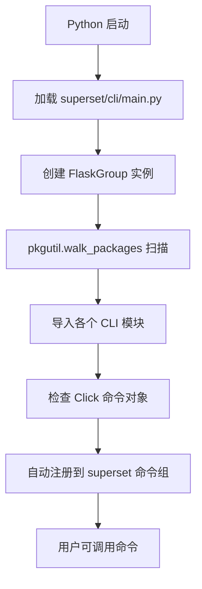

# Superset 学习指南 - Day 2: CLI 深度源码分析

欢迎来到学习第二天！今天我们将深入剖析 Superset 的命令行接口 (CLI) 源码实现、设计思想和调用流程。

## 1. CLI 架构深度解析

### 1.1 模块化设计思想

Superset 的 CLI 采用了高度模块化的设计，体现了"关注点分离"和"开放封闭原则"：

```
superset/cli/
├── main.py           # CLI 主入口，负责命令发现和注册
├── lib.py            # 公共工具函数
├── examples.py       # 示例数据相关命令
├── importexport.py   # 导入导出功能
├── test.py           # 测试相关命令
├── reset.py          # 重置功能
├── update.py         # 更新相关命令
├── thumbnails.py     # 缩略图生成
├── viz_migrations.py # 可视化迁移
└── test_db.py        # 数据库测试
```

### 1.2 核心设计模式分析

#### 1.2.1 命令发现模式 (Command Discovery Pattern)

在 `superset/cli/main.py` 中，使用了动态命令发现机制：

```python
# 自动发现并注册所有 CLI 命令
for load, module_name, is_pkg in pkgutil.walk_packages(
    cli.__path__, cli.__name__ + "."
):
    module = importlib.import_module(module_name)
    for attribute in module.__dict__.values():
        if isinstance(attribute, (click.core.Command, click.core.Group)):
            superset.add_command(attribute)
            if isinstance(attribute, click.core.Group):
                break
```

**设计思想**：
- **插件式架构**：新命令只需在 `cli/` 目录下创建文件即可自动被发现
- **零配置**：无需手动注册命令，降低维护成本
- **类型安全**：通过 `isinstance` 检查确保只注册有效的命令对象

#### 1.2.2 应用上下文注入模式

所有 CLI 命令都使用 `@with_appcontext` 装饰器：

```python
@superset.command()
@with_appcontext
@transaction()
def init() -> None:
    """Inits the Superset application"""
    appbuilder.add_permissions(update_perms=True)
    security_manager.sync_role_definitions()
```

**设计思想**：
- **依赖注入**：自动注入 Flask 应用上下文
- **事务管理**：通过 `@transaction()` 确保数据一致性
- **资源管理**：自动管理数据库连接和应用状态

### 1.3 扩展集成架构

#### Flask-Migrate 集成分析

```python
# superset/extensions/__init__.py
from flask_migrate import Migrate
migrate = Migrate()

# 在应用初始化时关联
def init_app(app: Flask) -> None:
    migrate.init_app(app, db)
```

**调用链分析**：
1. `superset db upgrade` 命令调用
2. Flask-Migrate 读取 `migrations/` 目录
3. 执行未应用的迁移脚本
4. 更新数据库 schema 版本

## 2. 关键命令源码深度分析

### 2.1 `load_examples` 命令实现剖析

让我们深入分析 `superset/cli/examples.py` 的实现：

```python
@click.command()
@with_appcontext
@click.option("--load-test-data", is_flag=True, help="Load additional test data")
@click.option("--only-metadata", is_flag=True, help="Only load metadata")
def load_examples(load_test_data: bool, only_metadata: bool) -> None:
    """Loads a set of Slices and Dashboards and a supporting dataset"""
    print("Loading examples into {}".format(db.engine.url))
    
    # 1. 加载数据源
    load_birth_names()
    load_energy()
    load_world_bank_health_n_pop()
    # ... 更多数据源
    
    # 2. 创建切片 (Slices/Charts)
    create_slices()
    
    # 3. 创建仪表盘
    create_dashboards()
```

**执行流程分析**：

1. **数据源创建阶段**：
   ```python
   def load_birth_names():
       # 检查数据源是否已存在
       if not (db.session.query(SqlaTable).filter_by(table_name="birth_names").first()):
           # 创建数据库表
           # 插入示例数据
           # 创建 SqlaTable 元数据对象
   ```

2. **切片创建阶段**：
   ```python
   def create_slices():
       # 遍历预定义的图表配置
       for slice_data in SLICE_CONFIGS:
           # 创建 Slice 对象
           # 设置查询参数和可视化类型
           # 保存到数据库
   ```

3. **仪表盘创建阶段**：
   ```python
   def create_dashboards():
       # 创建 Dashboard 对象
       # 关联相关的 Slices
       # 设置布局和样式
   ```

### 2.2 `init` 命令权限同步机制

```python
@superset.command()
@with_appcontext
@transaction()
def init() -> None:
    """Inits the Superset application"""
    # 1. 同步权限定义
    appbuilder.add_permissions(update_perms=True)
    
    # 2. 同步角色定义
    security_manager.sync_role_definitions()
```

**权限同步的调用链**：

1. **`appbuilder.add_permissions()`**：
   ```python
   # flask_appbuilder/security/manager.py
   def add_permissions(self, update_perms=False):
       # 扫描所有视图类
       for view in self.baseviews:
           # 提取权限定义
           permissions = view.base_permissions
           # 同步到数据库
           self.add_permissions_view(permissions, view.class_name)
   ```

2. **`security_manager.sync_role_definitions()`**：
   ```python
   # superset/security/manager.py
   def sync_role_definitions(self):
       # 遍历预定义角色
       for role_name, role_config in BUILTIN_ROLES.items():
           # 创建或更新角色
           # 分配权限给角色
   ```

## 3. CLI 命令执行流程深度分析

### 3.1 完整的调用栈分析

以 `superset run` 命令为例：

```
用户执行: superset run -p 8088
    ↓
1. Python 解释器加载 superset 包
    ↓
2. 执行 superset/__init__.py 中的应用工厂
    ↓
3. Click 框架解析命令行参数
    ↓
4. Flask-CLI 的 FlaskGroup 处理 run 命令
    ↓
5. 调用 Flask 的 run() 方法
    ↓
6. 启动 Werkzeug 开发服务器
    ↓
7. 每个请求触发应用上下文创建
```

### 3.2 命令注册流程图



## 4. 核心命令详细调用流程

### 4.1 `superset init` 完整调用链

```python
# 1. CLI 入口
superset.command()(init)

# 2. Flask 应用上下文创建
@with_appcontext

# 3. 数据库事务管理
@transaction()

# 4. 权限同步
def init():
    # 4.1 扫描所有视图类，提取权限定义
    appbuilder.add_permissions(update_perms=True)
    
    # 4.2 同步内置角色定义
    security_manager.sync_role_definitions()
```

**详细执行步骤**：

1. **权限发现阶段**：
   ```python
   # 扫描 superset/views/ 下的所有视图类
   views = [DashboardRestApi, ChartRestApi, DatabaseView, ...]
   for view_class in views:
       permissions = view_class.base_permissions
       # ['can_read', 'can_write', 'can_delete', ...]
   ```

2. **权限同步阶段**：
   ```python
   # 检查数据库中是否存在这些权限
   for permission in permissions:
       db_permission = session.query(Permission).filter_by(name=permission).first()
       if not db_permission:
           # 创建新权限
           new_permission = Permission(name=permission)
           session.add(new_permission)
   ```

3. **角色同步阶段**：
   ```python
   # 同步内置角色：Admin, Alpha, Gamma, etc.
   for role_name, role_config in BUILTIN_ROLES.items():
       role = session.query(Role).filter_by(name=role_name).first()
       if not role:
           role = Role(name=role_name)
       
       # 分配权限给角色
       for permission_name in role_config['permissions']:
           permission = session.query(Permission).filter_by(name=permission_name).first()
           role.permissions.append(permission)
   ```

### 4.2 `superset load_examples` 数据流分析

```python
# 执行顺序和数据依赖关系
load_examples()
├── load_birth_names()          # 创建 birth_names 表和数据
├── load_energy()               # 创建 energy_usage 表和数据  
├── load_world_bank_health_n_pop() # 创建 world_bank 表和数据
├── create_slices()             # 基于上述表创建图表
└── create_dashboards()         # 组合图表创建仪表盘
```

**数据创建流程**：

```python
def load_birth_names():
    # 1. 检查表是否已存在
    table = db.session.query(SqlaTable).filter_by(table_name="birth_names").first()
    if table:
        return
    
    # 2. 创建物理表
    df = pd.read_csv('birth_names.csv')
    df.to_sql('birth_names', con=db.engine, if_exists='replace', index=False)
    
    # 3. 创建 Superset 元数据对象
    table = SqlaTable(
        table_name='birth_names',
        database=get_example_database(),
        schema=None
    )
    
    # 4. 添加列信息
    for column_name, column_type in df.dtypes.items():
        column = TableColumn(
            column_name=column_name,
            type=str(column_type),
            table=table
        )
        table.columns.append(column)
    
    # 5. 保存到数据库
    db.session.add(table)
    db.session.commit()
```

## 5. 扩展点和自定义机制

### 5.1 自定义命令开发模式

创建 `superset/cli/custom.py`：

```python
import click
from flask.cli import with_appcontext
from superset.extensions import db
from superset.utils.decorators import transaction

@click.command()
@with_appcontext
@transaction()
@click.option('--dry-run', is_flag=True, help='Preview changes without executing')
@click.option('--verbose', '-v', is_flag=True, help='Enable verbose output')
def cleanup_orphaned_data(dry_run: bool, verbose: bool) -> None:
    """清理孤立的数据记录"""
    
    # 查找孤立的切片（没有关联仪表盘的图表）
    orphaned_slices = db.session.query(Slice).filter(
        ~Slice.dashboards.any()
    ).all()
    
    if verbose:
        click.echo(f"发现 {len(orphaned_slices)} 个孤立切片")
    
    if not dry_run:
        for slice_obj in orphaned_slices:
            db.session.delete(slice_obj)
        db.session.commit()
        click.echo(f"已删除 {len(orphaned_slices)} 个孤立切片")
    else:
        click.echo("这是预览模式，不会实际删除数据")
```

**自动注册**：由于命令发现机制，这个命令会自动注册为 `superset cleanup-orphaned-data`。

### 5.2 命令组扩展模式

```python
@click.group()
def maintenance():
    """数据维护相关命令组"""
    pass

@maintenance.command()
@with_appcontext
def check_integrity():
    """检查数据完整性"""
    pass

@maintenance.command() 
@with_appcontext
def optimize_database():
    """优化数据库性能"""
    pass
```

## 6. 性能优化和最佳实践

### 6.1 批量操作优化

```python
@click.command()
@with_appcontext
def bulk_update_example():
    """批量更新示例，避免 N+1 查询问题"""
    
    # 错误做法：N+1 查询
    # for dashboard in dashboards:
    #     dashboard.owner = new_owner  # 每次都会触发数据库查询
    
    # 正确做法：批量更新
    db.session.query(Dashboard).filter(
        Dashboard.created_by_fk.is_(None)
    ).update({
        Dashboard.created_by_fk: admin_user.id
    })
    db.session.commit()
```

### 6.2 错误处理和日志记录

```python
import logging
from sqlalchemy.exc import SQLAlchemyError

logger = logging.getLogger(__name__)

@click.command()
@with_appcontext
def robust_command():
    """展示错误处理最佳实践"""
    try:
        # 业务逻辑
        perform_database_operations()
        
    except SQLAlchemyError as e:
        logger.error(f"数据库操作失败: {e}")
        db.session.rollback()
        click.echo("数据库操作失败，已回滚事务", err=True)
        raise click.Abort()
        
    except Exception as e:
        logger.exception(f"未预期的错误: {e}")
        click.echo(f"命令执行失败: {e}", err=True)
        raise
```

## 7. 调试技巧深度指南

### 7.1 CLI 命令调试环境设置

```python
# 开发时的调试配置
@click.command()
@with_appcontext
@click.option('--debug', is_flag=True, help='Enable debug mode')
def debug_command(debug: bool):
    """调试模式示例"""
    if debug:
        import pdb
        pdb.set_trace()
        
        # 或者使用 ipdb（更强大的调试器）
        # import ipdb
        # ipdb.set_trace()
    
    # 使用日志进行调试
    logger = logging.getLogger(__name__)
    logger.setLevel(logging.DEBUG if debug else logging.INFO)
    
    logger.debug("开始执行调试命令")
    # 命令逻辑
    logger.debug("命令执行完成")
```

### 7.2 性能分析工具

```python
import time
import cProfile
import io
import pstats

@click.command()
@with_appcontext
@click.option('--profile', is_flag=True, help='Enable profiling')
def performance_command(profile: bool):
    """性能分析示例"""
    if profile:
        pr = cProfile.Profile()
        pr.enable()
    
    start_time = time.time()
    
    # 执行业务逻辑
    execute_business_logic()
    
    execution_time = time.time() - start_time
    click.echo(f"执行时间: {execution_time:.2f} 秒")
    
    if profile:
        pr.disable()
        s = io.StringIO()
        ps = pstats.Stats(pr, stream=s).sort_stats('cumulative')
        ps.print_stats()
        click.echo(s.getvalue())
```

## 总结

Superset 的 CLI 系统展现了现代 Python 应用的最佳实践：

- **模块化设计**：清晰的关注点分离
- **插件架构**：易于扩展和维护  
- **自动发现**：减少配置和样板代码
- **上下文管理**：优雅的资源管理
- **类型安全**：充分利用 Python 的类型系统
- **事务管理**：确保数据一致性
- **错误处理**：健壮的异常处理机制

通过深入理解这些设计模式和实现细节，你不仅能熟练使用 Superset 的 CLI，还能将这些思想应用到自己的项目中。

接下来，请运行 `day2_practice.md` 中的实践练习，亲手验证这些理论知识！ 