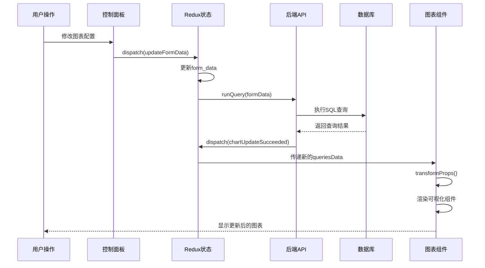
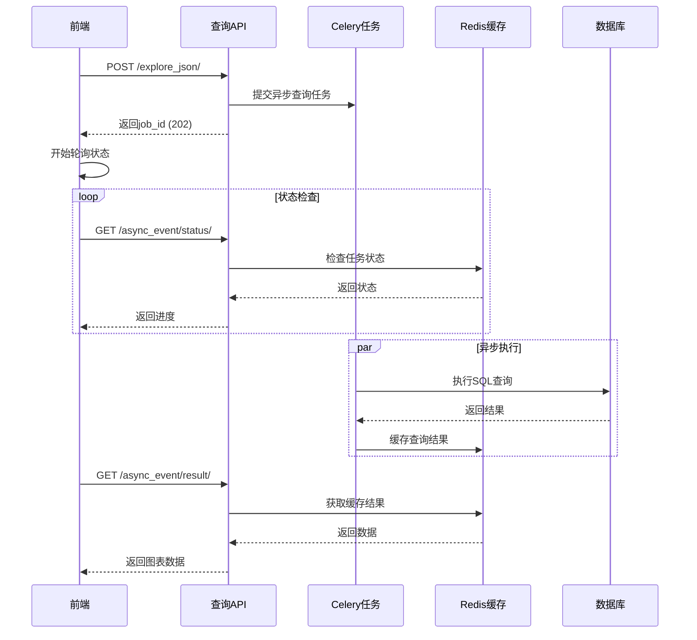
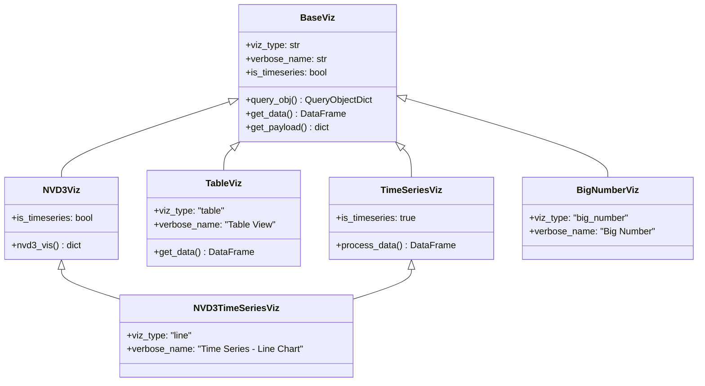
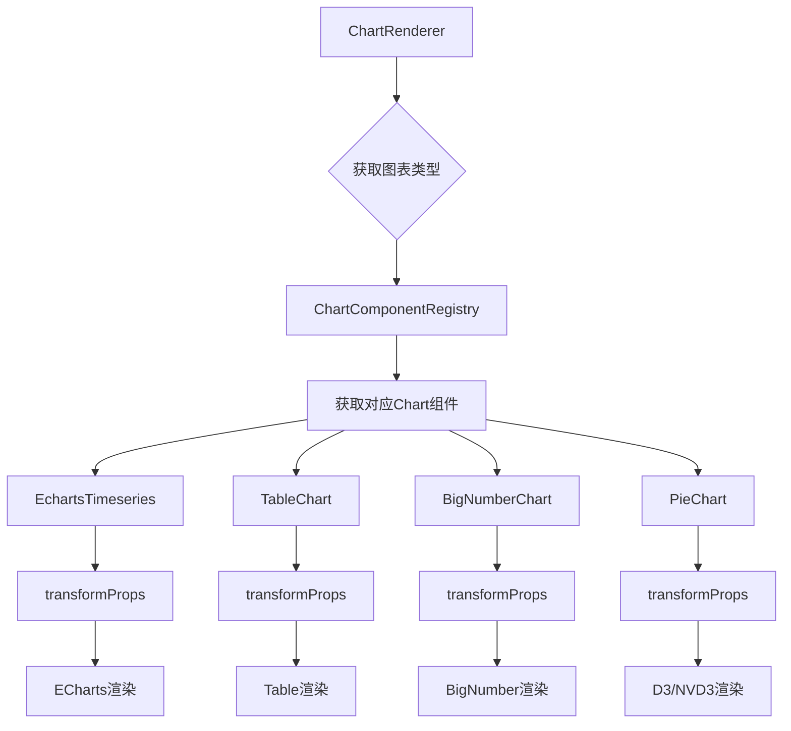

# Day 2: 数据可视化基础 - 源码深度分析

## 1. 图表类型系统源码分析

### 1.1 可视化类型注册机制

#### 图表类型发现与注册
```python
# superset/viz.py - 图表类型基类
class BaseViz:
    """所有可视化类型的基类"""
    viz_type: Optional[str] = None
    verbose_name = "Base Viz"
    credits = ""
    is_timeseries = False
    default_fillna = 0
    cache_type = "df"
    
    def __init__(
        self,
        datasource: BaseDatasource,
        form_data: dict[str, Any],
        force: bool = False,
        force_cached: bool = False,
    ) -> None:
        self.datasource = datasource
        self.form_data = form_data
        self.query_obj = self.query_obj()
        
    def query_obj(self) -> QueryObjectDict:
        """构建查询对象"""
        return QueryObjectDict(
            columns=self.form_data.get("columns", []),
            metrics=self.form_data.get("metrics", []),
            granularity=self.form_data.get("granularity_sqla"),
            from_dttm=self.form_data.get("since"),
            to_dttm=self.form_data.get("until"),
            is_timeseries=self.is_timeseries,
            filter=self.form_data.get("where"),
            extras=self.form_data.get("extras", {}),
        )

# viz_types 注册表
viz_types = {
    "table": TableViz,
    "line": NVD3TimeSeriesViz,
    "bar": NVD3TimeSeriesBarViz,
    "pie": NVD3PieViz,
    "big_number": BigNumberViz,
    "histogram": HistogramViz,
    "box_plot": BoxPlotViz,
    "sunburst": SunburstViz,
    "sankey": SankeyViz,
}
```

### 1.2 图表插件架构分析

#### @superset-ui 插件系统
```typescript
// superset-frontend/packages/superset-ui-core/src/chart/models/ChartPlugin.ts
export interface ChartPlugin {
  metadata: ChartMetadata;
  Chart: ChartType;
  transformProps?: TransformProps;
  buildQuery?: BuildQuery;
  controlPanel?: ControlPanelConfig;
}

export class ChartPlugin {
  constructor(config: ChartPluginConfig) {
    this.metadata = config.metadata;
    this.Chart = config.Chart;
    this.transformProps = config.transformProps;
    this.buildQuery = config.buildQuery;
    this.controlPanel = config.controlPanel;
  }
  
  register(): this {
    getChartMetadataRegistry().registerValue(this.metadata.name, this.metadata);
    getChartComponentRegistry().registerValue(this.metadata.name, this.Chart);
    return this;
  }
}
```

#### ECharts图表插件示例
```typescript
// plugins/plugin-chart-echarts/src/Timeseries/index.ts
export default class EchartsTimeseriesChartPlugin extends ChartPlugin {
  constructor() {
    super({
      metadata: new ChartMetadata({
        name: t('Time-series Chart'),
        description: t('Time-series line chart'),
        datasourceCount: 1,
        supportedAnnotationTypes: [
          AnnotationType.Event,
          AnnotationType.Formula,
          AnnotationType.Interval,
          AnnotationType.Timeseries,
        ],
        tags: [t('ECharts'), t('Time'), t('Trend'), t('Line')],
      }),
      Chart: EchartsTimeseries,
      transformProps: transformProps as TransformProps,
      buildQuery: buildQuery as BuildQuery,
      controlPanel: controlPanel as ControlPanelConfig,
    });
  }
}
```

## 2. 可视化引擎架构分析

### 2.1 前端图表引擎集成

#### Chart组件渲染机制
```typescript
// superset-frontend/src/components/Chart/ChartRenderer.jsx
export default class ChartRenderer extends React.Component {
  renderViz() {
    const {
      width,
      height,
      datasource,
      formData,
      vizType,
    } = this.props;

    // 获取图表组件
    const ChartClass = getChartComponentRegistry().get(vizType);
    
    if (!ChartClass) {
      return (
        <div className="alert alert-danger">
          <strong>ERROR:</strong> Unrecognized visualization type "{vizType}".
        </div>
      );
    }

    // 构建图表属性
    const chartProps = {
      width,
      height,
      datasource,
      formData,
      queriesData: this.state.queriesData,
      rawFormData: formData,
      hooks: this.hooks,
    };

    return <ChartClass {...chartProps} />;
  }

  render() {
    const chartClassName = `superset-chart-${snakeCase(this.props.vizType)}`;
    
    return (
      <div className={chartClassName}>
        {this.renderViz()}
      </div>
    );
  }
}
```

### 2.2 数据变换管道

#### transformProps 数据转换流程
```typescript
// plugins/plugin-chart-echarts/src/Timeseries/transformProps.ts
export default function transformProps(chartProps: ChartProps): EchartsProps {
  const { width, height, formData, queriesData } = chartProps;
  const { data } = queriesData[0];
  
  // 数据预处理
  const rows = data || [];
  const series = extractSeries(rows, {
    fillNeighborValue: formData.fillNeighborValue,
    xAxis: formData.granularity_sqla,
    extraFormData: formData.extra_form_data,
  });
  
  // ECharts配置生成
  const echartOptions: EChartsOption = {
    grid: getDefaultGrid(formData),
    xAxis: {
      type: 'time',
      data: series.map(row => row.timestamp),
    },
    yAxis: {
      type: 'value',
      scale: !formData.zeroImputation,
    },
    series: series.map(serie => ({
      type: 'line',
      name: serie.name,
      data: serie.data,
      smooth: formData.lineInterpolation === 'smooth',
    })),
    tooltip: {
      trigger: 'axis',
      formatter: tooltipFormatter,
    },
  };
  
  return {
    echartOptions,
    width,
    height,
  };
}
```

### 2.3 查询构建器分析

#### buildQuery 查询构建机制
```typescript
// superset-frontend/packages/superset-ui-core/src/query/buildQueryObject.ts
export default function buildQueryObject(formData: QueryFormData): QueryObject {
  const {
    columns = [],
    metrics = [],
    groupby = [],
    granularity_sqla,
    time_grain_sqla,
    since,
    until,
    filters = [],
    having = '',
    where = '',
    limit = 10000,
    timeseries_limit = 0,
    order_desc = true,
    extras = {},
  } = formData;

  const queryObject: QueryObject = {
    datasource: formData.datasource,
    columns: ensureIsArray(columns),
    metrics: ensureIsArray(metrics),
    groupby: ensureIsArray(groupby),
    granularity: granularity_sqla,
    time_grain: time_grain_sqla,
    from_dttm: since,
    to_dttm: until,
    filters: filters.map(filter => ({
      col: filter.col,
      op: filter.op,
      val: filter.val,
    })),
    having,
    where,
    limit,
    timeseries_limit,
    order_desc,
    extras,
    is_timeseries: formData.viz_type && isTimeseriesChart(formData.viz_type),
  };

  return queryObject;
}
```

## 3. 图表渲染管道源码分析

### 3.1 探索页面数据流

#### 探索页面状态管理
```typescript
// superset-frontend/src/explore/reducers/exploreReducer.js
export default function exploreReducer(state = {}, action) {
  switch (action.type) {
    case CHART_UPDATE_STARTED:
      return {
        ...state,
        chartUpdateStartTime: now(),
        chartUpdateEndTime: null,
        chartStatus: 'loading',
        latestQueryFormData: action.queryFormData,
      };
      
    case CHART_UPDATE_SUCCEEDED:
      return {
        ...state,
        chartUpdateEndTime: now(),
        chartStatus: 'success',
        queriesResponse: action.queriesResponse,
        chartAlert: null,
      };
      
    case CHART_UPDATE_FAILED:
      return {
        ...state,
        chartUpdateEndTime: now(),
        chartStatus: 'failed',
        chartAlert: action.queryResponse.error,
      };
      
    case UPDATE_CHART_FORM_DATA:
      return {
        ...state,
        form_data: {
          ...state.form_data,
          ...action.formData,
        },
      };
      
    default:
      return state;
  }
}
```

### 3.2 异步查询处理

#### Chart数据获取机制
```typescript
// superset-frontend/src/chart/chartAction.js
export function runQuery(
  formData,
  force = false,
  timeout = 60,
  key,
  dashboardId,
  ownState,
) {
  return function (dispatch, getState) {
    const { explore } = getState();
    const chartKey = key || explore.slice?.slice_id || 0;
    
    dispatch(chartUpdateStarted(query, latestQueryFormData, chartKey));
    
    const queryParams = {
      ...query,
      force,
      result_type: 'full',
      result_format: 'json',
    };
    
    return SupersetClient.post({
      endpoint: '/superset/explore_json/',
      postPayload: { form_data: formData },
      parseMethod: 'json-bigint',
      timeout: timeout * 1000,
    })
    .then(({ json }) => {
      if (json.errors && json.errors.length > 0) {
        dispatch(chartUpdateFailed(json.errors, chartKey));
      } else {
        dispatch(chartUpdateSucceeded(json, chartKey));
      }
      return json;
    })
    .catch(error => {
      dispatch(chartUpdateFailed([error.toString()], chartKey));
      throw error;
    });
  };
}
```

### 3.3 后端查询执行流程

#### explore_json API处理
```python
# superset/views/core.py - Superset类
@api
@has_access_api
@handle_api_exception
@event_logger.log_this
@expose("/explore_json/<datasource_type>/<int:datasource_id>/", methods=("GET", "POST"))
@check_resource_permissions(check_datasource_perms)
def explore_json(self, datasource_type: str | None = None, datasource_id: int | None = None) -> FlaskResponse:
    """图表数据API端点"""
    
    response_type = ChartDataResultFormat.JSON
    result_type = ChartDataResultType.FULL
    
    try:
        datasource_id, datasource_type = get_datasource_info(
            datasource_id, datasource_type, form_data
        )
        
        # 异步查询处理
        if is_feature_enabled("GLOBAL_ASYNC_QUERIES") and response_type == ChartDataResultFormat.JSON:
            try:
                viz_obj = get_viz(
                    datasource_type=cast(str, datasource_type),
                    datasource_id=datasource_id,
                    form_data=form_data,
                    force_cached=True,
                    force=force,
                )
                payload = viz_obj.get_payload()
                if payload is not None:
                    return self.send_data_payload_response(viz_obj, payload)
            except CacheLoadError:
                pass
                
            # 提交异步任务
            async_channel_id = async_query_manager.parse_channel_id_from_request(request)
            job_metadata = async_query_manager.submit_explore_json_job(
                async_channel_id, form_data, response_type, force, get_user_id()
            )
            return json_success(json.dumps(job_metadata), status=202)
        
        # 同步查询处理
        viz_obj = get_viz(
            datasource_type=cast(str, datasource_type),
            datasource_id=datasource_id,
            form_data=form_data,
            force=force,
        )
        
        return self.send_data_payload_response(viz_obj, viz_obj.get_payload())
        
    except SupersetException as ex:
        return json_error_response(utils.error_msg_from_exception(ex), status=400)
```

## 4. 控制面板配置系统

### 4.1 控制面板架构

#### Control Panel 配置结构
```typescript
// superset-frontend/packages/superset-ui-chart-controls/src/types.ts
export interface ControlPanelConfig {
  controlPanelSections: ControlPanelSection[];
  onInit?: (state: ControlStateMapping) => void;
  formDataOverrides?: (formData: QueryFormData) => QueryFormData;
}

export interface ControlPanelSection {
  label: string;
  expanded?: boolean;
  controlSetRows: (Control | Control[])[];
  description?: string;
  tabOverride?: string;
}

export interface Control {
  name: string;
  type: ControlType;
  label?: string;
  description?: string;
  default?: any;
  choices?: [any, string][];
  validators?: Validator[];
  mapStateToProps?: (state: any) => Partial<Control>;
}
```

#### 时间序列图表控制面板
```typescript
// plugins/plugin-chart-echarts/src/Timeseries/controlPanel.tsx
const config: ControlPanelConfig = {
  controlPanelSections: [
    {
      label: t('Query'),
      expanded: true,
      controlSetRows: [
        ['metrics'],
        ['adhoc_filters'],
        ['groupby'],
        ['limit', 'timeseries_limit_metric'],
        ['order_desc'],
      ],
    },
    {
      label: t('Chart Options'),
      expanded: true,
      controlSetRows: [
        ['color_scheme'],
        [
          {
            name: 'line_interpolation',
            config: {
              type: 'SelectControl',
              label: t('Line interpolation'),
              choices: [
                ['linear', t('Linear')],
                ['smooth', t('Smooth')],
                ['step-before', t('Step - before')],
                ['step-after', t('Step - after')],
              ],
              default: 'linear',
              description: t('Line interpolation as defined by d3.js'),
            },
          },
        ],
        ['show_legend', 'legend_type', 'legend_margin'],
        [
          {
            name: 'rich_tooltip',
            config: {
              type: 'CheckboxControl',
              label: t('Rich tooltip'),
              default: true,
              description: t('Shows a list of all series available at that point in time'),
            },
          },
        ],
      ],
    },
    {
      label: t('X Axis'),
      expanded: true,
      controlSetRows: [
        ['x_axis_label'],
        ['bottom_margin'],
        ['x_axis_showminmax'],
        ['x_axis_format'],
      ],
    },
    {
      label: t('Y Axis'),
      expanded: true,
      controlSetRows: [
        ['y_axis_label'],
        ['left_margin'],
        ['y_axis_showminmax'],
        ['y_axis_format'],
        ['currency_format'],
        ['y_log_scale'],
        ['y_axis_bounds'],
      ],
    },
  ],
  onInit(state: ControlStateMapping) {
    return {
      ...state,
      time_grain_sqla: {
        ...state.time_grain_sqla,
        value: state.datasource?.main_dttm_col?.python_date_format,
      },
    };
  },
};
```

### 4.2 控件系统源码分析

#### 基础控件组件
```typescript
// superset-frontend/src/explore/components/controls/SelectControl/SelectControl.tsx
interface SelectControlProps {
  choices: [any, string][];
  clearable?: boolean;
  description?: string;
  disabled?: boolean;
  freeForm?: boolean;
  isLoading?: boolean;
  label?: string;
  multi?: boolean;
  name: string;
  onChange?: (value: any) => void;
  placeholder?: string;
  value?: any;
  valueKey?: string;
  valueRenderer?: (option: any) => ReactNode;
}

export default function SelectControl({
  choices = [],
  description,
  disabled = false,
  freeForm = false,
  isLoading = false,
  label,
  multi = false,
  name,
  onChange,
  placeholder,
  value,
  ...props
}: SelectControlProps) {
  const options = choices.map(([value, label]) => ({
    value,
    label,
  }));

  const handleChange = (selection: any) => {
    let newValue;
    if (multi) {
      newValue = selection ? selection.map(option => option.value) : [];
    } else {
      newValue = selection ? selection.value : null;
    }
    
    if (onChange) {
      onChange(newValue);
    }
  };

  return (
    <div>
      {label && <Label>{label}</Label>}
      <Select
        aria-label={label}
        clearable
        disabled={disabled}
        isLoading={isLoading}
        isMulti={multi}
        name={name}
        onChange={handleChange}
        options={options}
        placeholder={placeholder}
        value={multi ? 
          options.filter(option => value && value.includes(option.value)) :
          options.find(option => option.value === value)
        }
        {...props}
      />
      {description && <FormText>{description}</FormText>}
    </div>
  );
}
```

## 5. 数据处理流程分析

### 5.1 查询对象构建

#### QueryObject 到 SQL 转换
```python
# superset/connectors/sqla/models.py - SqlaTable类
def get_sqla_query(
    self,
    columns: list[Column] = None,
    filter: list[QueryObjectDict] = None,
    from_dttm: datetime | None = None,
    to_dttm: datetime | None = None,
    groupby: list[Column] = None,
    metrics: list[Metric] = None,
    granularity: Column | None = None,
    **kwargs,
) -> Query:
    """构建SQLAlchemy查询对象"""
    
    qry = select(columns)
    qry = qry.select_from(self.get_from_clause())
    
    # 应用时间过滤
    if granularity:
        dttm_col = self.get_column(granularity)
        if dttm_col:
            if from_dttm:
                qry = qry.where(dttm_col >= from_dttm)
            if to_dttm:
                qry = qry.where(dttm_col <= to_dttm)
    
    # 应用WHERE过滤
    if filter:
        for flt in filter:
            qry = qry.where(self._get_filter_clause(flt))
    
    # 应用GROUP BY
    if groupby:
        qry = qry.group_by(*groupby)
    
    # 应用指标聚合
    if metrics:
        for metric in metrics:
            qry = qry.column(self._get_metric_expr(metric))
    
    return qry

def get_query_str(self, query_obj: QueryObjectDict) -> str:
    """获取查询SQL字符串"""
    qry = self.get_sqla_query(**query_obj)
    sql = str(qry.compile(
        dialect=self.database.get_dialect(),
        compile_kwargs={"literal_binds": True}
    ))
    return sql
```

### 5.2 数据格式化处理

#### 数据预处理管道
```python
# superset/utils/pandas_postprocessing.py
def pivot(
    df: DataFrame,
    index: list[str],
    columns: list[str],
    metric_fill_value: Any = None,
    aggregates: dict[str, str] | None = None,
    drop_missing_columns: bool = True,
    combine_value_with_metric: bool = False,
    flatten_columns: bool = True,
    reset_index: bool = True,
) -> DataFrame:
    """数据透视表后处理"""
    
    if not index + columns:
        raise InvalidPostProcessingError("Pivot operation requires at least one index or column")
    
    aggregation_func = aggregates or {}
    df_pivot = df.pivot_table(
        index=index,
        columns=columns,
        values=df.columns.difference(index + columns).tolist(),
        aggfunc=aggregation_func,
        fill_value=metric_fill_value,
        dropna=drop_missing_columns,
    )
    
    if flatten_columns:
        df_pivot.columns = [
            " ".join([str(col) for col in multi_col if col != ""])
            for multi_col in df_pivot.columns.values
        ]
    
    if reset_index:
        df_pivot = df_pivot.reset_index()
    
    return df_pivot

def sort(
    df: DataFrame,
    columns: dict[str, bool],
    **kwargs: Any,
) -> DataFrame:
    """数据排序后处理"""
    return df.sort_values(
        by=list(columns.keys()),
        ascending=list(columns.values()),
    )
```

## 6. 可视化渲染时序图

### 6.1 完整图表渲染流程



### 6.2 异步查询处理流程



## 7. 图表类型架构图

### 7.1 可视化继承层次



### 7.2 前端图表组件架构



## 8. 重点难点分析

### 8.1 技术难点

1. **多引擎兼容性**：需要统一不同可视化库的API
2. **性能优化**：大数据集的渲染性能问题
3. **响应式设计**：不同屏幕尺寸的适配
4. **交互一致性**：不同图表类型的交互体验统一

### 8.2 数据处理挑战

1. **数据变换**：复杂的数据透视和聚合操作
2. **内存管理**：大数据集的前端处理
3. **缓存策略**：查询结果的有效缓存
4. **实时更新**：数据变化的及时反映

### 8.3 架构设计考虑

1. **插件化架构**：支持第三方图表类型扩展
2. **配置驱动**：通过配置而非代码定制图表
3. **类型安全**：TypeScript确保配置的正确性
4. **向后兼容**：支持旧版本图表配置的迁移

这个源码分析展示了Superset可视化系统的完整架构，从图表类型定义到渲染管道，从控制面板到数据处理，体现了现代数据可视化平台的设计精髓。 