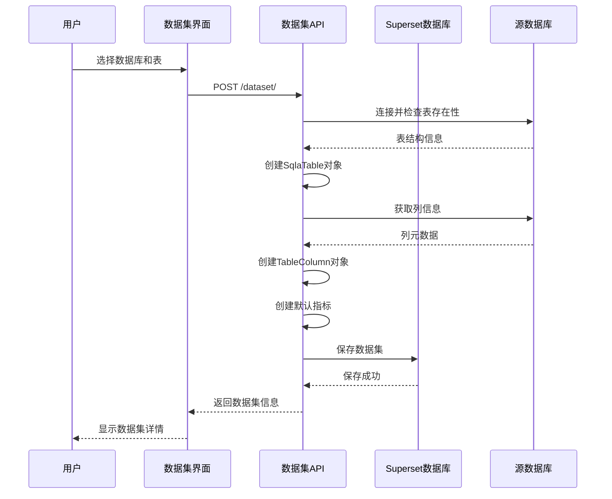
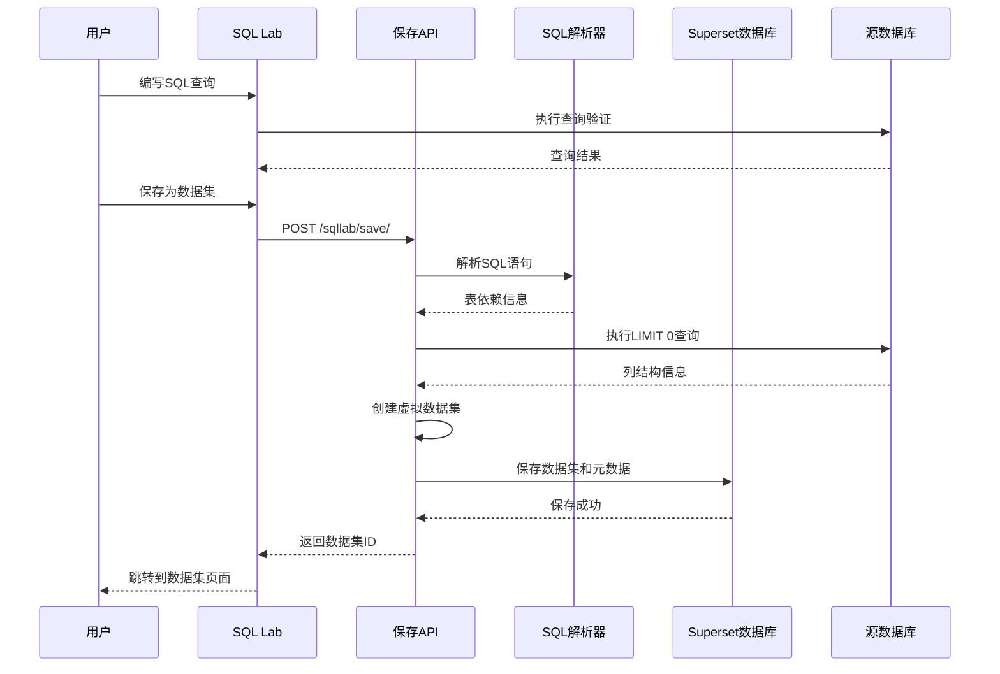
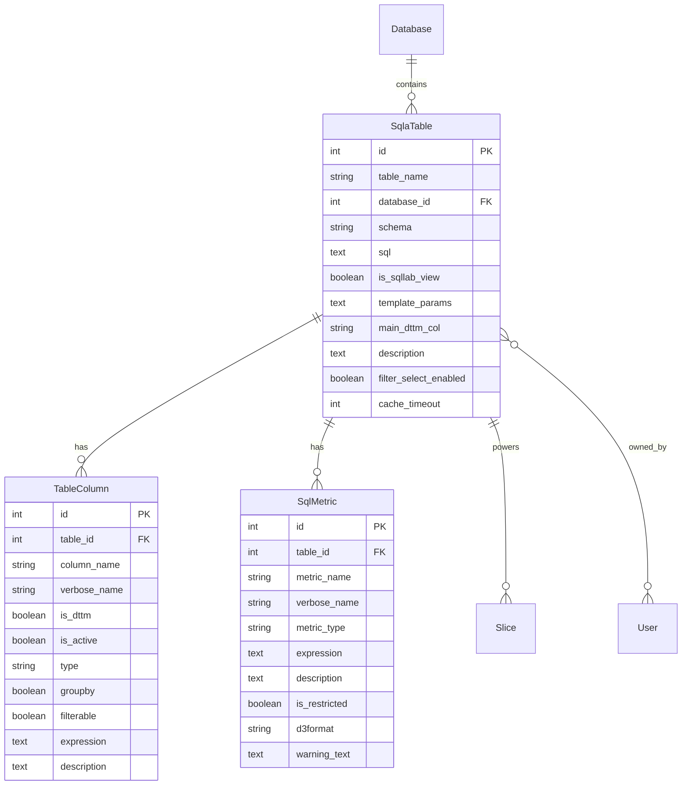

# Day 4: 数据集管理与建模 - 源码深度分析

## 1. 数据集模型架构源码分析

### 1.1 SqlaTable 核心模型实现

#### 数据集基础模型
```python
# superset/connectors/sqla/models.py
class SqlaTable(Model, BaseDatasource, ExploreMixin):
    """SQL数据表模型 - Superset的核心数据源"""
    
    __tablename__ = "tables"
    
    # 基础字段
    id = Column(Integer, primary_key=True)
    table_name = Column(String(250), nullable=False)
    main_dttm_col = Column(String(250))
    database_id = Column(Integer, ForeignKey("dbs.id"), nullable=False)
    fetch_values_predicate = Column(Text)
    owners = relationship(security_manager.user_model, secondary=sqlatable_user)
    database = relationship("Database", backref="tables")
    
    # SQL配置
    sql = Column(Text)  # 自定义SQL查询
    is_sqllab_view = Column(Boolean, default=False)
    template_params = Column(Text)
    
    # 数据源配置
    schema = Column(String(255))
    description = Column(Text)
    default_endpoint = Column(Text)
    filter_select_enabled = Column(Boolean, default=True)
    
    # 缓存配置
    cache_timeout = Column(Integer)
    
    # 权限配置
    perm = Column(String(1000))
    schema_perm = Column(String(1000))
    
    # 关联关系
    columns = relationship(
        "TableColumn",
        cascade="all, delete-orphan",
        backref="table",
    )
    metrics = relationship(
        "SqlMetric",
        cascade="all, delete-orphan",
        backref="table",
    )
    
    @property
    def type(self) -> str:
        return "table"
    
    @property
    def datasource_name(self) -> str:
        return self.table_name
    
    @property
    def link(self) -> Markup:
        name = escape(self.table_name)
        anchor = f'<a target="_blank" href="{self.explore_url}">{name}</a>'
        return Markup(anchor)
    
    @property
    def full_name(self) -> str:
        """获取完整表名，包含schema"""
        if self.schema:
            return f"{self.schema}.{self.table_name}"
        return self.table_name
    
    @property
    def dttm_cols(self) -> list[str]:
        """获取时间维度列"""
        return [col.column_name for col in self.columns if col.is_dttm]
    
    @property
    def num_cols(self) -> list[str]:
        """获取数值列"""
        return [col.column_name for col in self.columns if col.is_numeric]
    
    @property
    def any_dttm_col(self) -> str | None:
        """获取默认时间列"""
        if self.main_dttm_col:
            return self.main_dttm_col
        dttm_cols = self.dttm_cols
        return dttm_cols[0] if dttm_cols else None
```

### 1.2 表列模型详细分析

#### TableColumn 列定义模型
```python
# superset/connectors/sqla/models.py
class TableColumn(Model, BaseColumn, ExploreMixin):
    """表列模型 - 定义数据集的字段属性"""
    
    __tablename__ = "table_columns"
    
    # 基础字段
    id = Column(Integer, primary_key=True)
    table_id = Column(Integer, ForeignKey("tables.id"))
    column_name = Column(String(255), nullable=False)
    verbose_name = Column(String(1024))
    is_dttm = Column(Boolean, default=False)
    is_active = Column(Boolean, default=True)
    type = Column(String(32))
    groupby = Column(Boolean, default=True)
    filterable = Column(Boolean, default=True)
    description = Column(Text)
    
    # 高级配置
    expression = Column(Text)  # 计算列表达式
    extra = Column(Text)       # 额外配置
    python_date_format = Column(String(255))
    
    @property
    def is_numeric(self) -> bool:
        """判断是否为数值类型"""
        return self.type and self.type.upper() in {
            "INT", "INTEGER", "BIGINT", "DECIMAL", "NUMERIC",
            "FLOAT", "DOUBLE", "REAL", "MONEY"
        }
    
    @property
    def is_string(self) -> bool:
        """判断是否为字符串类型"""
        return self.type and self.type.upper() in {
            "VARCHAR", "CHAR", "TEXT", "STRING", "NVARCHAR", "NCHAR"
        }
    
    def get_sqla_col(self, label: str | None = None) -> Column:
        """获取SQLAlchemy列对象"""
        label = label or self.column_name
        
        # 处理表达式列
        if self.expression:
            col = literal_column(self.expression)
        else:
            col = column(self.column_name)
        
        # 处理时间列格式化
        if self.is_dttm and self.python_date_format:
            col = self.table.database.db_engine_spec.epoch_to_dttm().format(col=col)
        
        return col.label(label)
    
    @property
    def data(self) -> dict[str, Any]:
        """序列化列数据"""
        return {
            "id": self.id,
            "column_name": self.column_name,
            "verbose_name": self.verbose_name,
            "type": self.type,
            "groupby": self.groupby,
            "filterable": self.filterable,
            "is_dttm": self.is_dttm,
            "expression": self.expression,
            "description": self.description,
            "python_date_format": self.python_date_format,
        }
```

### 1.3 指标模型实现

#### SqlMetric 指标定义
```python
# superset/connectors/sqla/models.py
class SqlMetric(Model, BaseMetric, ExploreMixin):
    """SQL指标模型 - 定义聚合计算逻辑"""
    
    __tablename__ = "sql_metrics"
    
    # 基础字段
    id = Column(Integer, primary_key=True)
    metric_name = Column(String(255), nullable=False)
    verbose_name = Column(String(1024))
    metric_type = Column(String(32))
    table_id = Column(Integer, ForeignKey("tables.id"))
    expression = Column(Text, nullable=False)
    description = Column(Text)
    is_restricted = Column(Boolean, default=False, nullable=False)
    d3format = Column(String(128))
    extra = Column(Text)
    warning_text = Column(Text)
    
    @property
    def perm(self) -> str | None:
        """指标权限标识"""
        if self.table:
            return f"{self.table.perm}.{self.metric_name}"
        return None
    
    def get_sqla_col(self, label: str | None = None) -> Column:
        """获取SQLAlchemy列对象"""
        label = label or self.metric_name
        
        # 解析表达式
        try:
            # 简单表达式（如COUNT(*)）
            if self.expression.upper().startswith(('COUNT', 'SUM', 'AVG', 'MIN', 'MAX')):
                col = literal_column(self.expression)
            else:
                # 复杂表达式，可能包含子查询
                col = text(self.expression)
            
            return col.label(label)
            
        except Exception as ex:
            logger.warning("Failed to parse metric expression: %s", self.expression)
            raise ValueError(f"Invalid metric expression: {self.expression}") from ex
    
    @property
    def data(self) -> dict[str, Any]:
        """序列化指标数据"""
        return {
            "id": self.id,
            "metric_name": self.metric_name,
            "verbose_name": self.verbose_name,
            "metric_type": self.metric_type,
            "expression": self.expression,
            "description": self.description,
            "d3format": self.d3format,
            "is_restricted": self.is_restricted,
            "warning_text": self.warning_text,
        }

    @classmethod
    def get_metrics(
        cls,
        table: SqlaTable,
        include_time_series: bool = True,
    ) -> list["SqlMetric"]:
        """获取表的所有指标"""
        query = db.session.query(cls).filter(cls.table_id == table.id)
        
        if not include_time_series:
            query = query.filter(cls.is_restricted == False)
        
        return query.all()
```

## 2. 虚拟数据集实现

### 2.1 SQL Lab 到数据集转换

#### SQL查询保存为数据集
```python
# superset/views/sql_lab/views.py
class SavedQueryView(BaseSupersetView, DeleteMixin):
    """保存的查询视图"""
    
    @expose("/save/", methods=["POST"])
    @has_access
    @permission_name("write")
    @event_logger.log_this
    def save(self) -> FlaskResponse:
        """保存SQL查询为数据集"""
        
        sql = request.form.get("sql", "").strip()
        database_id = request.form.get("database_id")
        schema = request.form.get("schema")
        datasource_name = request.form.get("datasource_name")
        
        if not sql or not database_id:
            return json_error_response("Missing required fields")
        
        try:
            # 验证SQL语法
            database = db.session.get(Database, database_id)
            if not database:
                return json_error_response("Database not found")
            
            # 创建虚拟数据集
            table = SqlaTable(
                table_name=datasource_name,
                database=database,
                schema=schema,
                sql=sql,
                is_sqllab_view=True,
                template_params=request.form.get("template_params", ""),
            )
            
            # 推断列信息
            self._infer_table_columns(table)
            
            # 保存到数据库
            db.session.add(table)
            db.session.commit()
            
            # 添加权限
            security_manager.add_permission_view_menu("datasource_access", table.perm)
            
            return json_success({
                "table_id": table.id,
                "datasource_name": table.datasource_name,
            })
            
        except Exception as ex:
            logger.exception("Failed to save SQL as dataset")
            return json_error_response(str(ex))
    
    def _infer_table_columns(self, table: SqlaTable) -> None:
        """推断表列信息"""
        try:
            # 执行LIMIT 0查询获取列信息
            with table.database.get_sqla_engine() as engine:
                limited_sql = f"SELECT * FROM ({table.sql}) AS query LIMIT 0"
                result = engine.execute(text(limited_sql))
                
                # 创建列对象
                for col in result.cursor.description:
                    column_name = col[0]
                    column_type = str(col[1])
                    
                    table_column = TableColumn(
                        column_name=column_name,
                        type=column_type,
                        table=table,
                        is_dttm=self._is_datetime_type(column_type),
                        groupby=True,
                        filterable=True,
                    )
                    
                    db.session.add(table_column)
                
                # 创建基础计数指标
                count_metric = SqlMetric(
                    metric_name="count",
                    verbose_name="COUNT(*)",
                    metric_type="count",
                    expression="COUNT(*)",
                    table=table,
                )
                
                db.session.add(count_metric)
                
        except Exception as ex:
            logger.exception("Failed to infer table columns")
            raise ValueError(f"Cannot infer columns from SQL: {str(ex)}") from ex
    
    def _is_datetime_type(self, column_type: str) -> bool:
        """判断是否为时间类型"""
        datetime_types = {
            "TIMESTAMP", "DATETIME", "DATE", "TIME",
            "TIMESTAMPTZ", "DATETIMETZ", "INTERVAL"
        }
        return column_type.upper() in datetime_types
```

### 2.2 数据集元数据管理

#### 数据集同步与更新
```python
# superset/connectors/sqla/models.py - SqlaTable类方法
def fetch_metadata(self, commit: bool = True) -> None:
    """从数据库同步表元数据"""
    
    try:
        with self.database.get_sqla_engine() as engine:
            # 获取表结构信息
            inspector = inspect(engine)
            
            if self.sql:
                # 虚拟数据集：通过查询推断结构
                self._sync_virtual_table_metadata(engine)
            else:
                # 物理表：直接读取表结构
                self._sync_physical_table_metadata(inspector)
            
            if commit:
                db.session.commit()
                
    except Exception as ex:
        db.session.rollback()
        logger.exception("Failed to fetch table metadata")
        raise DatasetMetadataError(f"Cannot fetch metadata: {str(ex)}") from ex

def _sync_physical_table_metadata(self, inspector: Inspector) -> None:
    """同步物理表元数据"""
    
    # 检查表是否存在
    if not inspector.has_table(self.table_name, schema=self.schema):
        raise DatasetNotFoundError(f"Table {self.full_name} not found")
    
    # 获取列信息
    columns_info = inspector.get_columns(self.table_name, schema=self.schema)
    existing_columns = {col.column_name: col for col in self.columns}
    
    for col_info in columns_info:
        column_name = col_info["name"]
        
        if column_name in existing_columns:
            # 更新现有列
            column = existing_columns[column_name]
            column.type = str(col_info["type"])
        else:
            # 创建新列
            column = TableColumn(
                column_name=column_name,
                type=str(col_info["type"]),
                table=self,
                is_dttm=self._is_temporal_column(col_info["type"]),
                groupby=True,
                filterable=True,
            )
            db.session.add(column)
    
    # 删除不存在的列
    current_columns = {col["name"] for col in columns_info}
    for column in self.columns:
        if column.column_name not in current_columns:
            db.session.delete(column)

def _sync_virtual_table_metadata(self, engine: Engine) -> None:
    """同步虚拟表元数据"""
    
    # 执行查询获取列信息
    limited_sql = f"SELECT * FROM ({self.sql}) AS subquery LIMIT 1"
    
    try:
        result = engine.execute(text(limited_sql))
        columns_info = result.cursor.description
        existing_columns = {col.column_name: col for col in self.columns}
        
        for col_info in columns_info:
            column_name = col_info[0]
            column_type = str(col_info[1])
            
            if column_name in existing_columns:
                # 更新现有列
                column = existing_columns[column_name]
                column.type = column_type
            else:
                # 创建新列
                column = TableColumn(
                    column_name=column_name,
                    type=column_type,
                    table=self,
                    is_dttm=self._is_temporal_column(column_type),
                    groupby=True,
                    filterable=True,
                )
                db.session.add(column)
        
        # 清理不存在的列
        current_columns = {col[0] for col in columns_info}
        for column in self.columns:
            if column.column_name not in current_columns:
                db.session.delete(column)
                
    except Exception as ex:
        logger.exception("Failed to sync virtual table metadata")
        raise DatasetMetadataError(f"Cannot sync virtual table: {str(ex)}") from ex
```

## 3. 数据建模功能实现

### 3.1 计算列实现

#### 表达式列处理
```python
# superset/connectors/sqla/models.py - TableColumn类方法
def get_sqla_col(self, label: str | None = None) -> Column:
    """获取SQLAlchemy列对象，支持计算列"""
    
    label = label or self.column_name
    
    if self.expression:
        # 计算列：使用表达式
        try:
            # 验证表达式安全性
            self._validate_expression_security()
            
            # 构建表达式列
            col = literal_column(self.expression)
            
            # 应用类型转换
            if self.type:
                col = self._apply_type_casting(col)
            
            return col.label(label)
            
        except Exception as ex:
            logger.error("Failed to parse column expression: %s", self.expression)
            raise ValueError(f"Invalid column expression: {self.expression}") from ex
    else:
        # 普通列
        col = column(self.column_name)
        return col.label(label)

def _validate_expression_security(self) -> None:
    """验证表达式安全性"""
    
    if not self.expression:
        return
    
    # 检查危险函数
    dangerous_functions = [
        "exec", "eval", "import", "open", "file",
        "subprocess", "os.", "sys.", "__import__"
    ]
    
    expression_lower = self.expression.lower()
    for func in dangerous_functions:
        if func in expression_lower:
            raise SecurityException(f"Dangerous function '{func}' not allowed in expression")
    
    # 使用SQLGlot验证SQL表达式语法
    try:
        from sqlglot import parse_one, ParseError
        parse_one(self.expression, dialect=self.table.database.backend)
    except ParseError as ex:
        raise ValueError(f"Invalid SQL expression: {str(ex)}") from ex

def _apply_type_casting(self, col: Column) -> Column:
    """应用类型转换"""
    
    if not self.type:
        return col
    
    # 数据库特定的类型转换
    db_engine = self.table.database.db_engine_spec
    
    if self.type.upper() == "DATE":
        return db_engine.epoch_to_dttm().format(col=col)
    elif self.type.upper() in ("INT", "INTEGER"):
        return cast(col, Integer)
    elif self.type.upper() in ("FLOAT", "DOUBLE"):
        return cast(col, Float)
    elif self.type.upper() == "BOOLEAN":
        return cast(col, Boolean)
    
    return col
```

### 3.2 自定义指标系统

#### 复杂指标表达式处理
```python
# superset/connectors/sqla/models.py - SqlMetric类方法
@classmethod
def create_advanced_metric(
    cls,
    table: SqlaTable,
    metric_name: str,
    expression: str,
    metric_type: str = "custom",
    description: str | None = None,
    **kwargs
) -> "SqlMetric":
    """创建高级自定义指标"""
    
    # 验证指标表达式
    cls._validate_metric_expression(expression, table)
    
    # 创建指标对象
    metric = cls(
        metric_name=metric_name,
        expression=expression,
        metric_type=metric_type,
        table=table,
        description=description,
        **kwargs
    )
    
    return metric

@classmethod
def _validate_metric_expression(cls, expression: str, table: SqlaTable) -> None:
    """验证指标表达式"""
    
    # 基础安全检查
    if not expression or not expression.strip():
        raise ValueError("Metric expression cannot be empty")
    
    # 检查表达式中的列是否存在
    column_names = {col.column_name for col in table.columns}
    
    # 简单的列名检查（可以扩展为更复杂的SQL解析）
    import re
    
    # 提取表达式中可能的列名
    potential_columns = re.findall(r'\b([a-zA-Z_][a-zA-Z0-9_]*)\b', expression)
    
    for col_name in potential_columns:
        # 跳过SQL关键字和函数
        if col_name.upper() in SQL_KEYWORDS:
            continue
        
        # 检查列是否存在
        if col_name not in column_names and not cls._is_sql_function(col_name):
            logger.warning("Column '%s' in metric expression may not exist", col_name)

@staticmethod
def _is_sql_function(name: str) -> bool:
    """判断是否为SQL函数"""
    sql_functions = {
        "count", "sum", "avg", "min", "max",
        "case", "when", "then", "else", "end",
        "cast", "convert", "coalesce", "nullif",
        "substring", "concat", "upper", "lower",
        "extract", "date_part", "current_date",
        "current_timestamp", "now", "today"
    }
    return name.lower() in sql_functions

def get_advanced_sqla_col(self, label: str | None = None) -> Column:
    """获取高级SQLAlchemy列对象，支持复杂表达式"""
    
    label = label or self.metric_name
    
    try:
        # 处理不同类型的指标表达式
        if self.metric_type == "ratio":
            return self._build_ratio_metric(label)
        elif self.metric_type == "percent_change":
            return self._build_percent_change_metric(label)
        elif self.metric_type == "cumulative":
            return self._build_cumulative_metric(label)
        else:
            # 标准表达式
            return literal_column(self.expression).label(label)
            
    except Exception as ex:
        logger.exception("Failed to build metric column")
        raise MetricError(f"Cannot build metric '{self.metric_name}': {str(ex)}") from ex

def _build_ratio_metric(self, label: str) -> Column:
    """构建比率指标"""
    # 解析分子分母表达式
    # 格式: "numerator / denominator"
    parts = self.expression.split(" / ")
    if len(parts) != 2:
        raise ValueError("Ratio metric must have format 'numerator / denominator'")
    
    numerator = literal_column(parts[0])
    denominator = literal_column(parts[1])
    
    # 避免除零错误
    return (numerator / nullif(denominator, 0)).label(label)
```

## 4. 数据血缘追踪实现

### 4.1 血缘关系建模

#### 数据血缘图构建
```python
# superset/models/sql_lab.py - Query类扩展
class QueryLineage:
    """查询血缘追踪"""
    
    def __init__(self, query: Query) -> None:
        self.query = query
        self._lineage = None
    
    @property
    def lineage(self) -> dict[str, Any]:
        """获取查询血缘信息"""
        if self._lineage is None:
            self._lineage = self._build_lineage()
        return self._lineage
    
    def _build_lineage(self) -> dict[str, Any]:
        """构建血缘关系"""
        
        try:
            # 解析SQL获取表依赖
            parsed_query = ParsedQuery(self.query.sql, engine=self.query.database.backend)
            source_tables = list(parsed_query.tables)
            
            # 构建血缘图
            lineage = {
                "query_id": self.query.id,
                "sql": self.query.sql,
                "database": self.query.database.database_name,
                "schema": self.query.schema,
                "source_tables": [
                    {
                        "table": table.table,
                        "schema": table.schema,
                        "catalog": table.catalog,
                        "full_name": str(table),
                    }
                    for table in source_tables
                ],
                "target_table": None,  # 如果是INSERT/CREATE语句
                "columns": self._extract_column_lineage(),
                "created_at": self.query.start_time.isoformat() if self.query.start_time else None,
            }
            
            # 检查目标表（INSERT/CREATE语句）
            target_table = self._extract_target_table()
            if target_table:
                lineage["target_table"] = target_table
            
            return lineage
            
        except Exception as ex:
            logger.exception("Failed to build query lineage")
            return {
                "query_id": self.query.id,
                "error": str(ex),
            }
    
    def _extract_column_lineage(self) -> list[dict[str, Any]]:
        """提取列级血缘"""
        
        # 这里可以集成更高级的SQL解析器来提取列级依赖
        # 目前返回基础信息
        return [
            {
                "source_column": f"{table}.{col}",
                "target_column": col,
                "transformation": "direct_mapping",  # 可以是 direct_mapping, aggregation, calculation
            }
            for table in ["table1", "table2"]  # 简化示例
            for col in ["column1", "column2"]
        ]
    
    def _extract_target_table(self) -> dict[str, Any] | None:
        """提取目标表信息"""
        
        sql_upper = self.query.sql.upper().strip()
        
        # INSERT语句
        if sql_upper.startswith("INSERT"):
            insert_match = re.search(r'INSERT\s+INTO\s+(?:(\w+)\.)?(\w+)', sql_upper)
            if insert_match:
                schema, table = insert_match.groups()
                return {
                    "table": table,
                    "schema": schema or self.query.schema,
                    "operation": "insert",
                }
        
        # CREATE TABLE语句
        elif sql_upper.startswith("CREATE"):
            create_match = re.search(r'CREATE\s+TABLE\s+(?:(\w+)\.)?(\w+)', sql_upper)
            if create_match:
                schema, table = create_match.groups()
                return {
                    "table": table,
                    "schema": schema or self.query.schema,
                    "operation": "create",
                }
        
        return None

# 血缘追踪API
class DataLineageAPI:
    """数据血缘API"""
    
    @staticmethod
    def get_table_lineage(table: SqlaTable) -> dict[str, Any]:
        """获取表的血缘信息"""
        
        # 上游依赖：如果是虚拟数据集，分析SQL依赖
        upstream_tables = []
        if table.sql:
            parsed_query = ParsedQuery(table.sql, engine=table.database.backend)
            upstream_tables = [
                {
                    "table_name": str(t),
                    "database": table.database.database_name,
                    "relationship": "source",
                }
                for t in parsed_query.tables
            ]
        
        # 下游依赖：查找使用此表的图表和仪表板
        downstream_charts = []
        for slice in table.slices:
            downstream_charts.append({
                "chart_id": slice.id,
                "chart_name": slice.slice_name,
                "viz_type": slice.viz_type,
                "dashboards": [
                    {"id": dash.id, "title": dash.dashboard_title}
                    for dash in slice.dashboards
                ],
            })
        
        return {
            "table_id": table.id,
            "table_name": table.table_name,
            "database": table.database.database_name,
            "schema": table.schema,
            "is_virtual": bool(table.sql),
            "upstream_tables": upstream_tables,
            "downstream_charts": downstream_charts,
            "column_count": len(table.columns),
            "metric_count": len(table.metrics),
        }
```

### 4.2 影响分析系统

#### 数据变更影响分析
```python
# superset/dao/dataset.py - DatasetDAO类扩展
class DatasetDAO:
    """数据集数据访问对象"""
    
    @staticmethod
    def analyze_change_impact(table: SqlaTable, changes: dict[str, Any]) -> dict[str, Any]:
        """分析数据集变更的影响"""
        
        impact_analysis = {
            "table_id": table.id,
            "table_name": table.table_name,
            "changes": changes,
            "affected_charts": [],
            "affected_dashboards": [],
            "risk_level": "low",
            "recommendations": [],
        }
        
        # 分析列变更影响
        if "columns" in changes:
            column_impacts = DatasetDAO._analyze_column_changes(table, changes["columns"])
            impact_analysis.update(column_impacts)
        
        # 分析指标变更影响
        if "metrics" in changes:
            metric_impacts = DatasetDAO._analyze_metric_changes(table, changes["metrics"])
            impact_analysis.update(metric_impacts)
        
        # 分析SQL变更影响（虚拟数据集）
        if "sql" in changes and table.sql:
            sql_impacts = DatasetDAO._analyze_sql_changes(table, changes["sql"])
            impact_analysis.update(sql_impacts)
        
        # 计算总体风险等级
        impact_analysis["risk_level"] = DatasetDAO._calculate_risk_level(impact_analysis)
        
        return impact_analysis
    
    @staticmethod
    def _analyze_column_changes(table: SqlaTable, column_changes: dict[str, Any]) -> dict[str, Any]:
        """分析列变更影响"""
        
        affected_charts = []
        removed_columns = column_changes.get("removed", [])
        modified_columns = column_changes.get("modified", [])
        
        for slice in table.slices:
            slice_columns = slice.form_data.get("columns", [])
            groupby_columns = slice.form_data.get("groupby", [])
            
            # 检查删除的列
            for col in removed_columns:
                if col in slice_columns or col in groupby_columns:
                    affected_charts.append({
                        "chart_id": slice.id,
                        "chart_name": slice.slice_name,
                        "impact": "broken_column_reference",
                        "details": f"Column '{col}' is used but will be removed",
                        "severity": "high",
                    })
            
            # 检查修改的列
            for col in modified_columns:
                if col in slice_columns or col in groupby_columns:
                    affected_charts.append({
                        "chart_id": slice.id,
                        "chart_name": slice.slice_name,
                        "impact": "column_type_change",
                        "details": f"Column '{col}' type changed, may affect visualization",
                        "severity": "medium",
                    })
        
        return {"affected_charts": affected_charts}
    
    @staticmethod
    def _analyze_metric_changes(table: SqlaTable, metric_changes: dict[str, Any]) -> dict[str, Any]:
        """分析指标变更影响"""
        
        affected_charts = []
        removed_metrics = metric_changes.get("removed", [])
        modified_metrics = metric_changes.get("modified", [])
        
        for slice in table.slices:
            slice_metrics = slice.form_data.get("metrics", [])
            
            # 检查删除的指标
            for metric in removed_metrics:
                if metric in slice_metrics:
                    affected_charts.append({
                        "chart_id": slice.id,
                        "chart_name": slice.slice_name,
                        "impact": "broken_metric_reference",
                        "details": f"Metric '{metric}' is used but will be removed",
                        "severity": "high",
                    })
            
            # 检查修改的指标
            for metric in modified_metrics:
                if metric in slice_metrics:
                    affected_charts.append({
                        "chart_id": slice.id,
                        "chart_name": slice.slice_name,
                        "impact": "metric_definition_change",
                        "details": f"Metric '{metric}' definition changed, results may differ",
                        "severity": "medium",
                    })
        
        return {"affected_charts": affected_charts}
    
    @staticmethod
    def _calculate_risk_level(impact_analysis: dict[str, Any]) -> str:
        """计算风险等级"""
        
        high_severity_count = sum(
            1 for chart in impact_analysis.get("affected_charts", [])
            if chart.get("severity") == "high"
        )
        
        medium_severity_count = sum(
            1 for chart in impact_analysis.get("affected_charts", [])
            if chart.get("severity") == "medium"
        )
        
        if high_severity_count > 0:
            return "high"
        elif medium_severity_count > 3:
            return "medium"
        else:
            return "low"
```

## 5. 数据集管理流程时序图

### 5.1 物理表数据集创建流程



### 5.2 虚拟数据集创建流程



## 6. 数据集架构图

### 6.1 数据集模型关系图



### 6.2 数据血缘架构图

```mermaid
flowchart TD
    A[源数据库表] --> B[虚拟数据集SQL]
    A --> C[物理数据集]
    B --> D[数据集]
    C --> D
    
    D --> E[表列]
    D --> F[自定义指标]
    
    E --> G[图表维度]
    F --> H[图表指标]
    
    G --> I[图表]
    H --> I
    
    I --> J[仪表板]
    
    K[SQL查询] --> L[查询血缘]
    L --> M[表级依赖]
    L --> N[列级依赖]
    
    O[数据变更] --> P[影响分析]
    P --> Q[受影响图表]
    P --> R[受影响仪表板]
```



## 7. 重点难点分析

### 7.1 技术挑战

1. **元数据同步**：保持数据集元数据与源数据库的一致性
2. **血缘追踪**：复杂SQL查询的准确解析和依赖提取
3. **性能优化**：大量数据集的元数据管理性能
4. **版本控制**：数据集配置变更的版本管理

### 7.2 架构设计要点

1. **分层设计**：物理表和虚拟数据集的统一抽象
2. **元数据驱动**：通过元数据配置驱动数据访问和展示
3. **扩展性**：支持自定义列和指标的灵活配置
4. **安全性**：细粒度的数据访问权限控制

### 7.3 业务价值

1. **数据治理**：完整的数据血缘和影响分析
2. **自助分析**：业务用户可自主创建和管理数据集
3. **开发效率**：统一的数据访问层减少重复开发
4. **数据质量**：元数据管理提升数据一致性

这个源码分析深入展示了Superset数据集管理系统的完整架构，从基础模型到高级功能，从数据建模到血缘追踪，体现了现代数据平台在数据管理层面的设计理念和实践方法。 