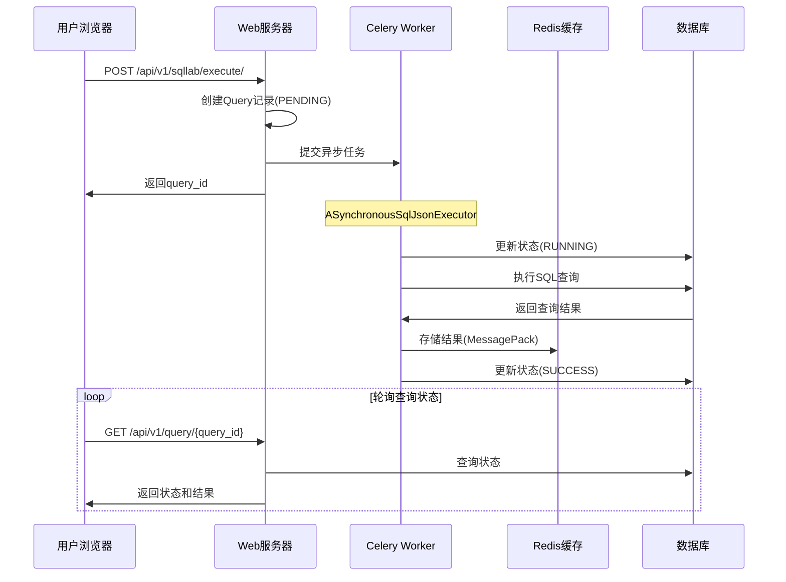
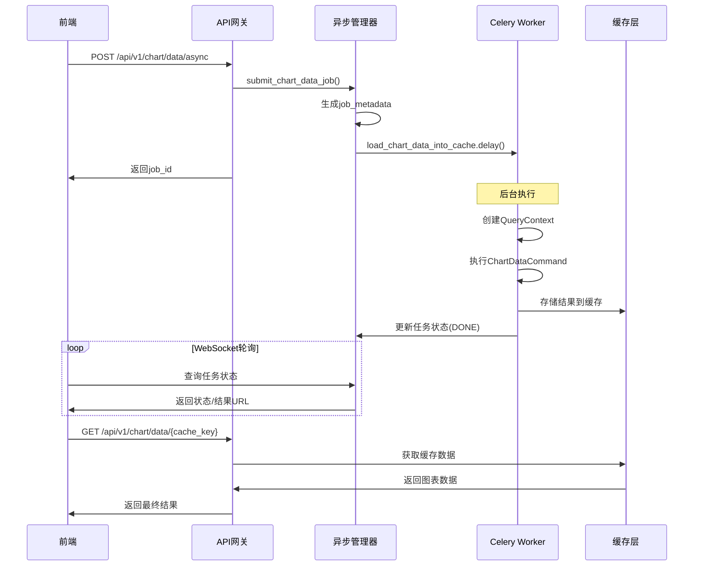

# Day 5 源码分析：Superset异步处理与性能优化 🚀

## 📋 目录
1. [Celery异步任务架构](#celery异步任务架构)
2. [SQL Lab异步查询实现](#sql-lab异步查询实现)
3. [缓存机制源码分析](#缓存机制源码分析)
4. [数据查询优化](#数据查询优化)
5. [异步图表数据加载](#异步图表数据加载)
6. [性能监控实现](#性能监控实现)

---

## 🎯 Celery异步任务架构

### 核心架构文件分析

**1. 任务应用初始化 (`superset/tasks/celery_app.py`)**

```python
# superset/tasks/celery_app.py
from superset import create_app
from superset.extensions import celery_app, db

# 初始化Flask应用
flask_app = create_app()

# 导入任务模块
from . import cache, scheduler

# 导出全局celery应用
app = celery_app

@worker_process_init.connect
def reset_db_connection_pool(**kwargs):
    """Worker进程初始化时重置数据库连接池"""
    with flask_app.app_context():
        db.engine.dispose()
```

**源码分析要点：**
- 每个Worker进程启动时会重置数据库连接池，避免连接冲突
- 通过`create_app()`确保Worker有完整的应用上下文
- 模块化导入任务定义，支持任务分类管理

**2. Celery配置初始化 (`superset/initialization/__init__.py`)**

```python
# superset/initialization/__init__.py
def configure_celery(self) -> None:
    celery_app.config_from_object(self.config["CELERY_CONFIG"])
    celery_app.set_default()
    superset_app = self.superset_app

    # 定义应用上下文任务基类
    class AppContextTask(task_base):
        abstract = True

        def __call__(self, *args: Any, **kwargs: Any) -> Any:
            with superset_app.app_context():
                return task_base.__call__(self, *args, **kwargs)

    celery_app.Task = AppContextTask
```

**源码分析要点：**
- 自定义`AppContextTask`确保每个任务都在Flask应用上下文中执行
- 通过继承机制统一管理所有Celery任务的执行环境

### 异步查询实现机制

**3. SQL Lab异步执行器 (`superset/sqllab/sql_json_executer.py`)**

```python
class ASynchronousSqlJsonExecutor(SqlJsonExecutorBase):
    def execute(self, execution_context, rendered_query, log_params):
        query_id = execution_context.query.id
        logger.info("Query %i: Running query on a Celery worker", query_id)
        
        try:
            # 提交异步任务
            task = self._get_sql_results_task.delay(
                query_id,
                rendered_query,
                return_results=False,
                store_results=not execution_context.select_as_cta,
                username=get_username(),
                start_time=now_as_float(),
                expand_data=execution_context.expand_data,
                log_params=log_params,
            )
            
            # 立即忘记任务引用，避免内存泄漏
            try:
                task.forget()
            except NotImplementedError:
                logger.warning("Backend does not support task forgetting")
                
        except Exception as ex:
            # 异步任务提交失败处理
            error = SupersetError(
                message=__("Failed to start remote query on a worker."),
                error_type=SupersetErrorType.ASYNC_WORKERS_ERROR,
                level=ErrorLevel.ERROR,
            )
            query.status = QueryStatus.FAILED
            raise SupersetErrorException(error) from ex
            
        return SqlJsonExecutionStatus.QUERY_IS_RUNNING
```

**源码分析要点：**
- 查询立即返回`QUERY_IS_RUNNING`状态，不阻塞用户界面
- 使用`task.forget()`释放任务引用，防止内存积累
- 完善的异常处理机制，确保错误状态正确传递

**4. SQL查询任务实现 (`superset/sql_lab.py`)**

```python
@celery_app.task(bind=True, soft_time_limit=SQLLAB_TIMEOUT)
def get_sql_results(
    self,
    query_id: int,
    rendered_query: str,
    return_results: bool = True,
    store_results: bool = False,
    username: Optional[str] = None,
    start_time: Optional[float] = None,
    expand_data: bool = False,
    log_params: Optional[Dict[str, Any]] = None,
) -> Optional[Dict[str, Any]]:
    """异步执行SQL查询的核心任务"""
    
    query = db.session.query(Query).filter_by(id=query_id).one()
    
    try:
        # 更新查询状态为运行中
        query.status = QueryStatus.RUNNING
        db.session.commit()
        
        # 获取数据库连接和引擎
        database = query.database
        db_engine_spec = database.db_engine_spec
        
        # 执行查询
        with database.get_sqla_engine() as engine:
            with closing(engine.raw_connection()) as conn:
                # 设置查询超时
                if database.query_timeout:
                    conn.execute(f"SET statement_timeout = {database.query_timeout}")
                
                # 执行查询
                cursor = conn.execute(rendered_query)
                
                # 处理查询结果
                data = db_engine_spec.fetch_data(cursor, query.limit)
                
        # 构建结果集
        result_set = SupersetResultSet(data, cursor.description, db_engine_spec)
        
        # 序列化和存储结果
        if store_results:
            payload = {
                "query_id": query_id,
                "status": QueryStatus.SUCCESS,
                "data": result_set.to_pandas_df().to_dict(orient="records"),
                "columns": result_set.columns,
            }
            
            # 使用MessagePack压缩存储
            if results_backend_use_msgpack:
                serialized_data = msgpack.packb(payload)
            else:
                serialized_data = json.dumps(payload).encode()
                
            results_backend.set(query_id, serialized_data)
        
        # 更新查询状态
        query.status = QueryStatus.SUCCESS
        query.end_time = datetime.now()
        db.session.commit()
        
        return payload
        
    except SoftTimeLimitExceeded:
        # 软超时处理
        query.status = QueryStatus.TIMED_OUT
        db.session.commit()
        raise
        
    except Exception as ex:
        # 异常处理
        query.status = QueryStatus.FAILED
        query.error_message = str(ex)
        db.session.commit()
        raise
```

**源码分析要点：**
- 使用软超时限制(`soft_time_limit`)避免查询无限制运行
- 通过数据库事务管理确保状态一致性
- MessagePack压缩优化大数据集的存储和传输
- 完整的生命周期状态管理：PENDING → RUNNING → SUCCESS/FAILED/TIMED_OUT

---

## 🎯 缓存机制源码分析

### Redis缓存配置

**5. 缓存配置 (`docker/pythonpath_dev/superset_config.py`)**

```python
# Redis配置
REDIS_HOST = os.getenv("REDIS_HOST", "redis")
REDIS_PORT = os.getenv("REDIS_PORT", "6379")
REDIS_CELERY_DB = os.getenv("REDIS_CELERY_DB", "0")
REDIS_RESULTS_DB = os.getenv("REDIS_RESULTS_DB", "1")

# 缓存配置
CACHE_CONFIG = {
    "CACHE_TYPE": "RedisCache",
    "CACHE_DEFAULT_TIMEOUT": 300,
    "CACHE_KEY_PREFIX": "superset_",
    "CACHE_REDIS_HOST": REDIS_HOST,
    "CACHE_REDIS_PORT": REDIS_PORT,
    "CACHE_REDIS_DB": REDIS_RESULTS_DB,
}

# Celery配置使用不同的Redis数据库
class CeleryConfig:
    broker_url = f"redis://{REDIS_HOST}:{REDIS_PORT}/{REDIS_CELERY_DB}"
    result_backend = f"redis://{REDIS_HOST}:{REDIS_PORT}/{REDIS_RESULTS_DB}"
    imports = (
        "superset.sql_lab",
        "superset.tasks.scheduler",
        "superset.tasks.thumbnails",
        "superset.tasks.cache",
    )
```

**源码分析要点：**
- 使用不同Redis数据库分离Celery消息队列和结果缓存
- 支持环境变量配置，便于容器化部署
- 统一的缓存键前缀避免键冲突

### 异步图表数据加载

**6. 异步图表数据任务 (`superset/tasks/async_queries.py`)**

```python
@celery_app.task(name="load_chart_data_into_cache", soft_time_limit=query_timeout)
def load_chart_data_into_cache(
    job_metadata: Dict[str, Any],
    form_data: Dict[str, Any],
) -> None:
    """将图表数据异步加载到缓存中"""
    
    with override_user(_load_user_from_job_metadata(job_metadata), force=False):
        try:
            # 设置表单数据到全局上下文
            set_form_data(form_data)
            
            # 创建查询上下文
            query_context = _create_query_context_from_form(form_data)
            
            # 执行图表数据命令
            command = ChartDataCommand(query_context)
            result = command.run(cache=True)
            
            # 获取缓存键
            cache_key = result["cache_key"]
            result_url = f"/api/v1/chart/data/{cache_key}"
            
            # 更新异步任务状态
            async_query_manager.update_job(
                job_metadata,
                async_query_manager.STATUS_DONE,
                result_url=result_url,
            )
            
        except SoftTimeLimitExceeded as ex:
            logger.warning("Timeout occurred while loading chart data: %s", ex)
            raise
            
        except Exception as ex:
            error = str(ex.message if hasattr(ex, "message") else ex)
            errors = [{"message": error}]
            async_query_manager.update_job(
                job_metadata, 
                async_query_manager.STATUS_ERROR, 
                errors=errors
            )
            raise
```

**源码分析要点：**
- 使用用户上下文覆盖确保权限一致性
- 通过缓存键生成结果URL，支持前端轮询获取结果
- 异步任务管理器统一管理任务状态和进度

**7. 异步查询管理器 (`superset/async_events/async_query_manager.py`)**

```python
class AsyncQueryManager:
    STATUS_PENDING = "pending"
    STATUS_RUNNING = "running" 
    STATUS_ERROR = "error"
    STATUS_DONE = "done"

    def submit_chart_data_job(
        self,
        channel_id: str,
        form_data: Dict[str, Any],
        user_id: Optional[int] = None,
    ) -> Dict[str, Any]:
        """提交图表数据异步任务"""
        
        # 初始化任务元数据
        job_metadata = self.init_job(channel_id, user_id)
        
        # 处理访客用户token
        if guest_user := security_manager.get_current_guest_user_if_guest():
            job_metadata["guest_token"] = guest_user.guest_token
            
        # 提交Celery任务
        self._load_chart_data_into_cache_job.delay(
            job_metadata,
            form_data,
        )
        
        return job_metadata

    def init_job(self, channel_id: str, user_id: Optional[int]) -> Dict[str, Any]:
        """初始化异步任务"""
        job_id = str(uuid.uuid4())
        return build_job_metadata(
            channel_id, job_id, user_id, status=self.STATUS_PENDING
        )
```

**源码分析要点：**
- UUID生成确保任务ID唯一性
- 支持访客用户的异步查询，通过guest_token传递权限
- 统一的任务状态管理和元数据结构

---

## 🎯 性能监控实现

### 查询性能分析

**8. 查询执行统计 (`superset/sql_lab.py`)**

```python
def get_sql_results(self, query_id, rendered_query, **kwargs):
    """执行查询并收集性能指标"""
    
    start_time = time.time()
    
    try:
        # 执行查询
        result = execute_query(rendered_query)
        
        # 计算执行时间
        execution_time = time.time() - start_time
        
        # 记录性能指标
        query.executed_sql = rendered_query
        query.rows = len(result.data) if result.data else 0
        query.progress = 100
        query.end_time = datetime.now()
        
        # 发送性能统计
        stats_logger.incr("sqllab.query.success")
        stats_logger.timing("sqllab.query.duration", execution_time * 1000)
        stats_logger.gauge("sqllab.query.rows", query.rows)
        
        return result
        
    except Exception as ex:
        stats_logger.incr("sqllab.query.error")
        raise
```

**源码分析要点：**
- 精确的执行时间测量，包含查询准备和结果处理
- 多维度指标收集：成功/失败计数、执行时间、结果行数
- 集成Statsd协议，支持Grafana等监控系统

---

## 🎯 源码请求流程分析

### 异步查询完整流程



### 图表数据异步加载流程



---

## 🎯 关键源码配置分析

### 生产环境Celery配置

```python
# superset/config.py - 生产环境推荐配置
class CeleryConfig:
    broker_url = "redis://redis-cluster:6379/0"
    result_backend = "redis://redis-cluster:6379/1"
    
    # 性能优化配置
    worker_prefetch_multiplier = 1  # 避免任务堆积
    task_acks_late = True          # 任务确认延迟
    
    # 任务路由和限流
    task_annotations = {
        "sql_lab.get_sql_results": {
            "rate_limit": "100/s",      # 限制SQL查询并发
            "routing_key": "sql_lab",   # 专用队列
        },
        "load_chart_data_into_cache": {
            "rate_limit": "50/s",
            "routing_key": "charts",
        },
    }
    
    # 定时任务配置
    beat_schedule = {
        "reports.scheduler": {
            "task": "reports.scheduler",
            "schedule": crontab(minute="*", hour="*"),
        },
        "cache.cleanup": {
            "task": "cache.cleanup_expired",
            "schedule": crontab(minute=0, hour=2),  # 每天2点清理过期缓存
        },
    }
```

**配置要点：**
- `worker_prefetch_multiplier=1`避免单个Worker预取过多任务
- 任务路由分离不同类型的工作负载
- 合理的限流配置防止系统过载
- 定时清理任务维护系统健康

这个分析展示了Superset异步处理的完整源码实现，从Celery任务架构到具体的查询执行，再到性能监控，为理解Superset的高性能设计提供了源码级别的深入分析。 