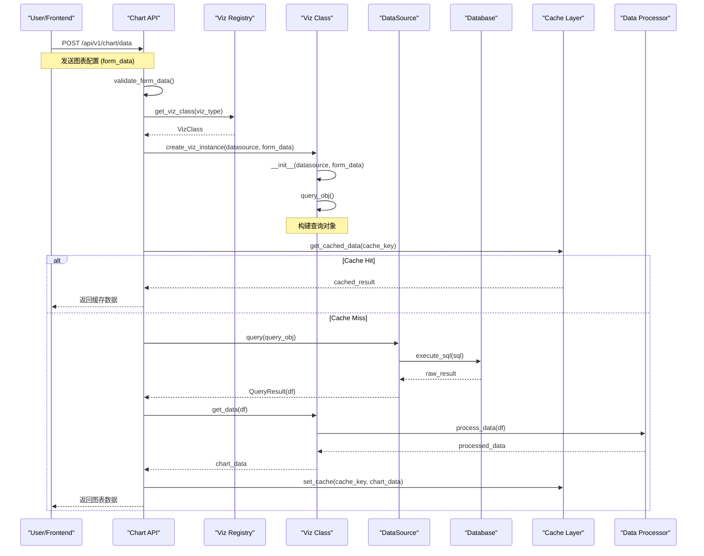
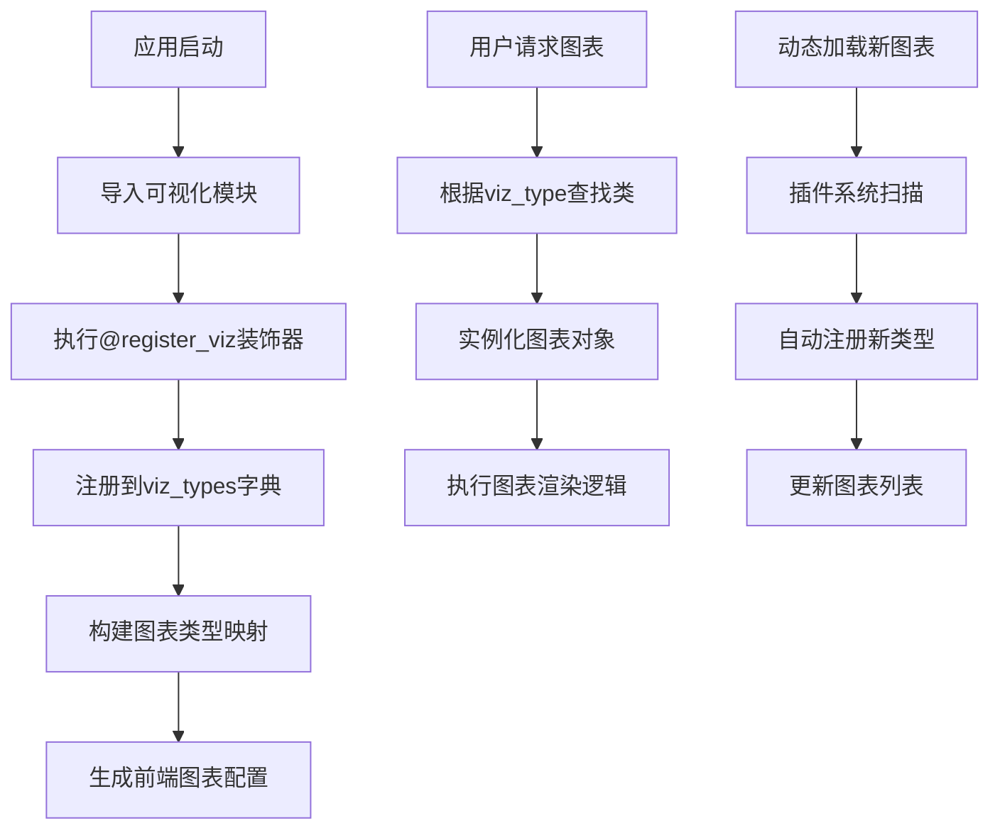
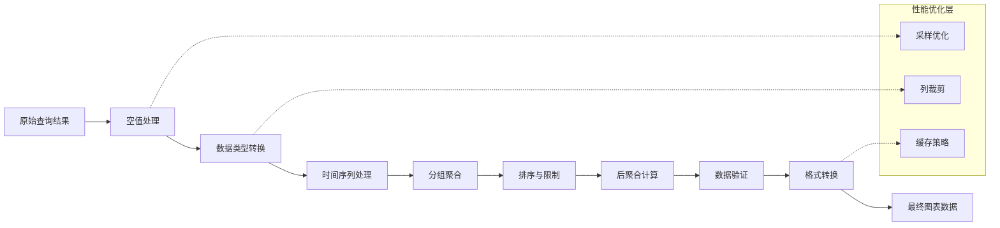

# Day 5 高级分析：图表系统深度剖析与扩展机制 🔬

## 📋 目录
1. [系统调用流程图](#系统调用流程图)
2. [核心设计思想](#核心设计思想)
3. [扩展机制详解](#扩展机制详解)
4. [实际扩展示例](#实际扩展示例)
5. [扩展点总结](#扩展点总结)

---

## 🔄 系统调用流程图

### 1. 图表渲染完整流程



上面的序列图展示了从用户请求到返回图表数据的完整流程，包括缓存机制的工作原理。

### 2. 图表注册与发现流程



第二个流程图展示了图表类型的注册机制，包括静态注册和动态加载。

### 3. 数据处理流水线



第三个流程图展示了数据从原始查询结果到最终图表数据的转换过程。

---

## 🎨 核心设计思想

### 1. 插件化架构 (Plugin Architecture)

**设计理念**：开放-封闭原则，对扩展开放，对修改封闭

```python
# 核心设计模式：注册表模式 + 工厂模式
class VizPluginRegistry:
    """可视化插件注册表"""
    
    def __init__(self):
        self._registry = {}
        self._metadata = {}
    
    def register(self, viz_class, metadata=None):
        """注册图表类型"""
        viz_type = viz_class.viz_type
        
        # 验证图表类规范
        self._validate_viz_class(viz_class)
        
        # 注册到系统
        self._registry[viz_type] = viz_class
        self._metadata[viz_type] = metadata or {}
        
        # 触发注册事件
        self._emit_register_event(viz_type, viz_class)
    
    def create_viz(self, viz_type, datasource, form_data):
        """工厂方法：创建图表实例"""
        if viz_type not in self._registry:
            raise VizTypeNotFoundError(f"Unknown viz type: {viz_type}")
        
        viz_class = self._registry[viz_type]
        
        # 依赖注入
        return viz_class(
            datasource=datasource,
            form_data=form_data,
            registry=self  # 注入注册表引用
        )
    
    def _validate_viz_class(self, viz_class):
        """验证图表类规范"""
        required_attributes = ['viz_type', 'verbose_name']
        required_methods = ['get_data']
        
        for attr in required_attributes:
            if not hasattr(viz_class, attr):
                raise VizClassValidationError(f"Missing attribute: {attr}")
        
        for method in required_methods:
            if not callable(getattr(viz_class, method, None)):
                raise VizClassValidationError(f"Missing method: {method}")
```

**优势**：
- **低耦合**：新图表类型不影响现有代码
- **高内聚**：每个图表类型封装自己的逻辑
- **易扩展**：通过注册机制轻松添加新类型
- **可测试**：每个图表类型可独立测试

### 2. 策略模式 (Strategy Pattern)

**设计理念**：不同图表类型采用不同的数据处理策略

```python
# 数据处理策略接口
class DataProcessingStrategy:
    """数据处理策略基类"""
    
    def process(self, df: pd.DataFrame, form_data: Dict) -> pd.DataFrame:
        raise NotImplementedError()

class TimeSeriesStrategy(DataProcessingStrategy):
    """时间序列数据处理策略"""
    
    def process(self, df: pd.DataFrame, form_data: Dict) -> pd.DataFrame:
        time_col = form_data.get('granularity_sqla')
        if time_col and time_col in df.columns:
            # 时间序列特有的处理逻辑
            df[time_col] = pd.to_datetime(df[time_col])
            df = df.sort_values(time_col)
            
            # 时间窗口聚合
            if form_data.get('time_grain_sqla'):
                df = self._apply_time_grain(df, form_data)
            
            # 填充时间间隙
            if form_data.get('fill_gaps'):
                df = self._fill_time_gaps(df, form_data)
        
        return df

class CategoricalStrategy(DataProcessingStrategy):
    """分类数据处理策略"""
    
    def process(self, df: pd.DataFrame, form_data: Dict) -> pd.DataFrame:
        groupby_cols = form_data.get('groupby', [])
        if groupby_cols:
            # 分类特有的处理逻辑
            for col in groupby_cols:
                if col in df.columns:
                    # 处理分类编码
                    df[col] = df[col].astype('category')
                    
                    # Top-N 分类过滤
                    if form_data.get('row_limit'):
                        top_categories = df[col].value_counts().head(
                            form_data['row_limit']
                        ).index
                        df = df[df[col].isin(top_categories)]
        
        return df

# 在图表类中使用策略
class BaseViz:
    def __init__(self, datasource, form_data):
        self.datasource = datasource
        self.form_data = form_data
        self.processing_strategy = self._get_processing_strategy()
    
    def _get_processing_strategy(self):
        """根据图表类型选择处理策略"""
        if self.is_timeseries:
            return TimeSeriesStrategy()
        else:
            return CategoricalStrategy()
    
    def process_data(self, df):
        """使用策略处理数据"""
        return self.processing_strategy.process(df, self.form_data)
```

### 3. 模板方法模式 (Template Method Pattern)

**设计理念**：定义图表渲染的骨架，子类实现具体步骤

```python
class BaseViz:
    """图表基类 - 模板方法模式"""
    
    def get_json_data(self):
        """模板方法：定义图表数据获取的完整流程"""
        try:
            # 1. 构建查询对象（可被子类重写）
            query_obj = self.query_obj()
            
            # 2. 执行查询（通用步骤）
            df = self._execute_query(query_obj)
            
            # 3. 预处理数据（可被子类重写）
            df = self.pre_process(df)
            
            # 4. 转换为图表数据（必须被子类实现）
            chart_data = self.get_data(df)
            
            # 5. 后处理（可被子类重写）
            chart_data = self.post_process(chart_data)
            
            # 6. 添加元数据（通用步骤）
            return self._add_metadata(chart_data)
            
        except Exception as e:
            return self._handle_error(e)
    
    def query_obj(self):
        """Hook方法：构建查询对象（子类可重写）"""
        return {
            'datasource': self.datasource.get_query_str(),
            'granularity': self.form_data.get('granularity_sqla'),
            'groupby': self.form_data.get('groupby', []),
            'metrics': self.form_data.get('metrics', []),
            'filters': self.form_data.get('filters', []),
        }
    
    def pre_process(self, df):
        """Hook方法：数据预处理（子类可重写）"""
        return df
    
    def get_data(self, df):
        """抽象方法：转换图表数据（子类必须实现）"""
        raise NotImplementedError()
    
    def post_process(self, chart_data):
        """Hook方法：后处理（子类可重写）"""
        return chart_data
    
    def _execute_query(self, query_obj):
        """私有方法：执行查询（不可重写）"""
        return self.datasource.query(query_obj)
    
    def _add_metadata(self, chart_data):
        """私有方法：添加元数据（不可重写）"""
        return {
            'data': chart_data,
            'query': self.query_obj(),
            'form_data': self.form_data,
            'viz_type': self.viz_type
        }
```

### 4. 观察者模式 (Observer Pattern)

**设计理念**：图表状态变化时通知相关组件

```python
class ChartEventManager:
    """图表事件管理器"""
    
    def __init__(self):
        self._observers = {
            'before_query': [],
            'after_query': [],
            'before_render': [],
            'after_render': [],
            'on_error': []
        }
    
    def subscribe(self, event_type, callback):
        """订阅事件"""
        if event_type in self._observers:
            self._observers[event_type].append(callback)
    
    def notify(self, event_type, *args, **kwargs):
        """触发事件通知"""
        if event_type in self._observers:
            for callback in self._observers[event_type]:
                try:
                    callback(*args, **kwargs)
                except Exception as e:
                    logger.error(f"Event callback error: {e}")

# 在图表类中集成事件系统
class BaseViz:
    def __init__(self, datasource, form_data):
        self.datasource = datasource
        self.form_data = form_data
        self.event_manager = ChartEventManager()
    
    def get_json_data(self):
        try:
            # 触发查询前事件
            self.event_manager.notify('before_query', self)
            
            query_obj = self.query_obj()
            df = self.datasource.query(query_obj)
            
            # 触发查询后事件
            self.event_manager.notify('after_query', self, df)
            
            # 触发渲染前事件
            self.event_manager.notify('before_render', self, df)
            
            chart_data = self.get_data(df)
            
            # 触发渲染后事件
            self.event_manager.notify('after_render', self, chart_data)
            
            return chart_data
            
        except Exception as e:
            # 触发错误事件
            self.event_manager.notify('on_error', self, e)
            raise

# 使用观察者模式实现性能监控
class PerformanceMonitor:
    def __init__(self):
        self.metrics = {}
    
    def on_before_query(self, viz):
        self.metrics[id(viz)] = {'start_time': time.time()}
    
    def on_after_render(self, viz, chart_data):
        viz_id = id(viz)
        if viz_id in self.metrics:
            elapsed = time.time() - self.metrics[viz_id]['start_time']
            logger.info(f"Chart {viz.viz_type} rendered in {elapsed:.3f}s")

# 注册监控器
monitor = PerformanceMonitor()
viz.event_manager.subscribe('before_query', monitor.on_before_query)
viz.event_manager.subscribe('after_render', monitor.on_after_render)
```

---

## 🔧 扩展机制详解

### 1. 图表类型扩展点

#### 1.1 基础图表类型扩展

```python
# 扩展点1：继承BaseViz创建新图表类型
@register_viz
class GaugeChartViz(BaseViz):
    """仪表盘图表"""
    
    viz_type = 'gauge'
    verbose_name = 'Gauge Chart'
    is_timeseries = False
    
    # 扩展点：自定义查询对象构建
    def query_obj(self):
        query_obj = super().query_obj()
        
        # 仪表盘特有的查询逻辑
        query_obj['row_limit'] = 1  # 只需要一个值
        query_obj['order_desc'] = True  # 取最新值
        
        return query_obj
    
    # 扩展点：自定义数据处理
    def get_data(self, df):
        if df.empty:
            return {'value': 0, 'error': 'No data'}
        
        # 获取单个数值
        metrics = self.form_data.get('metrics', [])
        if not metrics:
            return {'value': 0, 'error': 'No metrics specified'}
        
        metric = metrics[0]
        if metric not in df.columns:
            return {'value': 0, 'error': f'Metric {metric} not found'}
        
        value = df[metric].iloc[0]
        
        # 仪表盘特有的数据格式
        return {
            'value': float(value),
            'min': self.form_data.get('gauge_min', 0),
            'max': self.form_data.get('gauge_max', 100),
            'thresholds': self.form_data.get('gauge_thresholds', []),
            'unit': self.form_data.get('gauge_unit', ''),
            'format': self._format_gauge_value(value)
        }
    
    def _format_gauge_value(self, value):
        """仪表盘数值格式化"""
        if abs(value) >= 1000000:
            return f"{value/1000000:.1f}M"
        elif abs(value) >= 1000:
            return f"{value/1000:.1f}K"
        else:
            return f"{value:.1f}"
```

#### 1.2 复合图表类型扩展

```python
@register_viz
class ComboChartViz(BaseViz):
    """组合图表（折线+柱状）"""
    
    viz_type = 'combo'
    verbose_name = 'Combo Chart'
    is_timeseries = True
    
    def get_data(self, df):
        line_metrics = self.form_data.get('line_metrics', [])
        bar_metrics = self.form_data.get('bar_metrics', [])
        x_axis = self.form_data.get('granularity_sqla')
        
        if not x_axis or x_axis not in df.columns:
            return {'error': 'Missing time column'}
        
        # 构建组合图表数据
        chart_data = {
            'xAxis': {
                'type': 'time',
                'data': df[x_axis].dt.strftime('%Y-%m-%d').tolist()
            },
            'yAxis': [
                {'type': 'value', 'name': 'Bar Metrics'},
                {'type': 'value', 'name': 'Line Metrics', 'position': 'right'}
            ],
            'series': []
        }
        
        # 添加柱状图系列
        for metric in bar_metrics:
            if metric in df.columns:
                chart_data['series'].append({
                    'name': metric,
                    'type': 'bar',
                    'yAxisIndex': 0,
                    'data': df[metric].tolist()
                })
        
        # 添加折线图系列
        for metric in line_metrics:
            if metric in df.columns:
                chart_data['series'].append({
                    'name': metric,
                    'type': 'line',
                    'yAxisIndex': 1,
                    'data': df[metric].tolist()
                })
        
        return chart_data
```

### 2. 数据处理扩展点

#### 2.1 自定义数据处理器

```python
class CustomDataProcessor:
    """自定义数据处理器接口"""
    
    def process(self, df: pd.DataFrame, form_data: Dict) -> pd.DataFrame:
        raise NotImplementedError()

# 扩展点：异常值检测与处理
class OutlierDetectionProcessor(CustomDataProcessor):
    """异常值检测处理器"""
    
    def process(self, df: pd.DataFrame, form_data: Dict) -> pd.DataFrame:
        method = form_data.get('outlier_method', 'iqr')
        numeric_cols = df.select_dtypes(include=[np.number]).columns
        
        if method == 'iqr':
            return self._iqr_outlier_detection(df, numeric_cols)
        elif method == 'zscore':
            return self._zscore_outlier_detection(df, numeric_cols)
        elif method == 'isolation_forest':
            return self._isolation_forest_detection(df, numeric_cols)
        
        return df
    
    def _iqr_outlier_detection(self, df, numeric_cols):
        """IQR方法检测异常值"""
        for col in numeric_cols:
            Q1 = df[col].quantile(0.25)
            Q3 = df[col].quantile(0.75)
            IQR = Q3 - Q1
            lower_bound = Q1 - 1.5 * IQR
            upper_bound = Q3 + 1.5 * IQR
            
            # 标记异常值
            df[f'{col}_is_outlier'] = (
                (df[col] < lower_bound) | (df[col] > upper_bound)
            )
            
            # 可选：移除或修正异常值
            if form_data.get('remove_outliers'):
                df = df[~df[f'{col}_is_outlier']]
        
        return df

# 扩展点：时间序列分解
class TimeSeriesDecompositionProcessor(CustomDataProcessor):
    """时间序列分解处理器"""
    
    def process(self, df: pd.DataFrame, form_data: Dict) -> pd.DataFrame:
        time_col = form_data.get('granularity_sqla')
        value_col = form_data.get('decompose_metric')
        
        if not time_col or not value_col or time_col not in df.columns or value_col not in df.columns:
            return df
        
        # 确保时间序列排序
        df = df.sort_values(time_col)
        df = df.set_index(time_col)
        
        # 时间序列分解
        from statsmodels.tsa.seasonal import seasonal_decompose
        
        try:
            decomposition = seasonal_decompose(
                df[value_col], 
                model=form_data.get('decompose_model', 'additive'),
                period=form_data.get('decompose_period', 12)
            )
            
            # 添加分解后的组件
            df[f'{value_col}_trend'] = decomposition.trend
            df[f'{value_col}_seasonal'] = decomposition.seasonal
            df[f'{value_col}_residual'] = decomposition.resid
            
        except Exception as e:
            logger.warning(f"Time series decomposition failed: {e}")
        
        return df.reset_index()

# 在图表类中使用自定义处理器
class AdvancedLineChartViz(BaseViz):
    """高级折线图，支持异常值检测和时间序列分解"""
    
    viz_type = 'advanced_line'
    verbose_name = 'Advanced Line Chart'
    is_timeseries = True
    
    def pre_process(self, df):
        """使用自定义处理器预处理数据"""
        processors = []
        
        # 根据配置添加处理器
        if self.form_data.get('enable_outlier_detection'):
            processors.append(OutlierDetectionProcessor())
        
        if self.form_data.get('enable_decomposition'):
            processors.append(TimeSeriesDecompositionProcessor())
        
        # 依次执行处理器
        for processor in processors:
            df = processor.process(df, self.form_data)
        
        return df
```

### 3. 缓存策略扩展点

#### 3.1 自定义缓存策略

```python
class CacheStrategy:
    """缓存策略基类"""
    
    def get_cache_key(self, viz_obj, form_data):
        raise NotImplementedError()
    
    def get_cache_timeout(self, viz_obj, form_data):
        raise NotImplementedError()
    
    def should_cache(self, viz_obj, form_data):
        raise NotImplementedError()

# 扩展点：智能缓存策略
class SmartCacheStrategy(CacheStrategy):
    """智能缓存策略"""
    
    def get_cache_key(self, viz_obj, form_data):
        """生成智能缓存键"""
        key_components = {
            'viz_type': viz_obj.viz_type,
            'datasource': viz_obj.datasource.id,
            'form_data_hash': self._hash_form_data(form_data),
            'user_context': self._get_user_context(),
            'data_freshness': self._get_data_freshness(viz_obj.datasource)
        }
        
        key_str = json.dumps(key_components, sort_keys=True)
        return hashlib.sha256(key_str.encode()).hexdigest()
    
    def get_cache_timeout(self, viz_obj, form_data):
        """动态缓存超时时间"""
        # 根据数据更新频率调整缓存时间
        data_update_freq = self._get_data_update_frequency(viz_obj.datasource)
        
        if data_update_freq == 'real_time':
            return 60  # 1分钟
        elif data_update_freq == 'hourly':
            return 3600  # 1小时
        elif data_update_freq == 'daily':
            return 86400  # 1天
        else:
            return 3600  # 默认1小时
    
    def should_cache(self, viz_obj, form_data):
        """智能缓存决策"""
        # 大数据集优先缓存
        estimated_rows = self._estimate_result_size(viz_obj, form_data)
        if estimated_rows > 10000:
            return True
        
        # 复杂查询优先缓存
        query_complexity = self._calculate_query_complexity(form_data)
        if query_complexity > 5:
            return True
        
        # 频繁访问的图表优先缓存
        access_frequency = self._get_access_frequency(viz_obj)
        if access_frequency > 10:  # 10次/小时
            return True
        
        return False

# 扩展点：分层缓存策略
class TieredCacheStrategy(CacheStrategy):
    """分层缓存策略"""
    
    def __init__(self):
        self.memory_cache = {}
        self.redis_cache = None
        self.file_cache = None
    
    def get_cached_data(self, cache_key, viz_obj, form_data):
        """分层缓存获取"""
        # L1: 内存缓存
        if cache_key in self.memory_cache:
            data = self.memory_cache[cache_key]
            if not self._is_expired(data):
                return data['content']
        
        # L2: Redis缓存
        if self.redis_cache:
            data = self.redis_cache.get(cache_key)
            if data:
                # 提升到内存缓存
                self._promote_to_memory(cache_key, data)
                return json.loads(data)
        
        # L3: 文件缓存
        if self.file_cache:
            data = self.file_cache.get(cache_key)
            if data:
                # 提升到Redis和内存缓存
                self._promote_to_redis(cache_key, data)
                self._promote_to_memory(cache_key, data)
                return data
        
        return None
    
    def set_cached_data(self, cache_key, data, viz_obj, form_data):
        """分层缓存设置"""
        data_size = len(json.dumps(data))
        
        # 小数据存内存
        if data_size < 1024 * 100:  # 100KB
            self.memory_cache[cache_key] = {
                'content': data,
                'timestamp': time.time(),
                'size': data_size
            }
        
        # 中等数据存Redis
        if data_size < 1024 * 1024 * 10:  # 10MB
            if self.redis_cache:
                self.redis_cache.setex(
                    cache_key, 
                    self._get_cache_timeout(viz_obj, form_data),
                    json.dumps(data)
                )
        
        # 大数据存文件
        if self.file_cache:
            self.file_cache.set(cache_key, data)
```

### 4. API扩展点

#### 4.1 自定义API端点

```python
# 扩展点：自定义图表API
class CustomChartAPI(Resource):
    """自定义图表API扩展"""
    
    @expose('/advanced_chart_data', methods=['POST'])
    def advanced_chart_data(self):
        """高级图表数据API"""
        try:
            form_data = request.json.get('form_data', {})
            
            # 扩展点：自定义参数验证
            validation_result = self._validate_advanced_form_data(form_data)
            if not validation_result['valid']:
                return self.response_400(message=validation_result['errors'])
            
            # 扩展点：自定义数据获取逻辑
            chart_data = self._get_advanced_chart_data(form_data)
            
            # 扩展点：自定义响应格式
            response = self._format_advanced_response(chart_data, form_data)
            
            return self.response(200, **response)
            
        except Exception as e:
            return self._handle_advanced_error(e)
    
    def _validate_advanced_form_data(self, form_data):
        """自定义表单验证"""
        errors = []
        
        # 验证高级配置
        if form_data.get('enable_ml_prediction'):
            if not form_data.get('prediction_periods'):
                errors.append("Missing prediction_periods for ML prediction")
        
        if form_data.get('enable_anomaly_detection'):
            if not form_data.get('anomaly_threshold'):
                errors.append("Missing anomaly_threshold for anomaly detection")
        
        return {
            'valid': len(errors) == 0,
            'errors': errors
        }
    
    def _get_advanced_chart_data(self, form_data):
        """获取高级图表数据"""
        # 标准图表数据获取
        base_data = self._get_base_chart_data(form_data)
        
        # 扩展功能
        if form_data.get('enable_ml_prediction'):
            base_data = self._add_ml_predictions(base_data, form_data)
        
        if form_data.get('enable_anomaly_detection'):
            base_data = self._add_anomaly_detection(base_data, form_data)
        
        if form_data.get('enable_statistical_analysis'):
            base_data = self._add_statistical_analysis(base_data, form_data)
        
        return base_data

# 扩展点：WebSocket实时推送
class ChartWebSocketHandler:
    """图表WebSocket处理器"""
    
    async def handle_chart_subscription(self, websocket, chart_id, user_id):
        """处理图表订阅"""
        subscription_id = f"{user_id}_{chart_id}_{int(time.time())}"
        
        # 注册订阅
        await self._register_subscription(subscription_id, websocket, chart_id, user_id)
        
        try:
            # 发送初始数据
            initial_data = await self._get_initial_chart_data(chart_id, user_id)
            await websocket.send_json({
                'type': 'initial_data',
                'data': initial_data,
                'subscription_id': subscription_id
            })
            
            # 监听数据变化
            async for message in websocket:
                await self._handle_websocket_message(message, subscription_id)
                
        except Exception as e:
            logger.error(f"WebSocket error: {e}")
        finally:
            await self._unregister_subscription(subscription_id)
    
    async def broadcast_chart_update(self, chart_id, updated_data):
        """广播图表更新"""
        subscriptions = await self._get_chart_subscriptions(chart_id)
        
        message = {
            'type': 'data_update',
            'chart_id': chart_id,
            'data': updated_data,
            'timestamp': time.time()
        }
        
        for subscription in subscriptions:
            try:
                await subscription['websocket'].send_json(message)
            except Exception as e:
                logger.warning(f"Failed to send update to subscription {subscription['id']}: {e}")
```

---

## 🚀 实际扩展示例

### 示例1：机器学习预测图表

```python
@register_viz
class MLPredictionChartViz(BaseViz):
    """机器学习预测图表"""
    
    viz_type = 'ml_prediction'
    verbose_name = 'ML Prediction Chart'
    is_timeseries = True
    
    def get_data(self, df):
        """获取包含ML预测的图表数据"""
        base_data = self._get_historical_data(df)
        
        if self.form_data.get('enable_prediction'):
            prediction_data = self._generate_predictions(df)
            base_data = self._merge_predictions(base_data, prediction_data)
        
        return base_data
    
    def _generate_predictions(self, df):
        """生成ML预测"""
        try:
            from sklearn.linear_model import LinearRegression
            from sklearn.preprocessing import PolynomialFeatures
            
            time_col = self.form_data.get('granularity_sqla')
            target_col = self.form_data.get('prediction_target')
            periods = self.form_data.get('prediction_periods', 30)
            
            # 准备训练数据
            df_clean = df.dropna(subset=[time_col, target_col])
            df_clean = df_clean.sort_values(time_col)
            
            # 特征工程
            df_clean['time_numeric'] = pd.to_numeric(df_clean[time_col])
            X = df_clean[['time_numeric']].values
            y = df_clean[target_col].values
            
            # 训练模型
            if self.form_data.get('prediction_model') == 'polynomial':
                poly_features = PolynomialFeatures(degree=2)
                X_poly = poly_features.fit_transform(X)
                model = LinearRegression()
                model.fit(X_poly, y)
                
                # 生成预测
                last_time = df_clean['time_numeric'].max()
                time_step = df_clean['time_numeric'].diff().median()
                future_times = np.arange(
                    last_time + time_step, 
                    last_time + (periods + 1) * time_step, 
                    time_step
                )
                
                future_X = future_times.reshape(-1, 1)
                future_X_poly = poly_features.transform(future_X)
                predictions = model.predict(future_X_poly)
                
            else:  # 线性回归
                model = LinearRegression()
                model.fit(X, y)
                
                last_time = df_clean['time_numeric'].max()
                time_step = df_clean['time_numeric'].diff().median()
                future_times = np.arange(
                    last_time + time_step, 
                    last_time + (periods + 1) * time_step, 
                    time_step
                )
                
                future_X = future_times.reshape(-1, 1)
                predictions = model.predict(future_X)
            
            # 转换回日期格式
            future_dates = pd.to_datetime(future_times, unit='ns')
            
            return {
                'dates': future_dates.strftime('%Y-%m-%d').tolist(),
                'predictions': predictions.tolist(),
                'model_score': model.score(X, y) if hasattr(model, 'score') else None
            }
            
        except Exception as e:
            logger.error(f"ML prediction failed: {e}")
            return {'dates': [], 'predictions': [], 'error': str(e)}

# 注册自定义处理器
class MLDataProcessor(CustomDataProcessor):
    """ML数据预处理器"""
    
    def process(self, df: pd.DataFrame, form_data: Dict) -> pd.DataFrame:
        """ML特有的数据预处理"""
        # 数据清洗
        df = self._clean_data_for_ml(df, form_data)
        
        # 特征工程
        df = self._feature_engineering(df, form_data)
        
        # 异常值处理
        df = self._handle_outliers_for_ml(df, form_data)
        
        return df
    
    def _clean_data_for_ml(self, df, form_data):
        """ML数据清洗"""
        target_col = form_data.get('prediction_target')
        
        if target_col and target_col in df.columns:
            # 移除目标变量的空值
            df = df.dropna(subset=[target_col])
            
            # 移除无穷值
            df = df.replace([np.inf, -np.inf], np.nan).dropna()
        
        return df
```

### 示例2：地理信息图表扩展

```python
@register_viz
class GeoHeatmapViz(BaseViz):
    """地理热力图"""
    
    viz_type = 'geo_heatmap'
    verbose_name = 'Geographic Heatmap'
    is_timeseries = False
    
    def get_data(self, df):
        """获取地理热力图数据"""
        lat_col = self.form_data.get('latitude_column')
        lng_col = self.form_data.get('longitude_column')
        value_col = self.form_data.get('value_column')
        
        if not all([lat_col, lng_col, value_col]):
            return {'error': 'Missing required geographic columns'}
        
        # 验证地理坐标
        df = self._validate_coordinates(df, lat_col, lng_col)
        
        # 空间聚合
        if self.form_data.get('enable_spatial_aggregation'):
            df = self._spatial_aggregation(df, lat_col, lng_col, value_col)
        
        # 构建热力图数据
        heatmap_data = []
        for _, row in df.iterrows():
            heatmap_data.append({
                'lat': float(row[lat_col]),
                'lng': float(row[lng_col]),
                'value': float(row[value_col]),
                'weight': self._calculate_weight(row[value_col], df[value_col])
            })
        
        return {
            'heatmap_data': heatmap_data,
            'bounds': self._calculate_bounds(df, lat_col, lng_col),
            'center': self._calculate_center(df, lat_col, lng_col),
            'zoom_level': self._calculate_zoom_level(df, lat_col, lng_col)
        }
    
    def _validate_coordinates(self, df, lat_col, lng_col):
        """验证地理坐标"""
        # 纬度范围：-90到90
        df = df[(df[lat_col] >= -90) & (df[lat_col] <= 90)]
        
        # 经度范围：-180到180
        df = df[(df[lng_col] >= -180) & (df[lng_col] <= 180)]
        
        return df
    
    def _spatial_aggregation(self, df, lat_col, lng_col, value_col):
        """空间聚合"""
        precision = self.form_data.get('spatial_precision', 2)
        
        # 将坐标四舍五入到指定精度
        df['lat_rounded'] = df[lat_col].round(precision)
        df['lng_rounded'] = df[lng_col].round(precision)
        
        # 按四舍五入的坐标分组聚合
        aggregated = df.groupby(['lat_rounded', 'lng_rounded']).agg({
            value_col: self.form_data.get('aggregation_method', 'sum')
        }).reset_index()
        
        # 重命名列
        aggregated[lat_col] = aggregated['lat_rounded']
        aggregated[lng_col] = aggregated['lng_rounded']
        
        return aggregated
```

---

## 📊 扩展点总结

### 核心扩展点

1. **图表类型扩展**
   - 继承 `BaseViz` 类
   - 实现 `get_data()` 方法
   - 使用 `@register_viz` 装饰器

2. **数据处理扩展**
   - 实现 `CustomDataProcessor` 接口
   - 重写 `pre_process()` / `post_process()` 方法
   - 集成到处理流水线

3. **缓存策略扩展**
   - 实现 `CacheStrategy` 接口
   - 自定义缓存键生成
   - 动态缓存超时策略

4. **API端点扩展**
   - 继承 `Resource` 类
   - 添加自定义路由
   - 实现WebSocket支持

### 扩展最佳实践

1. **保持向后兼容**：新扩展不应破坏现有功能
2. **遵循接口规范**：实现所有必需的方法和属性
3. **错误处理**：优雅处理异常情况
4. **性能考量**：避免扩展影响系统性能
5. **文档完整**：为扩展提供完整的文档和示例

### 扩展开发流程

```
1. 需求分析 → 确定扩展类型和功能
2. 设计接口 → 定义扩展点和API
3. 实现扩展 → 编写扩展代码
4. 单元测试 → 确保扩展功能正确
5. 集成测试 → 验证与现有系统的兼容性
6. 文档编写 → 提供使用说明和示例
7. 部署发布 → 注册扩展并发布
```

通过这些扩展机制，你可以根据业务需求灵活地扩展 Superset 的图表功能，实现定制化的数据可视化解决方案！🚀 