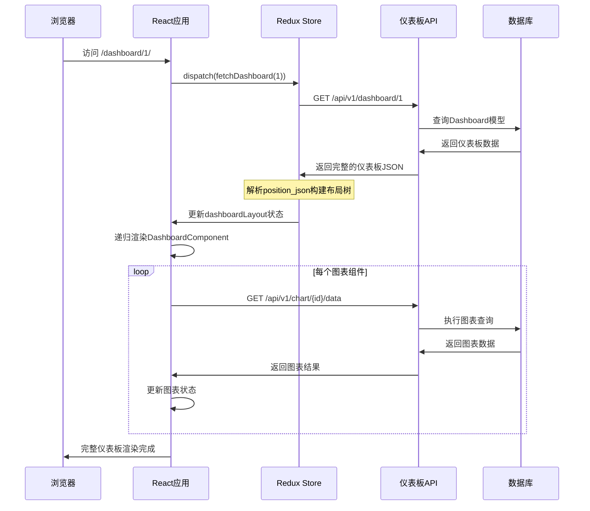
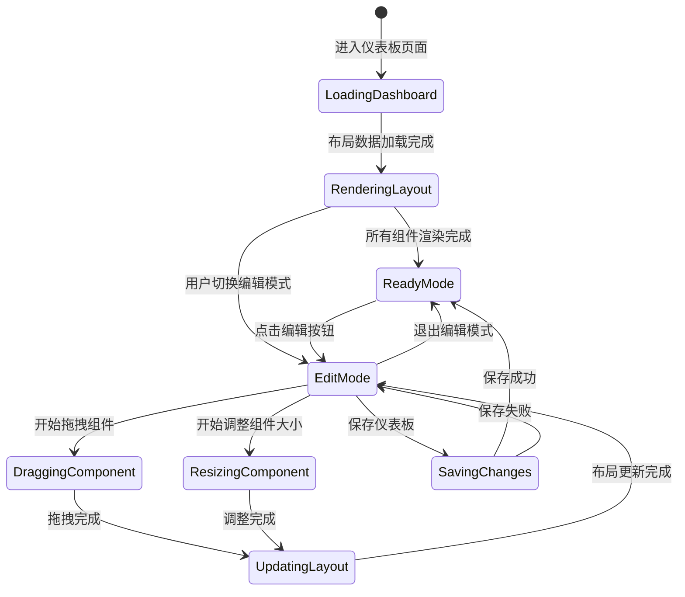

# Day 6 源码分析：Superset仪表板布局系统 📊

## 📋 目录
1. [仪表板架构概览](#仪表板架构概览)
2. [布局组件系统](#布局组件系统)
3. [拖拽交互实现](#拖拽交互实现)
4. [状态管理机制](#状态管理机制)
5. [API接口分析](#api接口分析)
6. [数据流向追踪](#数据流向追踪)

---

## 🎯 仪表板架构概览

### 核心组件层次结构

**1. 仪表板容器组件 (`superset-frontend/src/dashboard/containers/DashboardComponent.jsx`)**

```javascript
// DashboardComponent.jsx - 仪表板组件容器
class DashboardComponent extends PureComponent {
  render() {
    const { component, parentComponent, getComponentById } = this.props;
    const Component = componentLookup[component.type];
    
    return (
      <Component
        id={component.id}
        parentId={parentComponent.id}
        component={component}
        parentComponent={parentComponent}
        index={component.meta?.index}
        depth={this.props.depth + 1}
        availableColumnCount={
          parentComponent.type === COLUMN_TYPE 
            ? parentComponent.meta.width 
            : GRID_COLUMN_COUNT
        }
        columnWidth={
          (parentComponent.meta?.width || GRID_COLUMN_COUNT) / GRID_COLUMN_COUNT
        }
        onResizeStop={this.handleResizeStop}
        onResize={this.handleResize}
        onChangeTab={this.handleChangeTab}
        onDeleteComponent={this.handleDeleteComponent}
        onDropOnTab={this.handleDropOnTab}
        editMode={this.props.editMode}
        isComponentVisible={this.props.isComponentVisible}
        dashboardId={this.props.dashboardId}
        nativeFilters={this.props.nativeFilters}
      />
    );
  }
}

// 状态映射
function mapStateToProps({ dashboardLayout, dashboardState, dashboardInfo }, ownProps) {
  const { id, parentId } = ownProps;
  const component = dashboardLayout.present[id];
  
  return {
    component,
    getComponentById: id => dashboardLayout.present[id],
    parentComponent: dashboardLayout.present[parentId],
    editMode: dashboardState.editMode,
    filters: getActiveFilters(),
    dashboardId: dashboardInfo.id,
    fullSizeChartId: dashboardState.fullSizeChartId,
  };
}
```

**源码分析要点：**
- 使用`componentLookup`策略模式动态选择组件类型
- 递归深度控制和层次结构管理
- 响应式列宽计算，支持嵌套布局
- Redux状态管理集成，实现组件间数据共享

**2. 组件类型查找表 (`superset-frontend/src/dashboard/components/gridComponents/index.js`)**

```javascript
// componentLookup - 组件类型映射
import Chart from './Chart';
import Column from './Column';
import Divider from './Divider';
import Header from './Header';
import Markdown from './Markdown';
import Row from './Row';
import Tabs from './Tabs';
import Tab from './Tab';

export const componentLookup = {
  [CHART_TYPE]: Chart,
  [COLUMN_TYPE]: Column,
  [DIVIDER_TYPE]: Divider,
  [HEADER_TYPE]: Header,
  [MARKDOWN_TYPE]: Markdown,
  [ROW_TYPE]: Row,
  [TABS_TYPE]: Tabs,
  [TAB_TYPE]: Tab,
};
```

### 仪表板类型定义

**3. 布局数据结构 (`superset-frontend/src/dashboard/types.ts`)**

```typescript
// 布局项数据结构
export type LayoutItem = {
  children: string[];           // 子组件ID列表
  parents?: string[];          // 父组件ID列表
  type: ComponentType;         // 组件类型
  id: string;                  // 唯一标识符
  meta: {
    chartId: number;           // 图表ID
    defaultText?: string;      // 默认文本
    height: number;            // 高度
    placeholder?: string;      // 占位符
    sliceName?: string;        // 切片名称
    sliceNameOverride?: string; // 切片名称覆盖
    text?: string;             // 文本内容
    uuid: string;              // UUID
    width: number;             // 宽度
  };
};

// 仪表板布局状态
export type DashboardLayout = { [key: string]: LayoutItem };

// 仪表板信息
export type DashboardInfo = {
  id: number;
  slug: string;
  dashboard_title: string;
  published: boolean;
  json_metadata: string;
  position_json: string;
  // ... 其他属性
};
```

---

## 🎯 布局组件系统

### 行组件实现

**4. 行组件 (`superset-frontend/src/dashboard/components/gridComponents/Row.jsx`)**

```javascript
class Row extends PureComponent {
  constructor(props) {
    super(props);
    this.state = { isFocused: false };
    this.handleChangeBackground = this.handleChangeBackground.bind(this);
    this.handleDeleteComponent = this.handleDeleteComponent.bind(this);
  }

  handleChangeBackground(background) {
    this.props.updateComponents({
      [this.props.id]: {
        ...this.props.component,
        meta: {
          ...this.props.component.meta,
          background,
        },
      },
    });
  }

  render() {
    const {
      component,
      parentComponent,
      index,
      depth,
      editMode,
      columnWidth,
      availableColumnCount,
      minColumnWidth = GRID_MIN_COLUMN_COUNT,
      isComponentVisible,
    } = this.props;

    const rowItems = component.children || [];
    const backgroundStyle = backgroundStyleOptions.find(
      option => option.value === (component.meta.background || BACKGROUND_TRANSPARENT)
    );

    return (
      <DragDroppable
        component={component}
        parentComponent={parentComponent}
        orientation="row"
        index={index}
        depth={depth}
        onDrop={this.props.handleComponentDrop}
        editMode={editMode}
      >
        {({ dropIndicatorProps, dragSourceRef }) => (
          <div
            ref={dragSourceRef}
            className={cx(
              'dashboard-component',
              'dashboard-component-row',
              backgroundStyle?.className,
            )}
            data-test="dashboard-component-row"
          >
            {/* 编辑模式悬停菜单 */}
            {editMode && (
              <HoverMenu position="top">
                <DragHandle position="top" />
                <WithPopoverMenu
                  menuItems={[
                    <BackgroundStyleDropdown
                      id={`${component.id}-background`}
                      value={component.meta.background}
                      onChange={this.handleChangeBackground}
                    />,
                  ]}
                >
                  <IconButton icon={<Icons.Gear />} />
                </WithPopoverMenu>
                <DeleteComponentButton onDelete={this.handleDeleteComponent} />
              </HoverMenu>
            )}

            {/* 渲染子组件 */}
            <div className="row-content">
              {rowItems.map((componentId, itemIndex) => (
                <DashboardComponent
                  key={componentId}
                  id={componentId}
                  parentId={component.id}
                  depth={depth + 1}
                  index={itemIndex}
                  availableColumnCount={availableColumnCount}
                  columnWidth={columnWidth}
                  isComponentVisible={isComponentVisible}
                />
              ))}
            </div>

            {dropIndicatorProps && <div {...dropIndicatorProps} />}
          </div>
        )}
      </DragDroppable>
    );
  }
}
```

**源码分析要点：**
- 嵌套组件递归渲染，通过`depth`控制层级
- 拖拽功能集成，支持方向性拖拽(`orientation="row"`)
- 背景样式动态切换，支持实时预览
- 编辑模式条件渲染，生产环境隐藏编辑功能

### 列组件实现

**5. 列组件 (`superset-frontend/src/dashboard/components/gridComponents/Column.jsx`)**

```javascript
class Column extends PureComponent {
  render() {
    const {
      component,
      parentComponent, 
      index,
      depth,
      editMode,
      availableColumnCount,
      columnWidth,
      minColumnWidth,
      isComponentVisible,
    } = this.props;

    const columnItems = component.children || [];
    const occupiedColumnCount = Math.min(
      availableColumnCount,
      component.meta.width || GRID_MIN_COLUMN_COUNT,
    );

    const backgroundStyle = backgroundStyleOptions.find(
      option => option.value === (component.meta.background || BACKGROUND_TRANSPARENT)
    );

    return (
      <Draggable
        component={component}
        parentComponent={parentComponent}
        orientation="column"
        index={index}
        depth={depth}
        onDrop={this.props.handleComponentDrop}
        editMode={editMode}
      >
        {({ dropIndicatorProps, dragSourceRef }) => (
          <div
            ref={dragSourceRef}
            className={cx(
              'dashboard-component',
              'dashboard-component-column',
              backgroundStyle?.className,
            )}
            style={{
              width: columnWidth ? `${columnWidth * occupiedColumnCount}%` : undefined,
            }}
          >
            {editMode && (
              <ResizableContainer
                id={component.id}
                adjustableWidth
                widthStep={columnWidth}
                widthMultiple={occupiedColumnCount}
                minWidthMultiple={minColumnWidth}
                maxWidthMultiple={availableColumnCount}
                onResizeStop={this.props.onResizeStop}
                editMode={editMode}
              >
                {this.renderColumnContent(columnItems, occupiedColumnCount)}
              </ResizableContainer>
            )}

            {!editMode && this.renderColumnContent(columnItems, occupiedColumnCount)}
            {dropIndicatorProps && <div {...dropIndicatorProps} />}
          </div>
        )}
      </Draggable>
    );
  }

  renderColumnContent(columnItems, occupiedColumnCount) {
    return (
      <Droppable
        component={this.props.component}
        orientation="column"
        index={this.props.index}
        depth={this.props.depth}
        onDrop={this.props.handleComponentDrop}
        editMode={this.props.editMode}
        className="column-content"
      >
        {columnItems.map((componentId, itemIndex) => (
          <DashboardComponent
            key={componentId}
            id={componentId}
            parentId={this.props.component.id}
            depth={this.props.depth + 1}
            index={itemIndex}
            availableColumnCount={occupiedColumnCount}
            columnWidth={this.props.columnWidth}
            isComponentVisible={this.props.isComponentVisible}
          />
        ))}
      </Droppable>
    );
  }
}
```

**源码分析要点：**
- 响应式宽度计算，基于Bootstrap网格系统
- 可调整宽度的容器，支持实时拖拽调整
- 嵌套下拉区域，支持多层次组件组织
- 占用列数约束，防止布局溢出

---

## 🎯 拖拽交互实现

### 拖拽组件基础

**6. 拖拽组件 (`superset-frontend/src/dashboard/components/dnd/DragDroppable.jsx`)**

```javascript
// DragDroppable组件 - 支持拖拽和放置
export const Draggable = ({ children, component, parentComponent, index, depth, onDrop, editMode, orientation }) => {
  const dragSpec = useMemo(() => ({
    type: component.type,
    
    // 拖拽开始时的数据
    item: {
      type: component.type,
      id: component.id,
      parentId: parentComponent.id,
      parentType: parentComponent.type,
      index,
      depth,
      meta: component.meta,
    },
    
    // 拖拽开始回调
    begin(monitor) {
      return {
        id: component.id,
        type: component.type,
        parentId: parentComponent.id,
        index,
      };
    },
    
    // 拖拽结束回调  
    end(item, monitor) {
      const dropResult = monitor.getDropResult();
      if (dropResult) {
        onDrop({
          source: item,
          destination: dropResult,
        });
      }
    },
  }), [component, parentComponent, index, depth, onDrop]);

  const [{ isDragging }, dragRef, dragPreviewRef] = useDrag(dragSpec);

  return children({
    dragSourceRef: editMode ? dragRef : undefined,
    dragPreviewRef,
    isDragging: editMode && isDragging,
  });
};

export const Droppable = ({ children, component, orientation, index, depth, onDrop, editMode, className }) => {
  const dropSpec = useMemo(() => ({
    accept: COMPONENT_TYPES, // 接受的组件类型
    
    // 放置时的处理
    drop(item, monitor) {
      if (monitor.didDrop()) {
        return undefined; // 已经被子组件处理
      }
      
      return {
        destination: {
          id: component.id,
          type: component.type,
          index: component.children ? component.children.length : 0,
        },
      };
    },
    
    // 悬停时的处理
    hover(item, monitor) {
      if (!monitor.isOver({ shallow: true })) {
        return;
      }
      
      const { type: dragType } = item;
      const { type: dropType } = component;
      
      // 检查拖拽兼容性
      if (!isValidDropTarget(dragType, dropType, orientation)) {
        return;
      }
    },
  }), [component, orientation, onDrop]);

  const [{ isOver, canDrop }, dropRef] = useDrop(dropSpec);

  return (
    <div
      ref={editMode ? dropRef : undefined}
      className={cx(className, {
        'drop-target': editMode && canDrop,
        'drop-target--hover': editMode && isOver && canDrop,
      })}
    >
      {children}
    </div>
  );
};
```

**源码分析要点：**
- React DnD库集成，提供类型安全的拖拽功能
- 拖拽生命周期管理：begin → hover → drop → end
- 嵌套拖拽支持，通过`shallow: true`避免重复处理
- 拖拽兼容性检查，确保组件能正确放置

### 布局更新逻辑

**7. 布局操作Actions (`superset-frontend/src/dashboard/actions/dashboardLayout.js`)**

```javascript
// 处理组件拖拽
export function handleComponentDrop(dropResult) {
  return (dispatch, getState) => {
    const { source, destination } = dropResult;
    const layout = getState().dashboardLayout.present;
    
    // 验证拖拽操作
    if (!destination || source.id === destination.id) {
      return;
    }
    
    // 检查是否会导致循环引用
    if (isDescendant(layout, source.id, destination.id)) {
      dispatch(addWarningToast(__('Cannot move component into itself or its descendants')));
      return;
    }
    
    // 创建新的布局状态
    const newLayout = { ...layout };
    
    // 从源位置移除组件
    const sourceParent = newLayout[source.parentId];
    const sourceChildren = [...sourceParent.children];
    sourceChildren.splice(source.index, 1);
    
    newLayout[source.parentId] = {
      ...sourceParent,
      children: sourceChildren,
    };
    
    // 添加到目标位置
    const destinationParent = newLayout[destination.id];
    const destinationChildren = [...(destinationParent.children || [])];
    
    const insertIndex = destination.index !== undefined 
      ? destination.index 
      : destinationChildren.length;
      
    destinationChildren.splice(insertIndex, 0, source.id);
    
    newLayout[destination.id] = {
      ...destinationParent,
      children: destinationChildren,
    };
    
    // 更新组件父级引用
    newLayout[source.id] = {
      ...newLayout[source.id],
      meta: {
        ...newLayout[source.id].meta,
        parentId: destination.id,
      },
    };
    
    dispatch(updateComponents(newLayout));
    dispatch(setUnsavedChanges(true));
  };
}

// 调整组件大小
export function resizeComponent({ id, width, height }) {
  return (dispatch, getState) => {
    const layout = getState().dashboardLayout.present;
    const component = layout[id];
    
    if (!component) return;
    
    const updatedComponent = {
      ...component,
      meta: {
        ...component.meta,
        width: Math.max(width, GRID_MIN_COLUMN_COUNT),
        height: Math.max(height, GRID_MIN_ROW_COUNT),
      },
    };
    
    dispatch(updateComponents({
      [id]: updatedComponent,
    }));
    dispatch(setUnsavedChanges(true));
  };
}
```

**源码分析要点：**
- 不可变状态更新，确保Redux时间旅行功能
- 循环引用检测，防止布局结构错误
- 索引计算和边界检查，确保组件正确插入
- 自动保存状态标记，提醒用户保存更改

---

## 🎯 API接口分析

### 仪表板API端点

**8. 仪表板REST API (`superset/dashboards/api.py`)**

```python
class DashboardRestApi(BaseSupersetModelRestApi):
    datamodel = SQLAInterface(Dashboard)
    
    @expose("/<id_or_slug>", methods=("GET",))
    @protect()
    @safe
    @statsd_metrics
    @with_dashboard
    @event_logger.log_this_with_extra_payload
    def get(self, dash: Dashboard, add_extra_log_payload: Callable = lambda **kwargs: None) -> Response:
        """获取仪表板详细信息"""
        result = self.dashboard_get_response_schema.dump(dash)
        
        # 添加额外的日志负载
        add_extra_log_payload(
            dashboard_id=dash.id, 
            action=f"{self.__class__.__name__}.get"
        )
        
        return self.response(200, result=result)
    
    @expose("/<id_or_slug>/charts", methods=("GET",))
    @protect()
    @safe
    @statsd_metrics
    def get_charts(self, id_or_slug: str) -> Response:
        """获取仪表板的图表定义"""
        try:
            charts = DashboardDAO.get_charts_for_dashboard(id_or_slug)
            result = [
                self.chart_entity_response_schema.dump(chart) 
                for chart in charts
            ]
            return self.response(200, result=result)
            
        except DashboardAccessDeniedError:
            return self.response_403()
        except DashboardNotFoundError:
            return self.response_404()
    
    @expose("/<id_or_slug>/datasets", methods=("GET",))
    @protect_with_jwt()
    @safe
    @statsd_metrics
    def get_datasets(self, id_or_slug: str) -> Response:
        """获取仪表板的数据集"""
        try:
            datasets = DashboardDAO.get_datasets_for_dashboard(id_or_slug)
            result = [
                self.dashboard_dataset_schema.dump(dataset) 
                for dataset in datasets
            ]
            return self.response(200, result=result)
            
        except DashboardAccessDeniedError:
            return self.response_403()
        except DashboardNotFoundError:
            return self.response_404()
```

**源码分析要点：**
- 装饰器链式保护：权限验证 → 安全检查 → 指标收集 → 日志记录
- 统一的异常处理，标准化的HTTP状态码响应
- 模式化数据序列化，确保API响应格式一致
- JWT保护的数据集接口，支持嵌入式仪表板

### 仪表板数据模型

**9. 仪表板模型 (`superset/models/dashboard.py`)**

```python
class Dashboard(AuditMixinNullable, ImportExportMixin, Model):
    __tablename__ = 'dashboards'
    
    id = Column(Integer, primary_key=True)
    dashboard_title = Column(String(500))
    position_json = Column(Text)          # 布局位置信息
    json_metadata = Column(Text)          # 元数据信息
    slug = Column(String(255), unique=True)
    published = Column(Boolean, default=False)
    
    # 关联关系
    slices = relationship('Slice', secondary=dashboard_slices, backref='dashboards')
    owners = relationship('User', secondary=dashboard_user)
    
    @property
    def url(self) -> str:
        """仪表板URL"""
        return f"/superset/dashboard/{self.slug or self.id}/"
    
    @property
    def datasources(self) -> set[BaseDatasource]:
        """获取仪表板使用的数据源"""
        datasources_by_cls_model = defaultdict(set)
        
        # 按模型类型分组数据源ID
        for slc in self.slices:
            datasources_by_cls_model[slc.cls_model].add(slc.datasource_id)
        
        # 批量查询数据源
        return {
            datasource
            for cls_model, datasource_ids in datasources_by_cls_model.items()
            for datasource in db.session.query(cls_model)
            .filter(cls_model.id.in_(datasource_ids))
            .all()
        }
    
    @property
    def digest(self) -> str:
        """仪表板摘要，用于缓存键生成"""
        return get_dashboard_digest(self)
    
    @property
    def thumbnail_url(self) -> str:
        """缩略图URL，包含摘要避免浏览器缓存"""
        return f"/api/v1/dashboard/{self.id}/thumbnail/{self.digest}/"
```

**源码分析要点：**
- 布局数据的JSON存储，支持复杂的嵌套结构
- 多对多关系映射，图表与仪表板的灵活关联
- 懒加载属性设计，按需计算数据源集合
- 摘要机制支持智能缓存失效

---

## 🎯 数据流向追踪

### 仪表板加载完整流程



### 组件交互状态流



---

## 🎯 关键源码配置

### 网格系统配置

```javascript
// superset-frontend/src/dashboard/util/constants.js
export const GRID_COLUMN_COUNT = 12;           // 网格列数
export const GRID_GUTTER_SIZE = 16;            // 网格间距
export const GRID_MIN_COLUMN_COUNT = 1;        // 最小列数
export const GRID_MIN_ROW_COUNT = 1;           // 最小行数
export const GRID_BASE_UNIT = 'px';            // 基础单位
export const GRID_MAX_ROW_COUNT = 1000;        // 最大行数

// 组件类型常量
export const CHART_TYPE = 'CHART';
export const COLUMN_TYPE = 'COLUMN';
export const DIVIDER_TYPE = 'DIVIDER';
export const HEADER_TYPE = 'HEADER';
export const MARKDOWN_TYPE = 'MARKDOWN';
export const ROW_TYPE = 'ROW';
export const TABS_TYPE = 'TABS';
export const TAB_TYPE = 'TAB';

// 特殊ID常量
export const DASHBOARD_ROOT_ID = 'DASHBOARD_VERSION_KEY';
export const DASHBOARD_GRID_ID = 'GRID_ID';
export const DASHBOARD_HEADER_ID = 'HEADER_ID';
```

### 布局验证逻辑

```javascript
// 布局验证函数
export function validateLayoutStructure(layout) {
  const errors = [];
  const visited = new Set();
  
  function validateComponent(componentId, path = []) {
    if (visited.has(componentId)) {
      errors.push(`Circular reference detected: ${path.join(' -> ')} -> ${componentId}`);
      return;
    }
    
    visited.add(componentId);
    const component = layout[componentId];
    
    if (!component) {
      errors.push(`Missing component: ${componentId}`);
      return;
    }
    
    // 验证子组件
    if (component.children) {
      component.children.forEach(childId => {
        validateComponent(childId, [...path, componentId]);
      });
    }
    
    visited.delete(componentId);
  }
  
  validateComponent(DASHBOARD_ROOT_ID);
  return errors;
}
```

这个源码分析深入解析了Superset仪表板系统的架构设计、组件实现和交互机制，为理解复杂的前端布局系统提供了完整的技术视角。 