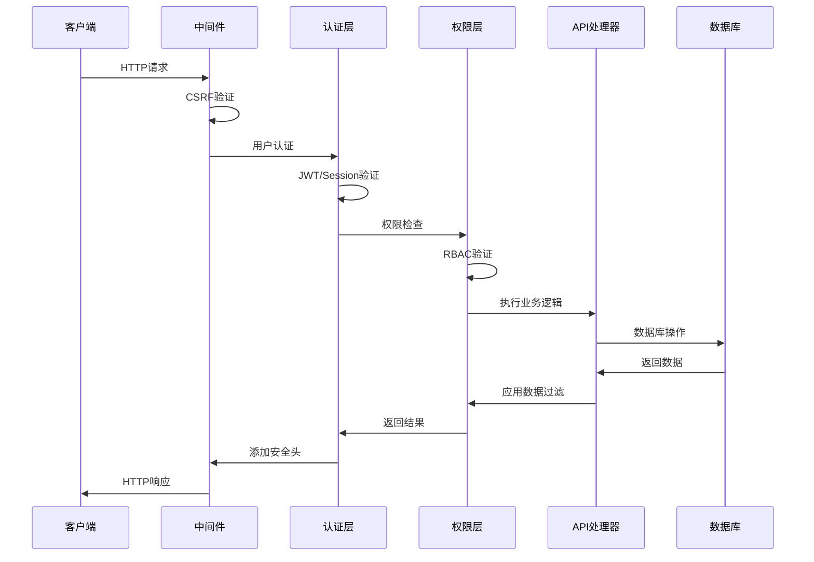

# Day 7 源码分析：Superset API与Web服务架构 🌐

## 📋 目录
1. [API架构设计](#api架构设计)
2. [RESTful端点实现](#restful端点实现)
3. [认证授权机制](#认证授权机制)
4. [权限控制系统](#权限控制系统)
5. [请求处理流程](#请求处理流程)
6. [微服务集成](#微服务集成)

---

## 🎯 API架构设计

### 基础API类结构

**1. 基础模型API (`superset/views/base_api.py`)**

```python
class BaseSupersetModelRestApi(ModelRestApi):
    """Superset模型REST API基类"""
    
    # 通用配置
    allow_browser_login = True
    class_permission_name = None
    method_permission_name = MODEL_API_RW_METHOD_PERMISSION_MAP
    
    # 响应装饰器
    @statsd_metrics
    @event_logger.log_this_with_context
    def get(self, pk: int) -> Response:
        """获取单个资源"""
        rv = None
        try:
            item = self.datamodel.get(pk, self._base_filters)
            if not item:
                return self.response_404()
            rv = self.response(200, **{API_RESULT_RES_KEY: self._get_result_from_rows([item])})
        except Exception as ex:
            return handle_api_exception(ex)
        return rv
    
    def post(self) -> Response:
        """创建新资源"""
        if not request.is_json:
            return self.response_400(message="Request must be JSON")
            
        try:
            item = self.add_model_schema.load(request.json)
            # 权限验证
            if self.class_permission_name:
                check_ownership(item, raise_if_false=True)
            
            # 创建资源
            new_model = self.datamodel.add(item)
            self.datamodel.session.commit()
            
            return self.response(201, **{API_RESULT_RES_KEY: self._get_result_from_rows([new_model])})
            
        except ValidationError as error:
            return self.response_422(message=error.messages)
        except SupersetSecurityException as ex:
            return self.response_403(message=str(ex))
        except Exception as ex:
            return handle_api_exception(ex)
    
    def put(self, pk: int) -> Response:
        """更新资源"""
        try:
            item = self.datamodel.get(pk, self._base_filters)
            if not item:
                return self.response_404()
                
            # 权限检查
            check_ownership(item, raise_if_false=True)
            
            # 更新数据
            item = self.edit_model_schema.load(request.json, instance=item)
            self.datamodel.edit(item)
            self.datamodel.session.commit()
            
            return self.response(200, **{API_RESULT_RES_KEY: self._get_result_from_rows([item])})
            
        except ValidationError as error:
            return self.response_422(message=error.messages)
        except SupersetSecurityException as ex:
            return self.response_403(message=str(ex))
```

**源码分析要点：**
- 统一的CRUD操作模板，减少重复代码
- 集成权限验证和异常处理
- 指标收集和日志记录的装饰器模式
- 标准化的HTTP响应格式

### 图表API实现

**2. 图表REST API (`superset/charts/api.py`)**

```python
class ChartRestApi(BaseSupersetModelRestApi):
    datamodel = SQLAInterface(Slice)
    resource_name = "chart"
    
    # 支持的路由方法
    include_route_methods = RouteMethod.REST_MODEL_VIEW_CRUD_SET | {
        RouteMethod.EXPORT,
        RouteMethod.IMPORT,
        RouteMethod.RELATED,
        "bulk_delete",
        "favorite_status", 
        "add_favorite",
        "remove_favorite",
        "thumbnail",
        "warm_up_cache",
    }
    
    # 字段配置
    show_columns = [
        "cache_timeout",
        "certified_by", 
        "certification_details",
        "changed_on_delta_humanized",
        "dashboards.dashboard_title",
        "dashboards.id",
        "description",
        "id",
        "owners.first_name",
        "params",
        "slice_name",
        "thumbnail_url",
        "url",
        "viz_type",
        "query_context",
    ]
    
    # 搜索过滤器
    search_filters = {
        "id": [ChartFavoriteFilter, ChartCertifiedFilter],
        "slice_name": [ChartAllTextFilter],
        "created_by": [ChartHasCreatedByFilter, ChartCreatedByMeFilter],
        "tags": [ChartTagNameFilter, ChartTagIdFilter],
    }
    
    @expose("/", methods=("POST",))
    @protect()
    @safe
    @statsd_metrics
    @requires_json
    def post(self) -> Response:
        """创建新图表"""
        try:
            item = self.add_model_schema.load(request.json)
            
            # 验证仪表板权限
            if item.get("dashboards"):
                for dashboard_id in item["dashboards"]:
                    check_ownership(
                        get_object_or_404(Dashboard, dashboard_id),
                        raise_if_false=True
                    )
            
            # 创建图表
            new_model = CreateChartCommand(item).run()
            return self.response(201, id=new_model.id, result=item)
            
        except DashboardsForbiddenError as ex:
            return self.response(ex.status, message=ex.message)
        except ChartInvalidError as ex:
            return self.response_422(message=ex.normalized_messages())
        except ChartCreateFailedError as ex:
            return self.response_422(message=str(ex))
    
    @expose("/warm_up_cache", methods=("PUT",))
    @protect()
    @safe
    @statsd_metrics
    def warm_up_cache(self) -> Response:
        """预热图表缓存"""
        try:
            body = ChartCacheWarmUpRequestSchema().load(request.json)
            result = ChartWarmUpCacheCommand(
                body["chart_id"],
                body.get("dashboard_id"),
                body.get("extra_filters"),
            ).run()
            return self.response(200, result=[result])
            
        except ValidationError as error:
            return self.response_400(message=error.messages)
        except CommandException as ex:
            return self.response(ex.status, message=ex.message)
```

**源码分析要点：**
- 路由方法集合配置，灵活控制API端点
- 多维度搜索过滤器，支持复杂查询场景
- 命令模式集成，业务逻辑与API层分离
- 缓存预热功能，提升用户体验

### 仪表板API实现

**3. 仪表板REST API (`superset/dashboards/api.py`)**

```python
class DashboardRestApi(BaseSupersetModelRestApi):
    datamodel = SQLAInterface(Dashboard)
    
    @expose("/<id_or_slug>", methods=("GET",))
    @protect()
    @safe
    @statsd_metrics
    @with_dashboard
    @event_logger.log_this_with_extra_payload
    def get(self, dash: Dashboard, add_extra_log_payload: Callable = lambda **kwargs: None) -> Response:
        """获取仪表板详情"""
        result = self.dashboard_get_response_schema.dump(dash)
        add_extra_log_payload(
            dashboard_id=dash.id, 
            action=f"{self.__class__.__name__}.get"
        )
        return self.response(200, result=result)
    
    @expose("/<id_or_slug>/charts", methods=("GET",))
    @protect()
    @safe
    @statsd_metrics
    def get_charts(self, id_or_slug: str) -> Response:
        """获取仪表板图表列表"""
        try:
            charts = DashboardDAO.get_charts_for_dashboard(id_or_slug)
            result = [
                self.chart_entity_response_schema.dump(chart) 
                for chart in charts
            ]
            return self.response(200, result=result)
            
        except DashboardAccessDeniedError:
            return self.response_403()
        except DashboardNotFoundError:
            return self.response_404()
    
    @expose("/<id_or_slug>/datasets", methods=("GET",))
    @protect_with_jwt()
    @safe  
    @statsd_metrics
    def get_datasets(self, id_or_slug: str) -> Response:
        """获取仪表板数据集"""
        try:
            datasets = DashboardDAO.get_datasets_for_dashboard(id_or_slug)
            result = [
                self.dashboard_dataset_schema.dump(dataset) 
                for dataset in datasets
            ]
            return self.response(200, result=datasets)
            
        except DashboardAccessDeniedError:
            return self.response_403()
        except DashboardNotFoundError:
            return self.response_404()
```

**源码分析要点：**
- 自定义装饰器`@with_dashboard`实现资源预加载
- 支持ID和slug两种标识符访问方式
- JWT保护的数据集接口，支持嵌入式场景
- DAO模式数据访问，业务逻辑封装

---

## 🎯 认证授权机制

### JWT认证实现

**4. JWT装饰器 (`superset/security/decorators.py`)**

```python
def protect_with_jwt(f: Callable[..., Any]) -> Callable[..., Any]:
    """JWT保护装饰器"""
    
    @wraps(f)
    def decorated(*args: Any, **kwargs: Any) -> Any:
        try:
            # 检查Authorization头
            auth_header = request.headers.get("Authorization")
            if not auth_header or not auth_header.startswith("Bearer "):
                return current_app.response_class(
                    response=json.dumps({"message": "Missing or invalid authorization header"}),
                    status=401,
                    mimetype="application/json"
                )
            
            # 提取token
            token = auth_header.split(" ")[1]
            
            # 验证JWT token
            try:
                payload = jwt.decode(
                    token,
                    current_app.config["SECRET_KEY"],
                    algorithms=["HS256"]
                )
            except jwt.ExpiredSignatureError:
                return current_app.response_class(
                    response=json.dumps({"message": "Token has expired"}),
                    status=401,
                    mimetype="application/json"
                )
            except jwt.InvalidTokenError:
                return current_app.response_class(
                    response=json.dumps({"message": "Invalid token"}),
                    status=401,
                    mimetype="application/json"
                )
            
            # 设置当前用户
            user_id = payload.get("user_id")
            if user_id:
                user = security_manager.get_user_by_id(user_id)
                if user:
                    g.user = user
                    
        except Exception as ex:
            logger.exception("JWT authentication error: %s", str(ex))
            return current_app.response_class(
                response=json.dumps({"message": "Authentication failed"}),
                status=401,
                mimetype="application/json"
            )
        
        return f(*args, **kwargs)
    
    return decorated
```

### OAuth2集成

**5. OAuth2提供者配置 (`superset/security/manager.py`)**

```python
class SupersetSecurityManager(SecurityManager):
    
    def __init__(self, appbuilder):
        super().__init__(appbuilder)
        # OAuth2提供者配置
        self.oauth_providers = []
        self._init_oauth_providers()
    
    def _init_oauth_providers(self):
        """初始化OAuth2提供者"""
        config = self.appbuilder.app.config
        
        # Google OAuth2
        if config.get("AUTH_TYPE") == AUTH_OAUTH:
            google_config = {
                "name": "google",
                "icon": "fa-google",
                "token_key": "access_token",
                "remote_app": {
                    "client_id": config.get("GOOGLE_KEY"),
                    "client_secret": config.get("GOOGLE_SECRET"),
                    "api_base_url": "https://www.googleapis.com/oauth2/v2/",
                    "client_kwargs": {"scope": "email profile"},
                    "request_token_url": None,
                    "access_token_url": "https://accounts.google.com/o/oauth2/token",
                    "authorize_url": "https://accounts.google.com/o/oauth2/auth",
                },
            }
            self.oauth_providers.append(google_config)
    
    def oauth_user_info(self, provider: str, response: Dict[str, Any]) -> Dict[str, Any]:
        """获取OAuth用户信息"""
        if provider == "google":
            token = response.get("access_token")
            resp = self.oauth_remotes[provider].get("userinfo", token=token)
            
            if resp and resp.status_code == 200:
                user_data = resp.json()
                return {
                    "username": user_data.get("email"),
                    "email": user_data.get("email"),
                    "first_name": user_data.get("given_name", ""),
                    "last_name": user_data.get("family_name", ""),
                }
        
        return {}
    
    def auth_user_oauth(self, userinfo: Dict[str, Any]) -> User:
        """OAuth用户认证"""
        email = userinfo.get("email")
        if not email:
            raise SupersetSecurityException("Email is required for OAuth authentication")
        
        # 查找或创建用户
        user = self.find_user(email=email)
        if not user:
            user = self.add_user(
                username=userinfo.get("username", email),
                first_name=userinfo.get("first_name", ""),
                last_name=userinfo.get("last_name", ""),
                email=email,
                role=self.find_role(self.auth_user_registration_role),
                hashed_password="",
            )
        
        # 更新用户信息
        if user:
            user.first_name = userinfo.get("first_name", user.first_name)
            user.last_name = userinfo.get("last_name", user.last_name)
            self.update_user(user)
        
        return user
```

**源码分析要点：**
- 多提供者OAuth2支持，可扩展配置
- 用户信息映射和自动注册功能
- Token验证和用户会话管理
- 异常处理和安全日志记录

---

## 🎯 权限控制系统

### 基于角色的访问控制(RBAC)

**6. 权限装饰器 (`superset/views/base.py`)**

```python
def has_access(f: Callable[..., Any]) -> Callable[..., Any]:
    """权限检查装饰器"""
    
    @wraps(f)
    def decorated(self, *args: Any, **kwargs: Any) -> Any:
        # 获取权限名称
        permission_str = self.class_permission_name
        if self.method_permission_name:
            method_name = request.method.lower()
            permission_str = self.method_permission_name.get(method_name, permission_str)
        
        # 检查权限
        if not g.user.is_anonymous:
            # 检查用户是否有足够权限
            if security_manager.has_access(
                permission_str, self.class_permission_name, g.user
            ):
                return f(self, *args, **kwargs)
        
        # 权限不足，记录访问尝试
        logger.warning(
            "Access denied for user %s on %s.%s",
            g.user.username if g.user else "anonymous",
            self.__class__.__name__,
            f.__name__
        )
        
        # 返回403或重定向到登录页面
        if request.is_json:
            return self.response_403()
        else:
            flash(__("Access is Denied"), "danger")
            return redirect(url_for("AuthDBView.login"))
    
    return decorated

def has_access_api(f: Callable[..., Any]) -> Callable[..., Any]:
    """API权限检查装饰器"""
    
    @wraps(f)
    def decorated(self, *args: Any, **kwargs: Any) -> Any:
        # API权限检查逻辑
        if self._has_view_access():
            return f(self, *args, **kwargs)
        else:
            return self.response_403()
    
    return decorated
```

### 资源级权限控制

**7. 资源过滤器 (`superset/views/filters.py`)**

```python
class BaseFilterRelatedUsers(BaseFilter):
    """用户相关的基础过滤器"""
    
    def apply(self, query: Query, value: Any) -> Query:
        # 如果是管理员，返回所有记录
        if security_manager.is_admin():
            return query
        
        # 普通用户只能看到自己的记录
        return query.filter(
            or_(
                self.model.created_by_fk == g.user.id,
                self.model.changed_by_fk == g.user.id,
            )
        )

class DashboardAccessFilter(BaseFilter):
    """仪表板访问过滤器"""
    
    def apply(self, query: Query, value: Any) -> Query:
        if security_manager.is_admin():
            return query
        
        # 检查仪表板权限
        user_roles = [role.name for role in g.user.roles]
        owned_by_user = query.filter(Dashboard.owners.any(User.id == g.user.id))
        
        # 公开仪表板或者用户拥有的仪表板
        public_dashboards = query.filter(Dashboard.published == True)
        
        return owned_by_user.union(public_dashboards)

class ChartFilter(BaseFilter):
    """图表访问过滤器"""
    
    def apply(self, query: Query, value: Any) -> Query:
        # 数据源权限检查
        datasource_perms = security_manager.user_view_menu_names("datasource_access")
        schema_perms = security_manager.user_view_menu_names("schema_access")
        
        return query.filter(
            or_(
                # 用户拥有的图表
                Slice.owners.any(User.id == g.user.id),
                # 有数据源权限的图表
                and_(
                    Slice.datasource_type == "table",
                    or_(
                        Slice.datasource_name.in_(datasource_perms),
                        Slice.schema.in_(schema_perms),
                    )
                )
            )
        )
```

**源码分析要点：**
- 分层权限检查：方法级 → 资源级 → 字段级
- 动态权限过滤，基于用户角色和资源所有权
- SQL级别的权限控制，避免数据泄露
- 管理员特权处理，简化权限逻辑

---

## 🎯 请求处理流程

### 中间件处理链

**8. 请求处理中间件 (`superset/app.py`)**

```python
def create_app(config: Optional[Dict[str, Any]] = None) -> Flask:
    """创建Flask应用"""
    app = SupersetApp(__name__)
    
    # 配置加载
    app.config.from_object(config or get_config())
    
    # 初始化器
    app_initializer = SupersetAppInitializer(app)
    app_initializer.init_app()
    
    # 注册蓝图
    register_blueprints(app)
    
    # 错误处理器
    @app.errorhandler(500)
    def internal_error(error):
        db.session.rollback()
        return render_template("500.html"), 500
    
    @app.errorhandler(404)  
    def not_found_error(error):
        return render_template("404.html"), 404
    
    # 请求前处理
    @app.before_request
    def before_request():
        # CSRF保护
        if request.method in ["POST", "PUT", "DELETE", "PATCH"]:
            if not request.is_json and not csrf.validate():
                return current_app.response_class(
                    response=json.dumps({"message": "CSRF token missing or invalid"}),
                    status=400,
                    mimetype="application/json"
                )
        
        # 设置全局变量
        g.user = security_manager.get_user()
        g.request_start_time = time.time()
    
    # 请求后处理
    @app.after_request
    def after_request(response):
        # 性能监控
        if hasattr(g, "request_start_time"):
            duration = time.time() - g.request_start_time
            stats_logger.timing("request.duration", duration * 1000)
        
        # 安全头设置
        response.headers["X-Content-Type-Options"] = "nosniff"
        response.headers["X-Frame-Options"] = "DENY"
        response.headers["X-XSS-Protection"] = "1; mode=block"
        
        return response
    
    return app
```

### API请求生命周期



---

## 🎯 微服务集成

### 服务发现机制

**9. 服务注册中心模拟 (`day7_api_web_services/web_services_demo.py`中的关键实现)**

```python
class ServiceRegistry:
    """服务注册中心"""
    
    def __init__(self):
        self.services: Dict[str, List[ServiceInstance]] = defaultdict(list)
        self.health_check_interval = 30
        self._lock = threading.Lock()
    
    def register_service(self, service_name: str, host: str, port: int, metadata: Dict = None) -> str:
        """注册服务实例"""
        instance_id = f"{service_name}-{host}-{port}-{int(time.time())}"
        
        instance = ServiceInstance(
            id=instance_id,
            service_name=service_name,
            host=host,
            port=port,
            metadata=metadata or {},
            registered_at=time.time(),
            last_heartbeat=time.time()
        )
        
        with self._lock:
            self.services[service_name].append(instance)
            
        logger.info(f"Service {service_name} registered with ID {instance_id}")
        return instance_id
    
    def discover_service(self, service_name: str) -> List[ServiceInstance]:
        """发现服务实例"""
        with self._lock:
            # 过滤健康的实例
            healthy_instances = [
                instance for instance in self.services[service_name]
                if time.time() - instance.last_heartbeat < self.health_check_interval
            ]
            return healthy_instances
    
    def deregister_service(self, service_name: str, instance_id: str) -> bool:
        """注销服务实例"""
        with self._lock:
            instances = self.services[service_name]
            for i, instance in enumerate(instances):
                if instance.id == instance_id:
                    del instances[i]
                    logger.info(f"Service instance {instance_id} deregistered")
                    return True
        return False

class LoadBalancer:
    """负载均衡器"""
    
    def __init__(self, strategy: str = "round_robin"):
        self.strategy = strategy
        self.round_robin_index = defaultdict(int)
        self.connection_counts = defaultdict(int)
    
    def select_instance(self, instances: List[ServiceInstance]) -> Optional[ServiceInstance]:
        """选择服务实例"""
        if not instances:
            return None
        
        if self.strategy == "round_robin":
            return self._round_robin(instances)
        elif self.strategy == "random":
            return self._random(instances)
        elif self.strategy == "least_connections":
            return self._least_connections(instances)
        elif self.strategy == "weighted":
            return self._weighted(instances)
        
        return instances[0]  # 默认返回第一个
    
    def _round_robin(self, instances: List[ServiceInstance]) -> ServiceInstance:
        """轮询策略"""
        service_name = instances[0].service_name
        index = self.round_robin_index[service_name] % len(instances)
        self.round_robin_index[service_name] += 1
        return instances[index]
    
    def _least_connections(self, instances: List[ServiceInstance]) -> ServiceInstance:
        """最少连接策略"""
        return min(instances, key=lambda x: self.connection_counts[x.id])
```

### API网关实现

**10. API网关核心逻辑**

```python
class APIGateway:
    """API网关"""
    
    def __init__(self, service_registry: ServiceRegistry, load_balancer: LoadBalancer):
        self.service_registry = service_registry
        self.load_balancer = load_balancer
        self.circuit_breaker = CircuitBreaker()
        self.rate_limiter = RateLimiter()
        
    def route_request(self, service_name: str, path: str, method: str = "GET", 
                     headers: Dict = None, data: Dict = None) -> Dict:
        """路由请求到后端服务"""
        
        # 1. 服务发现
        instances = self.service_registry.discover_service(service_name)
        if not instances:
            return {"error": f"No healthy instances found for service {service_name}", "status": 503}
        
        # 2. 负载均衡
        selected_instance = self.load_balancer.select_instance(instances)
        if not selected_instance:
            return {"error": "Load balancer failed to select instance", "status": 503}
        
        # 3. 限流检查
        client_id = headers.get("X-Client-ID", "anonymous") if headers else "anonymous"
        if not self.rate_limiter.allow_request(client_id):
            return {"error": "Rate limit exceeded", "status": 429}
        
        # 4. 熔断检查
        if self.circuit_breaker.should_block_request(selected_instance.id):
            return {"error": "Service temporarily unavailable", "status": 503}
        
        # 5. 请求转发
        try:
            response = self._forward_request(selected_instance, path, method, headers, data)
            self.circuit_breaker.record_success(selected_instance.id)
            return response
            
        except Exception as e:
            self.circuit_breaker.record_failure(selected_instance.id)
            return {"error": f"Request failed: {str(e)}", "status": 500}
    
    def _forward_request(self, instance: ServiceInstance, path: str, 
                        method: str, headers: Dict, data: Dict) -> Dict:
        """转发请求到具体实例"""
        # 构建完整URL
        url = f"http://{instance.host}:{instance.port}{path}"
        
        # 添加网关标识头
        if headers is None:
            headers = {}
        headers["X-Gateway-Version"] = "1.0"
        headers["X-Request-ID"] = str(uuid.uuid4())
        
        # 模拟HTTP请求
        start_time = time.time()
        
        # 这里应该是真实的HTTP请求，简化为模拟
        response_data = {
            "data": f"Response from {instance.service_name}",
            "instance_id": instance.id,
            "processed_at": time.time(),
            "gateway_latency": (time.time() - start_time) * 1000
        }
        
        return {"status": 200, "data": response_data}
```

**源码分析要点：**
- 服务注册与发现的线程安全实现
- 多种负载均衡算法支持
- 熔断器模式防止级联故障
- 请求链路追踪和监控

---

## 🎯 性能监控与优化

### 关键指标收集

```python
# 性能监控装饰器
def performance_monitor(f):
    @wraps(f)
    def decorated(*args, **kwargs):
        start_time = time.time()
        
        try:
            result = f(*args, **kwargs)
            
            # 成功指标
            duration = time.time() - start_time
            stats_logger.timing(f"api.{f.__name__}.duration", duration * 1000)
            stats_logger.incr(f"api.{f.__name__}.success")
            
            return result
            
        except Exception as e:
            # 失败指标
            stats_logger.incr(f"api.{f.__name__}.error")
            stats_logger.incr(f"api.{f.__name__}.error.{type(e).__name__}")
            raise
            
    return decorated
```

这个源码分析展示了Superset API和Web服务的完整架构，从基础的REST API设计到高级的微服务集成，为理解现代Web应用的API设计提供了完整的技术视角。 