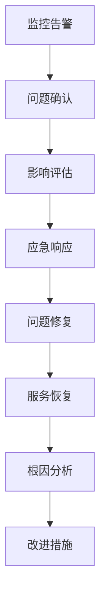

# Day 9 学习总结：生产部署与DevOps

## 📋 今日学习内容回顾

### 1. 核心概念掌握

#### 🐳 容器化部署
- **多阶段构建**: 优化Docker镜像大小和安全性
- **生产配置**: 环境变量管理、资源限制、健康检查
- **服务编排**: Docker Compose生产配置最佳实践
- **镜像管理**: 版本标签、构建优化、安全扫描

#### ☸️ Kubernetes部署
- **资源管理**: CPU、内存、存储的合理配置
- **服务发现**: Service、Ingress、DNS配置
- **配置管理**: ConfigMap、Secret的安全使用
- **自动扩展**: HPA、VPA的配置和调优

#### 🔧 高可用架构
- **负载均衡**: Nginx配置、健康检查、故障转移
- **数据库集群**: PostgreSQL主从配置
- **缓存集群**: Redis集群配置和监控
- **故障恢复**: 自动重启、服务降级、灾难恢复

### 2. 实践技能提升

#### 📊 监控告警系统
- **Prometheus配置**: 指标收集、记录规则、告警规则
- **Grafana仪表板**: 可视化配置、模板管理
- **日志管理**: 集中化日志收集和分析
- **性能监控**: APM集成、链路追踪

#### 🔒 安全加固措施
- **HTTPS配置**: SSL证书管理、安全策略
- **认证集成**: LDAP、OAuth2、SAML配置
- **网络安全**: 防火墙规则、VPN配置
- **数据安全**: 加密传输、访问控制

#### 🚀 自动化运维
- **CI/CD流程**: 自动化构建、测试、部署
- **配置管理**: Infrastructure as Code
- **备份策略**: 自动化备份和恢复测试
- **版本管理**: 发布策略、回滚机制

## 🎯 重点知识点

### 1. 生产环境配置要点

```python
# 生产配置核心要素
PRODUCTION_CONFIG = {
    'security': {
        'secret_key': 'strong-random-key',
        'csrf_enabled': True,
        'session_timeout': 28800  # 8小时
    },
    'database': {
        'pool_size': 20,
        'pool_recycle': 3600,
        'pool_pre_ping': True
    },
    'cache': {
        'type': 'RedisCache',
        'default_timeout': 300,
        'key_prefix': 'superset_'
    },
    'celery': {
        'broker_url': 'redis://redis:6379/0',
        'result_backend': 'redis://redis:6379/1',
        'worker_prefetch_multiplier': 1
    }
}
```

### 2. 监控指标体系

```yaml
# 关键监控指标
key_metrics:
  application:
    - request_rate: 请求速率
    - error_rate: 错误率
    - response_time: 响应时间
    - active_users: 活跃用户数
  
  system:
    - cpu_usage: CPU使用率
    - memory_usage: 内存使用率
    - disk_usage: 磁盘使用率
    - network_io: 网络IO
  
  database:
    - connection_count: 连接数
    - query_time: 查询时间
    - cache_hit_ratio: 缓存命中率
    - slow_queries: 慢查询数量
```

### 3. 部署最佳实践

#### 部署策略
1. **蓝绿部署**: 零停机时间升级
2. **滚动更新**: 逐步替换实例
3. **金丝雀发布**: 小规模验证后全量发布
4. **回滚机制**: 快速回到稳定版本

#### 环境管理
- **开发环境**: 功能开发和单元测试
- **测试环境**: 集成测试和性能测试
- **预生产环境**: 生产前最后验证
- **生产环境**: 正式业务服务

### 4. 故障处理流程



## 💡 关键收获

### 1. 生产部署思维转变
- 从开发思维转向运维思维
- 从功能实现转向系统稳定性
- 从单机部署转向集群化部署
- 从手动操作转向自动化运维

### 2. 全栈运维能力
- **基础设施管理**: Docker、Kubernetes、云平台
- **监控告警**: Prometheus、Grafana、AlertManager
- **日志管理**: ELK Stack、Fluentd
- **安全管理**: SSL、认证、授权、审计

### 3. 问题解决策略
- **预警机制**: 提前发现潜在问题
- **快速响应**: 建立标准操作程序
- **根因分析**: 避免问题重复发生
- **持续改进**: 基于数据优化系统

## 🔄 持续学习方向

### 1. 云原生技术
- **Service Mesh**: Istio、Linkerd
- **Serverless**: Knative、OpenFaaS
- **GitOps**: ArgoCD、Flux
- **可观测性**: Jaeger、Zipkin

### 2. 高级运维技能
- **混沌工程**: 系统韧性测试
- **SRE实践**: 错误预算、SLO/SLI
- **成本优化**: 资源使用效率
- **合规管理**: 安全合规要求

### 3. 业务理解
- **用户体验**: 从技术角度优化用户体验
- **业务连续性**: 保障业务不中断
- **数据治理**: 数据质量和安全
- **团队协作**: DevOps文化建设

## 📊 学习成果评估

### 技能掌握程度
- ✅ Docker容器化部署 (熟练)
- ✅ Kubernetes编排 (中级)
- ✅ 监控告警配置 (熟练)
- ✅ 自动化脚本编写 (熟练)
- ✅ 问题排查和修复 (中级)
- ⭐ 大规模集群管理 (初级)
- ⭐ 云平台集成 (初级)

### 实践项目完成
1. ✅ 生产级Docker镜像构建
2. ✅ 完整的监控告警系统
3. ✅ 自动化部署脚本
4. ✅ 健康检查和故障恢复
5. ✅ 安全配置和加固
6. ⭐ CI/CD流水线搭建
7. ⭐ 灾难恢复演练

## 🚀 下一步行动计划

### 短期目标 (1-2周)
1. **实践应用**: 在测试环境完整部署一套生产级Superset
2. **监控优化**: 配置完整的监控告警体系
3. **文档完善**: 整理部署和运维文档
4. **脚本自动化**: 完善自动化部署和运维脚本

### 中期目标 (1-2月)
1. **云平台集成**: 学习AWS/Azure/GCP的Superset部署
2. **高级监控**: 实现APM和分布式链路追踪
3. **安全加固**: 实施企业级安全策略
4. **性能优化**: 基于监控数据进行系统调优

### 长期目标 (3-6月)
1. **SRE实践**: 建立完整的SRE工作流程
2. **团队协作**: 推广DevOps文化和实践
3. **业务优化**: 基于数据分析优化业务流程
4. **技术分享**: 输出最佳实践和经验总结

## 📚 参考资源

### 官方文档
- [Superset Documentation](https://superset.apache.org/docs/intro)
- [Docker Best Practices](https://docs.docker.com/develop/dev-best-practices/)
- [Kubernetes Documentation](https://kubernetes.io/docs/)
- [Prometheus Documentation](https://prometheus.io/docs/)

### 推荐书籍
- 《Site Reliability Engineering》
- 《The DevOps Handbook》
- 《Kubernetes in Action》
- 《Prometheus Up & Running》

### 在线课程
- Docker和Kubernetes实战
- 云原生应用开发
- SRE工程实践
- 监控和可观测性

---

通过Day 9的深入学习，我们完成了从开发到生产的完整闭环，掌握了企业级Superset部署和运维的核心技能。这些知识和经验将为实际工作中的系统运维和优化提供坚实的基础。

**下一阶段建议**: 选择一个实际的业务场景，应用所学知识进行完整的生产部署实践，在实战中进一步提升技能水平。 